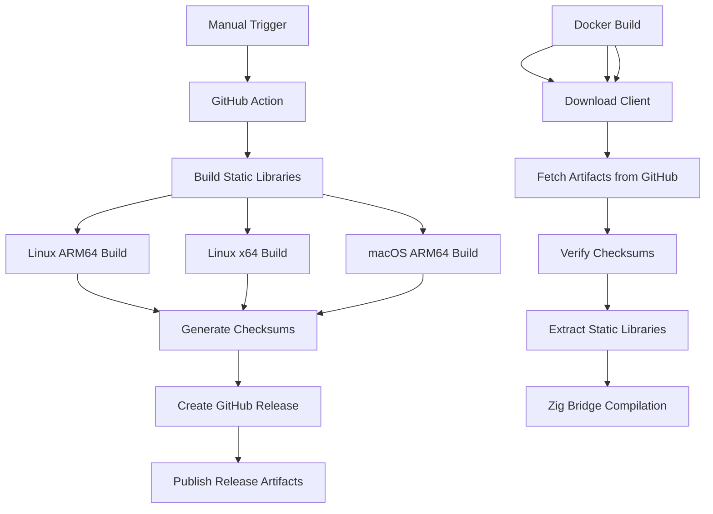
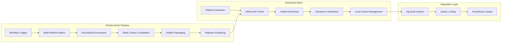

# Design Document

## Overview

This system will replace the current 15-minute Rust compilation process with a fast binary download mechanism. The solution consists of two main components:

1. **GitHub Action Build Pipeline**: Builds static libraries for multiple platforms and publishes them as GitHub release artifacts
2. **Download Client Integration**: Downloads and integrates pre-built libraries into the existing Zig bridge build process

The system will eliminate Rust toolchain dependencies from CI/CD pipelines, Docker images, and local development environments while maintaining full compatibility with the existing Temporal Bun SDK.

## Architecture

### High-Level Flow



### Component Architecture



## Components and Interfaces

### 1. GitHub Action Workflow

**File**: `.github/workflows/temporal-static-libraries.yml`

**Responsibilities**:

- Build static libraries for target platforms (Linux ARM64, Linux x64, macOS ARM64)
- Use arm64 runners from cluster resources
- Generate checksums for integrity verification
- Create GitHub releases with versioned artifacts
- Support manual triggering via workflow_dispatch

**Key Features**:

- Matrix build strategy for multiple platforms
- Rust toolchain setup with cross-compilation support
- Artifact naming convention: `temporal-static-libs-{platform}-{arch}-{version}.tar.gz`
- Checksum files: `temporal-static-libs-{platform}-{arch}-{version}.sha256`

### 2. Download Client

**File**: `packages/temporal-bun-sdk/scripts/download-temporal-libs.ts` (Bun script)

**Interface**:

```typescript
interface DownloadClient {
  downloadLibraries(version?: string): Promise<LibrarySet>
  getCachedLibraries(version: string): LibrarySet | null
  verifyChecksum(filePath: string, expectedChecksum: string): boolean
  detectPlatform(): PlatformInfo
}

interface LibrarySet {
  platform: string
  architecture: string
  version: string
  libraries: StaticLibrary[]
}

interface StaticLibrary {
  name: string
  path: string
  checksum: string
}
```

**Responsibilities**:

- Detect current platform and architecture
- Query GitHub releases API for available artifacts
- Download appropriate static libraries
- Verify checksums for security
- Manage local cache for offline builds
- Provide fallback to Rust compilation if needed

### 3. Build System Integration

**Modified Files**:

- `packages/temporal-bun-sdk/native/temporal-bun-bridge-zig/build.zig`
- `packages/temporal-bun-sdk/package.json`
- `packages/temporal-bun-sdk/scripts/run-with-rust-toolchain.ts` (deprecated)
- All scripts implemented as Bun scripts with `#!/usr/bin/env bun` shebang

**Integration Points**:

- Zig build system modified to use pre-built libraries
- Package.json scripts updated to use download client
- Environment variable `USE_PREBUILT_LIBS=true` to enable new behavior
- Fallback mechanism when `USE_PREBUILT_LIBS=false` or download fails

### 4. Cache Management

**Location**: `packages/temporal-bun-sdk/.temporal-libs-cache/`

**Structure**:

```
.temporal-libs-cache/
├── v1.0.0/
│   ├── linux-arm64/
│   │   ├── libtemporal_sdk_core.a
│   │   ├── libtemporal_client.a
│   │   └── checksums.sha256
│   ├── linux-x64/
│   └── macos-arm64/
└── v1.1.0/
    └── ...
```

## Data Models

### Release Artifact Structure

```json
{
  "tag_name": "temporal-libs-v1.0.0",
  "name": "Temporal Static Libraries v1.0.0",
  "assets": [
    {
      "name": "temporal-static-libs-linux-arm64-v1.0.0.tar.gz",
      "browser_download_url": "https://github.com/org/repo/releases/download/...",
      "size": 12345678
    },
    {
      "name": "temporal-static-libs-linux-arm64-v1.0.0.sha256",
      "browser_download_url": "https://github.com/org/repo/releases/download/...",
      "size": 64
    }
  ]
}
```

### Configuration Schema

```typescript
interface TemporalLibsConfig {
  version?: string // Default: "latest"
  platforms: PlatformConfig[]
  cacheDir: string
  fallbackToCompilation: boolean
  checksumVerification: boolean
}

interface PlatformConfig {
  os: 'linux' | 'macos'
  arch: 'arm64' | 'x64'
  enabled: boolean
}
```

## Error Handling

### Download Client Error Scenarios

1. **Network Connectivity Issues**
   - Retry mechanism with exponential backoff
   - Fallback to cached libraries if available
   - Ultimate fallback to Rust compilation

2. **Checksum Verification Failure**
   - Reject corrupted downloads
   - Attempt re-download once
   - Fallback to Rust compilation

3. **Platform Not Supported**
   - Clear error message indicating unsupported platform
   - Automatic fallback to Rust compilation
   - Documentation reference for manual setup

4. **GitHub API Rate Limiting**
   - Respect rate limit headers
   - Implement exponential backoff
   - Use cached libraries when available

### Build System Error Handling

1. **Missing Static Libraries**
   - Validate all required libraries are present
   - Provide clear error messages with missing library names
   - Automatic fallback to download or compilation

2. **Zig Compilation Errors**
   - Preserve existing error reporting
   - Add context about library source (downloaded vs compiled)
   - Include troubleshooting guidance

## Testing Strategy

### Unit Tests

1. **Download Client Tests**
   - Mock GitHub API responses
   - Test checksum verification logic
   - Test platform detection accuracy
   - Test cache management operations

2. **Build System Integration Tests**
   - Test Zig build with pre-built libraries
   - Test fallback mechanisms
   - Test cross-platform compatibility

### Integration Tests

1. **End-to-End Workflow Tests**
   - Test complete download-to-build pipeline
   - Test with various network conditions
   - Test cache behavior across builds

2. **CI/CD Pipeline Tests**
   - Test GitHub Action workflow
   - Test artifact publishing
   - Test download in CI environment

### Performance Tests

1. **Build Time Comparison**
   - Measure build time with pre-built libraries vs Rust compilation
   - Target: <2 minutes total build time (vs current 15 minutes)

2. **Download Performance**
   - Test download speeds across different network conditions
   - Test parallel downloads for multiple platforms

## Migration Strategy

### Phase 1: Infrastructure Setup

1. Create GitHub Action workflow
2. Implement download client
3. Set up initial release with static libraries

### Phase 2: Integration

1. Modify Zig build system to support pre-built libraries
2. Update package.json scripts
3. Add environment variable controls

### Phase 3: CI/CD Updates

1. Update temporal-bun-sdk.yml workflow
2. Remove Rust toolchain dependencies
3. Update Docker images

### Phase 4: Cleanup

1. Deprecate run-with-rust-toolchain.ts
2. Remove Rust-related dependencies
3. Update documentation

### Rollback Plan

- Environment variable `USE_PREBUILT_LIBS=false` reverts to old behavior
- Keep Rust compilation code until migration is proven stable
- Maintain vendor directory setup as fallback

## Security Considerations

1. **Checksum Verification**
   - SHA256 checksums for all artifacts
   - Mandatory verification before use
   - Rejection of corrupted downloads

2. **GitHub Release Security**
   - Use GitHub's built-in security features
   - Verify download URLs are from expected repository
   - Implement download size limits

3. **Cache Security**
   - Verify cached files before use
   - Clear cache on checksum mismatches
   - Protect cache directory permissions

## Performance Targets

- **Build Time Reduction**: From 15 minutes to <2 minutes (87% improvement)
- **Download Time**: <30 seconds for typical network conditions
- **Cache Hit Rate**: >90% for repeated builds
- **Artifact Size**: <50MB per platform (compressed)

## Monitoring and Observability

1. **GitHub Action Metrics**
   - Build success/failure rates
   - Build duration per platform
   - Artifact size trends

2. **Download Client Metrics**
   - Download success rates
   - Cache hit rates
   - Fallback frequency

3. **Build Performance Metrics**
   - End-to-end build times
   - Network vs cached build comparison
   - Error rates and types
