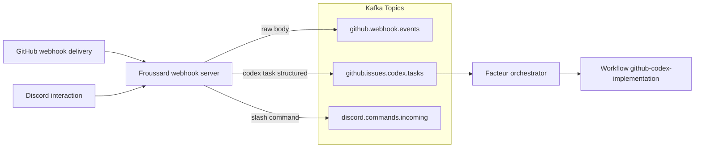

# Froussard Webhook Bridge

Froussard is a TypeScript service running on Bun (Elysia HTTP runtime) that receives webhook
deliveries (GitHub issues/comments and Discord slash commands), verifies signatures, and forwards
structured payloads into Kafka for downstream automation such as Argo Workflows and the Facteur
service.

## End-to-end Data Flow



The Argo CD application also provisions the `discord.commands.incoming` Kafka topic so Discord automation can publish into the shared cluster alongside GitHub event streams.

## Runtime Responsibilities

- Validate GitHub `x-hub-signature-256` headers using `@octokit/webhooks`.
- Validate Discord `x-signature-ed25519`/`x-signature-timestamp` headers using `discord-interactions` before parsing the payload.
- Emit the original JSON event (`github.webhook.events`) and publish Codex task payloads in structured (`github.issues.codex.tasks`) form.
- Normalize Discord slash command payloads (command name, options, interaction token, user metadata) and publish them into `discord.commands.incoming`.
- Provision and maintain the `discord.commands.incoming` Kafka topic for Facteur ingestion.
- Surface health checks on `/health/liveness` and `/health/readiness`.

## Local Development

```bash
bun install
bun run build
bun run start
```

> Bun ≥ 1.1 must be available on your PATH—the build step uses `tsdown` to emit ESM bundles and the runtime executes them via `bun dist/index.mjs`.

The local runtime exposes:

- `POST /webhooks/github` for GitHub event simulation.
- `/health/liveness` and `/health/readiness` for probes.

## Deployment Notes

- Environment configuration is provided via the ArgoCD `froussard` application.
- Kafka credentials are mirrored from the Strimzi-managed `KafkaUser/kafka-codex-credentials`
  (reflected into both `kafka` and `argo-workflows` namespaces); a companion secret
  `kafka-codex-username` in `argo-workflows` defines the SASL username consumed by
  Argo Events workflow-completion sensors. Strimzi surfaces the username only inside
  the `sasl.jaas.config` field, so we persist a lightweight static secret to expose it
  under the `username` key that `userSecret.key` consumers expect while leaving Strimzi
  in charge of password rotation.
- Facteur consumes `github.issues.codex.tasks` and dispatches the `github-codex-implementation` WorkflowTemplate.
- Discord slash command signature verification requires `DISCORD_PUBLIC_KEY`. Set
  `KAFKA_DISCORD_COMMAND_TOPIC` to control the output topic for normalized command events.
- The structured stream is configured via `KAFKA_CODEX_TOPIC_STRUCTURED` (defaulting to `github.issues.codex.tasks`).

### Local Deploy Script

- Run `bun packages/scripts/src/froussard/deploy-service.ts` to build/push the Docker image defined in `apps/froussard/Dockerfile`, stamp `argocd/applications/froussard/knative-service.yaml` with the new image digest plus the derived `FROUSSARD_VERSION/FROUSSARD_COMMIT`, and `kubectl apply` the manifest for an immediate rollout. The helper reads version/commit from `git describe --tags --always` / `git rev-parse HEAD` unless you override them via env vars.
- Useful overrides:
  - `FROUSSARD_IMAGE_REGISTRY`, `FROUSSARD_IMAGE_REPOSITORY`, `FROUSSARD_IMAGE_TAG`, `FROUSSARD_PLATFORMS` (defaults to `linux/arm64`), `FROUSSARD_DOCKERFILE`, and `FROUSSARD_BUILD_CONTEXT` control the Docker build.
  - `FROUSSARD_KNATIVE_MANIFEST` points to the manifest to rewrite/apply (defaults to `argocd/applications/froussard/knative-service.yaml`).
  - `FROUSSARD_VERSION` / `FROUSSARD_COMMIT` let you pin the metadata injected into the deployment env without touching git state.
  - Append `--dry-run` (and optionally point `FROUSSARD_KNATIVE_MANIFEST` at a scratch copy) to preview the manifest edits without building/pushing or calling `kubectl`.

## Verification Checklist

1. Create a GitHub issue in `proompteng/lab` as the Codex trigger user using the **Codex Task** issue template so summary, scope, and validation fields are present.
2. Ensure Argo Workflows produces a Workflow named `github-codex-implementation-*` in
   `argo-workflows` namespace.
3. Inspect pod logs to confirm the payload mirrors the Kafka message and the implementation prompt.

## Codex Automation Image

The Codex implementation workflow uses a derived container built from
`apps/froussard/Dockerfile.codex`. The helper script below copies the local
Codex auth (`~/.codex/auth.json`), Codex configuration (`~/.codex/config.toml`),
and your GitHub CLI token into the image before pushing it to the shared
registry.

```bash
bun apps/froussard/src/codex/cli/build-codex-image.ts
```

- Override `IMAGE_TAG` to publish a different tag or registry.
- Provide `GH_TOKEN` explicitly if `gh auth token` is unavailable. The token must include the `workflow` scope (GitHub blocks pushes to `.github/workflows/**` without it); refresh with `gh auth refresh --hostname github.com --scopes repo,workflow` or supply a PAT that carries those scopes.
- The resulting image defaults to cloning `proompteng/lab` into
  `/workspace/lab`; override `REPO_URL`, `BASE_BRANCH`, or `TARGET_DIR` at
  runtime as needed.
