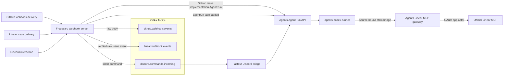

# Froussard Webhook Bridge

Froussard is a TypeScript service running on Bun (Elysia HTTP runtime) that receives webhook
deliveries (GitHub, Linear issues, and Discord slash commands), verifies signatures, and forwards
trusted events to the owning downstream system. Froussard is the only public webhook ingress for
Agents automation; an AgentRun's `implementation.source` remains provenance, not an ingress
configuration object.

## End-to-end Data Flow


```mermaid
flowchart LR
  GH[GitHub webhook delivery] --> Froussard[Froussard webhook server]
  Linear[Linear issue delivery] --> Froussard
  Discord[Discord interaction] --> Froussard
  subgraph Kafka Topics
    Raw[github.webhook.events]
    LinearRaw[linear.webhook.events]
    DiscordTopic[discord.commands.incoming]
  end
  Froussard -->|raw body| Raw
  Froussard -->|verified raw issue event| LinearRaw
  Froussard -->|GitHub issue implementation AgentRun| Agents
  Froussard -->|agentrun label added| Agents
  Froussard -->|slash command| DiscordTopic
  DiscordTopic --> Facteur[Facteur Discord bridge]
  Facteur --> Agents[Agents AgentRun API]
  Agents --> Runner[agents-codex-runner]
  Runner -->|source-bound stdio bridge| LinearGateway[Agents Linear MCP gateway]
  LinearGateway -->|OAuth app actor| LinearMcp[Official Linear MCP]
```

The Argo CD application also provisions the `discord.commands.incoming` Kafka topic so Discord automation can publish into the shared cluster alongside GitHub event streams.

## Runtime Responsibilities

- Validate GitHub `x-hub-signature-256` headers using `@octokit/webhooks`.
- Validate Discord `x-signature-ed25519`/`x-signature-timestamp` headers using `discord-interactions` before parsing the payload.
- Validate Linear's raw-body HMAC, delivery UUID, header and payload timestamps, JSON content type,
  and body-size limit before parsing trusted fields.
- Emit the original JSON event (`github.webhook.events`) and submit GitHub issue implementation runs directly to the Agents `/v1/agent-runs` API.
- Audit verified Linear events to `linear.webhook.events`. Submit exactly one `codex-linear-agent`
  run when an Issue is created with `agentrun` or an update proves that label was newly added.
- Use `Linear-Delivery` as both the HTTP and AgentRun idempotency key. Descriptions, signatures,
  and actor emails are never logged.
- Normalize Discord slash command payloads (command name, options, interaction token, user metadata) and publish them into `discord.commands.incoming`.
- Provision and maintain the `discord.commands.incoming` Kafka topic for Facteur ingestion.
- Surface health checks on `/health/liveness` and `/health/readiness`.

## Local Development

```bash
bun install
bun run build
bun run start
```

> Bun 1.3.14 must be available on your PATH. The build step uses `tsdown` to emit ESM bundles and the runtime executes them via `bun dist/index.mjs`.

The local runtime exposes:

- `POST /webhooks/github` for GitHub event simulation.
- `POST /webhooks/linear` for Linear issue delivery simulation when
  `LINEAR_WEBHOOK_ENABLED=true`.
- `/health/liveness` and `/health/readiness` for probes.

## Deployment Notes

- Environment configuration is provided via the ArgoCD `froussard` application.
- Kafka credentials are mirrored from the Strimzi-managed `KafkaUser/kafka-codex-credentials`
  (reflected into both `kafka` and `argo-workflows` namespaces); a companion secret
  `kafka-codex-username` in `argo-workflows` defines the SASL username consumed by
  Argo Events workflow-completion sensors. Strimzi surfaces the username only inside
  the `sasl.jaas.config` field, so we persist a lightweight static secret to expose it
  under the `username` key that `userSecret.key` consumers expect while leaving Strimzi
  in charge of password rotation.
- GitHub issue implementation runs are submitted directly to the Agents service configured by `AGENTS_SERVICE_BASE_URL`.
- Linear sends Issue events to `https://froussard.proompteng.ai/webhooks/linear`. The signing
  secret is a dedicated `linear-webhook-secret`; it is not an OAuth or API credential.
- Linear intake is dormant by default. Set `LINEAR_WEBHOOK_ENABLED=true` only in the activation
  rollout that also provides `LINEAR_WEBHOOK_SECRET` and `KAFKA_LINEAR_WEBHOOK_TOPIC`.
- Generate the Linear SealedSecret with
  `bun packages/scripts/src/froussard/reseal-secrets.ts`. The default 1Password field is
  `op://infra/linear/webhook-secret`; override it with
  `FROUSSARD_LINEAR_WEBHOOK_SECRET_OP_PATH` and the output with
  `FROUSSARD_LINEAR_SEALED_SECRETS_OUTPUT`.
- Discord slash command signature verification requires `DISCORD_PUBLIC_KEY`. Set
  `KAFKA_DISCORD_COMMAND_TOPIC` to control the output topic for normalized command events.
- Webhook idempotency defaults to a 10 minute TTL with 10,000 entries. Override via
  `FROUSSARD_WEBHOOK_IDEMPOTENCY_TTL_MS` and `FROUSSARD_WEBHOOK_IDEMPOTENCY_MAX_ENTRIES`.

### Local Deploy Script

- Run `bun packages/scripts/src/froussard/deploy-service.ts` to build/push the Docker image defined in `apps/froussard/Dockerfile`, stamp `argocd/applications/froussard/knative-service.yaml` with the new image digest plus the derived `FROUSSARD_VERSION/FROUSSARD_COMMIT`, and `kubectl apply` the manifest for an immediate rollout. The helper reads version/commit from `git describe --tags --always` / `git rev-parse HEAD` unless you override them via env vars.
- Useful overrides:
  - `FROUSSARD_IMAGE_REGISTRY`, `FROUSSARD_IMAGE_REPOSITORY`, `FROUSSARD_IMAGE_TAG`, `FROUSSARD_PLATFORMS` (defaults to `linux/arm64`), `FROUSSARD_DOCKERFILE`, and `FROUSSARD_BUILD_CONTEXT` control the Docker build.
  - `FROUSSARD_KNATIVE_MANIFEST` points to the manifest to rewrite/apply (defaults to `argocd/applications/froussard/knative-service.yaml`).
  - `FROUSSARD_VERSION` / `FROUSSARD_COMMIT` let you pin the metadata injected into the deployment env without touching git state.
  - Append `--dry-run` (and optionally point `FROUSSARD_KNATIVE_MANIFEST` at a scratch copy) to preview the manifest edits without building/pushing or calling `kubectl`.

## Verification Checklist

1. Create a GitHub issue in `proompteng/lab` as the Codex trigger user using the **Codex Task** issue template so summary, scope, and validation fields are present.
2. Ensure the Agents service creates an `AgentRun` in the `agents` namespace.
3. Inspect the AgentRun job logs and artifacts to confirm the payload contains the implementation prompt.

For Linear, add `agentrun` to one canary issue and verify one AgentRun whose source contains only
`provider`, issue identifier, and issue URL. Verify the Job has the Linear MCP tools but no Linear
credential, then prove a caller-supplied second issue identifier is rejected. Removing `agentrun`
must revoke subsequent mutations.

## Codex Runtime

Codex implementation runs use the Agents-owned `agents-codex-runner` image and the `codex-agent` provider. Froussard no longer ships Argo `WorkflowTemplate` runtime definitions for Codex execution.
