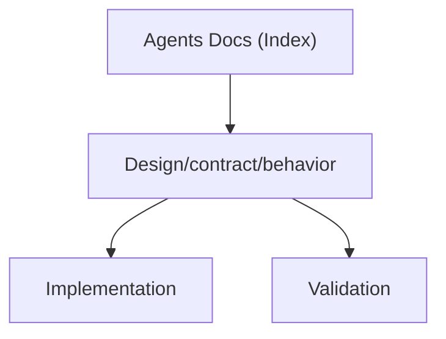

# Agents Docs (Index)

Status: Current (2026-02-07)

This is the hub for `docs/agents/**`. It is intended to make the Agents documentation set composable:
clear entrypoints, clear “source of truth”, and a complete catalog of related documents.

## Start Here

- Operational/source-of-truth appendix (repo + chart + cluster): `designs/handoff-common.md`
- Implementing the Helm chart and controllers (implementation-grade): `agents-helm-chart-implementation.md`
- Chart intent and scope (high-level design): `agents-helm-chart-design.md`
- How to validate changes in CI: `ci-validation-plan.md`
- How to install/upgrade/debug (ops): `runbooks.md`
- Security baseline: `threat-model.md`
- RBAC requirements: `rbac-matrix.md`
- Production bar (non-negotiables): `production-readiness-design.md`

## Source Of Truth And Precedence

When documents disagree, use this precedence order:

1. GitOps desired state: `argocd/applications/agents/` (what the cluster should converge to).
2. Helm chart and CRDs: `charts/agents/` (`templates/`, `values.yaml`, `values.schema.json`, `crds/`).
3. Controller/runtime code: `services/jangar/src/server/**` and API types in `services/jangar/api/**`.
4. “Current” docs in `docs/agents/` (implementation-grade and current requirements).
5. “Draft/Partial” docs in `docs/agents/designs/` (proposals; may describe current behavior but are not always enforced).

If you are changing behavior, update 1-3 first, then ensure 4-5 describe the resulting system accurately.

## How The Docs Compose

- Platform requirements and guardrails:
  - `production-readiness-design.md`, `threat-model.md`, `rbac-matrix.md`
- Chart + GitOps packaging and install surface:
  - `agents-helm-chart-design.md`, `agents-helm-chart-implementation.md`, chart-level docs in `docs/agents/designs/chart-*.md`
- API and schema:
  - CRD generation/spec: `crd-best-practices.md`, `crd-yaml-spec.md`, plus `docs/agents/designs/crd-*.md`
- Controllers and runtime behavior:
  - `jangar-controller-design.md`, `leader-election-design.md`, plus `docs/agents/designs/controller-*.md`
- Validation and operations:
  - `ci-validation-plan.md`, `runbooks.md`, plus `docs/agents/designs/*runbook*.md`
- Distribution:
  - `market-readiness-and-distribution.md`, plus `docs/agents/designs/artifacthub-oci-distribution.md`
- CLI:
  - `agentctl.md` and `agentctl-*.md`, plus `docs/agents/designs/agentctl-*.md`

## Common Change Flows

### Changing CRDs

- Update Go types (Agents primitives): `services/jangar/api/agents/v1alpha1/**`
- Regenerate CRDs: `charts/agents/crds/`
- Validate: `scripts/agents/validate-agents.sh`
- Update examples if needed: `charts/agents/examples/**`
- Ensure chart metadata stays accurate: `charts/agents/Chart.yaml` (CRD listings/examples)

### Changing Chart Values Or Templates

- Update: `charts/agents/values.yaml`, `charts/agents/values.schema.json`, `charts/agents/templates/**`
- Update production overlay (if needed): `argocd/applications/agents/values.yaml`
- Render the GitOps desired install: see `designs/handoff-common.md`

### Changing Controller Behavior

- Update: `services/jangar/src/server/**`
- Verify env var/value mapping remains correct: `docs/agents/designs/chart-env-vars-merge-precedence.md`
- Validate end-to-end with `scripts/agents/validate-agents.sh` and a smoke run

## Catalog (All Documents)

### Top-Level (`docs/agents/*.md`)

- [agent-run-retention-design.md](agent-run-retention-design.md)
- [agentctl-cli-design.md](agentctl-cli-design.md)
- [agentctl-grpc-coverage.md](agentctl-grpc-coverage.md)
- [agentctl-release.md](agentctl-release.md)
- [agentctl-status-watch.md](agentctl-status-watch.md)
- [agentctl.md](agentctl.md)
- [agents-helm-chart-design.md](agents-helm-chart-design.md)
- [agents-helm-chart-implementation.md](agents-helm-chart-implementation.md)
- [ci-validation-plan.md](ci-validation-plan.md)
- [crd-best-practices.md](crd-best-practices.md)
- [crd-yaml-spec.md](crd-yaml-spec.md)
- [jangar-controller-design.md](jangar-controller-design.md)
- [leader-election-design.md](leader-election-design.md)
- [market-readiness-and-distribution.md](market-readiness-and-distribution.md)
- [production-readiness-design.md](production-readiness-design.md)
- [rbac-matrix.md](rbac-matrix.md)
- [runbooks.md](runbooks.md)
- [threat-model.md](threat-model.md)
- [topology-spread-constraints.md](topology-spread-constraints.md)
- [version-control-provider-design.md](version-control-provider-design.md)

### Designs (`docs/agents/designs/*.md`)

- [designs/admission-control-policy.md](designs/admission-control-policy.md)
- [designs/agentctl-cli-resilience.md](designs/agentctl-cli-resilience.md)
- [designs/api-pagination-and-watch.md](designs/api-pagination-and-watch.md)
- [designs/approval-policy-gates.md](designs/approval-policy-gates.md)
- [designs/artifact-storage-s3.md](designs/artifact-storage-s3.md)
- [designs/artifacthub-oci-distribution.md](designs/artifacthub-oci-distribution.md)
- [designs/audit-logging.md](designs/audit-logging.md)
- [designs/branch-naming-conflict-strategy.md](designs/branch-naming-conflict-strategy.md)
- [designs/budget-enforcement.md](designs/budget-enforcement.md)
- [designs/chart-canary-argo-rollouts.md](designs/chart-canary-argo-rollouts.md)
- [designs/chart-config-checksum-rollouts.md](designs/chart-config-checksum-rollouts.md)
- [designs/chart-controller-namespaces-empty-semantics.md](designs/chart-controller-namespaces-empty-semantics.md)
- [designs/chart-controllers-hpa.md](designs/chart-controllers-hpa.md)
- [designs/chart-controllers-image-override-precedence.md](designs/chart-controllers-image-override-precedence.md)
- [designs/chart-controllers-pdb.md](designs/chart-controllers-pdb.md)
- [designs/chart-controllers-service.md](designs/chart-controllers-service.md)
- [designs/chart-controlplane-image-override-precedence.md](designs/chart-controlplane-image-override-precedence.md)
- [designs/chart-database-url-secretref-precedence.md](designs/chart-database-url-secretref-precedence.md)
- [designs/chart-deployment-strategy-rollingupdate.md](designs/chart-deployment-strategy-rollingupdate.md)
- [designs/chart-env-vars-merge-precedence.md](designs/chart-env-vars-merge-precedence.md)
- [designs/chart-envfrom-conflict-resolution.md](designs/chart-envfrom-conflict-resolution.md)
- [designs/chart-extra-volumes-mounts-contract.md](designs/chart-extra-volumes-mounts-contract.md)
- [designs/chart-grpc-enabled-source-of-truth.md](designs/chart-grpc-enabled-source-of-truth.md)
- [designs/chart-image-digest-tag-precedence.md](designs/chart-image-digest-tag-precedence.md)
- [designs/chart-kubernetesapi-host-port-override.md](designs/chart-kubernetesapi-host-port-override.md)
- [designs/chart-namespaceoverride-namespace-behavior.md](designs/chart-namespaceoverride-namespace-behavior.md)
- [designs/chart-pod-annotations-merging.md](designs/chart-pod-annotations-merging.md)
- [designs/chart-probes-configuration-contract.md](designs/chart-probes-configuration-contract.md)
- [designs/chart-rbac-clusterscoped-guardrails.md](designs/chart-rbac-clusterscoped-guardrails.md)
- [designs/chart-resources-component-overrides.md](designs/chart-resources-component-overrides.md)
- [designs/chart-rollback-helm-behavior.md](designs/chart-rollback-helm-behavior.md)
- [designs/chart-runner-serviceaccount-defaulting.md](designs/chart-runner-serviceaccount-defaulting.md)
- [designs/chart-serviceaccount-name-resolution.md](designs/chart-serviceaccount-name-resolution.md)
- [designs/chart-termination-grace-prestop.md](designs/chart-termination-grace-prestop.md)
- [designs/cluster-cost-optimization.md](designs/cluster-cost-optimization.md)
- [designs/control-plane-ui-filters.md](designs/control-plane-ui-filters.md)
- [designs/controller-auth-secret-mount-rotation.md](designs/controller-auth-secret-mount-rotation.md)
- [designs/controller-concurrency-tuning.md](designs/controller-concurrency-tuning.md)
- [designs/controller-condition-type-taxonomy.md](designs/controller-condition-type-taxonomy.md)
- [designs/controller-controllers-deployment-grpc-off.md](designs/controller-controllers-deployment-grpc-off.md)
- [designs/controller-controllers-deployment-migrations-skip.md](designs/controller-controllers-deployment-migrations-skip.md)
- [designs/controller-failed-reconcile-events.md](designs/controller-failed-reconcile-events.md)
- [designs/controller-finalizer-conventions.md](designs/controller-finalizer-conventions.md)
- [designs/controller-kubectl-version-compat.md](designs/controller-kubectl-version-compat.md)
- [designs/controller-namespace-scope-parse-validate.md](designs/controller-namespace-scope-parse-validate.md)
- [designs/controller-orchestration-submit-dedup.md](designs/controller-orchestration-submit-dedup.md)
- [designs/controller-postgres-ca-rootcert.md](designs/controller-postgres-ca-rootcert.md)
- [designs/controller-reconcile-timeout-budget.md](designs/controller-reconcile-timeout-budget.md)
- [designs/controller-resourceversion-conflict-retry.md](designs/controller-resourceversion-conflict-retry.md)
- [designs/controller-server-side-apply-ownership.md](designs/controller-server-side-apply-ownership.md)
- [designs/controller-status-timestamps-generation.md](designs/controller-status-timestamps-generation.md)
- [designs/controller-webhook-signature-verification.md](designs/controller-webhook-signature-verification.md)
- [designs/crd-agent-config-schema.md](designs/crd-agent-config-schema.md)
- [designs/crd-agentrun-artifacts-limits.md](designs/crd-agentrun-artifacts-limits.md)
- [designs/crd-agentrun-idempotency.md](designs/crd-agentrun-idempotency.md)
- [designs/crd-agentrun-spec-immutability.md](designs/crd-agentrun-spec-immutability.md)
- [designs/crd-implementationsource-webhook-cel.md](designs/crd-implementationsource-webhook-cel.md)
- [designs/crd-implementationspec-config-constraints.md](designs/crd-implementationspec-config-constraints.md)
- [designs/crd-lifecycle-upgrades.md](designs/crd-lifecycle-upgrades.md)
- [designs/crd-memory-retention-compaction.md](designs/crd-memory-retention-compaction.md)
- [designs/crd-orchestration-dag.md](designs/crd-orchestration-dag.md)
- [designs/crd-orchestrationrun-cancel-propagation.md](designs/crd-orchestrationrun-cancel-propagation.md)
- [designs/crd-versioncontrolprovider-ssh-knownhosts.md](designs/crd-versioncontrolprovider-ssh-knownhosts.md)
- [designs/custom-system-prompt-agent-runs.md](designs/custom-system-prompt-agent-runs.md)
- [designs/data-migration-runbooks.md](designs/data-migration-runbooks.md)
- [designs/disaster-recovery-backups.md](designs/disaster-recovery-backups.md)
- [designs/github-app-auth-rotation.md](designs/github-app-auth-rotation.md)
- [designs/gitops-argocd-hooks.md](designs/gitops-argocd-hooks.md)
- [designs/grpc-coverage-parity.md](designs/grpc-coverage-parity.md)
- [designs/handoff-common.md](designs/handoff-common.md)
- [designs/implementation-contract-enforcement.md](designs/implementation-contract-enforcement.md)
- [designs/integration-test-harness.md](designs/integration-test-harness.md)
- [designs/job-gc-visibility.md](designs/job-gc-visibility.md)
- [designs/leader-election-ha.md](designs/leader-election-ha.md)
- [designs/load-testing-benchmarking.md](designs/load-testing-benchmarking.md)
- [designs/log-retention-shipper.md](designs/log-retention-shipper.md)
- [designs/metrics-otel-tracing.md](designs/metrics-otel-tracing.md)
- [designs/multi-namespace-controller-guards.md](designs/multi-namespace-controller-guards.md)
- [designs/multi-provider-auth-deprecations.md](designs/multi-provider-auth-deprecations.md)
- [designs/namespaced-install-matrix.md](designs/namespaced-install-matrix.md)
- [designs/network-policy-egress.md](designs/network-policy-egress.md)
- [designs/observability-pack.md](designs/observability-pack.md)
- [designs/pod-security-admission.md](designs/pod-security-admission.md)
- [designs/pr-rate-limits-batching.md](designs/pr-rate-limits-batching.md)
- [designs/queue-fairness-per-repo.md](designs/queue-fairness-per-repo.md)
- [designs/repo-allow-deny-policy.md](designs/repo-allow-deny-policy.md)
- [designs/resourcequota-limitrange.md](designs/resourcequota-limitrange.md)
- [designs/runner-image-defaults-job-ttl.md](designs/runner-image-defaults-job-ttl.md)
- [designs/schedule-cronjob-reliability.md](designs/schedule-cronjob-reliability.md)
- [designs/scheduler-affinity-priority.md](designs/scheduler-affinity-priority.md)
- [designs/secretbinding-guardrails.md](designs/secretbinding-guardrails.md)
- [designs/security-sbom-signing.md](designs/security-sbom-signing.md)
- [designs/signal-delivery-retries.md](designs/signal-delivery-retries.md)
- [designs/staging-prod-values-overlays.md](designs/staging-prod-values-overlays.md)
- [designs/supply-chain-attestations.md](designs/supply-chain-attestations.md)
- [designs/throughput-backpressure-quotas.md](designs/throughput-backpressure-quotas.md)
- [designs/toolrun-runtime-isolation.md](designs/toolrun-runtime-isolation.md)
- [designs/topology-spread-defaults.md](designs/topology-spread-defaults.md)
- [designs/values-schema-readme-automation.md](designs/values-schema-readme-automation.md)
- [designs/webhook-ingestion-scaling.md](designs/webhook-ingestion-scaling.md)
- [designs/workflow-step-timeouts.md](designs/workflow-step-timeouts.md)
- [designs/workspace-pvc-lifecycle.md](designs/workspace-pvc-lifecycle.md)

## Diagram

