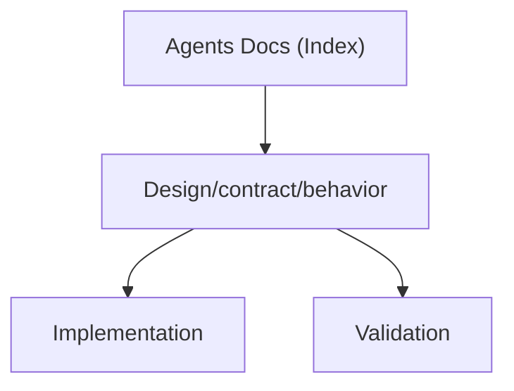

# Agents Docs (Index)

Status: Current (2026-02-07)

This is the hub for `docs/agents/**`. It is intended to make the Agents documentation set composable:
clear entrypoints, clear “source of truth”, and a complete catalog of related documents.

Authority note: use `../documentation-authority.md` when deciding whether a design file is current. The `designs/**`
tree is a dated design archive unless an individual file explicitly says it is current and points to live code, GitOps,
and runtime validation.

## Start Here

- Source-read current state: `current-source-state.md`
- Operational/source-of-truth appendix (repo + chart + cluster): `designs/handoff-common.md`
- Implementing the Helm chart and controllers (implementation-grade): `agents-helm-chart-implementation.md`
- Chart intent and scope (high-level design): `agents-helm-chart-design.md`
- Creating AgentRuns safely (prompt precedence): `agentrun-creation-guide.md`
- Linear issue intake and source-bound MCP operations: `linear-mcp.md`
- Agents control-plane UI and schema-form rollout proof: `control-plane-ui.md`
- Connecting Codex to Agents through MCP: `codex-mcp-agents.md`
- Launching workflow loops correctly (state reuse + checks): `agentrun-workflow-loop-launch-guide.md`
- Running Codex Spark review/fix PR cycles: `codex-spark-review-cycle.md`
- How to validate changes in CI: `ci-validation-plan.md`
- How to install/upgrade/debug (ops): `runbooks.md`
- Fast Jangar/Torghut live analysis workflow: `designs/jangar-torghut-live-analysis-playbook.md`
- Historical autonomous Jangar/Torghut production proposal: `designs/autonomous-jangar-torghut-production-system.md`
- Swarm agentic mission architecture notes: `designs/swarm-agentic-mission-architecture-2026-05-08.md`
- Jangar/Torghut architecture contract archive. Treat these as dated handoffs until verified against live code, GitOps,
  and runtime status:
  - `designs/207-jangar-consumer-evidence-transport-split-and-source-serving-contract-canary-2026-05-15.md`
  - `../torghut/design-system/v6/213-torghut-consumer-evidence-contract-canary-and-alpha-reentry-transport-2026-05-15.md`
  - `designs/206-jangar-route-adjacent-proof-custody-and-torghut-reentry-admission-2026-05-14.md`
  - `../torghut/design-system/v6/212-torghut-route-adjacent-proof-and-execution-freshness-reentry-2026-05-14.md`
  - `designs/205-jangar-controller-ingestion-settlement-and-verification-carry-cutover-2026-05-14.md`
  - `../torghut/design-system/v6/211-torghut-controller-ingestion-carry-and-alpha-no-delta-release-2026-05-14.md`
  - `designs/204-jangar-source-bound-verification-carry-exchange-and-repair-slot-reconciliation-2026-05-14.md`
  - `../torghut/design-system/v6/210-torghut-source-bound-verification-carry-import-and-no-delta-release-2026-05-14.md`
  - `designs/203-jangar-foreclosure-carry-rollout-witness-and-stage-debt-repair-2026-05-14.md`
  - `../torghut/design-system/v6/209-torghut-verification-carry-import-and-alpha-repair-release-2026-05-14.md`
  - `../torghut/design-system/v6/208-torghut-jangar-verification-carry-bridge-and-no-delta-reentry-market-2026-05-14.md`
  - `designs/202-jangar-verification-carry-export-and-repair-slot-reconciliation-2026-05-14.md`
  - `../torghut/design-system/v6/207-torghut-quant-plan-closeout-and-alpha-repair-reentry-handoff-2026-05-14.md`
  - `designs/201-jangar-verify-trust-foreclosure-and-alpha-repair-reentry-2026-05-14.md`
  - `../torghut/design-system/v6/206-torghut-no-delta-repair-reentry-auction-and-verification-carry-2026-05-14.md`
  - `designs/200-jangar-revenue-repair-settlement-conveyor-and-stage-health-custody-2026-05-14.md`
  - `../torghut/design-system/v6/205-torghut-alpha-readiness-settlement-conveyor-and-routeable-profit-runway-2026-05-14.md`
  - `designs/199-jangar-material-action-custody-flight-recorder-and-merge-reentry-slo-2026-05-14.md`
  - `../torghut/design-system/v6/204-torghut-alpha-repair-dividend-ledger-and-custody-flight-recorder-2026-05-14.md`
  - `designs/198-jangar-material-gate-digest-and-alpha-closure-carry-2026-05-14.md`
  - `../torghut/design-system/v6/203-torghut-alpha-closure-dividend-slo-and-consumer-evidence-carry-2026-05-14.md`
  - `designs/197-jangar-compact-alpha-closure-ingestion-and-stage-credit-repair-gate-2026-05-14.md`
  - `../torghut/design-system/v6/202-torghut-compact-alpha-closure-export-and-no-delta-lease-2026-05-14.md`
  - `designs/196-jangar-alpha-closure-slot-governor-and-no-delta-budget-2026-05-14.md`
  - `../torghut/design-system/v6/201-torghut-alpha-closure-settlement-and-feature-replay-market-2026-05-14.md`
  - `designs/195-jangar-receipt-backed-alpha-foundry-and-rollout-safety-covenant-2026-05-14.md`
  - `../torghut/design-system/v6/200-torghut-routeable-alpha-evidence-foundry-and-capital-safe-profit-ladder-2026-05-14.md`
  - `designs/194-jangar-receipt-settled-repair-slots-and-stage-custody-thaw-2026-05-14.md`
  - `../torghut/design-system/v6/199-torghut-executable-alpha-settlement-slots-and-no-delta-repair-custody-2026-05-14.md`
  - `designs/193-jangar-cross-plane-closure-board-and-revenue-repair-admission-2026-05-14.md`
  - `../torghut/design-system/v6/198-torghut-alpha-repair-closure-board-and-routeable-revenue-reentry-2026-05-14.md`
  - `designs/192-jangar-material-readiness-reentry-clearinghouse-and-source-rollout-receipts-2026-05-13.md`
  - `../torghut/design-system/v6/197-torghut-executable-alpha-repair-receipts-and-zero-notional-reentry-2026-05-13.md`
  - `designs/192-jangar-source-to-serving-promotion-closure-and-repair-value-accounting-2026-05-13.md`
  - `../torghut/design-system/v6/197-torghut-serving-promotion-closure-and-no-delta-repair-value-2026-05-13.md`
  - `designs/192-jangar-alpha-readiness-repair-escrow-and-runner-admission-2026-05-13.md`
  - `../torghut/design-system/v6/197-torghut-alpha-readiness-strike-ledger-and-routeable-candidate-ladder-2026-05-13.md`
  - `designs/191-jangar-rollout-proof-passports-and-runner-capacity-futures-2026-05-13.md`
  - `../torghut/design-system/v6/196-torghut-profit-carry-passports-and-repair-capacity-futures-2026-05-13.md`
  - `designs/190-jangar-projection-foreclosure-notary-and-stage-custody-repair-2026-05-13.md`
  - `../torghut/design-system/v6/195-torghut-stale-projection-foreclosure-and-route-custody-2026-05-13.md`
  - `designs/189-jangar-authority-provenance-settlement-and-rollout-reentry-windows-2026-05-13.md`
  - `../torghut/design-system/v6/193-torghut-route-repair-yield-board-and-hypothesis-reentry-guardrails-2026-05-13.md`
  - `designs/189-jangar-terminal-debt-compaction-and-repair-outcome-escrow-2026-05-13.md`
  - `../torghut/design-system/v6/193-torghut-repair-outcome-dividend-ledger-and-capital-reentry-frontier-2026-05-13.md`
  - `designs/188-jangar-ready-truth-arbiter-and-stage-credit-cutover-2026-05-13.md`
  - `../torghut/design-system/v6/192-torghut-repair-receipt-frontier-and-profit-cutover-2026-05-13.md`
  - `designs/188-jangar-evidence-pressure-ledger-and-watch-backoff-governor-2026-05-13.md`
  - `../torghut/design-system/v6/192-torghut-freshness-carry-and-repair-proof-slo-2026-05-13.md`
  - `designs/188-jangar-typed-torghut-evidence-admission-and-repair-dispatch-2026-05-13.md`
  - `../torghut/design-system/v6/192-torghut-typed-consumer-evidence-route-and-capital-safe-repair-dispatch-2026-05-13.md`
  - `designs/187-jangar-main-source-ci-retention-and-source-serving-verdicts-2026-05-13.md`
  - `../torghut/design-system/v6/191-torghut-source-serving-proof-and-repair-receipt-promotion-2026-05-13.md`
  - `designs/186-jangar-route-warrant-dispatch-custody-and-dependency-verdicts-2026-05-13.md`
  - `../torghut/design-system/v6/190-torghut-route-warrant-exchange-and-ingestion-proof-reentry-2026-05-13.md`
  - `designs/185-jangar-clock-settled-repair-dispatch-and-rollout-custody-2026-05-12.md`
  - `../torghut/design-system/v6/189-torghut-clock-settled-repair-execution-and-routeability-reentry-2026-05-12.md`
  - `designs/184-jangar-stage-evidence-credit-authority-and-freeze-reclock-2026-05-12.md`
  - `../torghut/design-system/v6/188-torghut-evidence-credit-capital-repair-market-2026-05-12.md`
  - `designs/184-jangar-stage-clearance-packets-and-repair-run-lot-ledger-2026-05-12.md`
  - `../torghut/design-system/v6/188-torghut-stage-clearance-consumer-and-repair-lot-broker-2026-05-12.md`
  - `designs/184-jangar-stage-clearance-packets-and-freeze-aware-launch-governor-2026-05-12.md`
  - `../torghut/design-system/v6/188-torghut-profit-repair-clearance-packets-and-market-context-slos-2026-05-12.md`
  - `designs/183-jangar-attested-action-custody-and-profit-window-admission-2026-05-08.md`
  - `../torghut/design-system/v6/187-torghut-profit-window-custody-and-repair-value-market-2026-05-08.md`
  - `designs/182-jangar-routeability-cutover-backpressure-and-proof-run-admission-2026-05-08.md`
  - `../torghut/design-system/v6/186-torghut-routeability-acceptance-cutover-and-fill-quality-loop-2026-05-08.md`
  - `designs/181-jangar-proof-production-debt-and-routeability-admission-2026-05-08.md`
  - `../torghut/design-system/v6/185-torghut-routeability-repair-acceptance-ledger-2026-05-08.md`
  - `designs/180-jangar-stage-clearance-exchange-and-scheduler-routability-contract-2026-05-08.md`
  - `../torghut/design-system/v6/184-torghut-profit-signal-quorum-and-context-routability-handoff-2026-05-08.md`
  - `designs/180-jangar-execution-trust-debt-retirement-and-profit-repair-settlement-2026-05-08.md`
  - `../torghut/design-system/v6/184-torghut-execution-trusted-profit-repair-settlement-2026-05-08.md`
  - `designs/179-jangar-controller-witness-stability-escrow-and-capital-reentry-backpressure-2026-05-08.md`
  - `../torghut/design-system/v6/183-torghut-receipt-settled-capital-reentry-cohorts-2026-05-08.md`
  - `designs/178-jangar-source-serving-parity-escrow-and-route-independent-launch-passports-2026-05-08.md`
  - `../torghut/design-system/v6/182-torghut-route-proven-profit-receipts-and-consumer-evidence-canary-2026-05-08.md`
  - `designs/177-jangar-evidence-quality-admission-ledger-and-degradation-backpressure-2026-05-08.md`
  - `../torghut/design-system/v6/181-torghut-quality-adjusted-profit-frontier-and-hypothesis-escrow-2026-05-08.md`
  - `designs/176-jangar-resource-pressure-escrow-and-runner-qos-gates-2026-05-08.md`
  - `../torghut/design-system/v6/180-torghut-resource-priced-evidence-frontier-and-context-spend-escrow-2026-05-08.md`
  - `designs/175-jangar-failure-debt-clearance-and-action-reentry-frontier-2026-05-08.md`
  - `../torghut/design-system/v6/179-torghut-capital-repair-frontier-and-route-yield-clearance-2026-05-08.md`
  - `designs/174-jangar-observer-rights-and-source-settled-capital-ledger-2026-05-08.md`
  - `../torghut/design-system/v6/178-torghut-route-sample-mint-and-capital-proof-ratchet-2026-05-08.md`
  - `designs/173-jangar-action-broker-and-proof-carrying-rollout-cells-2026-05-08.md`
  - `../torghut/design-system/v6/177-torghut-profit-repair-broker-and-capital-promotion-gates-2026-05-08.md`
  - `designs/171-jangar-terminal-debt-exchange-and-retry-custody-2026-05-08.md`
  - `../torghut/design-system/v6/175-torghut-failure-costed-context-repair-and-route-custody-2026-05-08.md`
  - `designs/170-jangar-continuity-witness-ledger-and-attested-dispatch-packets-2026-05-08.md`
  - `../torghut/design-system/v6/174-torghut-continuity-priced-route-repair-market-and-capital-holds-2026-05-08.md`
  - `designs/168-jangar-source-heartbeat-witness-settlement-and-material-action-bonds-2026-05-07.md`
  - `../torghut/design-system/v6/172-torghut-repair-yield-ledger-and-session-proof-capital-gates-2026-05-07.md`
  - `designs/166-jangar-repair-cadence-ledger-and-capital-surface-admission-2026-05-07.md`
  - `../torghut/design-system/v6/170-torghut-capital-surface-repair-cadence-and-route-edge-market-2026-05-07.md`
  - `designs/164-jangar-contract-graduation-brake-and-runtime-receipt-gates-2026-05-07.md`
  - `../torghut/design-system/v6/168-torghut-executable-alpha-receipts-and-capital-replay-board-2026-05-07.md`
  - `designs/162-jangar-contract-witness-notary-and-material-action-gates-2026-05-07.md`
  - `../torghut/design-system/v6/166-torghut-paper-edge-witness-notary-and-zero-notional-repair-queue-2026-05-07.md`
  - `designs/161-jangar-stage-debt-clearinghouse-and-freshness-credit-ledger-2026-05-07.md`
  - `../torghut/design-system/v6/165-torghut-quant-freshness-debt-and-paper-edge-ledgers-2026-05-07.md`
  - `designs/160-jangar-split-authority-repair-escrow-and-dispatch-reentry-packets-2026-05-07.md`
  - `../torghut/design-system/v6/164-torghut-zero-notional-route-repair-packets-and-paper-rehearsal-2026-05-07.md`
  - `designs/155-jangar-execution-cohort-settlement-and-launch-quarantine-2026-05-07.md`
  - `../torghut/design-system/v6/159-torghut-capital-cohort-frontier-and-routeability-repair-board-2026-05-07.md`
  - `designs/154-jangar-source-provenance-leases-and-material-action-escrow-2026-05-07.md`
  - `../torghut/design-system/v6/158-torghut-capital-proof-provenance-and-routeable-edge-repair-ledger-2026-05-07.md`
  - `designs/153-jangar-design-actuation-ledger-and-contract-convergence-gates-2026-05-07.md`
  - `../torghut/design-system/v6/157-torghut-profit-contract-actuation-and-capital-surface-truth-2026-05-07.md`
  - `designs/151-jangar-repair-outcome-settlement-and-schedule-debt-roi-exchange-2026-05-07.md`
  - `../torghut/design-system/v6/155-torghut-capital-repair-outcome-ledger-and-edge-reacquisition-gates-2026-05-07.md`
  - `designs/152-jangar-material-verdict-authority-and-contradiction-debt-ledger-2026-05-07.md`
  - `../torghut/design-system/v6/156-torghut-repair-closure-yield-ledger-and-capital-unlock-receipts-2026-05-07.md`
  - `designs/150-jangar-controller-brownout-budgets-and-proof-spend-admission-exchange-2026-05-07.md`
  - `../torghut/design-system/v6/154-torghut-marginal-proof-spend-portfolio-and-capital-repair-budget-2026-05-07.md`
  - `designs/149-jangar-wrapper-truth-settlement-and-useful-evidence-gates-2026-05-07.md`
  - `../torghut/design-system/v6/153-torghut-useful-evidence-capital-escrow-and-provider-repair-gates-2026-05-07.md`
  - `designs/148-jangar-source-rollout-truth-exchange-and-proof-floor-settlement-2026-05-07.md`
  - `../torghut/design-system/v6/152-torghut-proof-floor-settlement-bonds-and-tca-repair-auction-2026-05-07.md`
  - `designs/147-jangar-hypothesis-scoped-capital-adjudication-ledger-2026-05-07.md`
  - `../torghut/design-system/v6/151-torghut-hypothesis-scoped-capital-adjudication-and-profit-gates-2026-05-07.md`
  - `designs/146-jangar-repair-warrant-exchange-and-schedule-debt-firebreak-2026-05-07.md`
  - `../torghut/design-system/v6/150-torghut-repair-dividend-order-book-and-capital-warrants-2026-05-07.md`
  - `designs/145-jangar-observation-epoch-tripwire-and-capital-contradiction-arbiter-2026-05-07.md`
  - `../torghut/design-system/v6/149-torghut-profit-evidence-convergence-epochs-and-quant-stage-arbitrage-2026-05-07.md`
  - `designs/143-jangar-profit-repair-lease-control-plane-and-controller-witness-exchange-2026-05-07.md`
  - `../torghut/design-system/v6/147-torghut-profit-repair-leases-and-forecast-registry-settlement-2026-05-07.md`
  - `designs/143-jangar-route-stable-status-snapshot-escrow-and-repair-actuation-windows-2026-05-07.md`
  - `../torghut/design-system/v6/147-torghut-stale-proof-repair-exchange-and-route-stable-capital-quorum-2026-05-07.md`
  - `designs/142-jangar-repair-dividend-handoff-gates-and-actuation-contracts-2026-05-07.md`
  - `../torghut/design-system/v6/146-torghut-submission-quorum-handoff-and-profit-repair-gates-2026-05-07.md`
  - `designs/141-jangar-controller-witness-escrow-and-repair-dividend-settlement-2026-05-07.md`
  - `../torghut/design-system/v6/145-torghut-repair-dividend-ledger-and-submission-quorum-2026-05-07.md`
  - `designs/140-jangar-watch-reliability-state-exchange-and-capital-action-governor-2026-05-07.md`
  - `../torghut/design-system/v6/144-torghut-state-coherent-profit-auction-and-tca-renewal-governor-2026-05-07.md`
  - `designs/139-jangar-empirical-relay-source-binding-and-capital-gate-parity-2026-05-07.md`
  - `../torghut/design-system/v6/143-torghut-empirical-relay-receipts-and-paper-gate-settlement-2026-05-07.md`
  - `designs/138-jangar-proof-truth-windows-and-contradiction-arbiter-2026-05-07.md`
  - `../torghut/design-system/v6/142-torghut-alpha-truth-windows-and-capital-reentry-warrants-2026-05-07.md`
  - `designs/137-jangar-watch-debt-clearing-and-profit-repair-leases-2026-05-07.md`
  - `../torghut/design-system/v6/141-torghut-watch-debt-profit-repair-market-and-capital-reentry-gates-2026-05-07.md`
  - `designs/136-jangar-verification-trust-escrow-and-query-budgeted-evidence-settlement-2026-05-07.md`
  - `../torghut/design-system/v6/140-torghut-post-cost-alpha-reentry-and-proof-query-market-2026-05-07.md`
  - `designs/136-jangar-controller-authority-settlement-and-endpoint-parity-ledger-2026-05-07.md`
  - `../torghut/design-system/v6/140-torghut-endpoint-parity-profit-repair-and-capital-route-auction-2026-05-07.md`
  - `designs/134-jangar-evidence-census-and-projection-settlement-exchange-2026-05-07.md`
  - `../torghut/design-system/v6/138-torghut-profit-stats-census-and-tca-reactivation-market-2026-05-07.md`
  - `designs/134-jangar-profit-clock-settlement-router-and-evidence-margin-arbiter-2026-05-07.md`
  - `../torghut/design-system/v6/138-torghut-capital-efficiency-proof-exchange-and-profit-clock-2026-05-07.md`
  - `designs/133-jangar-in-flight-stage-renewal-bonds-and-controller-ingestion-settlement-2026-05-07.md`
  - `../torghut/design-system/v6/137-torghut-renewal-bond-profit-escrow-and-evidence-carry-2026-05-07.md`
  - `designs/132-jangar-schedule-lease-rehydration-and-stage-trust-settlement-2026-05-07.md`
  - `../torghut/design-system/v6/136-torghut-capital-repair-escrow-and-freshness-auction-2026-05-07.md`
  - `designs/130-jangar-synthetic-readiness-settlement-and-evidence-probe-fuses-2026-05-06.md`
  - `../torghut/design-system/v6/134-torghut-profitability-proof-floor-and-evidence-repair-market-2026-05-06.md`
  - `designs/129-jangar-heartbeat-lane-escrow-and-material-verdict-stability-2026-05-06.md`
  - `../torghut/design-system/v6/133-torghut-stable-jangar-receipts-and-closed-session-capital-hold-2026-05-06.md`
  - `designs/128-jangar-terminal-run-settlement-and-forecast-reentry-admission-2026-05-06.md`
  - `../torghut/design-system/v6/132-torghut-forecast-profit-tournament-and-capital-reentry-guardrails-2026-05-06.md`
  - `designs/128-jangar-runtime-convergence-ledger-and-capital-gate-receipts-2026-05-06.md`
  - `../torghut/design-system/v6/132-torghut-dependency-quorum-rehydration-and-profit-inventory-handoff-2026-05-06.md`
  - `designs/127-jangar-activation-inventory-ledger-and-product-gap-fuses-2026-05-06.md`
  - `../torghut/design-system/v6/131-torghut-active-profit-inventory-and-quant-carry-fuses-2026-05-06.md`
  - `designs/127-jangar-session-rehearsal-conductor-and-capital-settlement-gates-2026-05-06.md`
  - `../torghut/design-system/v6/131-torghut-session-capital-bonds-and-profit-rehearsal-exchange-2026-05-06.md`
  - `designs/126-jangar-projection-witness-exchange-and-material-evidence-products-2026-05-06.md`
  - `../torghut/design-system/v6/130-torghut-evidence-product-order-book-and-profit-carry-ladder-2026-05-06.md`
  - `designs/125-jangar-quant-proof-replication-and-capital-admission-firebreak-2026-05-06.md`
  - `../torghut/design-system/v6/129-torghut-bidirectional-quant-proof-receipts-and-profit-reentry-ledger-2026-05-06.md`
  - `designs/123-jangar-market-context-contradiction-ledger-and-lane-capital-holds-2026-05-06.md`
  - `../torghut/design-system/v6/127-torghut-market-context-claims-and-lane-profit-settlement-2026-05-06.md`
  - `designs/122-jangar-evidence-pressure-governor-and-data-cost-rollout-cells-2026-05-06.md`
  - `../torghut/design-system/v6/126-torghut-hypothesis-custody-ledger-and-data-cost-profit-reserve-2026-05-06.md`
  - `designs/121-jangar-material-action-repair-clearing-lane-and-profit-proof-ledger-2026-05-06.md`
  - `../torghut/design-system/v6/125-torghut-profit-priced-evidence-renewal-and-capital-reentry-ledger-2026-05-06.md`
  - `designs/121-jangar-controller-witness-uplink-and-proof-renewal-train-2026-05-06.md`
  - `../torghut/design-system/v6/125-torghut-proof-renewal-train-and-capital-reentry-sequencer-2026-05-06.md`
  - `designs/120-jangar-material-action-verdict-arbiter-and-clock-budget-parity-2026-05-06.md`
  - `../torghut/design-system/v6/124-torghut-capital-action-verdict-consumer-and-profit-hypothesis-settlement-2026-05-06.md`
  - `designs/120-jangar-data-plane-proof-quarantine-and-profit-repair-fuse-2026-05-06.md`
  - `../torghut/design-system/v6/124-torghut-data-plane-proof-quarantine-and-profit-renewal-fuse-2026-05-06.md`
  - `designs/116-jangar-controller-witness-quorum-and-capital-activation-receipts-2026-05-06.md`
  - `../torghut/design-system/v6/120-torghut-capital-activation-receipts-and-shadow-profit-proof-queue-2026-05-06.md`
  - `designs/115-jangar-watch-quiescence-and-evidence-renewal-arbiter-2026-05-06.md`
  - `../torghut/design-system/v6/119-torghut-evidence-renewal-batches-and-capital-quiescence-gates-2026-05-06.md`
  - `designs/114-jangar-evidence-transport-ledger-and-watch-restart-circuit-breakers-2026-05-06.md`
  - `../torghut/design-system/v6/118-torghut-proof-route-parity-and-options-informed-repair-scheduler-2026-05-06.md`
  - `designs/113-jangar-contradiction-settlement-and-profit-repair-auction-2026-05-06.md`
  - `../torghut/design-system/v6/117-torghut-contradiction-priced-profit-repair-and-capital-readmission-2026-05-06.md`
  - `designs/112-jangar-session-scoped-proof-settlement-and-stale-alert-netting-2026-05-06.md`
  - `../torghut/design-system/v6/116-torghut-session-scoped-alpha-ledger-and-replay-capital-scheduler-2026-05-06.md`
  - `designs/111-jangar-negative-evidence-router-and-action-slo-budgets-2026-05-06.md`
  - `../torghut/design-system/v6/115-torghut-proof-spend-market-and-negative-evidence-consumer-2026-05-06.md`
  - `designs/110-jangar-gitops-convergence-escrow-and-promotion-evidence-ledger-2026-05-06.md`
  - `../torghut/design-system/v6/114-torghut-convergence-bound-proof-replay-and-capital-readmission-2026-05-06.md`
  - `designs/109-jangar-promotion-escrow-replay-cells-and-consumer-parity-gates-2026-05-06.md`
  - `../torghut/design-system/v6/113-torghut-live-sim-parity-and-empirical-proof-replay-escrow-2026-05-06.md`
  - `designs/108-jangar-action-class-capital-clearance-and-proof-clock-arbiter-2026-05-06.md`
  - `../torghut/design-system/v6/112-torghut-dual-key-capital-clearance-and-intraday-proof-loop-2026-05-06.md`
  - `designs/107-jangar-reciprocal-evidence-authority-and-contradiction-escrow-2026-05-06.md`
  - `../torghut/design-system/v6/111-torghut-reciprocal-evidence-authority-and-profit-escrow-2026-05-06.md`
  - `designs/106-jangar-proof-repair-clearinghouse-and-brownout-priority-queue-2026-05-06.md`
  - `../torghut/design-system/v6/110-torghut-evidence-freshness-repair-market-and-capital-reentry-2026-05-06.md`
  - `designs/105-jangar-evidence-pressure-runways-and-profit-proof-budgets-2026-05-06.md`
  - `../torghut/design-system/v6/109-torghut-profit-proof-budget-consumer-and-options-runway-2026-05-06.md`
  - `designs/104-jangar-quant-evidence-clearinghouse-and-capital-action-firewall-2026-05-06.md`
  - `../torghut/design-system/v6/108-torghut-capital-clearance-market-and-negative-evidence-ledger-2026-05-06.md`
  - `designs/104-jangar-repair-closure-receipts-and-settlement-finality-2026-05-06.md`
  - `../torghut/design-system/v6/108-torghut-proof-repair-closure-receipts-and-profit-settlement-2026-05-06.md`
  - `designs/103-jangar-torghut-decision-custody-cells-and-rollout-proof-exchange-2026-05-06.md`
  - `../torghut/design-system/v6/107-torghut-decision-custody-cells-and-capital-reentry-2026-05-06.md`
  - `designs/103-jangar-material-action-settlement-board-and-profit-repair-gates-2026-05-06.md`
  - `../torghut/design-system/v6/107-torghut-profit-repair-roi-ledger-and-capital-settlement-gates-2026-05-06.md`
  - `designs/102-jangar-dual-authority-dispatch-ledger-and-capital-proof-firewall-2026-05-06.md`
  - `../torghut/design-system/v6/106-torghut-live-proof-recovery-ledger-and-options-data-firewall-2026-05-06.md`
  - `designs/101-jangar-typed-evidence-authority-and-readiness-debt-gates-2026-05-06.md`
  - `../torghut/design-system/v6/105-torghut-capital-reentry-evidence-feed-and-readiness-debt-netting-2026-05-06.md`
  - `designs/101-jangar-evidence-provenance-firewall-and-lease-graduation-contract-2026-05-06.md`
  - `../torghut/design-system/v6/105-torghut-proof-provenance-firewall-and-profit-lease-graduation-2026-05-06.md`
  - `designs/101-jangar-account-scoped-proof-liquidity-and-query-budget-2026-05-06.md`
  - `../torghut/design-system/v6/105-torghut-account-scoped-hypothesis-liquidity-and-options-bootstrap-2026-05-06.md`
  - `designs/100-jangar-lease-reconciliation-clock-and-dispatch-expiry-contract-2026-05-06.md`
  - `../torghut/design-system/v6/104-torghut-proof-expiry-clock-and-hypothesis-rehydration-lanes-2026-05-06.md`
  - `designs/99-jangar-evidence-lease-cells-and-rollout-admission-arbiter-2026-05-06.md`
  - `../torghut/design-system/v6/103-torghut-hypothesis-lease-arbiter-and-options-profit-runway-2026-05-06.md`
  - `designs/97-jangar-discover-cutover-handoff-and-proof-debt-gates-2026-05-06.md`
  - `../torghut/design-system/v6/101-torghut-proof-debt-retirement-and-shadow-capital-handoff-2026-05-06.md`
  - `designs/96-jangar-session-proof-train-and-capital-authority-separation-2026-05-06.md`
  - `../torghut/design-system/v6/100-torghut-session-proof-train-and-profitability-warrants-2026-05-06.md`
  - `designs/96-jangar-observed-action-authority-and-negative-evidence-reclocking-2026-05-06.md`
  - `../torghut/design-system/v6/100-torghut-market-context-negative-evidence-and-shadow-capital-router-2026-05-06.md`
  - `designs/95-jangar-evidence-settlement-slo-and-launch-escrow-runway-2026-05-05.md`
  - `../torghut/design-system/v6/99-torghut-profit-proof-escrow-and-repair-dividend-slo-2026-05-05.md`
  - `designs/94-jangar-proof-backed-rollout-brake-and-repair-debt-ledger-2026-05-05.md`
  - `../torghut/design-system/v6/98-torghut-repair-dividend-ledger-and-capital-reentry-guard-2026-05-05.md`
  - `designs/93-jangar-torghut-proof-sample-settlement-and-repair-close-loop-2026-05-05.md`
  - `../torghut/design-system/v6/97-torghut-proof-sample-settlement-and-repair-close-loop-2026-05-05.md`
  - `designs/92-jangar-torghut-proof-feed-route-budget-and-quorum-split-2026-05-05.md`
  - `../torghut/design-system/v6/96-torghut-control-plane-proof-feed-and-profit-route-budget-contract-2026-05-05.md`
  - `designs/91-jangar-evidence-warrants-and-lane-local-quorum-2026-05-05.md`
  - `../torghut/design-system/v6/95-torghut-hypothesis-warrant-reclocking-and-profit-repair-contract-2026-05-05.md`
  - `designs/90-jangar-proof-capacity-leases-and-route-slo-governor-2026-05-05.md`
  - `../torghut/design-system/v6/94-torghut-session-edge-ledger-and-cost-aware-capital-allocator-2026-05-05.md`
  - `designs/89-jangar-brownout-adoption-ladder-and-quant-capital-contract-2026-05-05.md`
  - `../torghut/design-system/v6/93-torghut-evidence-priced-hypothesis-market-and-capital-ladder-2026-05-05.md`
  - `designs/88-jangar-negative-evidence-arbiter-and-brownout-governor-2026-05-05.md`
  - `../torghut/design-system/v6/92-torghut-proof-cost-market-and-options-catalog-firebreak-2026-05-05.md`
  - `designs/85-jangar-evidence-epoch-runway-and-material-action-gates-2026-05-05.md`
  - `../torghut/design-system/v6/89-torghut-hypothesis-warrant-ledger-and-profit-runway-2026-05-05.md`
  - `designs/84-jangar-material-action-settlement-ledger-and-slo-arbiter-2026-05-05.md`
  - `../torghut/design-system/v6/88-torghut-profit-slo-lanes-and-session-replay-governor-2026-05-05.md`
  - `designs/83-jangar-clearance-repair-exchange-and-budgeted-proof-closures-2026-05-05.md`
  - `../torghut/design-system/v6/87-torghut-repair-alpha-exchange-and-session-proof-budgets-2026-05-05.md`
  - `designs/83-jangar-lease-backed-proof-market-and-profit-aware-rollout-authority-2026-05-05.md`
  - `../torghut/design-system/v6/87-torghut-capital-lease-consumer-and-profit-repair-marketplace-2026-05-05.md`
  - `designs/82-jangar-authority-clearance-cells-and-negative-evidence-slas-2026-05-05.md`
  - `../torghut/design-system/v6/86-torghut-profit-debt-ledger-and-repair-sla-experiments-2026-05-05.md`
  - `designs/81-jangar-action-authority-ledger-and-repair-runway-2026-05-05.md`
  - `../torghut/design-system/v6/85-torghut-profit-escrow-repair-auction-and-capital-authority-2026-05-05.md`
  - `designs/80-jangar-settlement-adoption-ladder-and-cutover-governance-2026-05-05.md`
  - `../torghut/design-system/v6/84-torghut-capital-warrant-adoption-and-profitability-experiment-ladder-2026-05-05.md`
  - `designs/79-jangar-control-plane-proof-runway-and-consumer-gated-rollout-2026-05-05.md`
  - `../torghut/design-system/v6/83-torghut-profit-runway-consumer-and-hypothesis-capital-auction-2026-05-05.md`
  - `designs/78-jangar-capital-warrant-issuer-and-route-independent-order-admission-2026-05-05.md`
  - `../torghut/design-system/v6/82-torghut-order-admission-warrants-and-replay-capital-auction-2026-05-05.md`
  - `designs/77-jangar-evidence-settlement-authority-and-data-proof-handoff-2026-05-05.md`
  - `../torghut/design-system/v6/81-torghut-capital-proof-reconciliation-and-jangar-settlement-consumer-2026-05-05.md`
  - `designs/76-jangar-rollout-settlement-fuses-and-proof-reclocking-2026-05-05.md`
  - `../torghut/design-system/v6/80-torghut-capital-proof-reclocking-and-live-submission-fuses-2026-05-05.md`
  - `designs/70-jangar-evidence-epoch-admission-and-rollout-quarantine-2026-05-05.md`
  - `../torghut/design-system/v6/75-torghut-cross-plane-evidence-epochs-and-profit-cell-governor-2026-05-05.md`
  - `designs/67-jangar-runtime-cells-and-rollout-backpressure-contract-2026-05-05.md`
  - `../torghut/design-system/v6/72-torghut-proof-exchange-and-data-firebreak-contract-2026-05-05.md`
  - `designs/65-jangar-recovery-epoch-cutover-and-backlog-seat-enforcement-contract-2026-03-21.md`
  - `../torghut/design-system/v6/64-torghut-profit-window-cutover-and-escrow-enforcement-contract-2026-03-21.md`
  - `designs/64-jangar-recovery-epochs-and-backlog-seats-contract-2026-03-21.md`
  - `../torghut/design-system/v6/63-torghut-profit-windows-and-evidence-escrow-contract-2026-03-21.md`
  - `designs/63-jangar-consumer-projections-and-latency-class-admission-contract-2026-03-20.md`
  - `../torghut/design-system/v6/62-torghut-lane-books-and-bounded-query-firebreak-contract-2026-03-20.md`
  - `designs/62-jangar-execution-receipts-and-stage-recovery-cells-contract-2026-03-20.md`
  - `../torghut/design-system/v6/61-torghut-evidence-seats-and-profit-repair-exchange-contract-2026-03-20.md`
  - `designs/61-jangar-runtime-kits-and-admission-passports-contract-2026-03-20.md`
  - `../torghut/design-system/v6/60-torghut-hypothesis-passports-and-capability-quote-auction-contract-2026-03-20.md`
  - `designs/60-jangar-recovery-ledger-and-consumer-attestation-contract-2026-03-20.md`
  - `../torghut/design-system/v6/59-torghut-lane-balance-sheet-and-dataset-seat-auction-contract-2026-03-20.md`
  - `designs/59-jangar-authority-session-bus-and-rollout-lease-contract-2026-03-20.md`
  - `../torghut/design-system/v6/58-torghut-profit-cohort-auction-and-freshness-insurance-contract-2026-03-20.md`
  - `designs/57-jangar-authority-capsules-and-readiness-class-separation-2026-03-20.md`
  - `../torghut/design-system/v6/56-torghut-capability-leases-and-profit-clocks-2026-03-20.md`
  - `designs/55-jangar-rollout-fact-receipts-and-swarm-freeze-parity-2026-03-20.md`
  - `../torghut/design-system/v6/54-torghut-capital-lease-receipts-and-profit-falsification-ledger-2026-03-20.md`
  - `designs/54-jangar-witness-mirror-quorum-and-promotion-veto-2026-03-20.md`
  - `../torghut/design-system/v6/53-torghut-cross-plane-profit-certificate-veto-and-options-auth-isolation-2026-03-20.md`
  - `designs/51-jangar-control-plane-execution-cells-and-collaboration-failover-2026-03-19.md`
  - `designs/54-jangar-admission-receipts-rollout-shadow-and-anti-entropy-reconciliation-2026-03-20.md`
  - `../torghut/design-system/v6/50-torghut-submission-parity-council-and-options-bootstrap-escrow-2026-03-19.md`
  - `../torghut/design-system/v6/53-torghut-capital-leases-and-profit-trial-firebreaks-2026-03-20.md`
  - `designs/50-torghut-hypothesis-capital-governor-and-data-quorum-2026-03-19.md`
  - `designs/52-jangar-segment-authority-graph-and-promotion-certificate-fail-safe-2026-03-19.md`
  - `../torghut/design-system/v6/51-torghut-promotion-certificate-and-segment-firebreak-handoff-2026-03-19.md`
- Discover-stage rationale feeding the current March 20 contract stack:
  - `designs/57-jangar-authority-capsules-and-route-parity-contract-2026-03-20.md`
  - `../torghut/design-system/v6/56-torghut-profit-clocks-and-lane-falsification-exchange-2026-03-20.md`
- Security baseline: `threat-model.md`
- RBAC requirements: `rbac-matrix.md`
- Production bar (non-negotiables): `production-readiness-design.md`

## Source Of Truth And Precedence

When documents disagree, use this precedence order:

1. GitOps desired state: `argocd/applications/agents/` (what the cluster should converge to).
2. Helm chart and CRDs: `charts/agents/` (`templates/`, `values.yaml`, `values.schema.json`, `crds/`).
3. Controller/runtime code and API types: `services/agents/src/server/**` and `services/agents/api/**`.
4. “Current” docs in `docs/agents/` (implementation-grade and current requirements).
5. “Draft/Partial” docs in `docs/agents/designs/` (proposals; may describe current behavior but are not always enforced).

If you are changing behavior, update 1-3 first, then ensure 4-5 describe the resulting system accurately.

For env and gRPC source-of-truth changes in this branch:

- Update chart contracts in `charts/agents/templates/validation.yaml`.
- Configure precedence and migration details in:
  - `designs/chart-env-vars-merge-precedence.md`
  - `designs/chart-envfrom-conflict-resolution.md`
  - `designs/chart-grpc-enabled-source-of-truth.md`

## How The Docs Compose

- Platform requirements and guardrails:
  - `production-readiness-design.md`, `threat-model.md`, `rbac-matrix.md`
- Chart + GitOps packaging and install surface:
  - `agents-helm-chart-design.md`, `agents-helm-chart-implementation.md`, chart-level docs in `docs/agents/designs/chart-*.md`
- API and schema:
  - CRD generation/spec: `crd-best-practices.md`, `crd-yaml-spec.md`, plus `docs/agents/designs/crd-*.md`
- Controllers and runtime behavior:
  - `jangar-controller-design.md`, `leader-election-design.md`, plus `docs/agents/designs/controller-*.md`
- Validation and operations:
  - `ci-validation-plan.md`, `runbooks.md`, plus `docs/agents/designs/*runbook*.md`
- Distribution:
  - `market-readiness-and-distribution.md`, plus `docs/agents/designs/artifacthub-oci-distribution.md`
- CLI:
  - `agentctl.md` and `agentctl-*.md`, plus `docs/agents/designs/agentctl-*.md`

## Common Change Flows

### Changing CRDs

- Update Go types (Agents primitives): `services/agents/api/agents/v1alpha1/**`
- Regenerate CRDs: `charts/agents/crds/`
- Validate: `scripts/agents/validate-agents.sh`
- Update examples if needed: `charts/agents/examples/**`
- Ensure chart metadata stays accurate: `charts/agents/Chart.yaml` (CRD listings/examples)

### Changing Chart Values Or Templates

- Update: `charts/agents/values.yaml`, `charts/agents/values.schema.json`, `charts/agents/templates/**`
- Update production overlay (if needed): `argocd/applications/agents/values.yaml`
- Render the GitOps desired install: see `designs/handoff-common.md`

### Changing Controller Behavior

- Update: `services/agents/src/server/**`
- Verify env var/value mapping remains correct: `docs/agents/designs/chart-env-vars-merge-precedence.md`
- Validate end-to-end with `scripts/agents/validate-agents.sh` and a smoke run

## Catalog (All Documents)

### Top-Level (`docs/agents/*.md`)

- [agentrun-creation-guide.md](agentrun-creation-guide.md)
- [codex-spark-review-cycle.md](codex-spark-review-cycle.md)
- [agentrun-workflow-loop-launch-guide.md](agentrun-workflow-loop-launch-guide.md)
- [agent-run-retention-design.md](agent-run-retention-design.md)
- [agentctl-cli-design.md](agentctl-cli-design.md)
- [agentctl-grpc-coverage.md](agentctl-grpc-coverage.md)
- [agentctl-release.md](agentctl-release.md)
- [agentctl-status-watch.md](agentctl-status-watch.md)
- [agentctl.md](agentctl.md)
- [agents-helm-chart-design.md](agents-helm-chart-design.md)
- [agents-helm-chart-implementation.md](agents-helm-chart-implementation.md)
- [ci-validation-plan.md](ci-validation-plan.md)
- [crd-best-practices.md](crd-best-practices.md)
- [crd-yaml-spec.md](crd-yaml-spec.md)
- [jangar-controller-design.md](jangar-controller-design.md)
- [leader-election-design.md](leader-election-design.md)
- [market-readiness-and-distribution.md](market-readiness-and-distribution.md)
- [production-readiness-design.md](production-readiness-design.md)
- [rbac-matrix.md](rbac-matrix.md)
- [runbooks.md](runbooks.md)
- [threat-model.md](threat-model.md)
- [topology-spread-constraints.md](topology-spread-constraints.md)
- [version-control-provider-design.md](version-control-provider-design.md)

### Designs (`docs/agents/designs/*.md`)

- [designs/admission-control-policy.md](designs/admission-control-policy.md)
- [designs/agentctl-cli-resilience.md](designs/agentctl-cli-resilience.md)
- [designs/api-pagination-and-watch.md](designs/api-pagination-and-watch.md)
- [designs/approval-policy-gates.md](designs/approval-policy-gates.md)
- [designs/artifact-storage-s3.md](designs/artifact-storage-s3.md)
- [designs/artifacthub-oci-distribution.md](designs/artifacthub-oci-distribution.md)
- [designs/autonomous-jangar-torghut-production-system.md](designs/autonomous-jangar-torghut-production-system.md)
- [designs/audit-logging.md](designs/audit-logging.md)
- [designs/branch-naming-conflict-strategy.md](designs/branch-naming-conflict-strategy.md)
- [designs/budget-enforcement.md](designs/budget-enforcement.md)
- [designs/chart-canary-argo-rollouts.md](designs/chart-canary-argo-rollouts.md)
- [designs/chart-config-checksum-rollouts.md](designs/chart-config-checksum-rollouts.md)
- [designs/chart-controller-namespaces-empty-semantics.md](designs/chart-controller-namespaces-empty-semantics.md)
- [designs/chart-controllers-hpa.md](designs/chart-controllers-hpa.md)
- [designs/chart-controllers-image-override-precedence.md](designs/chart-controllers-image-override-precedence.md)
- [designs/chart-controllers-pdb.md](designs/chart-controllers-pdb.md)
- [designs/chart-controllers-service.md](designs/chart-controllers-service.md)
- [designs/chart-controlplane-image-override-precedence.md](designs/chart-controlplane-image-override-precedence.md)
- [designs/chart-database-url-secretref-precedence.md](designs/chart-database-url-secretref-precedence.md)
- [designs/chart-deployment-strategy-rollingupdate.md](designs/chart-deployment-strategy-rollingupdate.md)
- [designs/chart-env-vars-merge-precedence.md](designs/chart-env-vars-merge-precedence.md)
- [designs/chart-envfrom-conflict-resolution.md](designs/chart-envfrom-conflict-resolution.md)
- [designs/chart-extra-volumes-mounts-contract.md](designs/chart-extra-volumes-mounts-contract.md)
- [designs/chart-grpc-enabled-source-of-truth.md](designs/chart-grpc-enabled-source-of-truth.md)
- [designs/chart-image-digest-tag-precedence.md](designs/chart-image-digest-tag-precedence.md)
- [designs/chart-kubernetesapi-host-port-override.md](designs/chart-kubernetesapi-host-port-override.md)
- [designs/chart-namespaceoverride-namespace-behavior.md](designs/chart-namespaceoverride-namespace-behavior.md)
- [designs/chart-pod-annotations-merging.md](designs/chart-pod-annotations-merging.md)
- [designs/chart-probes-configuration-contract.md](designs/chart-probes-configuration-contract.md)
- [designs/chart-rbac-clusterscoped-guardrails.md](designs/chart-rbac-clusterscoped-guardrails.md)
- [designs/chart-resources-component-overrides.md](designs/chart-resources-component-overrides.md)
- [designs/chart-rollback-helm-behavior.md](designs/chart-rollback-helm-behavior.md)
- [designs/chart-runner-serviceaccount-defaulting.md](designs/chart-runner-serviceaccount-defaulting.md)
- [designs/chart-serviceaccount-name-resolution.md](designs/chart-serviceaccount-name-resolution.md)
- [designs/chart-termination-grace-prestop.md](designs/chart-termination-grace-prestop.md)
- [designs/cluster-cost-optimization.md](designs/cluster-cost-optimization.md)
- [designs/control-plane-ui-filters.md](designs/control-plane-ui-filters.md)
- [designs/controller-auth-secret-mount-rotation.md](designs/controller-auth-secret-mount-rotation.md)
- [designs/controller-concurrency-tuning.md](designs/controller-concurrency-tuning.md)
- [designs/controller-condition-type-taxonomy.md](designs/controller-condition-type-taxonomy.md)
- [designs/controller-controllers-deployment-grpc-off.md](designs/controller-controllers-deployment-grpc-off.md)
- [designs/controller-controllers-deployment-migrations-skip.md](designs/controller-controllers-deployment-migrations-skip.md)
- [designs/controller-failed-reconcile-events.md](designs/controller-failed-reconcile-events.md)
- [designs/jangar-control-plane-operability-reliability-assessment.md](designs/jangar-control-plane-operability-reliability-assessment.md)
- [designs/jangar-control-plane-capability-admission-failure-budgets-and-rollout-rings-2026-03-06.md](designs/jangar-control-plane-capability-admission-failure-budgets-and-rollout-rings-2026-03-06.md)
- [designs/jangar-authoritative-controller-heartbeat-and-dependency-quorum-2026-03-08.md](designs/jangar-authoritative-controller-heartbeat-and-dependency-quorum-2026-03-08.md)
- [designs/jangar-control-plane-admission-quorum-and-rollout-circuit-breaker-2026-03-06.md](designs/jangar-control-plane-admission-quorum-and-rollout-circuit-breaker-2026-03-06.md)
- [designs/jangar-control-plane-provider-capacity-arbitration-and-template-run-truth-2026-03-14.md](designs/jangar-control-plane-provider-capacity-arbitration-and-template-run-truth-2026-03-14.md)
- [designs/84-jangar-material-action-settlement-ledger-and-slo-arbiter-2026-05-05.md](designs/84-jangar-material-action-settlement-ledger-and-slo-arbiter-2026-05-05.md)
- [designs/83-jangar-clearance-repair-exchange-and-budgeted-proof-closures-2026-05-05.md](designs/83-jangar-clearance-repair-exchange-and-budgeted-proof-closures-2026-05-05.md)
- [designs/83-jangar-lease-backed-proof-market-and-profit-aware-rollout-authority-2026-05-05.md](designs/83-jangar-lease-backed-proof-market-and-profit-aware-rollout-authority-2026-05-05.md)
- [designs/82-jangar-authority-clearance-cells-and-negative-evidence-slas-2026-05-05.md](designs/82-jangar-authority-clearance-cells-and-negative-evidence-slas-2026-05-05.md)
- [designs/80-jangar-settlement-adoption-ladder-and-cutover-governance-2026-05-05.md](designs/80-jangar-settlement-adoption-ladder-and-cutover-governance-2026-05-05.md)
- [designs/79-jangar-control-plane-proof-runway-and-consumer-gated-rollout-2026-05-05.md](designs/79-jangar-control-plane-proof-runway-and-consumer-gated-rollout-2026-05-05.md)
- [designs/78-jangar-capital-warrant-issuer-and-route-independent-order-admission-2026-05-05.md](designs/78-jangar-capital-warrant-issuer-and-route-independent-order-admission-2026-05-05.md)
- [designs/77-jangar-evidence-settlement-authority-and-data-proof-handoff-2026-05-05.md](designs/77-jangar-evidence-settlement-authority-and-data-proof-handoff-2026-05-05.md)
- [designs/67-jangar-runtime-cells-and-rollout-backpressure-contract-2026-05-05.md](designs/67-jangar-runtime-cells-and-rollout-backpressure-contract-2026-05-05.md)
- [designs/49-jangar-control-plane-authority-ledger-and-expiry-watchdog-2026-03-19.md](designs/49-jangar-control-plane-authority-ledger-and-expiry-watchdog-2026-03-19.md)
- [designs/50-torghut-hypothesis-capital-governor-and-data-quorum-2026-03-19.md](designs/50-torghut-hypothesis-capital-governor-and-data-quorum-2026-03-19.md)
- [designs/51-jangar-control-plane-execution-cells-and-collaboration-failover-2026-03-19.md](designs/51-jangar-control-plane-execution-cells-and-collaboration-failover-2026-03-19.md)
- [designs/52-jangar-segment-authority-graph-and-promotion-certificate-fail-safe-2026-03-19.md](designs/52-jangar-segment-authority-graph-and-promotion-certificate-fail-safe-2026-03-19.md)
- [designs/54-jangar-witness-mirror-quorum-and-promotion-veto-2026-03-20.md](designs/54-jangar-witness-mirror-quorum-and-promotion-veto-2026-03-20.md)
- [designs/55-jangar-rollout-fact-receipts-and-swarm-freeze-parity-2026-03-20.md](designs/55-jangar-rollout-fact-receipts-and-swarm-freeze-parity-2026-03-20.md)
- [designs/57-jangar-authority-capsules-and-route-parity-contract-2026-03-20.md](designs/57-jangar-authority-capsules-and-route-parity-contract-2026-03-20.md)
- [designs/controller-finalizer-conventions.md](designs/controller-finalizer-conventions.md)
- [designs/controller-kubectl-version-compat.md](designs/controller-kubectl-version-compat.md)
- [designs/controller-namespace-scope-parse-validate.md](designs/controller-namespace-scope-parse-validate.md)
- [designs/controller-orchestration-submit-dedup.md](designs/controller-orchestration-submit-dedup.md)
- [designs/controller-postgres-ca-rootcert.md](designs/controller-postgres-ca-rootcert.md)
- [designs/controller-reconcile-timeout-budget.md](designs/controller-reconcile-timeout-budget.md)
- [designs/controller-resourceversion-conflict-retry.md](designs/controller-resourceversion-conflict-retry.md)
- [designs/controller-server-side-apply-ownership.md](designs/controller-server-side-apply-ownership.md)
- [designs/controller-status-timestamps-generation.md](designs/controller-status-timestamps-generation.md)
- [designs/controller-webhook-signature-verification.md](designs/controller-webhook-signature-verification.md)
- [designs/crd-agent-config-schema.md](designs/crd-agent-config-schema.md)
- [designs/crd-agentrun-artifacts-limits.md](designs/crd-agentrun-artifacts-limits.md)
- [designs/crd-agentrun-idempotency.md](designs/crd-agentrun-idempotency.md)
- [designs/crd-agentrun-workflow-loops.md](designs/crd-agentrun-workflow-loops.md)
- [designs/crd-agentrun-spec-immutability.md](designs/crd-agentrun-spec-immutability.md)
- [designs/crd-implementationsource-webhook-cel.md](designs/crd-implementationsource-webhook-cel.md)
- [designs/crd-implementationspec-config-constraints.md](designs/crd-implementationspec-config-constraints.md)
- [designs/crd-lifecycle-upgrades.md](designs/crd-lifecycle-upgrades.md)
- [designs/crd-memory-retention-compaction.md](designs/crd-memory-retention-compaction.md)
- [designs/crd-orchestration-dag.md](designs/crd-orchestration-dag.md)
- [designs/crd-orchestrationrun-cancel-propagation.md](designs/crd-orchestrationrun-cancel-propagation.md)
- [designs/crd-versioncontrolprovider-ssh-knownhosts.md](designs/crd-versioncontrolprovider-ssh-knownhosts.md)
- [designs/custom-system-prompt-agent-runs.md](designs/custom-system-prompt-agent-runs.md)
- [designs/data-migration-runbooks.md](designs/data-migration-runbooks.md)
- [designs/disaster-recovery-backups.md](designs/disaster-recovery-backups.md)
- [designs/github-app-auth-rotation.md](designs/github-app-auth-rotation.md)
- [designs/gitops-argocd-hooks.md](designs/gitops-argocd-hooks.md)
- [designs/grpc-coverage-parity.md](designs/grpc-coverage-parity.md)
- [designs/handoff-common.md](designs/handoff-common.md)
- [designs/implementation-contract-enforcement.md](designs/implementation-contract-enforcement.md)
- [designs/integration-test-harness.md](designs/integration-test-harness.md)
- [designs/jangar-quant-performance-control-plane.md](designs/jangar-quant-performance-control-plane.md)
- [designs/jangar-swarm-intelligence-owner-serving.md](designs/jangar-swarm-intelligence-owner-serving.md)
- [designs/jangar-trading-control-plan.md](designs/jangar-trading-control-plan.md)
- [designs/jangar-torghut-live-analysis-playbook.md](designs/jangar-torghut-live-analysis-playbook.md)
- [designs/job-gc-visibility.md](designs/job-gc-visibility.md)
- [designs/leader-election-ha.md](designs/leader-election-ha.md)
- [designs/load-testing-benchmarking.md](designs/load-testing-benchmarking.md)
- [designs/log-retention-shipper.md](designs/log-retention-shipper.md)
- [designs/metrics-otel-tracing.md](designs/metrics-otel-tracing.md)
- [designs/multi-namespace-controller-guards.md](designs/multi-namespace-controller-guards.md)
- [designs/multi-provider-auth-deprecations.md](designs/multi-provider-auth-deprecations.md)
- [designs/namespaced-install-matrix.md](designs/namespaced-install-matrix.md)
- [designs/network-policy-egress.md](designs/network-policy-egress.md)
- [designs/observability-pack.md](designs/observability-pack.md)
- [designs/pod-security-admission.md](designs/pod-security-admission.md)
- [designs/pr-rate-limits-batching.md](designs/pr-rate-limits-batching.md)
- [designs/queue-fairness-per-repo.md](designs/queue-fairness-per-repo.md)
- [designs/repo-allow-deny-policy.md](designs/repo-allow-deny-policy.md)
- [designs/resourcequota-limitrange.md](designs/resourcequota-limitrange.md)
- [designs/runner-image-defaults-job-ttl.md](designs/runner-image-defaults-job-ttl.md)
- [designs/schedule-cronjob-reliability.md](designs/schedule-cronjob-reliability.md)
- [designs/scheduler-affinity-priority.md](designs/scheduler-affinity-priority.md)
- [designs/secretbinding-guardrails.md](designs/secretbinding-guardrails.md)
- [designs/security-sbom-signing.md](designs/security-sbom-signing.md)
- [designs/signal-delivery-retries.md](designs/signal-delivery-retries.md)
- [designs/staging-prod-values-overlays.md](designs/staging-prod-values-overlays.md)
- [designs/supply-chain-attestations.md](designs/supply-chain-attestations.md)
- [designs/throughput-backpressure-quotas.md](designs/throughput-backpressure-quotas.md)
- [designs/toolrun-runtime-isolation.md](designs/toolrun-runtime-isolation.md)
- [designs/topology-spread-defaults.md](designs/topology-spread-defaults.md)
- [designs/values-schema-readme-automation.md](designs/values-schema-readme-automation.md)
- [designs/webhook-ingestion-scaling.md](designs/webhook-ingestion-scaling.md)
- [designs/workflow-step-timeouts.md](designs/workflow-step-timeouts.md)
- [designs/workspace-pvc-lifecycle.md](designs/workspace-pvc-lifecycle.md)

## Diagram

```mermaid
flowchart TD
  Doc["Agents Docs (Index)"] --> Purpose["Design/contract/behavior"]
  Purpose --> Impl["Implementation"]
  Purpose --> Validate["Validation"]
```
