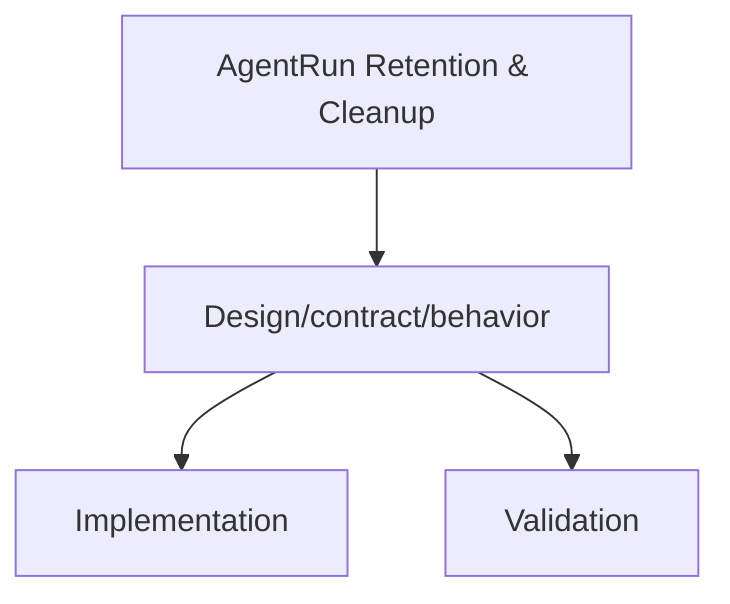

# AgentRun Retention & Cleanup

Status: Draft (2026-01-28)

Docs index: [README](README.md)

## Problem

AgentRun resources can accumulate indefinitely in production clusters. This increases etcd pressure, slows list/watch
operations, and bloats the control plane over time. Kubernetes only provides TTL cleanup for built-in resources like
Jobs, so Agents needs a first-class retention policy for its CRDs.

## Goals

- Provide a retention policy that automatically deletes completed AgentRun resources.
- Support a global default retention value configured via the Helm chart.
- Support per-run overrides for workloads that need longer (or shorter) retention windows.
- Ensure runtime resources (Jobs/ConfigMaps) are cleaned up when the AgentRun is deleted.
- Avoid deleting running or in-progress AgentRuns.

## Non-Goals

- Replacing runtime job TTL (`ttlSecondsAfterFinished`) for the underlying Job.
- Managing external log or artifact retention policies.
- Introducing CronJobs or background sweeper jobs outside of the controller.

## API Changes

- Add `spec.ttlSecondsAfterFinished` (int32, optional) to `AgentRunSpec`.
- When set, it overrides the controller-level default retention.
- `0` or unset means “do not auto-delete.”

## Controller Behavior

- Add an environment-backed default `agentRunRetentionSeconds`.
  - Env: `JANGAR_AGENTS_CONTROLLER_AGENTRUN_RETENTION_SECONDS`.
- Determine effective retention:
  1. `spec.ttlSecondsAfterFinished` if present
  2. Controller default env value
  3. Otherwise disabled
- When `status.phase` is terminal (`Succeeded` or `Failed`) and `status.finishedAt` is set:
  - Compute `finishedAt + retentionSeconds`.
  - If expired, delete the AgentRun (finalizer ensures runtime cleanup).
- Deletion must be idempotent and safe if the resource is already being removed.

## Helm Chart Changes

- Add `controller.agentRunRetentionSeconds` (int) to `values.yaml`.
- Wire to env var `JANGAR_AGENTS_CONTROLLER_AGENTRUN_RETENTION_SECONDS`.
- Update `values.schema.json` accordingly.

## Tests

- Unit tests in `services/jangar/src/server/__tests__/agents-controller.test.ts`:
  - Does not delete running runs.
  - Does not delete completed runs before TTL.
  - Deletes completed runs after TTL.
  - Per-run TTL overrides controller default.

## Acceptance Criteria

- Completed AgentRuns are automatically deleted after the configured retention window.
- Running runs are never deleted by retention logic.
- Helm chart exposes the retention configuration and passes schema validation.

## Diagram

