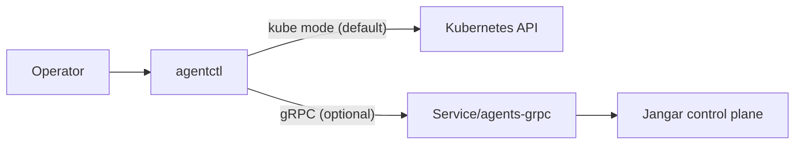

# Agentctl gRPC Primitive Coverage

Status: Draft (2026-01-30)

Docs index: [README](README.md)

## Problem

`agentctl` supports gRPC as an optional transport, but coverage is uneven relative to the Kubernetes API mode. The CLI
exposes list/watch/describe/apply/delete and run/log/status workflows for most Agents primitives (with newer or
less-used kinds still on the roadmap), yet the gRPC API is missing consistent watch semantics, pagination knobs, and
structured error details. This makes gRPC a partial
substitute for kube mode rather than a full-fidelity transport.

## Goals

- Provide full primitive parity between kube and gRPC modes for all agentctl commands.
- Define a stable, versioned gRPC surface that is safe to use for remote access and automation.
- Add watch/streaming support where the CLI depends on continuous updates (watch, run wait, logs).
- Standardize auth, error mapping, and pagination across all RPCs.
- Keep the CLI command surface unchanged when switching transports.

## Non-goals

- Replacing Kubernetes as the control plane or rewriting controllers.
- Designing a public multi-tenant API; this remains cluster-scoped and operator-managed.
- Introducing breaking changes to CRD schemas or server-side apply semantics.
- Adding new primitives beyond those already in the Agents API group.

## Current State

- `AgentctlService` already defines CRUD RPCs for most primitives and streaming for AgentRun logs/status.
- Responses are largely JSON strings, matching the CLI’s `--output json` needs but not watch/event workflows.
- gRPC is optional and off by default; access is in-cluster or via port-forward.
- CLI commands like `watch` and `run wait` currently depend on Kubernetes watches when in kube mode.

## Proposed API Surface

The gRPC transport should support every CLI command without feature loss. The table below shows the required RPC
coverage and where additions are needed.

### CRUD + list parity

- **Agent**: List/Get/Apply/Delete (existing)
- **AgentRun**: List/Get/Apply/Delete + Submit/Cancel (existing)
- **ImplementationSpec**: List/Get/Apply/Delete + Create (existing)
- **ImplementationSource**: List/Get/Apply/Delete (existing)
- **Memory**: List/Get/Apply/Delete (existing)
- **Tool**: List/Get/Apply/Delete (existing)
- **Schedule**: List/Get/Apply/Delete (existing)
- **Workspace**: List/Get/Apply/Delete (existing)
- **Signal**: List/Get/Apply/Delete (existing)
- **ApprovalPolicy**: List/Get/Apply/Delete (existing)
- **Budget**: List/Get/Apply/Delete (existing)
- **SecretBinding**: List/Get/Apply/Delete (existing)
- **Artifacts/Orchestrations/ToolRuns/SignalDeliveries**: keep existing RPCs even if not yet exposed in CLI (future CLI
  coverage should not require proto changes).

### Watch parity (new)

Add server-streaming watch RPCs for every resource that exposes `agentctl <resource> watch`:

- `WatchAgents`, `WatchImplementationSpecs`, `WatchImplementationSources`, `WatchMemories`, `WatchTools`,
  `WatchSchedules`, `WatchWorkspaces`, `WatchSignals`, `WatchApprovalPolicies`, `WatchBudgets`, `WatchSecretBindings`,
  `WatchAgentRuns`

Each watch should emit a common event payload with resource JSON and event metadata.

### Run/log/status parity

- `StreamAgentRunLogs` (existing; ensure follow and historical replay flags are supported).
- `StreamAgentRunStatus` (existing; should emit terminal phases and include JSON snapshots).
- `GetControlPlaneStatus` (existing; used by `agentctl status/diagnose`).
- `GetServerInfo` (existing; used by `agentctl version`).

## Proto Additions

Extend `proto/proompteng/jangar/v1/agentctl.proto` with shared option types and watch events to avoid per-resource
custom messages.

### Shared request options

- `ListOptions`:
  - `string namespace`
  - `string label_selector`
  - `string field_selector`
  - `int32 limit`
  - `string continue_token`
- `GetOptions`:
  - `string namespace`
- `ApplyOptions`:
  - `string namespace`
  - `bool dry_run`
  - `string field_manager`
- `DeleteOptions`:
  - `string namespace`
  - `int32 grace_seconds`
  - `string propagation_policy`
- `WatchOptions`:
  - `string namespace`
  - `string label_selector`
  - `string field_selector`
  - `string resource_version`
  - `bool include_initial_list`

Notes:

- `namespace` is ignored for cluster-scoped resources but should still be accepted for parity with kube mode.

### Watch event shape

- `WatchEvent`:
  - `string type` (`ADDED|MODIFIED|DELETED|BOOKMARK|ERROR`)
  - `string json`
  - `string resource_version`
  - `string message`

### Pagination and consistency

- All list responses should return `string continue_token` for pagination, mirroring kube behavior.
- For list requests without `limit`, the server returns all items (current behavior preserved).

### Error details

Adopt `google.rpc.Status` with details to allow CLI-friendly errors:

- `google.rpc.BadRequest` for validation issues (mapped to exit code 2).
- `google.rpc.ResourceInfo` for missing resources and scope.
- `google.rpc.ErrorInfo` for auth and permission errors.
- `google.rpc.RetryInfo` for throttling and backoff hints.

## Client Architecture

`agentctl` should treat gRPC as a first-class transport with a shared interface.

### Transport abstraction

- Define a `TransportClient` interface in `services/jangar/agentctl`:
  - `list/get/apply/delete` for each primitive
  - `watch` for watchable primitives
  - `submit/cancel/streamLogs/streamStatus` for AgentRuns
  - `getServerInfo`, `getControlPlaneStatus`
- Provide two implementations:
  - `KubeTransportClient` (current behavior using Kubernetes API).
  - `GrpcTransportClient` (generated stubs + interceptors).

### gRPC client behavior

- Single channel per process; reuse connection for all RPCs.
- Interceptors for auth metadata (`authorization: Bearer <token>`), request IDs, and client version headers.
- Backoff on retryable status codes (`UNAVAILABLE`, `RESOURCE_EXHAUSTED`, `DEADLINE_EXCEEDED`).
- Streaming APIs should expose async iterators to command handlers for consistent output formatting.

### Output formatting

- gRPC responses should return JSON payloads that the CLI formats as `json|yaml|table`.
- Watch streams should emit events that feed the same table/json renderers used in kube mode.

## Auth & Transport Security

- Continue to support a shared token (`--token`, `AGENTCTL_TOKEN`) passed as a Bearer token.
- Enable optional TLS/mTLS via CLI flags:
  - `--tls`, `--tls-ca`, `--tls-cert`, `--tls-key`.
- If TLS is enabled, enforce hostname verification and allow `--tls-server-name` override for port-forward.
- For kube-to-grpc bridging, allow in-cluster service account tokens to be forwarded when configured (explicit opt-in).

## Error Handling

- Map gRPC status codes to CLI exit codes:
  - `INVALID_ARGUMENT` → 2 (validation)
  - `NOT_FOUND` → 3 (resource not found)
  - `PERMISSION_DENIED`, `UNAUTHENTICATED` → 3 (auth/permission)
  - `FAILED_PRECONDITION` → 4 (runtime adapter/state)
  - `UNAVAILABLE`, `DEADLINE_EXCEEDED` → 5 (transport/system)
- Print structured errors when available:
  - Show field errors from `BadRequest`.
  - Suggest remedial actions (missing CRDs, disabled gRPC, wrong namespace).
- Preserve existing human-friendly messaging for kube mode to avoid regressions.

## Testing

- **Proto contract tests**: ensure generated stubs compile and server implements the new watch APIs.
- **CLI unit tests**: verify transport routing and output formatting for `--grpc` vs `--kube`.
- **Integration tests**:
  - Start Jangar with gRPC enabled and run `agentctl` commands against it.
  - Validate watch streams produce the same outputs as kube watch.
- **Auth tests**: token required/optional flows, invalid token errors, TLS handshake failures.
- **Regression tests**: ensure existing JSON outputs remain stable for automation workflows.

## Rollout Plan

1. Extend proto with shared options + watch event shape.
2. Implement watch RPCs in `services/jangar/src/server/agentctl-grpc.ts`.
3. Update CLI transport interface to cover watch + shared options.
4. Add tests (unit + integration).
5. Enable gRPC parity checks in CI (optional, if test infra is available).

## Open Questions

- Should gRPC list responses return typed protobuf resources instead of JSON strings?
- Do we want a single `WatchResources` RPC to reduce proto bloat?
- Should `Apply` accept JSON/YAML and server-side apply options for merges?

## Diagram

