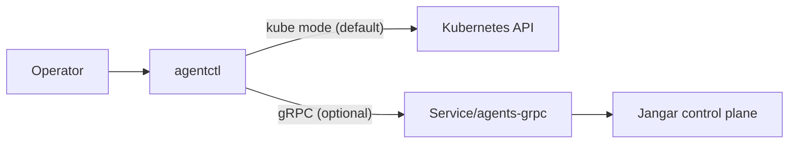

# agentctl release process

Docs index: [README](README.md)

This document describes how to build and publish `agentctl` (bundled with the Jangar service) for npm and Homebrew.
For install/usage guidance, see `docs/agents/agentctl.md`.
`agentctl` ships with Jangar and defaults to Kubernetes API access (gRPC optional).

## Prereqs

- Bun 1.3.9
- npm (for publishing)
- Access to `proompteng` npm org and the Homebrew tap repo

## Build artifacts

`agentctl` is packaged as a Node-bundled CLI (single JS file with a Node shebang) plus optional Bun-compiled
binaries for environments that want a standalone executable.

From the repo root:

```bash
bun run --filter @proompteng/agentctl build
bun run --filter @proompteng/agentctl build:bin
bun run --filter @proompteng/agentctl build:bins
bun run --filter @proompteng/agentctl build:release
```

Artifacts:

- `services/jangar/agentctl/dist/agentctl.js` (Node-bundled CLI; installable via npm and used in release archives)
- `services/jangar/agentctl/dist/agentctl-<os>-<arch>` (optional Bun-compiled binary)
- `services/jangar/agentctl/dist/agentctl` (host binary helper for local runs when `build:bin` is used)
- `services/jangar/agentctl/dist/release/agentctl-<version>-<os>-<arch>.tar.gz`
- Each archive contains a single `agentctl` executable (Node-bundled JS with shebang).
- `services/jangar/agentctl/dist/release/*.sha256`
- `services/jangar/agentctl/dist/release/agentctl.rb` (Homebrew formula with checksums, generated when all targets are built)

`build:release` builds all targets by default. To limit targets (e.g., per-OS builds in CI), set
`AGENTCTL_TARGETS=darwin-amd64,darwin-arm64,linux-amd64,linux-arm64` or pass `--targets`.

## Validation (compiled binary)

The validation script spins up a local mock gRPC server and exercises the optional compiled binary:

```bash
bun run --filter @proompteng/agentctl build:bin
bun run --filter @proompteng/agentctl validate:bin
```

To validate against a port-forwarded in-cluster server instead:

```bash
kubectl -n agents port-forward svc/agents-grpc 50052:50051
bun run --filter @proompteng/agentctl validate:bin -- --server 127.0.0.1:50052
```

`validate:bin` always exercises gRPC mode (use `--grpc` when running the binary manually).

## Publish npm

Before publishing, confirm the npm metadata is correct in `services/jangar/agentctl/package.json`:

- `name`, `version`, `description`, `license`, `repository`, and `homepage`
- `bugs` points to the repo issues page and `publishConfig.access` is `public`
- `bin` points to `dist/agentctl.js`
- `files` includes `dist/` and `README.md`

```bash
bun run --filter @proompteng/agentctl validate:metadata
```

```bash
cd services/jangar/agentctl
npm run prepack # builds Node CLI + all platform binaries
npm pack --dry-run # optional sanity check: ensures dist/ contains CLI + binaries
npm publish --access public
```

## Homebrew

1. Upload the release archives from `dist/release` to a GitHub release.
2. To generate the formula, run `bun run --filter @proompteng/agentctl build:release` (or set
   `AGENTCTL_TARGETS=darwin-amd64,darwin-arm64,linux-amd64,linux-arm64`) so all checksums are present.
3. If you built artifacts on multiple machines, combine them and run
   `bun run --filter @proompteng/agentctl homebrew:generate -- --input dist/release`
   to generate `agentctl.rb` with verified checksums.
4. Copy the generated `dist/release/agentctl.rb` into the Homebrew tap repo (`proompteng/homebrew-tap`) and commit
   (formula depends on `node`).
5. If needed, the template lives at `services/jangar/agentctl/scripts/homebrew/agentctl.rb`.

Example checksum:

```bash
shasum -a 256 dist/release/agentctl-<version>-darwin-arm64.tar.gz
shasum -a 256 dist/release/agentctl-<version>-darwin-amd64.tar.gz
shasum -a 256 dist/release/agentctl-<version>-linux-arm64.tar.gz
shasum -a 256 dist/release/agentctl-<version>-linux-amd64.tar.gz
```

## CI release (tag)

Push a semver tag with the `agentctl-` prefix (e.g. `agentctl-v0.1.0`) to trigger
`.github/workflows/agentctl-release.yml`. It:

- builds all target binaries and archives,
- uploads the artifacts to the GitHub release,
- optionally publishes npm if `NPM_TOKEN` is available.

```bash
git tag agentctl-v0.1.0
git push origin agentctl-v0.1.0
```

## Diagram


