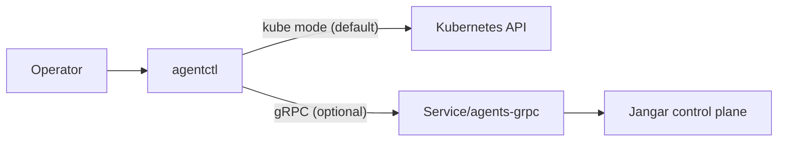

# agentctl Status Watch (Streaming Control-Plane Health)

Status: Draft (2026-01-30)

Docs index: [README](README.md)

## Overview
This document proposes a streaming status watch for the agent control plane, exposed via `agentctl` and backed by
Jangar APIs. The goal is to let operators watch health changes (controllers, runtimes, CRDs, and dependencies)
in real time without repeated polling.

The design adds:
- CLI UX for `agentctl status watch` (and `agentctl diagnose --watch`) with human and JSON outputs.
- New streaming endpoints in HTTP (SSE) and gRPC.
- A stable event schema with snapshots, deltas, and heartbeats.
- Clear error handling, retry/backoff, and reconnect semantics.

## Goals
- Stream live control-plane health changes with minimal latency.
- Provide a stable schema for programmatic consumers.
- Support kube-mode (watch via Kubernetes) and gRPC-mode (watch via Jangar).
- Handle reconnects with resumable cursors where feasible.
- Surface errors without dropping the terminal by default.

## Non-goals
- Streaming per-AgentRun logs (covered by `agentctl run logs --follow`).
- Replacing existing `agentctl status` or `agentctl diagnose` one-shot outputs.
- Real-time event history persistence beyond the stream window.

## CLI UX

### Command surface
- `agentctl status watch`
- `agentctl diagnose --watch` (alias to status watch, but retains `diagnose` formatting intent)
- `agentctl status --watch` (flag alias for `status watch`)

### Behavior
- Starts with an initial snapshot of the full control-plane status.
- Follows with incremental updates (deltas) when components change.
- Emits a heartbeat every N seconds to confirm liveness.
- If the stream disconnects, retries with exponential backoff unless `--retry=false` is set.

### Flags
- `--watch`: enable streaming mode on `agentctl status` and `agentctl diagnose`.
- `--output <table|json|ndjson>`: output format.
- `--follow-only`: do not print the initial snapshot; only emit deltas (useful for alerts).
- `--heartbeat <duration>`: heartbeat interval (default `30s`).
- `--retry`: retry on disconnect (default `true`).
- `--retry-backoff <duration>`: base backoff (default `1s`, max `30s`).
- `--fallback-poll`: if streaming is unavailable, fall back to polling instead of exiting.
- `--since <cursor>`: resume from a cursor (SSE `Last-Event-ID` or gRPC cursor).
- `--timeout <duration>`: optional overall watch duration (default: no timeout).
- `--transport <kube|grpc>`: explicit transport override.

### Example outputs

Human table (snapshot + deltas):
```
$ agentctl status watch
COMPONENT                NAMESPACE  STATUS     MESSAGE
namespace                agents     healthy
agents-controller        agents     healthy
supporting-controller    agents     healthy
orchestration-controller agents     healthy
runtime:workflow         agents     healthy
runtime:temporal         agents     configured temporal configuration resolved
runtime:custom           agents     unknown    custom runtime configured per AgentRun
database                 agents     healthy
grpc                     agents     healthy   127.0.0.1:50051
---
UPDATE 2026-01-30T18:15:02Z runtime:temporal status=degraded message="temporal connection retrying"
UPDATE 2026-01-30T18:15:12Z runtime:temporal status=healthy message="connection restored"
HEARTBEAT 2026-01-30T18:15:32Z
```

NDJSON for automation:
```
$ agentctl status watch --output ndjson
{"type":"snapshot","generated_at":"2026-01-30T18:15:00Z","items":[{"component":"agents-controller","namespace":"agents","status":"healthy","message":""}]}
{"type":"delta","generated_at":"2026-01-30T18:15:02Z","changes":[{"component":"runtime:temporal","status":"degraded","message":"temporal connection retrying"}]}
{"type":"heartbeat","generated_at":"2026-01-30T18:15:32Z"}
```

JSON stream (SSE or gRPC):
```
$ agentctl status watch --output json
{
  "type": "snapshot",
  "generated_at": "2026-01-30T18:15:00Z",
  "items": [
    {
      "component": "agents-controller",
      "namespace": "agents",
      "status": "healthy",
      "message": ""
    }
  ]
}
```

## Data model

### Status item
- `component` (string): logical name (e.g., `agents-controller`, `runtime:temporal`).
- `namespace` (string, optional): Kubernetes namespace when applicable.
- `status` (enum): `healthy | degraded | unknown | error | configured`.
- `message` (string, optional): human-friendly context.
- `details` (object, optional): structured metadata (e.g., `crds_ready`, `missing_crds`).

### Stream events
- `snapshot`: full list of status items at stream start.
- `delta`: list of items that changed since the last emission.
- `heartbeat`: liveness marker with no data payload.
- `error`: non-fatal errors (e.g., transient watch errors) that do not terminate the stream.

## API / gRPC endpoints

### HTTP SSE endpoint
- `GET /api/agents/control-plane/status/stream`
- Query parameters:
  - `namespace` (optional)
  - `heartbeat` (duration, optional)
  - `since` (cursor, optional)
  - `format` (`json` or `ndjson`, default `json`)

SSE semantics:
- `event: snapshot` with `id` set to the cursor of the snapshot.
- `event: delta` with `id` set to the delta cursor.
- `event: heartbeat` with `id` set to the heartbeat cursor.
- `event: error` for non-fatal issues (e.g., watch restarts).
- `data` contains a single JSON object, not an array.

### gRPC streaming
Add a new RPC in `proompteng.jangar.v1.AgentctlService`:
```
rpc WatchControlPlaneStatus(WatchControlPlaneStatusRequest)
  returns (stream ControlPlaneStatusEvent);
```

Request:
- `namespace` (optional)
- `heartbeat` (duration)
- `cursor` (string, optional)
- `follow_only` (bool)

Response event:
- `type` enum (`SNAPSHOT`, `DELTA`, `HEARTBEAT`, `ERROR`)
- `generated_at` (timestamp)
- `items` (repeated `ControlPlaneStatusItem`)
- `message` (string, for `ERROR` events)
- `cursor` (string)

### Cursor semantics
- Cursor is opaque to the client.
- Server should support resumable streams when the cursor is recent (best effort).
- If the cursor is invalid/expired, server returns a `snapshot` followed by deltas.

## Transport behavior

### Kube mode
- Implemented via Kubernetes watches on relevant resources (CRDs, Deployments, Pods, and controller health checks).
- The CLI aggregates to the same status model and emits events locally.
- The CLI generates cursors locally (monotonic timestamp + sequence) for output parity.

### gRPC mode
- CLI uses `WatchControlPlaneStatus` when `--transport grpc` or gRPC config is enabled.
- If the stream breaks, it reconnects with the last seen cursor.

## Error handling and retries

### CLI
- Retry on network disconnects by default; exponential backoff with jitter.
- If retries exceed `--timeout`, the CLI exits with non-zero status.
- `--retry=false` exits immediately on disconnect.
- For recoverable server errors, emit `error` event to output stream and continue.

### Server
- SSE responses include `Retry` header (e.g., `Retry: 1000`) for client guidance.
- Stream errors:
  - gRPC: use `UNAVAILABLE` for transient network/service issues.
  - gRPC: use `FAILED_PRECONDITION` for unsupported watch modes.
  - SSE: send `event: error` with JSON payload, then reconnect recommended.

## Compatibility and fallbacks
- `agentctl status` remains the default non-streaming command.
- `agentctl status watch` should work even if SSE is unavailable by falling back to polling (opt-in via `--fallback-poll`).
- If gRPC is not enabled, kube mode is used without a warning (unless `--transport grpc` is explicit).

## Telemetry and observability
- Emit client-side debug logs with `--debug` that include transport choice, cursor, and reconnect attempts.
- Server metrics: active watches, stream errors, average latency between delta generation and dispatch.

## Security and access control
- In kube mode, permissions are governed by the user’s kube context.
- In gRPC/SSE mode, reuse existing auth (mTLS/token) when configured.
- Ensure status details do not leak secrets (e.g., credentials in error messages).

## Open questions
- Should the `diagnose` alias use a different default output format?
- Do we need server-side aggregation to reduce event noise (debounce window)?
- Should we persist a rolling status timeline for audit or debugging?

## Diagram


