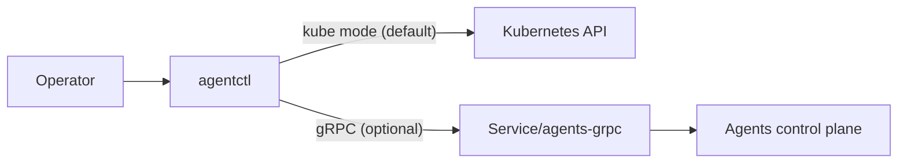

# agentctl CLI

Docs index: [README](README.md)

`agentctl` is the CLI for managing Agents primitives. By default it talks directly to the Kubernetes API
using your current kube context (argocd/virtctl-style). gRPC is optional and can be used when you need direct Agents API access.

## Install

### npm

```bash
npm install -g @proompteng/agentctl
npx @proompteng/agentctl --help
```

### Homebrew

```bash
brew install proompteng/tap/agentctl
```

## Modes

- **Kube mode (default):** uses your kubeconfig + context and talks to the Kubernetes API directly.
- **gRPC mode (optional):** uses the Agents gRPC endpoint; enable with `--grpc` or `AGENTCTL_MODE=grpc`.

## Port-forward for gRPC access (optional)

Agents gRPC is cluster-only by default. For local usage, port-forward the `agents-grpc` service:

```bash
kubectl -n agents port-forward svc/agents-grpc 50051:50051
agentctl --grpc --server 127.0.0.1:50051 status
```

## Configuration

`agentctl` reads `~/.config/agentctl/config.json` (or `$XDG_CONFIG_HOME/agentctl/config.json`).

```json
{
  "address": "agents-grpc.agents.svc.cluster.local:50051",
  "namespace": "agents",
  "token": "optional-shared-token",
  "kubeconfig": "/path/to/kubeconfig",
  "context": "my-context"
}
```

If you set a token here, the Agents server must be configured with the same
`AGENTS_GRPC_TOKEN` value (for example via `env.vars.AGENTS_GRPC_TOKEN` in the chart values).
`JANGAR_GRPC_TOKEN` is still accepted as a deprecated compatibility alias.

Kube mode uses:

- `--kubeconfig` or `AGENTCTL_KUBECONFIG` (optional)
- `--context` or `AGENTCTL_CONTEXT` (optional)

Transport selection:

- `--grpc` (or `AGENTCTL_MODE=grpc`) to use gRPC
- `--kube` (or `AGENTCTL_MODE=kube`) to force kube mode

TLS is supported on the client side. Use `--tls` and set:

- `AGENTCTL_CA_CERT` (optional)
- `AGENTCTL_CLIENT_CERT` / `AGENTCTL_CLIENT_KEY` (optional mTLS)
  The Agents service does not terminate TLS; use a gateway/mesh if you need TLS in production.

## Usage

```bash
agentctl status
agentctl auth login
agentctl auth status
agentctl get agent --selector app=my-agent
agentctl describe agent <name>
agentctl watch agent --interval 5

agentctl get impl
agentctl describe impl <name>
agentctl init impl --apply

agentctl run submit --agent <name> --impl <name> --runtime <type>
agentctl init run --apply --wait
agentctl run codex --prompt "Summarize repo" --agent <name> --runtime workflow --wait
agentctl get run <name>
agentctl list run --phase Succeeded --runtime workflow
agentctl watch run --selector app=my-agent
```

Use gRPC mode explicitly when needed:

```bash
agentctl --grpc --server 127.0.0.1:50051 status
```

## Build (Node CLI + optional binary)

```bash
bun run --filter @proompteng/agentctl build
bun run --filter @proompteng/agentctl build:bin
```

The build produces `services/agents/agentctl/dist/agentctl.js` (Node-bundled CLI). The optional
`build:bin` step also produces a host binary at `services/agents/agentctl/dist/agentctl`.

## Diagram


