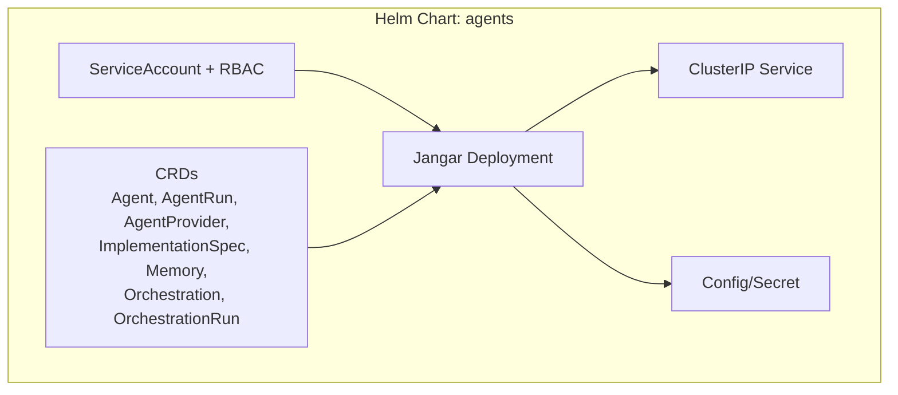
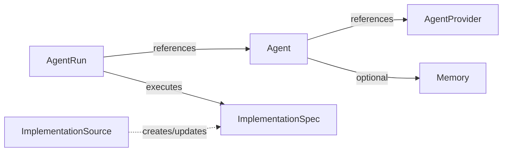
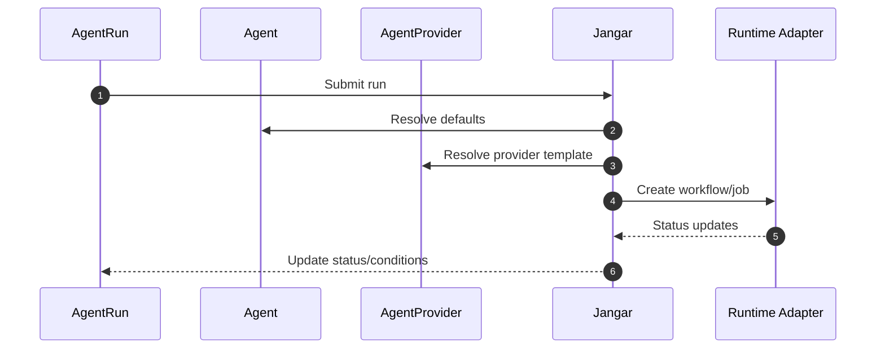
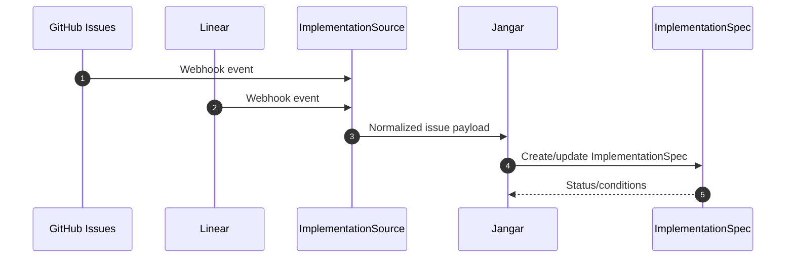

# Agents Helm Chart Design

Status: Current (2026-01-19)

Docs index: [README](README.md)

See also:
- `README.md` (index)
- `agents-helm-chart-implementation.md` (implementation-grade checklist)
- `designs/handoff-common.md` (repo/chart/cluster source-of-truth + validation commands)

## Context
The current `charts/agents` chart bundles control-plane deployment plus CRDs and several optional add-ons.
Today it:
- Ships SQL migration scripts inside the chart.
- Hardcodes memory to Postgres.
- Bakes GitHub-only fields into the Agent CRD.
- Includes multiple optional resources (ingress, embedded Postgres, backups, migrations job) that are not required for a minimal control plane.

We want a minimal, provider-agnostic control plane chart that installs cleanly on minikube, kind, and standard Kubernetes clusters, and is publishable on Artifact Hub.

## Goals
- Provide a minimal, installable Helm chart for the Jangar control plane plus CRDs.
- Keep the base chart portable across minikube, kind, and managed clusters.
- Remove GitHub-only coupling from CRDs; support GitHub Issues and Linear via an abstract ImplementationSpec.
- Add a first-class VersionControlProvider concept for repo operations (see `docs/agents/version-control-provider-design.md`).
- Make memory provider-agnostic via a Memory CRD.
- Move SQL migrations into the Jangar image (not shipped in the chart).
- Follow Helm and Artifact Hub best practices for a public chart.

## Non-goals
- Bundling a database or backups in the core chart.
- Shipping ingress configuration (left to the platform/cluster).
- Designing a fully featured integrations operator in this doc.
- Defining every provider schema detail (only the minimum for extensibility).

## Requirements (from request)
- Installable on minikube, kind, and regular clusters.
- No outdated features like ingress in the chart.
- CRDs declared in the existing `charts/agents` chart.
- SQL scripts must not be packaged in the chart; Jangar owns migrations.
- AgentRun specifies what to execute and the workload required; Agent defines only agent-level defaults.
- Implementation spec abstracts GitHub/Linear specifics away from Agent/AgentRun.
- Memory provider must be abstracted via a Memory CRD.
- Remove unnecessary chart resources.
- Align with Helm/Artifact Hub best practices.

## Proposed Chart Scope (Minimal Control Plane)
Resources to keep:
- Deployment: Jangar control plane.
- Service: ClusterIP.
- ServiceAccount + Role/RoleBinding (namespaced).
- Secrets/ConfigMaps needed for configuration (no SQL payloads).
- CRDs in `charts/agents/crds`.

Resources to remove from the base chart:
- Ingress.
- Embedded Postgres StatefulSet + Service + PVC.
- Migrations Job + SQL ConfigMap + `files/sql`.
- Backup CronJob + backup PVC.
- Optional PDB/NetworkPolicy (keep as an optional "extras" overlay or separate chart if still desired).

Mermaid: chart scope overview


Local cluster usage (minikube/kind):
- Keep `service.type=ClusterIP` and rely on `kubectl port-forward` for local access.
- Provide a `values-local.yaml` example that does not assume LoadBalancer/Ingress.

## Control Plane (Jangar)
- Jangar is packaged as the main deployment in this chart.
- Database migrations run inside Jangar (or a Jangar-owned init path) using SQL shipped in the image.
- Chart only passes database connection configuration and migration toggles (e.g., `JANGAR_MIGRATIONS=auto`).

### Jangar as Controller + Control Plane
Jangar is the reconciler for all Agents CRDs. No separate operator is required as long as Jangar runs.
It provides:
- Controller manager (leader-elected) that owns reconciliation loops.
- Runtime adapter layer (workflow/job, temporal, custom) for execution.
- Integration layer for GitHub + Linear ingestion into ImplementationSpec.
- Status/condition management and event emission.

Default runtime stance:
- The vanilla chart runs the native `job`/`workflow` runtimes with no external workflow engine required.
- The default workflow runtime is vendor-neutral and ships without vendor-specific defaults or subjects.
- External adapters are opt-in via explicit runtime configuration or environment settings.
- Ingestion is webhook-only by design (no polling).

#### Reconciliation loops (high-level)
- `AgentRun` reconciler:
  - Resolve `spec.agentRef` and `spec.implementationSpecRef` (or inline).
  - Validate `spec.runtime` + `spec.workload`.
  - Resolve Memory (AgentRun `memoryRef` -> Agent `memoryRef` -> default Memory).
  - Resolve provider templates and render an execution spec for `agent-runner`.
  - Select runtime adapter from `spec.runtime` and submit workload.
  - Update `status.phase`, `status.conditions`, timestamps, and runtime identifiers.
- `ImplementationSpec` reconciler:
  - Validate schema, normalize plaintext `spec.text`.
  - Track provenance (`spec.source`) and update conditions when upstream changes.
- `ImplementationSource` reconciler:
  - Accept webhook events from GitHub/Linear only (**no polling**).
  - Normalize external issues to ImplementationSpec objects (create/update/delete).
  - Record last webhook sync and errors in status; emit reconciliation events.
- `Memory` reconciler:
  - Validate connection secrets and publish capability metadata.
  - Optionally run health checks for memory backends.

#### Status model (suggested)
- Common conditions: `Ready`, `Accepted`, `InvalidSpec`, `InProgress`, `Succeeded`, `Failed`, `Blocked`.
- `AgentRun.status` includes:
  - `phase`: `Pending|Running|Succeeded|Failed|Cancelled`
  - `startedAt`, `finishedAt`
  - `runtimeRef`: opaque identifiers (workflow name/UID, job name, run ID)
  - `artifacts`: list of produced outputs (keys/paths)
- `ImplementationSpec.status` includes:
  - `syncedAt`, `sourceVersion`
  - `conditions` for provider sync

#### Lifecycle & safety
- Use finalizers on `AgentRun` to ensure runtime teardown on delete.
- Use ownerReferences when Jangar creates derived resources (if applicable).
- Leader election prevents duplicate runs in multi-replica deployments.
- Emit Kubernetes Events for submit/start/finish/failure.

#### Observability & operations
- Structured logs with run correlation (`agentRun.uid`, `implementationSpec.uid`).
- Metrics: reconcile duration, run latency, success/failure counts by runtime/provider.
- Configurable webhook retry/backoff for transient provider failures.

## CRD Redesign
All CRDs remain under `charts/agents/crds` and are cluster-scoped definitions.

### CRD Best Practices Adopted
- Generate CRDs from Go types with `controller-gen`, then publish static YAML under `charts/agents/crds`.
- Keep CRD JSON size below 256KB and provide a fallback minimal variant or trimmed descriptions when needed.
- Use structural schemas and avoid top-level `x-kubernetes-preserve-unknown-fields: false`; only mark specific subtrees as schemaless.
- Enable `subresources.status` for all CRDs and use conditions + `observedGeneration` for reconciliation state.
- Add `additionalPrinterColumns` for run status and timestamps to improve `kubectl get` UX.
- Use CEL validations sparingly for user-facing invariants; avoid heavy CEL on controller-managed specs.
- Validate examples against CRDs in CI.
- Prefer CRDs installed from Helm `crds/` (static, versioned); Jangar should only verify presence, not create CRDs at runtime.

Mermaid: CRD relationships


### Agent (v1alpha1)
Purpose: Default configuration and policy for an agent.
Key fields (conceptual):
- `spec.providerRef`: reference to AgentProvider.
- `spec.config`: flexible dictionary for agent-level configuration.
- `spec.env`: default env vars (array of `name`/`value`) (optional).
- `spec.security`: allowlist for `serviceAccounts` and `secrets`.
- `spec.memoryRef`: optional reference to Memory (default memory backend).
- `spec.defaults`: timeout/retry defaults for runs (non-resource).
  - `timeoutSeconds`
  - `retryLimit`

Status fields (required):
- `status.conditions`: Ready | InvalidSpec
- `status.observedGeneration`

Removed from Agent:
- Repo/issue/implementation inputs.
- Payloads tied to GitHub events.
- Resource sizing (resources belong on AgentRun).

### AgentRun (v1alpha1)
Purpose: A single execution of an ImplementationSpec with workload + runtime details.
Required fields:
- `spec.agentRef`: reference to Agent.
- `spec.implementationSpecRef` or `spec.implementation.inline`: what to implement (required).
- `spec.runtime`: runtime type + configuration for this run.
Optional fields:
- `spec.memoryRef`: override Memory selection for this run.
- `spec.idempotencyKey`: optional key to de-duplicate run submissions.

Implementation spec linkage:
- `spec.implementationSpecRef`: reference to ImplementationSpec (preferred).
- `spec.implementation.inline`: inline ImplementationSpec for ad-hoc runs.

Workload requirements:
- `spec.workload.image`: optional custom image for the agent execution environment.
- `spec.workload.resources`: resource requirements for this run.
  - `requests`: map of `cpu|memory|ephemeral-storage` to quantity strings.
  - `limits`: map of `cpu|memory|ephemeral-storage` to quantity strings.
- `spec.workload.volumes`: optional runtime volumes/scratch.
  - `type`: `emptyDir` | `pvc` | `secret`
  - `name`, `mountPath`, and type-specific fields (`claimName`, `secretName`, `sizeLimit`).

Overrides:
- `spec.runtime`: runtime-specific configuration for this run (runtime-agnostic schema; examples may include Temporal).
- `spec.parameters`: map of string -> string parameters for the provider.
- `spec.secrets`: named secret refs allowed for this run (mounted via `envFrom`, keys become env vars).

Status fields (required):
- `status.phase`: Pending | Running | Succeeded | Failed | Cancelled
- `status.conditions`: Accepted | InvalidSpec | InProgress | Succeeded | Failed
- `status.runtimeRef`: opaque runtime identifier(s)
- `status.startedAt`, `status.finishedAt`
- `status.observedGeneration`

Runtime schema (spec.runtime):
- `type`: `workflow` | `job` | `temporal` | `custom`
  - `workflow` is the default, vendor-neutral runtime (Job-backed).
  - `job` runs a single Job for backward-compatible AgentRun submissions.
- `config`: schemaless map for adapter-specific keys
  - `temporal` required: `taskQueue`, `workflowType`
  - `temporal` optional: `namespace`, `workflowId`, `timeouts`
  - `workflow` optional: `serviceAccount`, `ttlSecondsAfterFinished`
  - `job` optional: `serviceAccount`, `ttlSecondsAfterFinished`
  - `custom` optional: `endpoint`, `payload`

Mermaid: execution flow


### AgentProvider (v1alpha1)
Purpose: Define how to invoke the agent binary or runtime adapter.
Keep as-is with minimal cleanup:
- `spec.binary`
- `spec.argsTemplate`
- `spec.envTemplate`
- `spec.inputFiles`
- `spec.outputArtifacts`

Status fields (required):
- `status.conditions`: Ready | InvalidSpec
- `status.observedGeneration`

No GitHub-specific templates in examples.

Custom agent images:
- AgentRun can supply `spec.workload.image` for the container image that hosts `/usr/local/bin/agent-runner`.
- Provide a Codex agent Dockerfile for reference at `services/jangar/Dockerfile.codex`.

### ImplementationSpec (new CRD, v1alpha1)
Purpose: Provider-agnostic description of "what to implement".
Key fields:
- `spec.source`: optional origin info (provider + external ID + URL).
  - `provider`: `github` | `linear` | `manual` | `custom`
  - `externalId`: string (e.g., `owner/repo#123`, `LIN-123`)
  - `url`: canonical URL (optional)
- `spec.text`: plaintext requirements (initial format).
- `spec.summary`: short statement of intent.
- `spec.description`: long-form markdown (optional, future).
- `spec.acceptanceCriteria`: list of criteria.
- `spec.labels`: optional labels/tags.

Size limits:
- `spec.text`: 128KB max
- `spec.summary`: 256 chars max
- `spec.acceptanceCriteria`: 50 items max

Status fields (required):
- `status.conditions`: Ready | InvalidSpec | Stale
- `status.syncedAt`, `status.sourceVersion`
- `status.observedGeneration`

### Integration (GitHub + Linear)
Add an `ImplementationSource` CRD that configures webhook-only sync from GitHub Issues and Linear into ImplementationSpec objects. GitHub + Linear are the first integrations to ship. This keeps Agent and AgentRun generic while still enabling provider integrations. Jangar (or a lightweight integrations sidecar) is responsible for:
- Webhook-driven ingestion from GitHub and Linear.
- Normalizing external issues into ImplementationSpec fields.
- Updating status/conditions on ImplementationSpec when upstream changes.

ImplementationSource schema (summary):
- `spec.provider`: `github` | `linear`
- `spec.auth.secretRef`: reference to credentials secret
- `spec.webhook.enabled`: boolean (must be true)
- `spec.scope`: selector for org/project/repo
- `spec.mapping`: optional overrides for field mapping

Status fields:
- `status.conditions`: Ready | Error
- `status.lastSyncedAt`, `status.observedGeneration`

Webhook configuration:
- Endpoint: `POST /api/agents/implementation-sources/webhooks/{provider}` where `{provider}` is `github` or `linear`.
- Secret: reuse `spec.auth.secretRef` value as the webhook signing secret.
- GitHub headers: `X-Hub-Signature-256` (preferred) or `X-Hub-Signature`.
- Linear headers: `Linear-Signature` with `Linear-Event: issue`.

Mermaid: integration flow


### Memory (new CRD, v1alpha1)
Purpose: Abstract memory/storage backend away from Postgres.
Key fields:
- `spec.type`: `postgres` | `redis` | `weaviate` | `pinecone` | `custom`.
- `spec.connection.secretRef`: secret with DSN/endpoint/credentials.
- `spec.capabilities`: `vector`, `kv`, `blob` (for routing features).
- `spec.default`: boolean (optional, if multiple memory backends exist).

Agent and AgentRun reference Memory by name, not by provider-specific fields. Resolution order:
1) `AgentRun.spec.memoryRef` (if set)
2) `Agent.spec.memoryRef` (if set)
3) Memory with `spec.default=true` (if present)

Status fields:
- `status.conditions`: Ready | InvalidSpec | Unreachable
- `status.lastCheckedAt`, `status.observedGeneration`

## Values & Configuration (Helm)
The chart should include:
- `values.yaml` with sane defaults for a single-replica control plane.
- `values.schema.json` to validate configuration at install/upgrade/lint/template time.
- `values-local.yaml` example for minikube/kind (ClusterIP + port-forward).

Key values (conceptual):
- `image.repository`, `image.tag`, `image.digest`.
- `replicaCount`.
- `service.type`, `service.port`.
- `rbac.create`, `serviceAccount.create`.
- `env` and `envFromSecretRefs`.
- `resources`.
- `crds.install` (optional flag for `--skip-crds` parity).

Scheduling defaults for AgentRun pods (nodeSelector, tolerations, affinity, topology spread) are documented in
`docs/agents/topology-spread-constraints.md`.

No values for embedded database, migrations jobs, backups, or ingress.

## Compatibility & Installation
- Default chart installs cleanly on minikube/kind (ClusterIP + port-forward).
- No reliance on cloud-specific features (e.g., LoadBalancer or cloud storage).
- CRDs installed from `crds/` folder (not templated).

## Migration Plan (from current chart)
1. Replace existing CRDs in-place (v1alpha1) since current version is unused.
2. Update Jangar to expect the new v1alpha1 schema.
3. Update examples to match the new schema.
4. Remove SQL configmap and migrations job from the chart; move SQL into Jangar image.
5. Remove embedded Postgres and backup resources; document external database requirement via Memory CRD.

## Artifact Hub Readiness
Follow Helm and Artifact Hub guidance:
- Standard chart layout (`Chart.yaml`, `values.yaml`, `values.schema.json`, `README.md`, `LICENSE`, `crds/`, `templates/`).
- Provide `README.md` with configuration table and examples; Artifact Hub renders this content.
- Use Chart.yaml annotations for Artifact Hub metadata (`artifacthub.io/*`), including CRDs and examples.
- Provide `artifacthub-repo.yml` at the repository index level when publishing (or OCI metadata layer for OCI).

## CLI
See `docs/agents/agentctl-cli-design.md` for the `agentctl` CLI design.

## Market Readiness
See `docs/agents/market-readiness-and-distribution.md` for Artifact Hub publishability, mainstream readiness, and growth strategy.

## Production Readiness
See `docs/agents/production-readiness-design.md` for the production‑grade requirements checklist.

## Ops & Security
See:
- `docs/agents/rbac-matrix.md`
- `docs/agents/threat-model.md`
- `docs/agents/runbooks.md`
- `docs/agents/ci-validation-plan.md`
- `docs/agents/crd-yaml-spec.md`

## Decisions
- Minimum supported Kubernetes version: 1.25+ (CRD v1, no PSP, aligns with modern clusters).
- Optional extras (PDB/NetworkPolicy): keep out of the core chart; manage via a separate `agents-extras` chart or external policy tooling.
- ImplementationSpec is namespaced for multi-tenant safety.

## Appendix: Example CRD Usage (Conceptual)
Agent:
```
apiVersion: agents.proompteng.ai/v1alpha1
kind: Agent
metadata:
  name: codex-agent
spec:
  providerRef:
    name: codex-runner
  memoryRef:
    name: default-memory
  config: {}
```

ImplementationSpec:
```
apiVersion: agents.proompteng.ai/v1alpha1
kind: ImplementationSpec
metadata:
  name: impl-1234
spec:
  source:
    provider: github
    externalId: proompteng/lab#1234
    url: https://github.com/proompteng/lab/issues/1234
  text: "Implement agent helm chart redesign."
  summary: "Implement agent helm chart redesign"
  acceptanceCriteria:
    - "Chart installs on minikube and kind"
    - "No ingress in base chart"
```

AgentRun:
```
apiVersion: agents.proompteng.ai/v1alpha1
kind: AgentRun
metadata:
  generateName: codex-run-
spec:
  agentRef:
    name: codex-agent
  implementationSpecRef:
    name: impl-1234
  runtime:
    type: custom
  workload:
    image: registry.ide-newton.ts.net/lab/codex-universal:20260219-234214-2a44dd59-dl
    resources:
      cpu: 2
      memory: 4Gi
```

Replace the workload image with your own agent-runner build if you are not using the ProomptEng cluster registry.
