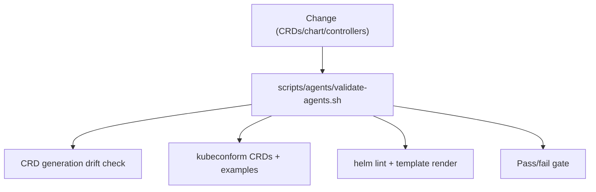

# CI Validation Plan (Agents)

Status: Current (2026-01-19)

Docs index: [README](README.md)

See also:

- `README.md` (docs index)
- `designs/handoff-common.md` (local render + validation commands)
- `agents-helm-chart-implementation.md` (what CI is validating)

## CRD Validation

- Generate **Agents** CRDs from Go types and verify:
  - Structural schema
  - JSON size <= 256KB
  - `subresources.status` present
- Validate CRDs with kubeconform (`charts/agents/crds/*.yaml`).
- Validate CRD examples against schemas.
  - Use `scripts/agents/validate-agents.sh` (also runs `helm lint` and render checks).

## Helm Validation

- `helm lint charts/agents`
- `helm template charts/agents` with dev/prod values
- Check rendered manifests for disallowed resources (ingress, embedded DB).

## Runner Promotion Safety Checks

- Before any Jangar release promotion, verify the candidate runner image is explicitly runnable on the promotion
  runner architecture using the same smoke-path the release workflow uses:

```bash
JANGAR_RUNNER_IMAGE="registry.ide-newton.ts.net/lab/jangar"
JANGAR_RUNNER_TAG="${TAG}"
JANGAR_RUNNER_DIGEST="${DIGEST}"
JANGAR_RUNNER_PLATFORM="linux/$(case "${RUNNER_ARCH}" in ARM64|arm64) echo arm64;; *) echo amd64;; esac)"

repoRoot="$(git rev-parse --show-toplevel)"
bun run "$repoRoot/packages/scripts/src/jangar/update-manifests.ts" \
  --registry registry.ide-newton.ts.net \
  --repository lab/jangar \
  --tag "$JANGAR_RUNNER_TAG" \
  --digest "$JANGAR_RUNNER_DIGEST" \
  --runner-image-name "$JANGAR_RUNNER_IMAGE" \
  --runner-image-tag "$JANGAR_RUNNER_TAG" \
  --runner-image-digest "$JANGAR_RUNNER_DIGEST" \
  --runner-image-platform "$JANGAR_RUNNER_PLATFORM" \
  --verify-runner-image \
  --verify-runner-image-only \
  --rollout-timestamp "$(date -u +%Y-%m-%dT%H:%M:%SZ)"
```

- Any non-zero result from that runtime probe (including `agent-runner --help`) is a hard failure.
- The release workflow runs this as a dedicated check before manifest writes in `jangar-release.yml`.

## Integration Tests

- in-cluster smoke test (ARC runners):
  - Install chart into a dedicated namespace
  - Provide a database URL (for example, `AGENTS_DB_BOOTSTRAP=true` in `packages/scripts/src/agents/smoke-agents.ts`)
  - Apply Agent/ImplementationSpec/AgentRun
  - Verify AgentRun completion and status
  - Use `packages/scripts/src/agents/smoke-agents.ts` with a deterministic smoke provider.
  - Requires `argocd/applications/agents-ci` RBAC for the ARC runner service account.
- kind/minikube smoke test (local):
  - Install chart
  - Apply Agent/ImplementationSpec/AgentRun
  - Verify AgentRun completion and status
  - Use `packages/scripts/src/agents/smoke-agents.ts` for a repeatable local flow.
- GitHub + Linear mock webhook sync tests (webhook-only).

## Performance

- Load test AgentRun submission (concurrency limits enforced).
- Measure reconcile latency p95.

## Security

- SBOM generation and vulnerability scan.
- Image signature verification checks.

## Diagram


