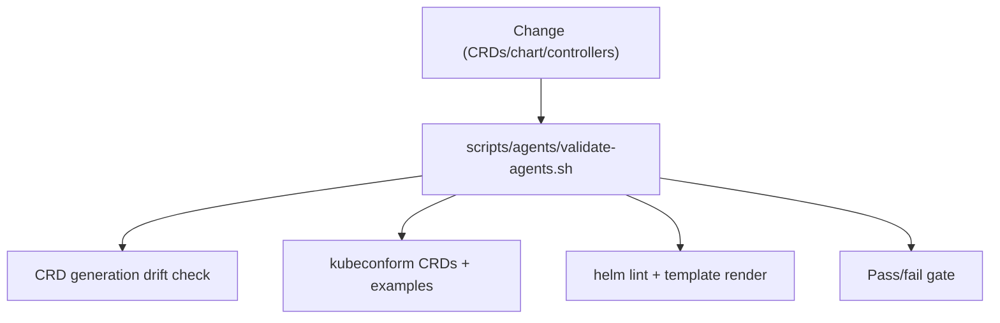

# CI Validation Plan (Agents)

Status: Current (2026-01-19)

Docs index: [README](README.md)

See also:

- `README.md` (docs index)
- `designs/handoff-common.md` (local render + validation commands)
- `agents-helm-chart-implementation.md` (what CI is validating)

## CRD Validation

- Generate **Agents** CRDs from Go types and verify:
  - Structural schema
  - JSON size <= 256KB
  - `subresources.status` present
- Validate CRDs with kubeconform (`charts/agents/crds/*.yaml`).
- Validate CRD examples against schemas.
  - Use `scripts/agents/validate-agents.sh` (also runs `helm lint` and render checks).

## Helm Validation

- `helm lint charts/agents`
- `helm template charts/agents` with dev/prod values
- Check rendered manifests for disallowed resources (ingress, embedded DB).
- Focused namespace/RBAC guardrail checks (recommended):
  - `helm template charts/agents --set-json 'controller.namespaces=["agents","agents-ci"]' --set rbac.clusterScoped=false` (expect fail: multi-namespace requires cluster-scoped RBAC)
  - `helm template charts/agents --set-json 'controller.namespaces=["*"]' --set rbac.clusterScoped=false` (expect fail: clusterScoped required)
  - `helm template charts/agents --set-json 'controller.namespaces=[]'` (expect fail: explicit empty list invalid)
  - `helm template charts/agents --set-json 'controller.namespaces=["*","agents"]' --set rbac.clusterScoped=true` (expect fail: wildcard may not combine with specific namespaces)
  - `helm template charts/agents --set-json 'controller.namespaces=["agents"]' --set rbac.clusterScoped=true` (expect success with namespaced list on Role)
  - `helm template charts/agents --set-json 'controller.namespaces=["*"]' --set rbac.clusterScoped=true` (expect success with ClusterRole)
  - `helm template charts/agents --set-json 'orchestrationController.namespaces=["agents","agents-ci"]' --set rbac.clusterScoped=false` (expect fail: multi-namespace requires cluster-scoped RBAC)
  - `helm template charts/agents --set-json 'supportingController.namespaces=["agents","agents-ci"]' --set rbac.clusterScoped=false` (expect fail: multi-namespace requires cluster-scoped RBAC)
  - `helm template charts/agents --set-json 'orchestrationController.namespaces=["*","agents"]' --set rbac.clusterScoped=true` (expect fail: wildcard may not combine with specific namespaces)
  - `helm template charts/agents --set-json 'supportingController.namespaces=["*","agents"]' --set rbac.clusterScoped=true` (expect fail: wildcard may not combine with specific namespaces)
  - `helm template charts/agents --set-json 'orchestrationController.namespaces=["*"]' --set rbac.clusterScoped=true` (expect success with namespaced controller and cluster-scoped RBAC)
  - `helm template charts/agents --set-json 'supportingController.namespaces=["*"]' --set rbac.clusterScoped=true` (expect success with supporting controller and cluster-scoped RBAC)

Validation command helper (example):
```bash
namespace_guardrails() {
  for cmd in \
    "helm template charts/agents --set-json 'controller.namespaces=[\"agents\",\"agents-ci\"]' --set rbac.clusterScoped=false" \
    "helm template charts/agents --set-json 'controller.namespaces=[\"*\"]' --set rbac.clusterScoped=false" \
    "helm template charts/agents --set-json 'controller.namespaces=[]'" \
    "helm template charts/agents --set-json 'controller.namespaces=[\"*\",\"agents\"]' --set rbac.clusterScoped=true" \
    "helm template charts/agents --set-json 'orchestrationController.namespaces=[\"agents\",\"agents-ci\"]' --set rbac.clusterScoped=false" \
    "helm template charts/agents --set-json 'supportingController.namespaces=[\"*\",\"agents\"]' --set rbac.clusterScoped=true"; do
    local output
    if output="$(eval "${cmd}" 2>&1)"; then
      printf 'PASS: %s\n' "${cmd}"
    else
      printf 'EXPECTED FAILURE: %s\n' "${cmd}" >&2
      printf 'ERROR: %s\n' "${output}" >&2
    fi
  done
}
```

## Integration Tests

- in-cluster smoke test (ARC runners):
  - Install chart into a dedicated namespace
  - Provide a database URL (for example, `AGENTS_DB_BOOTSTRAP=true` in `packages/scripts/src/agents/smoke-agents.ts`)
  - Apply Agent/ImplementationSpec/AgentRun
  - Verify AgentRun completion and status
  - Use `packages/scripts/src/agents/smoke-agents.ts` with a deterministic smoke provider.
  - Requires `argocd/applications/agents-ci` RBAC for the ARC runner service account.
- kind/minikube smoke test (local):
  - Install chart
  - Apply Agent/ImplementationSpec/AgentRun
  - Verify AgentRun completion and status
  - Use `packages/scripts/src/agents/smoke-agents.ts` for a repeatable local flow.
- GitHub + Linear mock webhook sync tests (webhook-only).

## Performance

- Load test AgentRun submission (concurrency limits enforced).
- Measure reconcile latency p95.

## Security

- SBOM generation and vulnerability scan.
- Image signature verification checks.

## Diagram


