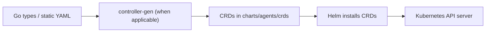

# CRD YAML Spec (Agents)

Status: Current (2026-01-19)

Docs index: [README](README.md)

## Required CRDs

- Agent
- AgentRun
- AgentProvider
- ImplementationSpec
- ImplementationSource
- Memory

## Common Requirements (all CRDs)

- `apiVersion: apiextensions.k8s.io/v1`
- `spec.versions[*].schema.openAPIV3Schema` present
- `spec.versions[*].subresources.status` enabled
- `spec.versions[*].additionalPrinterColumns` present where useful
- `spec.versions[*].schema.openAPIV3Schema.properties.status.properties.observedGeneration` included
- Do not set `x-kubernetes-preserve-unknown-fields: false` on the root schema. Omit the field and
  rely on structural schemas, marking only explicit subtrees as schemaless.
- Mark only specific subtrees as schemaless via:
  - `x-kubernetes-preserve-unknown-fields: true` or
  - `additionalProperties: { type: string }` (for string maps)

## Schemaless Subtrees

- Agent:
  - `spec.config` (map)
- AgentRun:
  - `spec.runtime.config` (map)
  - `spec.parameters` (map)
- ImplementationSpec:
  - no schemaless fields (plain strings only)

## Printer Columns (minimum)

### AgentRun

- Succeeded: `.status.conditions[?(@.type=="Succeeded")].status`
- Reason: `.status.conditions[?(@.type=="Succeeded")].reason`
- StartTime: `.status.startedAt`
- CompletionTime: `.status.finishedAt`
- Runtime: `.spec.runtime.type`

### ImplementationSpec

- Ready: `.status.conditions[?(@.type=="Ready")].status`
- Source: `.spec.source.provider`
- Updated: `.status.syncedAt`

## Versioning

- v1alpha1 only (no conversion webhook yet).
- When v1beta1 arrives: add conversion webhook and freeze v1alpha1 fields.

## Size Budget

- Validate generated CRD JSON <= 256KB (Tekton practice).
- Strip descriptions if necessary.

## Validation Rules (minimum)

- Required fields:
  - Agent: `spec.providerRef.name`
  - AgentRun: `spec.agentRef.name`, `spec.runtime.type`, `spec.implementationSpecRef.name` OR `spec.implementation.inline`
  - AgentProvider: `spec.binary`
  - ImplementationSpec: `spec.text`
  - ImplementationSource: `spec.provider`, `spec.auth.secretRef`, `spec.webhook.enabled=true`
  - Memory: `spec.type`, `spec.connection.secretRef`
- Optional fields:
  - AgentRun: `spec.ttlSecondsAfterFinished` (integer seconds, >= 0) to override controller retention (0 disables).

## Status Conditions (standard)

- All CRDs include `status.conditions[]` with `type`, `status`, `reason`, `message`, `lastTransitionTime`.

## Diagram

