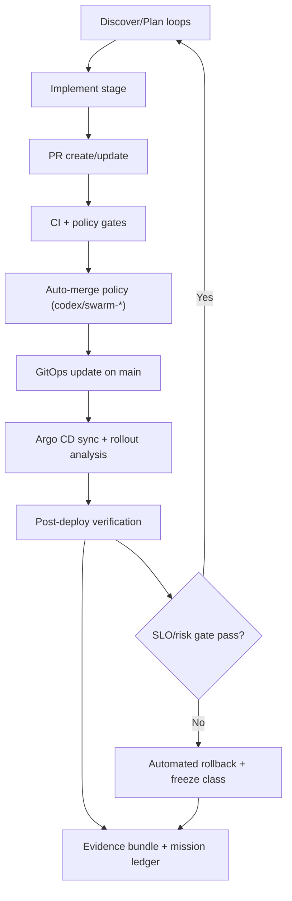

# Autonomous Jangar + Torghut Production System

Status: Proposed (2026-03-03)

Docs index: [README](../README.md)
Execution runbook baseline: [swarm-end-to-end-runbook](../swarm-end-to-end-runbook.md)

## Objective

Establish a production-grade autonomous operating model where:

- `jangar-control-plane` continuously engineers and operates the platform and cluster safely end-to-end.
- `torghut-quant` continuously improves trading profitability and risk-adjusted performance using scientific evidence.
- Both swarms can execute full lifecycle actions without human handoff:
  - code changes,
  - pull request creation,
  - merge,
  - rollout via GitOps,
  - post-deploy verification,
  - auditable evidence publication.

## Scope

- Swarm operational contracts and autonomy gates.
- Merge/deploy automation design for `codex/swarm-*` delivery.
- Reliability, incident, and rollback standards for Jangar.
- Scientific proof and promotion standards for Torghut.
- Phased implementation plan with acceptance criteria.

Non-goals:

- Replacing Argo CD/Argo Rollouts with a custom deploy system.
- Removing human override capability for emergency governance.
- Defining trading strategy internals beyond promotion/evidence contracts.

## Definitions

- **Operational swarm**: `Ready=True`, not frozen, executing stage cadence with fresh status timestamps, and able to close a mission end-to-end.
- **End-to-end autonomy**: discover -> plan -> implement -> verify -> PR -> merge -> rollout -> post-deploy verify -> evidence.
- **Scientific proof (Torghut)**: change decision backed by hypothesis, baseline comparator, controlled evaluation windows, statistical confidence, and risk constraint compliance.

## Current State Snapshot (2026-03-03)

Timestamp reference: `2026-03-03T08:36:43Z`.

- `jangar-control-plane`: `Active`, `Ready=True`, but stale operational progression (`lastImplementAt=2026-03-02T12:00:00Z`).
- `torghut-quant`: `Frozen`, `Ready=False`, `freezeReason=ConsecutiveFailures`, `freezeUntil=2026-03-03T08:41:47.392Z`.
- Implement stages have timed out in recent swarm runs (`WorkflowStepTimedOut`), and PR completion does not consistently progress into merge+rollout.
- Auto-merge eligibility is currently release-branch centric; `codex/swarm-*` branches are not treated as first-class autonomous release lanes.

This design closes those gaps.

## Operating Charters

### Jangar Swarm Charter (Platform Engineering Group)

Jangar swarm owns:

- agents control plane runtime health,
- agents CRD lifecycle and compatibility,
- cluster reliability and patching,
- SDLC control surface (PR, merge, rollout, rollback),
- incident response, remediation, and audit trail completeness.

Jangar swarm success definition:

- platform remains healthy and observable,
- cluster issues are detected and remediated with documented evidence,
- autonomous delivery is reliable and reversible.

### Torghut Swarm Charter (Research + Profitability Engineering Group)

Torghut swarm owns:

- research intake and hypothesis generation from whitepapers and market intelligence,
- alpha and execution improvement experiments,
- risk-governed strategy promotion decisions,
- sustained profitability under drawdown and exposure constraints.

Torghut swarm success definition:

- promoted changes improve or preserve risk-adjusted outcomes,
- evidence proves statistical and operational validity,
- safety constraints are never bypassed.

## Target Architecture

## Mandatory End-to-End Contract (Both Swarms)

Every mission MUST emit these artifacts before completion:

1. Discovery evidence:
   - ranked need,
   - source citations/signals,
   - confidence and impact score.
2. Plan evidence:
   - change plan,
   - test plan,
   - rollback plan.
3. Implementation evidence:
   - commit SHA,
   - PR URL,
   - diff scope summary.
4. Verification evidence:
   - required checks,
   - targeted runtime checks,
   - risk delta.
5. Delivery evidence:
   - merge ref,
   - rollout confirmation,
   - post-deploy health.
6. Audit evidence:
   - mission id,
   - actor identity,
   - timestamps,
   - channel and issue/document links.

Completion without these artifacts is invalid.

## Merge and Rollout Autonomy Design

### Branch and merge policy

- Swarm implementation branches remain `codex/swarm-*`.
- Add autonomous merge eligibility for `codex/swarm-*` PRs when all gates pass:
  - allowlisted paths/repositories,
  - required CI checks green,
  - policy validation green,
  - no `do-not-automerge` label,
  - risk class allows lights-out merge.

### Delivery transition

Choose one of two valid patterns:

1. **Direct swarm merge pattern**
   - merge `codex/swarm-*` PR directly once checks pass.
2. **Release handoff pattern**
   - convert successful swarm PR into release PR (`codex/jangar-release-*`, `codex/torghut-release-*`) and rely on release automerge flows.

V1 recommendation: direct swarm merge with strict file/path and policy gates, then move to release handoff where needed for image promotion workflows.

### Rollout gate

After merge, controller MUST verify:

- Argo app synced + healthy,
- deployment target healthy and serving,
- no rollback trigger active,
- no critical alert regression.

If any gate fails:

- rollback action is executed,
- incident mission is auto-opened,
- swarm stage class is frozen until verify recovery passes.

## Scientific Proof Framework (Torghut)

Every Torghut profitability or execution change MUST include:

1. Hypothesis definition:
   - what is expected to improve,
   - why it should improve.
2. Comparator:
   - baseline strategy/build or prior production revision.
3. Evaluation protocol:
   - fixed time windows,
   - walk-forward or out-of-sample segmenting,
   - regime segmentation where applicable.
4. Statistics:
   - confidence metric (p-value, interval, or equivalent),
   - effect size,
   - sample size adequacy.
5. Risk controls:
   - drawdown impact,
   - exposure/concentration effects,
   - execution slippage and fallback behavior.
6. Promotion decision:
   - pass/fail against explicit gate thresholds.

Promotion is blocked unless all required evidence fields exist and pass thresholds.

## Reliability and Incident Model (Jangar)

Jangar swarm MUST continuously enforce:

- controller health SLO,
- queue health and stuck-run detection,
- reconcile freshness and status currency,
- automated mitigation for known failure classes.

Incident contract:

- detect -> classify -> mitigate -> verify -> publish post-incident report.
- every incident includes root cause, blast radius, remediation, and follow-up tasks.

## Freeze/Unfreeze Policy

- Freeze is allowed only for configured critical failure classes.
- Freeze is time-bound and reason-stamped.
- Unfreeze requires an explicit recovery verify run with passing gate evidence.
- Repeated failures within a rolling window escalate severity and reduce autonomy tier temporarily.

## Audit Trail Contract

Every autonomous action MUST be reconstructable from immutable records:

- `swarmName`, `stage`, `missionId`, `requirementSignal`, actor identity.
- commit, PR, merge, rollout refs.
- CI and runtime check results.
- post-deploy verification.
- rollback evidence if triggered.

Store as linked artifacts across:

- Kubernetes object status,
- tracker issue/document/channel mission artifacts,
- PR metadata/comments.

## SLOs and KPIs

### Platform autonomy KPIs (Jangar)

- Stage success rate (24h): `>= 95%`.
- Stale swarm status age: `<= 2x stage cadence`.
- PR-to-merge p95 (eligible autonomous PRs): `<= 90m`.
- Merge-to-healthy-rollout p95: `<= 30m`.
- MTTR for critical control-plane incidents: `< 30m`.

### Profitability autonomy KPIs (Torghut)

- Strategy promotions with complete scientific proof: `100%`.
- Promotion rollback rate due to preventable evidence gaps: `< 5%`.
- Risk breach escape rate (post-promotion): `0`.
- Rolling risk-adjusted performance vs baseline: non-degrading threshold enforced.

## Implementation Plan

### Phase 0: Immediate Recovery (0-48h)

1. Restore Torghut from current freeze through verified recovery run.
2. Clear/close stale or stuck implement runs and normalize stage progression.
3. Validate at least one complete end-to-end mission for each swarm.
4. Confirm status freshness and eliminate active status ownership conflicts.

Exit criteria:

- Both swarms `Ready=True`, not frozen.
- One successful end-to-end mission closed per swarm with full evidence.

### Phase 1: Autonomy Hardening (Day 3-14)

1. Implement merge and rollout stages in swarm delivery pipeline.
2. Add codex/swarm auto-merge eligibility and gate enforcement.
3. Add post-deploy verification + rollback automation.
4. Add stale-run watchdog and timeout class remediation.

Exit criteria:

- Autonomous PRs can merge and roll out without manual intervention when eligible.
- Timeout-induced freeze recurrence reduced to zero for 7 consecutive days.

### Phase 2: Scientific Promotion System (Day 15-30)

1. Enforce Torghut proof schema in promotion decisions.
2. Gate promotion on statistical + risk criteria.
3. Publish machine-readable evaluation artifacts for each candidate.

Exit criteria:

- Every Torghut promotion has complete proof bundle.
- No promotion without comparator and risk impact report.

### Phase 3: Continuous Autonomous Operations (Day 31-60)

1. Run weekly resilience drills and monthly rollback drills.
2. Track autonomy scorecards and tighten SLO thresholds.
3. Expand automation to additional reliability/profitability mission classes.

Exit criteria:

- 30 consecutive days with both swarms operational and no critical unmanaged regressions.

## Acceptance Criteria (Design Complete)

This design is accepted only when all are true:

1. Both swarms demonstrate full end-to-end autonomous mission execution in production.
2. `codex/swarm-*` delivery path includes merge and rollout verification, not PR creation only.
3. Torghut promotions require and persist scientific proof artifacts.
4. Jangar incident and patch lifecycle is fully auditable and reproducible.
5. Operational scorecard is live and reviewed continuously.

## Risks and Mitigations

- **Risk**: Autonomous merge causes unsafe rollout.
  - **Mitigation**: strict path/policy gates + canary analysis + automatic rollback.
- **Risk**: False confidence from weak research evidence.
  - **Mitigation**: mandatory comparator, sample-size checks, and risk-aware gates.
- **Risk**: Controller status drift masks true system state.
  - **Mitigation**: field ownership normalization and freshness SLO alarms.
- **Risk**: Timeout loops re-trigger freeze.
  - **Mitigation**: adaptive timeouts, stuck-run watchdog, and staged retries.

## Rollback and Governance

- Any autonomy tier can be downgraded to assisted mode by policy switch.
- Critical failure class activates automatic freeze and escalation workflow.
- Human emergency override remains available and must be audited with expiry.

## Change Management

Planned implementation touchpoints:

- swarm implementation contract and controller stage orchestration.
- deploy automerge policy/workflows for swarm branches.
- post-deploy verification and rollback gate logic.
- proof schema enforcement for Torghut promotion.
- evidence ledger and status freshness instrumentation.
