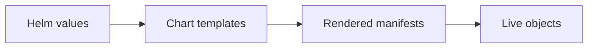

# Chart Env Var Merge Precedence

Status: Draft (2026-02-07)

Docs index: [README](../README.md)

## Overview

The Agents Helm chart exposes multiple ways to set environment variables for the control plane and controllers. Today the precedence is implicit in templates, which makes it easy to unintentionally override critical defaults (e.g. migrations, gRPC enablement) or to believe a value is set when it is not.

This doc defines a production-safe, testable precedence order and the validation behavior the chart/controllers should implement.

## Goals

- Make env var precedence explicit and deterministic.
- Prevent accidental overrides of chart-managed safety defaults.
- Provide a single table operators can use to predict runtime behavior.

## Non-Goals

- Replacing env vars with a fully typed config file system.
- Adding new runtime features beyond precedence/validation.

## Current State

- Chart templates:
  - Control plane env merge: `charts/agents/templates/deployment.yaml` (merges `.Values.env.vars` with `.Values.controlPlane.env.vars`).
  - Controllers env merge + forced defaults: `charts/agents/templates/deployment-controllers.yaml` (merges `.Values.env.vars` with `.Values.controllers.env.vars`, then sets defaults for `JANGAR_MIGRATIONS`, `JANGAR_GRPC_ENABLED`, `JANGAR_CONTROL_PLANE_CACHE_ENABLED` when not explicitly provided).
- Values surface area: `charts/agents/values.yaml` (`env.vars`, `env.extra`, `env.secrets`, `env.config`, `controlPlane.env.vars`, `controllers.env.vars`).
- Controllers runtime reads many `process.env.JANGAR_*` variables: `services/jangar/src/server/agents-controller.ts` and `services/jangar/src/server/implementation-source-webhooks.ts`.
- Cluster desired state (GitOps):
  - `argocd/applications/agents/values.yaml` sets some env vars directly under `.env.vars` and control plane vars under `.controlPlane.env.vars`.

## Design

### Precedence order (highest wins)

1. `.Values.controllers.env.vars` / `.Values.controlPlane.env.vars` (component-local explicit overrides)
2. `.Values.env.vars` (global explicit overrides)
3. Chart-implied defaults (template-set env vars like `JANGAR_MIGRATIONS=skip` for controllers)
4. Application defaults (code defaults when env var is absent)

### Conflict handling

- If the same key is set in both `.Values.env.vars` and a component-local `*.env.vars`, the component-local value MUST win.
- If the same key is set both via explicit `env:` entries (e.g. `.Values.env.extra`) and via `envFrom` (Secret/ConfigMap), behavior is Kubernetes-defined and can be surprising. The chart SHOULD:
  - Prefer explicit `env:` for chart-managed defaults.
  - Document that `envFrom` is “best effort” and may be overridden by explicit `env:`.

### Controller-side validation (recommended)

Add a lightweight startup check (controllers only) that:

- Logs the effective source for critical vars (`JANGAR_MIGRATIONS`, `JANGAR_GRPC_ENABLED`) at startup.
- Refuses to start if `JANGAR_MIGRATIONS=auto` is set in the controllers deployment (to prevent surprise migrations from the controller pod).

## Config Mapping

| Helm value                                                 | Rendered env var                     |             Default today | Intended behavior                                                               |
| ---------------------------------------------------------- | ------------------------------------ | ------------------------: | ------------------------------------------------------------------------------- |
| `env.vars.JANGAR_MIGRATIONS`                               | `JANGAR_MIGRATIONS`                  |                    `auto` | Control plane may run migrations; controllers should default to `skip`.         |
| `controllers.env.vars.JANGAR_MIGRATIONS`                   | `JANGAR_MIGRATIONS`                  | `skip` (template default) | If explicitly set, overrides template default; controllers MUST validate.       |
| `env.vars.JANGAR_GRPC_ENABLED`                             | `JANGAR_GRPC_ENABLED`                |                     unset | Global opt-in/out for control plane; controllers should default to `0`.         |
| `controllers.env.vars.JANGAR_GRPC_ENABLED`                 | `JANGAR_GRPC_ENABLED`                |    `0` (template default) | Controllers may force-disable gRPC unless explicitly enabled.                   |
| `controlPlane.env.vars.JANGAR_CONTROL_PLANE_CACHE_ENABLED` | `JANGAR_CONTROL_PLANE_CACHE_ENABLED` |                     unset | Control plane feature toggle; controllers default to `0` unless explicitly set. |

## Rollout Plan

1. Document precedence in `charts/agents/README.md` and values comments (no behavior change).
2. Add startup logging/validation in `services/jangar/src/server/*` (controllers only) with a conservative default (warn-only first).
3. Promote validation to fail-fast in a follow-up after a canary window.

Rollback:

- Revert controller-side validation (code-only rollback).
- Keep doc updates; they are safe.

## Validation

Helm render:

```bash
mise exec helm@3 -- helm template agents charts/agents -f argocd/applications/agents/values.yaml | rg -n \"JANGAR_MIGRATIONS|JANGAR_GRPC_ENABLED\"
```

Cluster (desired/live):

```bash
kubectl -n agents get deploy agents -o yaml | rg -n \"JANGAR_MIGRATIONS|JANGAR_GRPC_ENABLED\"
kubectl -n agents get deploy agents-controllers -o yaml | rg -n \"JANGAR_MIGRATIONS|JANGAR_GRPC_ENABLED\"
```

## Failure Modes and Mitigations

- Env var appears “set” but is overridden by component-local vars: mitigate with explicit precedence docs and startup logging.
- Controllers unexpectedly run migrations: mitigate by template default (`skip`) + controller fail-fast validation.
- gRPC accidentally enabled in controllers: mitigate with explicit defaults and chart-level tests (golden manifest render).

## Acceptance Criteria

- Operators can predict the effective value of a given env var from Helm values alone.
- Controllers deployment renders with `JANGAR_MIGRATIONS=skip` unless explicitly overridden.
- A canary install surfaces any unexpected overrides via logs before enforcing fail-fast.

## References

- Kubernetes environment variable precedence (explicit `env` vs `envFrom`): https://kubernetes.io/docs/tasks/inject-data-application/define-environment-variable-container/
- Helm chart best practices (values and templates): https://helm.sh/docs/chart_best_practices/values/

## Handoff Appendix (Repo + Chart + Cluster)

### Source of truth

- Helm chart: `charts/agents` (`Chart.yaml`, `values.yaml`, `values.schema.json`, `templates/`, `crds/`)
- GitOps application (desired state): `argocd/applications/agents/application.yaml`, `argocd/applications/agents/kustomization.yaml`, `argocd/applications/agents/values.yaml`
- Product appset enablement: `argocd/applicationsets/product.yaml`
- CRD Go types and codegen: `services/jangar/api/agents/v1alpha1/types.go`, `scripts/agents/validate-agents.sh`
- Control plane + controllers code:
  - Server entrypoints: `services/jangar/src/server/index.ts`, `services/jangar/src/server/app.ts`
  - Agents/AgentRuns controller: `services/jangar/src/server/agents-controller.ts`
  - Orchestrations: `services/jangar/src/server/orchestration-controller.ts`, `services/jangar/src/server/orchestration-submit.ts`
  - Supporting primitives: `services/jangar/src/server/supporting-primitives-controller.ts`
  - Policy checks (budgets/approval/etc): `services/jangar/src/server/primitives-policy.ts`
- Codex runners (when applicable): `services/jangar/scripts/codex/codex-implement.ts`, `packages/codex/src/runner.ts`
- Argo WorkflowTemplates used by Codex (when applicable): `argocd/applications/froussard/*.yaml` (typically in namespace `jangar`)

### Current cluster state (GitOps desired + live API server)

As of 2026-02-07 (repo `main`):

- Kubernetes API server (live): `v1.35.0+k3s1` (from `kubectl get --raw /version`).
- Argo CD app: `agents` deploys Helm chart `charts/agents` (release `agents`) into namespace `agents` with `includeCRDs: true`. See `argocd/applications/agents/kustomization.yaml`.
- Chart version pinned by GitOps: `0.9.1`. See `argocd/applications/agents/kustomization.yaml`.
- Images pinned by GitOps (see `argocd/applications/agents/values.yaml`):
  - Control plane (`Deployment/agents`): `registry.ide-newton.ts.net/lab/jangar-control-plane:5436c9d2@sha256:b511d73a2622ea3a4f81f5507899bca1970a0e7b6a9742b42568362f1d682b9a`
  - Controllers (`Deployment/agents-controllers`): `registry.ide-newton.ts.net/lab/jangar:5436c9d2@sha256:d673055eb54af663963dedfee69e63de46059254b830eca2a52e97e641f00349`
- Namespaced reconciliation: `controller.namespaces: [agents]` and `rbac.clusterScoped: false`. See `argocd/applications/agents/values.yaml`.
- Database connectivity: `database.secretRef.name: jangar-db-app` / `key: uri`. See `argocd/applications/agents/values.yaml`.
- gRPC enabled: `grpc.enabled: true` on port `50051`. See `argocd/applications/agents/values.yaml`.
- Repo allowlist: `env.vars.JANGAR_GITHUB_REPOS_ALLOWED: proompteng/lab`. See `argocd/applications/agents/values.yaml`.
- Runner auth (GitHub token): `envFromSecretRefs: [agents-github-token-env]`. See `argocd/applications/agents/values.yaml`.

Note: This repo’s GitOps manifests are the desired state. Live verification requires a kubectl context/SA with list/get access in `agents` (and cluster-scoped access for CRDs).

To verify live cluster state (requires sufficient RBAC), run:

```bash
kubectl version --short
kubectl get --raw /version

kubectl -n agents auth can-i list deploy
kubectl -n agents get deploy
kubectl -n agents get pods

kubectl get application -n argocd agents
kubectl get crd | rg 'proompteng\.ai'

kubectl rollout status -n agents deploy/agents
kubectl rollout status -n agents deploy/agents-controllers
```

### Values → env var mapping (chart)

Rendered primarily by `charts/agents/templates/deployment.yaml` (control plane) and `charts/agents/templates/deployment-controllers.yaml` (controllers).

Env var merge/precedence (see also `docs/agents/designs/chart-env-vars-merge-precedence.md`):

- Control plane: `.Values.env.vars` merged with `.Values.controlPlane.env.vars` (control-plane keys win).
- Controllers: `.Values.env.vars` merged with `.Values.controllers.env.vars` (controllers keys win), plus template defaults for `JANGAR_MIGRATIONS`, `JANGAR_GRPC_ENABLED`, and `JANGAR_CONTROL_PLANE_CACHE_ENABLED` when unset.

Common mappings:

- `controller.namespaces` → `JANGAR_AGENTS_CONTROLLER_NAMESPACES` (and also `JANGAR_PRIMITIVES_NAMESPACES`)
- `controller.concurrency.*` → `JANGAR_AGENTS_CONTROLLER_CONCURRENCY_{NAMESPACE,AGENT,CLUSTER}`
- `controller.queue.*` → `JANGAR_AGENTS_CONTROLLER_QUEUE_{NAMESPACE,REPO,CLUSTER}`
- `controller.rate.*` → `JANGAR_AGENTS_CONTROLLER_RATE_{WINDOW_SECONDS,NAMESPACE,REPO,CLUSTER}`
- `controller.agentRunRetentionSeconds` → `JANGAR_AGENTS_CONTROLLER_AGENTRUN_RETENTION_SECONDS`
- `controller.admissionPolicy.*` → `JANGAR_AGENTS_CONTROLLER_{LABELS_REQUIRED,LABELS_ALLOWED,LABELS_DENIED,IMAGES_ALLOWED,IMAGES_DENIED,BLOCKED_SECRETS}`
- `controller.vcsProviders.*` → `JANGAR_AGENTS_CONTROLLER_VCS_{PROVIDERS_ENABLED,DEPRECATED_TOKEN_TYPES,PR_RATE_LIMITS}`
- `controller.authSecret.*` → `JANGAR_AGENTS_CONTROLLER_AUTH_SECRET_{NAME,KEY,MOUNT_PATH}`
- `orchestrationController.*` → `JANGAR_ORCHESTRATION_CONTROLLER_{ENABLED,NAMESPACES}`
- `supportingController.*` → `JANGAR_SUPPORTING_CONTROLLER_{ENABLED,NAMESPACES}`
- `grpc.*` → `JANGAR_GRPC_{ENABLED,HOST,PORT}` (unless overridden via `env.vars`)
- `controller.jobTtlSecondsAfterFinished` → `JANGAR_AGENT_RUNNER_JOB_TTL_SECONDS`
- `runtime.*` → `JANGAR_{AGENT_RUNNER_IMAGE,AGENT_IMAGE,SCHEDULE_RUNNER_IMAGE,SCHEDULE_SERVICE_ACCOUNT}` (unless overridden via `env.vars`)

### Rollout plan (GitOps)

1. Update code + chart + CRDs in one PR when changing APIs:
   - Go types (`services/jangar/api/agents/v1alpha1/types.go`) → regenerate CRDs → `charts/agents/crds/`.
2. Validate locally:
   - `scripts/agents/validate-agents.sh`
   - `scripts/argo-lint.sh`
   - `scripts/kubeconform.sh argocd`
   - Render the app: `mise exec helm@3 -- kustomize build --enable-helm argocd/applications/agents > /tmp/agents.yaml`
3. Update the GitOps overlay if rollout requires new values:
   - `argocd/applications/agents/values.yaml`
4. Merge to `main`; Argo CD reconciles the `agents` application.

### Validation (smoke)

- Render the full install (Helm via kustomize): `mise exec helm@3 -- kustomize build --enable-helm argocd/applications/agents > /tmp/agents.yaml`
- Schema + example validation: `scripts/agents/validate-agents.sh`
- In-cluster (requires sufficient RBAC):
  - `kubectl -n agents get pods`
  - `kubectl -n agents logs deploy/agents-controllers --tail=200`
  - Apply a minimal `Agent`/`AgentRun` from `charts/agents/examples` and confirm it reaches `Succeeded`.

## Diagram


