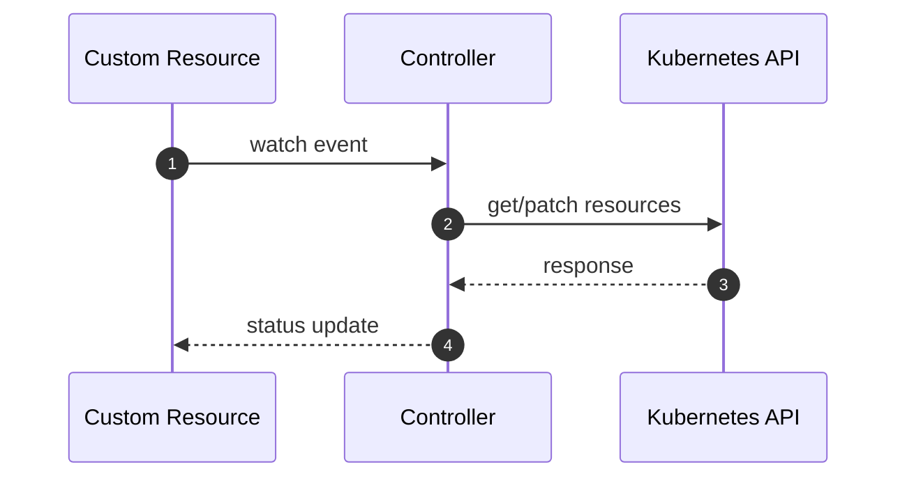

# Controller ResourceVersion Conflicts and Retry Strategy

Status: Draft (2026-02-07)

Docs index: [README](../README.md)
## Overview
Controllers patch and apply resources that may also be updated by other actors (users, GitOps, other controllers). Conflicts (HTTP 409) and optimistic concurrency failures should be handled predictably: retry when safe, fail fast when not.

## Goals
- Define a retry policy for resourceVersion conflicts on:
  - status writes
  - metadata patches (finalizers/labels)
- Avoid infinite retry loops.

## Non-Goals
- Solving every conflict scenario; some must surface as errors.

## Current State
- Controllers patch and set status frequently:
  - `services/jangar/src/server/agents-controller.ts` uses `kube.patch(...)` and `setStatus(...)`.
- `kube.patch` uses `kubectl patch --type=merge`:
  - `services/jangar/src/server/primitives-kube.ts`
- Conflict handling is not centralized; retries are largely implicit (if reconciliation loops run again).

## Design
### Retry policy
- For status updates:
  - Use SSA where possible (reduces conflicts) and retry up to N times with jitter on conflict.
- For metadata patches (finalizers):
  - Retry up to N times on conflict; if still conflicting, re-fetch and recompute finalizers.
- N defaults to 3, configurable via env var.

### Implementation approach
- Add a `withConflictRetry` helper used by:
  - finalizer patch paths in `agents-controller.ts`
  - status apply paths (if not already resilient)

## Config Mapping
| Proposed Helm value | Env var | Intended behavior |
|---|---|---|
| `controllers.env.vars.JANGAR_CONTROLLER_CONFLICT_RETRY_ATTEMPTS` | `JANGAR_CONTROLLER_CONFLICT_RETRY_ATTEMPTS` | Max retries on 409/conflict (default `3`). |
| `controllers.env.vars.JANGAR_CONTROLLER_CONFLICT_RETRY_BASE_MS` | `JANGAR_CONTROLLER_CONFLICT_RETRY_BASE_MS` | Base backoff delay (default `200`). |

## Rollout Plan
1. Add helper + defaults (no config needed).
2. Canary in non-prod by simulating concurrent updates and confirming convergence.

Rollback:
- Disable retries by setting attempts to `0` (or reverting code).

## Validation
```bash
kubectl -n agents get agentrun <name> -o yaml | rg -n \"resourceVersion:\"
kubectl -n agents logs deploy/agents-controllers | rg -n \"Conflict|409\"
```

## Failure Modes and Mitigations
- Retry loops amplify load: mitigate with small N and jitter.
- Conflicts hide real logic bugs: mitigate by logging a structured warning after the final retry.

## Acceptance Criteria
- Common conflict cases converge without operator intervention.
- Conflict retries are bounded and observable.

## References
- Kubernetes optimistic concurrency control: https://kubernetes.io/docs/reference/using-api/api-concepts/#resource-versions

## Handoff Appendix (Repo + Chart + Cluster)

### Source of truth
- Helm chart: `charts/agents` (`Chart.yaml`, `values.yaml`, `values.schema.json`, `templates/`, `crds/`)
- GitOps application (desired state): `argocd/applications/agents/application.yaml`, `argocd/applications/agents/kustomization.yaml`, `argocd/applications/agents/values.yaml`
- Product appset enablement: `argocd/applicationsets/product.yaml`
- CRD Go types and codegen: `services/jangar/api/agents/v1alpha1/types.go`, `scripts/agents/validate-agents.sh`
- Control plane + controllers code:
  - Server entrypoints: `services/jangar/src/server/index.ts`, `services/jangar/src/server/app.ts`
  - Agents/AgentRuns controller: `services/jangar/src/server/agents-controller.ts`
  - Orchestrations: `services/jangar/src/server/orchestration-controller.ts`, `services/jangar/src/server/orchestration-submit.ts`
  - Supporting primitives: `services/jangar/src/server/supporting-primitives-controller.ts`
  - Policy checks (budgets/approval/etc): `services/jangar/src/server/primitives-policy.ts`
- Codex runners (when applicable): `services/jangar/scripts/codex/codex-implement.ts`, `packages/codex/src/runner.ts`
- Argo WorkflowTemplates used by Codex (when applicable): `argocd/applications/froussard/*.yaml` (typically in namespace `jangar`)

### Current cluster state (GitOps desired + live API server)
As of 2026-02-07 (repo `main`):
- Kubernetes API server (live): `v1.35.0+k3s1` (from `kubectl get --raw /version`).
- Argo CD app: `agents` deploys Helm chart `charts/agents` (release `agents`) into namespace `agents` with `includeCRDs: true`. See `argocd/applications/agents/kustomization.yaml`.
- Chart version pinned by GitOps: `0.9.1`. See `argocd/applications/agents/kustomization.yaml`.
- Images pinned by GitOps (see `argocd/applications/agents/values.yaml`):
  - Control plane (`Deployment/agents`): `registry.ide-newton.ts.net/lab/jangar-control-plane:5436c9d2@sha256:b511d73a2622ea3a4f81f5507899bca1970a0e7b6a9742b42568362f1d682b9a`
  - Controllers (`Deployment/agents-controllers`): `registry.ide-newton.ts.net/lab/jangar:5436c9d2@sha256:d673055eb54af663963dedfee69e63de46059254b830eca2a52e97e641f00349`
- Namespaced reconciliation: `controller.namespaces: [agents]` and `rbac.clusterScoped: false`. See `argocd/applications/agents/values.yaml`.
- Database connectivity: `database.secretRef.name: jangar-db-app` / `key: uri`. See `argocd/applications/agents/values.yaml`.
- gRPC enabled: `grpc.enabled: true` on port `50051`. See `argocd/applications/agents/values.yaml`.
- Repo allowlist: `env.vars.JANGAR_GITHUB_REPOS_ALLOWED: proompteng/lab`. See `argocd/applications/agents/values.yaml`.
- Runner auth (GitHub token): `envFromSecretRefs: [agents-github-token-env]`. See `argocd/applications/agents/values.yaml`.

Note: This repo’s GitOps manifests are the desired state. Live verification requires a kubectl context/SA with list/get access in `agents` (and cluster-scoped access for CRDs).

To verify live cluster state (requires sufficient RBAC), run:

```bash
kubectl version --short
kubectl get --raw /version

kubectl -n agents auth can-i list deploy
kubectl -n agents get deploy
kubectl -n agents get pods

kubectl get application -n argocd agents
kubectl get crd | rg 'proompteng\.ai'

kubectl rollout status -n agents deploy/agents
kubectl rollout status -n agents deploy/agents-controllers
```

### Values → env var mapping (chart)
Rendered primarily by `charts/agents/templates/deployment.yaml` (control plane) and `charts/agents/templates/deployment-controllers.yaml` (controllers).

Env var merge/precedence (see also `docs/agents/designs/chart-env-vars-merge-precedence.md`):
- Control plane: `.Values.env.vars` merged with `.Values.controlPlane.env.vars` (control-plane keys win).
- Controllers: `.Values.env.vars` merged with `.Values.controllers.env.vars` (controllers keys win), plus template defaults for `JANGAR_MIGRATIONS`, `JANGAR_GRPC_ENABLED`, and `JANGAR_CONTROL_PLANE_CACHE_ENABLED` when unset.

Common mappings:
- `controller.namespaces` → `JANGAR_AGENTS_CONTROLLER_NAMESPACES` (and also `JANGAR_PRIMITIVES_NAMESPACES`)
- `controller.concurrency.*` → `JANGAR_AGENTS_CONTROLLER_CONCURRENCY_{NAMESPACE,AGENT,CLUSTER}`
- `controller.queue.*` → `JANGAR_AGENTS_CONTROLLER_QUEUE_{NAMESPACE,REPO,CLUSTER}`
- `controller.rate.*` → `JANGAR_AGENTS_CONTROLLER_RATE_{WINDOW_SECONDS,NAMESPACE,REPO,CLUSTER}`
- `controller.agentRunRetentionSeconds` → `JANGAR_AGENTS_CONTROLLER_AGENTRUN_RETENTION_SECONDS`
- `controller.admissionPolicy.*` → `JANGAR_AGENTS_CONTROLLER_{LABELS_REQUIRED,LABELS_ALLOWED,LABELS_DENIED,IMAGES_ALLOWED,IMAGES_DENIED,BLOCKED_SECRETS}`
- `controller.vcsProviders.*` → `JANGAR_AGENTS_CONTROLLER_VCS_{PROVIDERS_ENABLED,DEPRECATED_TOKEN_TYPES,PR_RATE_LIMITS}`
- `controller.authSecret.*` → `JANGAR_AGENTS_CONTROLLER_AUTH_SECRET_{NAME,KEY,MOUNT_PATH}`
- `orchestrationController.*` → `JANGAR_ORCHESTRATION_CONTROLLER_{ENABLED,NAMESPACES}`
- `supportingController.*` → `JANGAR_SUPPORTING_CONTROLLER_{ENABLED,NAMESPACES}`
- `grpc.*` → `JANGAR_GRPC_{ENABLED,HOST,PORT}` (unless overridden via `env.vars`)
- `controller.jobTtlSecondsAfterFinished` → `JANGAR_AGENT_RUNNER_JOB_TTL_SECONDS`
- `runtime.*` → `JANGAR_{AGENT_RUNNER_IMAGE,AGENT_IMAGE,SCHEDULE_RUNNER_IMAGE,SCHEDULE_SERVICE_ACCOUNT}` (unless overridden via `env.vars`)

### Rollout plan (GitOps)
1. Update code + chart + CRDs in one PR when changing APIs:
   - Go types (`services/jangar/api/agents/v1alpha1/types.go`) → regenerate CRDs → `charts/agents/crds/`.
2. Validate locally:
   - `scripts/agents/validate-agents.sh`
   - `scripts/argo-lint.sh`
   - `scripts/kubeconform.sh argocd`
   - Render the app: `mise exec helm@3 -- kustomize build --enable-helm argocd/applications/agents > /tmp/agents.yaml`
3. Update the GitOps overlay if rollout requires new values:
   - `argocd/applications/agents/values.yaml`
4. Merge to `main`; Argo CD reconciles the `agents` application.

### Validation (smoke)
- Render the full install (Helm via kustomize): `mise exec helm@3 -- kustomize build --enable-helm argocd/applications/agents > /tmp/agents.yaml`
- Schema + example validation: `scripts/agents/validate-agents.sh`
- In-cluster (requires sufficient RBAC):
  - `kubectl -n agents get pods`
  - `kubectl -n agents logs deploy/agents-controllers --tail=200`
  - Apply a minimal `Agent`/`AgentRun` from `charts/agents/examples` and confirm it reaches `Succeeded`.

## Diagram


