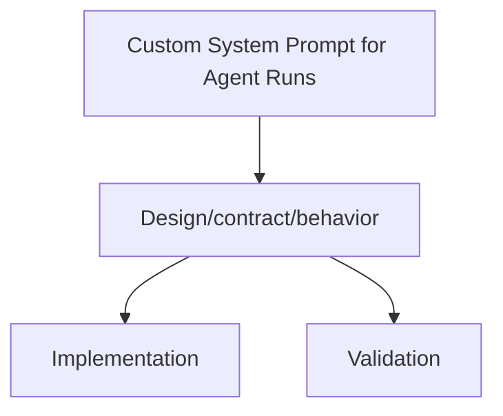

# Custom System Prompt for Agent Runs

Status: Implemented (2026-02-07)

Docs index: [README](../README.md)

Note: Clusters will accept/run the new fields once the updated `charts/agents` CRDs and the relevant controller/runtime deployments (plus Argo templates, if used) are rolled out.

## Summary
Agent runs now support per-run system prompts with Agent-level defaults. Prompts can be provided inline or by reference (Secret/ConfigMap). Codex runs apply the resolved prompt and record a SHA-256 hash for audit without logging prompt contents.

## Goals (Shipped)
- Per-run custom system prompt for AgentRun executions, with optional defaults at Agent level.
- Prompts can be supplied inline or by reference (ConfigMap/Secret).
- Codex job/workflow runs apply the system prompt without breaking existing runs.
- Auditability via hashes/metadata without leaking prompt contents.

## Non-Goals
- Redesigning the Codex user prompt builder or issue ingestion flows.
- Providing a UI for system prompt management in this phase.
- Expanding behavior for non-Codex providers beyond pass-through availability.

## Current State (Implemented)
- CRDs add `systemPrompt` / `systemPromptRef` on `AgentRun.spec` and `Agent.spec.defaults`, plus `status.systemPromptHash` on `AgentRun`. See `services/jangar/api/agents/v1alpha1/types.go` and `charts/agents/crds/`.
- Jangar resolves a system prompt using precedence rules, applies security checks, and records a SHA-256 hash in `AgentRun.status`. See `services/jangar/src/server/agents-controller.ts`.
- `codex-implement` resolves system prompt from `CODEX_SYSTEM_PROMPT_PATH` (preferred) or the event payload, logs only hash/length, and passes it to Codex. See `services/jangar/scripts/codex/codex-implement.ts`.
- `CodexRunner` forwards the system prompt as `--config developer_instructions=<toml-string>` when non-empty. See `packages/codex/src/runner.ts`.
- Argo templates accept inline + Secret/ConfigMap system prompt inputs and set `CODEX_SYSTEM_PROMPT_PATH` when a ref is supplied. See `argocd/applications/froussard/*workflow-template*.yaml`.

## API Additions
Optional system prompt fields are available on AgentRun and Agent defaults:

```yaml
spec:
  systemPrompt: string
  systemPromptRef:
    kind: Secret|ConfigMap
    name: string
    key: string
```

Agent defaults:

```yaml
spec:
  defaults:
    systemPrompt: string
    systemPromptRef:
      kind: Secret|ConfigMap
      name: string
      key: string
```

Validation:
- `systemPrompt` maxLength: 16384 (CRD + controller enforcement).
- `systemPrompt` and `systemPromptRef` are mutually exclusive at each level (XValidation).
- `systemPromptRef` must reference a Secret or ConfigMap in the same namespace.
- `systemPrompt` is treated as non-secret; sensitive content should use `systemPromptRef`.

## Resolution Order
1. `AgentRun.spec.systemPromptRef`
2. `AgentRun.spec.systemPrompt`
3. `Agent.spec.defaults.systemPromptRef`
4. `Agent.spec.defaults.systemPrompt`
5. No system prompt override

Notes:
- Empty/blank inline strings are treated as unset and fall through to the next candidate.
- `systemPromptRef` resolution short-circuits the search even if inline fields exist elsewhere.

## Controller Behavior (Jangar)
- Resolves system prompt per the precedence above.
- Inline prompt: included in the run payload (`systemPrompt` in event JSON).
- Ref prompt: mounted into the runtime pod as `/workspace/.codex/system-prompt.txt`, and `CODEX_SYSTEM_PROMPT_PATH` is set.
- Ref prompt: the prompt contents are not injected into the run payload.
- Records `systemPromptHash` (SHA-256 hex of prompt contents) in `AgentRun.status`.

Security constraints:
- Secret references must be present in `AgentRun.spec.secrets`.
- If `Agent.spec.security.allowedSecrets` is non-empty, Secret references must be allowlisted there.
- Secret references must not match `JANGAR_AGENTS_CONTROLLER_BLOCKED_SECRETS` (exact matching, consistent with other secret mounts).
- ConfigMap references do not require allowlisting.
- Secret data is read from `stringData` first, then base64-decoded from `data`.
- Missing refs/keys or invalid types fail the run with `InvalidSpec`.

## Runtime Behavior (Codex)
- `codex-implement` prefers `CODEX_SYSTEM_PROMPT_PATH` when the file exists and is non-empty; otherwise it falls back to `event.systemPrompt`.
- The resolved system prompt is passed to `CodexRunner` as `--config developer_instructions=<toml-string>`.
- Prompt contents are never logged; only hash and length are logged. A `systemPromptHash` attribute is attached to the NATS `run-started` event.
- `developer_instructions` is encoded as a quoted TOML string literal (do not attempt manual shell-escaping).

## Workflow Template Behavior (Argo)
- `codex-run`, `codex-autonomous`, and `github-codex-implementation` templates accept `system_prompt`.
- `codex-run`, `codex-autonomous`, and `github-codex-implementation` templates accept `system_prompt_secret_name` and `system_prompt_secret_key`.
- `codex-run`, `codex-autonomous`, and `github-codex-implementation` templates accept `system_prompt_configmap_name` and `system_prompt_configmap_key`.
- Secret mounts are exposed at `/workspace/.codex/system-prompt/secret/<key>`.
- ConfigMap mounts are exposed at `/workspace/.codex/system-prompt/configmap/<key>`.
- The template copies the selected file to `/workspace/.codex/system-prompt.txt` and sets `CODEX_SYSTEM_PROMPT_PATH`.
- The inline `system_prompt` is injected into the event JSON when non-empty.

Argo examples:

```bash
argo submit \
  --from workflowtemplate/codex-run \
  -n jangar \
  -p repository='proompteng/lab' \
  -p issue_number='1234' \
  -p head='my-branch' \
  -p prompt='Implement X' \
  -p system_prompt='You are a strict reviewer. Prefer minimal diffs.'
```

```bash
argo submit \
  --from workflowtemplate/codex-run \
  -n jangar \
  -p repository='proompteng/lab' \
  -p issue_number='1234' \
  -p head='my-branch' \
  -p prompt='Implement X' \
  -p system_prompt_secret_name='my-system-prompt' \
  -p system_prompt_secret_key='system-prompt.txt'
```

## Provider Pass-Through
- `systemPrompt` is present in the run payload for inline prompts, allowing non-Codex providers to consume it if desired.

## Data Flow (Codex, Inline Prompt)
1. AgentRun created with `spec.systemPrompt`.
2. Jangar resolves the system prompt and adds it to the event payload.
3. `agent-runner` writes event JSON to disk.
4. `codex-implement` reads event JSON and extracts `systemPrompt`.
5. `CodexRunner` invokes `codex exec --config developer_instructions="<prompt>"`.

## Data Flow (Codex, Ref Prompt)
1. AgentRun created with `spec.systemPromptRef`.
2. Jangar mounts the Secret/ConfigMap into `/workspace/.codex/system-prompt.txt` and exports `CODEX_SYSTEM_PROMPT_PATH`.
3. `codex-implement` reads `CODEX_SYSTEM_PROMPT_PATH` (preferred) and resolves the prompt.
4. `CodexRunner` invokes `codex exec --config developer_instructions="<prompt>"`.

## Hashing and Audit
- `AgentRun.status.systemPromptHash` stores the SHA-256 hex of the resolved prompt.
- `codex-implement` computes the hash of the resolved prompt and attaches it to the NATS `run-started` event.
- Prompt contents are never emitted to logs.
- Hash drift: if a Secret/ConfigMap changes mid-run, the controller-computed hash (recorded in `AgentRun.status`) and the runtime-computed hash (attached to NATS) can differ.

## Limitations
- Temporal runtime only receives inline `systemPrompt` in the payload. `systemPromptRef` is not mounted and is ignored for temporal runs.
- Custom runtime uses `spec.runtime.config.payload` (if set) else `{agentRun, implementation, memory}`. It does not receive the resolved system prompt (after applying Agent defaults or reading refs) unless you include it explicitly.
- No per-workflow-step system prompt overrides; workflow steps all share the resolved prompt.
- `systemPrompt` is not injected into any additional contract metadata beyond the event payload and `systemPromptHash` status field.

## Handoff Appendix (Repo + Chart + Cluster)

### Source of truth
- Helm chart: `charts/agents` (`Chart.yaml`, `values.yaml`, `values.schema.json`, `templates/`, `crds/`)
- GitOps application (desired state): `argocd/applications/agents/application.yaml`, `argocd/applications/agents/kustomization.yaml`, `argocd/applications/agents/values.yaml`
- Product appset enablement: `argocd/applicationsets/product.yaml`
- CRD Go types and codegen: `services/jangar/api/agents/v1alpha1/types.go`, `scripts/agents/validate-agents.sh`
- Control plane + controllers code:
  - Server entrypoints: `services/jangar/src/server/index.ts`, `services/jangar/src/server/app.ts`
  - Agents/AgentRuns controller: `services/jangar/src/server/agents-controller.ts`
  - Orchestrations: `services/jangar/src/server/orchestration-controller.ts`, `services/jangar/src/server/orchestration-submit.ts`
  - Supporting primitives: `services/jangar/src/server/supporting-primitives-controller.ts`
  - Policy checks (budgets/approval/etc): `services/jangar/src/server/primitives-policy.ts`
- Codex runners (when applicable): `services/jangar/scripts/codex/codex-implement.ts`, `packages/codex/src/runner.ts`
- Argo WorkflowTemplates used by Codex (when applicable): `argocd/applications/froussard/*.yaml` (typically in namespace `jangar`)

### Current cluster state (GitOps desired + live API server)
As of 2026-02-07 (repo `main`):
- Kubernetes API server (live): `v1.35.0+k3s1` (from `kubectl get --raw /version`).
- Argo CD app: `agents` deploys Helm chart `charts/agents` (release `agents`) into namespace `agents` with `includeCRDs: true`. See `argocd/applications/agents/kustomization.yaml`.
- Chart version pinned by GitOps: `0.9.1`. See `argocd/applications/agents/kustomization.yaml`.
- Images pinned by GitOps (see `argocd/applications/agents/values.yaml`):
  - Control plane (`Deployment/agents`): `registry.ide-newton.ts.net/lab/jangar-control-plane:5436c9d2@sha256:b511d73a2622ea3a4f81f5507899bca1970a0e7b6a9742b42568362f1d682b9a`
  - Controllers (`Deployment/agents-controllers`): `registry.ide-newton.ts.net/lab/jangar:5436c9d2@sha256:d673055eb54af663963dedfee69e63de46059254b830eca2a52e97e641f00349`
- Namespaced reconciliation: `controller.namespaces: [agents]` and `rbac.clusterScoped: false`. See `argocd/applications/agents/values.yaml`.
- Database connectivity: `database.secretRef.name: jangar-db-app` / `key: uri`. See `argocd/applications/agents/values.yaml`.
- gRPC enabled: `grpc.enabled: true` on port `50051`. See `argocd/applications/agents/values.yaml`.
- Repo allowlist: `env.vars.JANGAR_GITHUB_REPOS_ALLOWED: proompteng/lab`. See `argocd/applications/agents/values.yaml`.
- Runner auth (GitHub token): `envFromSecretRefs: [agents-github-token-env]`. See `argocd/applications/agents/values.yaml`.

Note: This repo’s GitOps manifests are the desired state. Live verification requires a kubectl context/SA with list/get access in `agents` (and cluster-scoped access for CRDs).

To verify live cluster state (requires sufficient RBAC), run:

```bash
kubectl version --short
kubectl get --raw /version

kubectl -n agents auth can-i list deploy
kubectl -n agents get deploy
kubectl -n agents get pods

kubectl get application -n argocd agents
kubectl get crd | rg 'proompteng\.ai'

kubectl rollout status -n agents deploy/agents
kubectl rollout status -n agents deploy/agents-controllers
```

### Values → env var mapping (chart)
Rendered primarily by `charts/agents/templates/deployment.yaml` (control plane) and `charts/agents/templates/deployment-controllers.yaml` (controllers).

Env var merge/precedence (see also `docs/agents/designs/chart-env-vars-merge-precedence.md`):
- Control plane: `.Values.env.vars` merged with `.Values.controlPlane.env.vars` (control-plane keys win).
- Controllers: `.Values.env.vars` merged with `.Values.controllers.env.vars` (controllers keys win), plus template defaults for `JANGAR_MIGRATIONS`, `JANGAR_GRPC_ENABLED`, and `JANGAR_CONTROL_PLANE_CACHE_ENABLED` when unset.

Common mappings:
- `controller.namespaces` → `JANGAR_AGENTS_CONTROLLER_NAMESPACES` (and also `JANGAR_PRIMITIVES_NAMESPACES`)
- `controller.concurrency.*` → `JANGAR_AGENTS_CONTROLLER_CONCURRENCY_{NAMESPACE,AGENT,CLUSTER}`
- `controller.queue.*` → `JANGAR_AGENTS_CONTROLLER_QUEUE_{NAMESPACE,REPO,CLUSTER}`
- `controller.rate.*` → `JANGAR_AGENTS_CONTROLLER_RATE_{WINDOW_SECONDS,NAMESPACE,REPO,CLUSTER}`
- `controller.agentRunRetentionSeconds` → `JANGAR_AGENTS_CONTROLLER_AGENTRUN_RETENTION_SECONDS`
- `controller.admissionPolicy.*` → `JANGAR_AGENTS_CONTROLLER_{LABELS_REQUIRED,LABELS_ALLOWED,LABELS_DENIED,IMAGES_ALLOWED,IMAGES_DENIED,BLOCKED_SECRETS}`
- `controller.vcsProviders.*` → `JANGAR_AGENTS_CONTROLLER_VCS_{PROVIDERS_ENABLED,DEPRECATED_TOKEN_TYPES,PR_RATE_LIMITS}`
- `controller.authSecret.*` → `JANGAR_AGENTS_CONTROLLER_AUTH_SECRET_{NAME,KEY,MOUNT_PATH}`
- `orchestrationController.*` → `JANGAR_ORCHESTRATION_CONTROLLER_{ENABLED,NAMESPACES}`
- `supportingController.*` → `JANGAR_SUPPORTING_CONTROLLER_{ENABLED,NAMESPACES}`
- `grpc.*` → `JANGAR_GRPC_{ENABLED,HOST,PORT}` (unless overridden via `env.vars`)
- `controller.jobTtlSecondsAfterFinished` → `JANGAR_AGENT_RUNNER_JOB_TTL_SECONDS`
- `runtime.*` → `JANGAR_{AGENT_RUNNER_IMAGE,AGENT_IMAGE,SCHEDULE_RUNNER_IMAGE,SCHEDULE_SERVICE_ACCOUNT}` (unless overridden via `env.vars`)

### Rollout plan (GitOps)
1. Update code + chart + CRDs in one PR when changing APIs:
   - Go types (`services/jangar/api/agents/v1alpha1/types.go`) → regenerate CRDs → `charts/agents/crds/`.
2. Validate locally:
   - `scripts/agents/validate-agents.sh`
   - `scripts/argo-lint.sh`
   - `scripts/kubeconform.sh argocd`
   - Render the app: `mise exec helm@3 -- kustomize build --enable-helm argocd/applications/agents > /tmp/agents.yaml`
3. Update the GitOps overlay if rollout requires new values:
   - `argocd/applications/agents/values.yaml`
4. Merge to `main`; Argo CD reconciles the `agents` application.

### Validation (smoke)
- Render the full install (Helm via kustomize): `mise exec helm@3 -- kustomize build --enable-helm argocd/applications/agents > /tmp/agents.yaml`
- Schema + example validation: `scripts/agents/validate-agents.sh`
- In-cluster (requires sufficient RBAC):
  - `kubectl -n agents get pods`
  - `kubectl -n agents logs deploy/agents-controllers --tail=200`
  - Apply a minimal `Agent`/`AgentRun` from `charts/agents/examples` and confirm it reaches `Succeeded`.

## Diagram


