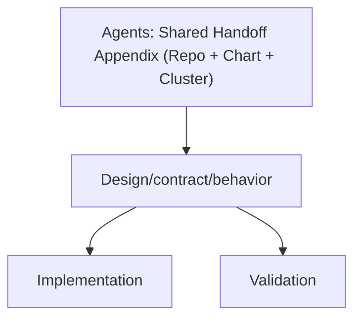

# Agents: Shared Handoff Appendix (Repo + Chart + Cluster)

Status: Current (2026-02-07)

Docs index: [README](../README.md)

This document centralizes the “always the same” operational facts for the Agents stack so individual design docs
can stay focused on their specific topic.

See also: `../README.md` (docs index)

## Production / GitOps (source of truth)

These design docs are written against the repo’s GitOps desired state. The cluster should converge to whatever is
declared in:

- Helm chart: `charts/agents/`
- Argo CD app + values overlay: `argocd/applications/agents/`

## Source of truth (repo)

- Helm chart (templates, CRDs, defaults): `charts/agents/`
- Chart values + schema:
  - Defaults: `charts/agents/values.yaml`
  - Schema: `charts/agents/values.schema.json`
  - Environment overlays (examples): `charts/agents/values-{dev,kind,local,prod,ci}.yaml`
- GitOps desired state (production install):
  - Argo CD Application: `argocd/applications/agents/application.yaml`
  - Helm via kustomize: `argocd/applications/agents/kustomization.yaml`
  - Values overlay: `argocd/applications/agents/values.yaml`
  - Extra primitives (Agent/Provider/VCP/etc): `argocd/applications/agents/*.yaml`
  - Related apps (not part of `agents` release, but commonly involved): `argocd/applications/jangar/`,
    `argocd/applications/froussard/`

## Current cluster desired state (GitOps)

As of 2026-02-07 (repo `main`), the repo declares:

- Argo CD app `agents` deploys to namespace `agents`. See `argocd/applications/agents/application.yaml`.
- Install mechanism: kustomize `helmCharts` with `includeCRDs: true` and Helm release name `agents`. See
  `argocd/applications/agents/kustomization.yaml`.
- Chart version pinned by GitOps: `0.9.1`. See `argocd/applications/agents/kustomization.yaml`.
- Images pinned by GitOps (from `argocd/applications/agents/values.yaml`):
  - Control plane (Deployment `agents`): `registry.ide-newton.ts.net/lab/jangar-control-plane:5436c9d2@sha256:b511d73a2622ea3a4f81f5507899bca1970a0e7b6a9742b42568362f1d682b9a`
  - Controllers (Deployment `agents-controllers`): `registry.ide-newton.ts.net/lab/jangar:5436c9d2@sha256:d673055eb54af663963dedfee69e63de46059254b830eca2a52e97e641f00349`
  - Runtime runner (AgentRun pods): `registry.ide-newton.ts.net/lab/codex-universal:5436c9d2@sha256:ff8e864d9ad6319fd46629f340c046370fd10cc9b2f31e7ddc100124a080e3f8`
- Controllers enabled: `controllers.enabled: true`. See `argocd/applications/agents/values.yaml`.
- Namespaced reconciliation (not cluster-scoped): `controller.namespaces: [agents]` and `rbac.clusterScoped: false`.
  See `argocd/applications/agents/values.yaml`.
- Database connection:
  - `database.secretRef.name: jangar-db-app`
  - `database.secretRef.key: uri`
  See `argocd/applications/agents/values.yaml`.
- gRPC is enabled and explicitly managed via both chart values and env vars:
  - `grpc.enabled: true`
  - `env.vars.JANGAR_GRPC_ENABLED: "true"`
  See `argocd/applications/agents/values.yaml`.
- GitHub VersionControlProvider is declared in GitOps as `VersionControlProvider/github`. See
  `argocd/applications/agents/codex-versioncontrolprovider.yaml`.

Note on “live cluster state”: this repo is GitOps-first, so treat `argocd/applications/**` + `charts/agents/**` as
the desired state. Validate live state with the commands in the next section (requires read access to `argocd` and
`agents` namespaces).

## Validation commands (local render)

Render the full desired install (Helm via kustomize, matching Argo CD):

```bash
mise exec helm@3 -- kustomize build --enable-helm argocd/applications/agents > /tmp/agents.yaml
rg -n \"^kind: (Deployment|Service|CustomResourceDefinition)$\" /tmp/agents.yaml | head
```

Validate schema / examples / chart renderability (includes kubeconform and size checks):

```bash
scripts/agents/validate-agents.sh
```

Validate Argo CD manifests (basic structure + kubeconform):

```bash
scripts/argo-lint.sh
scripts/kubeconform.sh argocd
```

If `kubectl` is not installed locally, use:

```bash
mise exec kubectl@1.30.0 -- kubectl version --client
```

## Validation commands (live cluster)

These commands confirm the live cluster matches the GitOps desired state.

```bash
# Kubernetes API server version
kubectl version --short
kubectl get --raw /version

# Argo CD view (requires access to namespace argocd)
kubectl get application -n argocd agents -o yaml | rg -n \"sync|health|revision\"

# Workloads
kubectl get deploy -n agents
kubectl rollout status -n agents deploy/agents
kubectl rollout status -n agents deploy/agents-controllers

# CRDs (cluster-scoped)
kubectl get crd | rg 'proompteng\\.ai'
```

## Rollout discipline (GitOps)

When changing behavior that affects runtime (CRDs, controllers, chart templates, or default values):

1. Update code and chart together:
   - Controllers/runtime: `services/jangar/src/server/**`
   - CRD types: `services/jangar/api/agents/v1alpha1/**` → regenerate CRDs into `charts/agents/crds/`
   - Chart templates/values: `charts/agents/templates/**`, `charts/agents/values*.yaml`, `charts/agents/values.schema.json`
2. Validate locally:
   - `scripts/agents/validate-agents.sh`
   - `mise exec helm@3 -- kustomize build --enable-helm argocd/applications/agents > /tmp/agents.yaml`
3. If new config is needed in prod, update `argocd/applications/agents/values.yaml`.
4. Merge to `main`; Argo CD will reconcile automatically.

## Diagram


