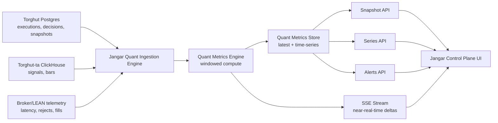

# Jangar Quant Performance Control Plane (Near Real Time)

Status: Proposed (2026-02-12)

Docs index: [README](../README.md)

## Objective
Design a full control plane in Jangar that exposes strategy performance in near real time with standard quant metrics,
so operators can answer at any moment:
- Is the strategy making money after costs?
- Is risk/exposure inside policy?
- Is execution quality degrading?
- Are data quality or pipeline lags invalidating decisions?

## Scope
- Jangar control-plane APIs and streams for quant performance.
- Metric computation contracts (definitions, formulas, freshness rules).
- Storage and aggregation design for near-real-time and historical views.
- Dashboard and alert contracts for operations and promotion gates.

Non-goals:
- Replacing Torghut deterministic risk/firewall authority.
- Direct broker execution from Jangar control-plane endpoints.
- Introducing live cutover logic without policy gates.

## Current Baseline (2026-02-12)
Existing surfaces are useful but not sufficient for full quant control plane:
- Jangar has Torghut summary endpoints:
  - `services/jangar/src/routes/api/torghut/trading/summary.ts`
  - `services/jangar/src/routes/api/torghut/trading/executions.ts`
  - `services/jangar/src/routes/api/torghut/trading/decisions.ts`
- Jangar computes realized PnL (average-cost long-only) and win-rate summaries:
  - `services/jangar/src/server/torghut-trading-pnl.ts`
- Torghut exposes status and counters, but not a complete near-real-time quant metric pack:
  - `services/torghut/app/main.py` (`/trading/status`, `/trading/metrics`, `/metrics`)
- Jangar has control-plane SSE patterns that can be reused for streaming:
  - `services/jangar/src/routes/api/agents/control-plane/stream.ts`

Primary gaps:
1. No single quant snapshot endpoint with risk-adjusted return + TCA + exposure.
2. No standardized metric dictionary with explicit formulas and window semantics.
3. No near-real-time metric stream for dashboard updates.
4. No alert contract tied to quant thresholds and rollout gates.

### Verified live evidence snapshot (2026-02-12 06:31-06:35 UTC)
- Runtime posture:
  - `ksvc/torghut` ready on `torghut-00062`.
  - `deployment/jangar` healthy (`1/1`).
  - `deployment/agents` healthy (`1/1`), `deployment/agents-controllers` healthy (`2/2`).
- Torghut status sample (`/trading/status`):
  - `enabled=true`, `mode=paper`, `running=true`, `kill_switch_enabled=false`.
  - `llm_requests_total=261`, `llm_approve_total=254`, `llm_veto_total=5`, `llm_error_total=2`.
- CNPG (`torghut-db`) sample:
  - `strategies_total=1` (`enabled=1`),
  - `trade_decisions_total=2852`, `executions_total=484`, `filled_total=379`,
  - `position_snapshots_total=3932`, latest snapshot `2026-02-11T21:59:28Z`.
- ClickHouse sample:
  - `ta_signals` latest event `2026-02-11T21:58:42Z`, `rows_24h=50450`.
  - `ta_microbars` latest `window_end=2026-02-11T21:58:42Z`, `rows_24h=47217`.
- Jangar control-plane status endpoint:
  - `/api/agents/control-plane/status?namespace=agents` returned healthy controllers/adapters.
- Operational constraints observed:
  - `/api/torghut/trading/strategies` and `/api/torghut/trading/summary` returned:
    - `{"ok":false,"message":"self signed certificate in certificate chain"}`
  - `svc/agents-metrics` still returned `404` on `/metrics`.
- Reproduction playbook:
  - `docs/agents/designs/jangar-torghut-live-analysis-playbook.md`

## Design Principles
- Deterministic risk engine remains final authority for execution approval.
- Metrics must be reproducible (same inputs, same formula version, same output).
- Every metric includes quality/freshness metadata.
- Near-real-time is explicitly defined and measured, not implied.
- Control-plane outputs are read-only and auditable.

## Near-Real-Time SLOs
- Event-to-control-plane ingestion latency p95: <= 2s.
- Metric recomputation cycle:
  - light metrics: every 1s,
  - medium metrics: every 5s,
  - heavy metrics (VaR/CVaR/beta): every 30s.
- API snapshot freshness p95: <= 5s.
- SSE fanout delay p95 (compute to client): <= 1s.
- Missing update alarm: trigger if no new metric frame for > 15s during market hours.

## Target Architecture



## Data Model

### Canonical facts (input)
- `trade_execution_fact`
  - strategy, symbol, side, qty, fill price, submit/fill timestamps, adapter, venue.
- `decision_fact`
  - strategy, decision timestamp, action, confidence, rationale tags, risk outcome.
- `position_snapshot_fact`
  - equity, cash, buying power, gross exposure, net exposure, positions.
- `signal_fact`
  - ta event timestamp, symbol, key signal features, source.
- `market_context_fact`
  - news/fundamentals/technicals freshness and quality (when enabled).

### Derived stores
- `quant_metrics_latest`
  - one row per `strategy_id + account + window + metric_name`.
- `quant_metrics_series`
  - append-only metric timeline with labels.
- `quant_alerts`
  - threshold breaches and recoveries.
- `quant_pipeline_health`
  - lag, last success, error counters per stage.

Proposed migration owner:
- `services/jangar/src/server/migrations/20260212_torghut_quant_control_plane.ts` (new)

## Standard Quant Metric Pack

All metrics must include:
- `metric_name`, `window`, `value`, `unit`, `as_of`, `freshness_seconds`, `quality`, `formula_version`.

### Performance and return
- `realized_pnl` (USD)
- `unrealized_pnl` (USD)
- `net_pnl` (USD)
- `gross_pnl` (USD)
- `cumulative_return` (ratio)
- `intraday_return` (ratio)
- `cost_bps` (bps)

### Risk-adjusted return
- `volatility_annualized`
- `downside_volatility_annualized`
- `sharpe_annualized`
- `sortino_annualized`
- `calmar`
- `max_drawdown`
- `drawdown_duration_minutes`
- `var_95_historical`
- `cvar_95_historical`

### Trade statistics
- `trade_count`
- `win_rate`
- `profit_factor`
- `avg_win`
- `avg_loss`
- `payoff_ratio`
- `expectancy_per_trade`
- `turnover_ratio`
- `avg_holding_minutes`

### Execution and TCA
- `fill_ratio`
- `reject_rate`
- `cancel_rate`
- `slippage_bps_vs_mid`
- `implementation_shortfall_bps`
- `decision_to_submit_latency_ms_p50`
- `decision_to_submit_latency_ms_p95`
- `submit_to_fill_latency_ms_p50`
- `submit_to_fill_latency_ms_p95`

### Exposure and portfolio risk
- `gross_exposure`
- `net_exposure`
- `leverage_gross_over_equity`
- `position_concentration_top1_pct`
- `position_concentration_top5_pct`
- `position_hhi`
- `beta_vs_benchmark` (optional when benchmark feed available)

### Data/pipeline quality
- `ta_freshness_seconds`
- `context_freshness_seconds`
- `metrics_pipeline_lag_seconds`
- `missing_price_rate`
- `missing_signal_rate`

## Formula and window contract
- Windows: `1m`, `5m`, `15m`, `1h`, `1d`, `5d`, `20d`.
- Annualization factor must be window-aware and explicit in metadata.
- Decimal precision:
  - money: 2-6 dp depending on instrument,
  - ratios: 6 dp,
  - bps: 2 dp.
- If a metric is unavailable, return `status=insufficient_data` instead of null-only payload.

## API Contract

### Snapshot
- `GET /api/torghut/trading/control-plane/quant/snapshot?strategy_id=...&account=...&window=1d`
- Returns latest metric frame + quality + active alerts.

### Time series
- `GET /api/torghut/trading/control-plane/quant/series?strategy_id=...&metrics=net_pnl,sharpe_annualized&window=1d&from=...&to=...`
- Returns aligned time-series points for charting.

### Alerts
- `GET /api/torghut/trading/control-plane/quant/alerts?strategy_id=...&state=open`

### Health
- `GET /api/torghut/trading/control-plane/quant/health`
- Exposes ingestion lag, compute lag, and last successful frame by stage.

### Near-real-time stream
- `GET /api/torghut/trading/control-plane/quant/stream?strategy_id=...&window=1d`
- SSE event types:
  - `quant.metrics.snapshot`
  - `quant.metrics.delta`
  - `quant.alert.opened`
  - `quant.alert.resolved`
  - heartbeat comment every 10-15s.

## UI Contract (Jangar Control Plane)

### Dashboard A: Strategy Scoreboard
- Net PnL, cumulative return, Sharpe, Sortino, max drawdown, profit factor.
- Strategy and account filters.
- Freshness badge per metric group.

### Dashboard B: Execution Quality (TCA)
- Slippage and shortfall distributions.
- Fill/reject/cancel rates and latency bands.
- Adapter split (`alpaca` vs `lean`) when LEAN path enabled.

### Dashboard C: Exposure and Risk
- Gross/net exposure, leverage, concentration, VaR/CVaR.
- Intraday drawdown curve and drawdown duration.
- Risk-limit breaches timeline.

### Dashboard D: Data/Pipeline Health
- TA/context freshness.
- Metrics pipeline lag and dropped frame counters.
- End-to-end staleness (source -> control plane).

## Alert Policy (initial)
- `max_drawdown_1d > policy.max_drawdown_1d` for 2 consecutive frames.
- `sharpe_5d < policy.min_sharpe_5d` for 3 consecutive frames.
- `slippage_bps_vs_mid_15m > policy.max_slippage_bps_15m`.
- `reject_rate_15m > policy.max_reject_rate_15m`.
- `metrics_pipeline_lag_seconds > 15` during market hours.
- `ta_freshness_seconds > 120` during active strategies.

Session-aware rule:
- freshness alerts must be market-session aware to avoid paging on expected out-of-session inactivity.

Alert payload fields:
- `alert_id`, `strategy_id`, `severity`, `metric_name`, `window`, `threshold`, `observed`, `opened_at`, `state`.

## Implementation Plan

### Workstream 0: Data trust-chain and scrape path hardening (prerequisite)
Owned areas:
- `argocd/applications/jangar/deployment.yaml`
- `services/jangar/src/server/torghut-trading-db.ts`
- `services/jangar/server.ts`
- `services/jangar/src/server/metrics.ts`

Deliverables:
- fix Torghut DB TLS trust path so `/api/torghut/trading/*` endpoints can read reliably from Jangar,
- define explicit DSN/SSL contract for `TORGHUT_DB_DSN`,
- make `/metrics` route reliably scrapeable on `agents-metrics`.

### Workstream A: Quant metric engine and storage
Owned areas:
- `services/jangar/src/server/torghut-quant-metrics.ts` (new)
- `services/jangar/src/server/torghut-quant-metrics-store.ts` (new)
- `services/jangar/src/server/migrations/20260212_torghut_quant_control_plane.ts` (new)

Deliverables:
- deterministic metric calculator with formula versioning,
- windowed incremental recompute scheduler,
- persistent latest + series stores.

### Workstream B: API and stream endpoints
Owned areas:
- `services/jangar/src/routes/api/torghut/trading/control-plane/quant/snapshot.ts` (new)
- `services/jangar/src/routes/api/torghut/trading/control-plane/quant/series.ts` (new)
- `services/jangar/src/routes/api/torghut/trading/control-plane/quant/alerts.ts` (new)
- `services/jangar/src/routes/api/torghut/trading/control-plane/quant/health.ts` (new)
- `services/jangar/src/routes/api/torghut/trading/control-plane/quant/stream.ts` (new)

Deliverables:
- schema-validated request params,
- SSE stream with heartbeat and typed events,
- explicit quality and freshness metadata in every response.

### Workstream C: Dashboard integration
Owned areas:
- `services/jangar/src/routes/control-plane/torghut/quant/index.tsx` (new)
- `services/jangar/src/components/control-plane/torghut-quant/*.tsx` (new)

Deliverables:
- four dashboard views defined above,
- filter state for strategy/account/window,
- stale-data visual states and alert drill-down.

### Workstream D: GitOps and observability
Owned areas:
- `argocd/applications/jangar/deployment.yaml`
- `argocd/applications/agents/values.yaml`
- `charts/agents/templates/metrics-servicemonitor.yaml`

Deliverables:
- env flags for quant control plane,
- scrape config and alerting rules,
- rollout toggles and safe defaults.

## Configuration Contract

Required environment flags (initial):
- `JANGAR_TORGHUT_QUANT_CONTROL_PLANE_ENABLED=true`
- `JANGAR_TORGHUT_QUANT_COMPUTE_INTERVAL_MS=1000`
- `JANGAR_TORGHUT_QUANT_HEAVY_COMPUTE_INTERVAL_MS=30000`
- `JANGAR_TORGHUT_QUANT_STREAM_HEARTBEAT_MS=15000`
- `JANGAR_TORGHUT_QUANT_MAX_STALENESS_SECONDS=15`

Safety defaults:
- disabled by default in production until dashboards and alerts are validated in paper mode.

## Validation Plan

### Functional
- Unit tests for each metric formula (edge cases, no-data windows, decimal precision).
- Integration tests for API contracts and SSE event sequence.
- Replay tests using recorded execution/decision fixtures.

### Operational
- Load test with 100+ symbols and 1s update cadence.
- Verify p95 staleness SLO and stream continuity.
- Chaos test: pause upstream feed and verify stale flags + alerts.
- Verify session-aware suppression for feed freshness alerts outside trading session.

Representative commands:
```bash
bun run --filter jangar test -- src/server/__tests__/torghut-trading-pnl.test.ts
bun run --filter jangar test -- src/server/__tests__/torghut-ta.test.ts
kubectl -n jangar logs deploy/jangar --tail=200 | rg "quant-control-plane|metrics-lag|alert"
```

## Rollout Strategy
1. Phase 1: shadow compute only, no UI exposure.
2. Phase 2: read-only UI + APIs for internal users.
3. Phase 3: enable alerts and oncall paging.
4. Phase 4: bind quant alerts to promotion gates.

Rollback:
- set `JANGAR_TORGHUT_QUANT_CONTROL_PLANE_ENABLED=false` and revert GitOps manifests.

## Risks and Mitigations
- Metric drift between Torghut and Jangar computations:
  - maintain shared fixtures and parity tests.
- High-cardinality storage pressure:
  - cap dimensions and downsample old windows.
- False alerts from stale upstream feeds:
  - separate data-quality alerts from strategy-quality alerts.

## AgentRun Handoff Bundle
- `ImplementationSpec`: `jangar-quant-performance-control-plane-impl-v1`
- Required keys:
  - `repository`
  - `base`
  - `head`
  - `jangarNamespace`
  - `torghutNamespace`
  - `gitopsPath`
  - `designDoc`
- Expected artifacts:
  - quant metrics engine + storage migrations,
  - API + SSE endpoints,
  - dashboard pages,
  - alert rule manifests and runbook notes.
- Exit criteria:
  - all tier-1 metrics available with freshness metadata,
  - near-real-time SLOs met in paper mode,
  - alert firing and resolution validated,
  - rollback rehearsal completed.
