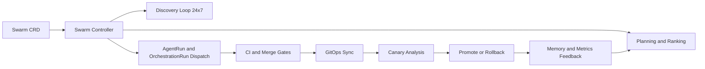

# Swarm Intelligence: Single-CRD 24/7 Autonomous Delivery

Status: Proposed (2026-03-01)

Docs index: [README](../README.md)

## Objective

Provide one always-on swarm control object that continuously discovers work, implements changes, and delivers to
production with machine-only gates when configured for lights-out mode across any chart installation.

## Decision

V1 CRD catalog for swarm control is one resource: `Swarm`.

V1 represents need backlog, owner profile details, and mission tracking as storage-backed runtime records managed by
the Swarm controller.

Reuse existing primitives for execution and policy:

- `AgentRun`, `Orchestration`, `OrchestrationRun`
- `Schedule`, `Signal`
- `Budget`, `ApprovalPolicy`
- `Memory`

Keep high-churn state in runtime storage:

- Ranked need backlog
- Pheromone/confidence traces
- Temporary planner artifacts

These live in Postgres/memory storage.

## Why One CRD Is Enough

- One durable intent object is enough for 24/7 operation: objectives + cadence + autonomy mode + delivery policy.
- Existing controllers already execute workloads and enforce policy; Swarm should orchestrate, not duplicate.
- CRDs are poor for high-frequency ranking updates; DB storage is safer and cheaper operationally.

## Portability

`Swarm` is mission-generic and platform-generic:

- Works for any domain that can express discovery sources, objectives, execution targets, and policy gates.
- Installs with the chart as a reusable primitive for all tenants/users.
- Profile examples in this document are illustrative defaults, not schema constraints.

## Generic Core, Specific Application

The `Swarm` CRD schema is generic and reusable. Runtime behavior becomes specific through instance configuration.

Initial rollout uses two concrete Swarm instances:

- `jangar-control-plane`: agents continuously discover platform work, build new internal constructs for themselves, and
  expand system capabilities with autonomous delivery gates.
- `torghut-quant`: agents continuously discover market/research/ops work and run autonomous quant LLM trading
  improvements under stricter risk and freeze policies.

Each instance uses the same CRD fields with different domain objectives, cadences, risk thresholds, and deployment
targets.

## Internet-Backed Basis

As of 2026-03-01:

- [Argo CD Automated Sync](https://argo-cd.readthedocs.io/en/stable/user-guide/auto_sync/) supports automated sync,
  optional prune, and self-heal.
- [Argo Rollouts Analysis](https://argoproj.github.io/argo-rollouts/features/analysis/) supports canary gating with
  automatic abort/pause.
- [GitHub protected branches](https://docs.github.com/en/repositories/configuring-branches-and-merges-in-your-repository/managing-protected-branches/about-protected-branches)
  and [auto-merge](https://docs.github.com/en/pull-requests/collaborating-with-pull-requests/incorporating-changes-from-a-pull-request/automatically-merging-a-pull-request)
  support no-human merge when checks pass.
- [Kyverno verifyImages](https://kyverno.io/docs/policy-types/cluster-policy/verify-images/overview/) and
  [SLSA requirements](https://slsa.dev/spec/v1.1/requirements) enable enforceable provenance.
- Agent benchmarks such as [SWE-bench](https://arxiv.org/abs/2310.06770) and
  [SWE-agent](https://arxiv.org/abs/2405.15793) show non-trivial failure rates, so autonomous loops require retries,
  rollback, and freeze logic.

## Swarm CRD Contract (v1)

Group/version/kind:

- `swarm.proompteng.ai/v1alpha1`
- `kind: Swarm`

### `spec` (required fields)

- `owner.id`: stable owner identity for accountability and routing.
- `owner.channel`: primary conversation channel.
- `domains[]`: mission domains (for example `platform-reliability`, `quant-strategy`, `docs-automation`).
- `objectives[]`: outcome statements (not task lists).
- `mode`: `assisted` or `lights-out`.
- `cadence.discoverEvery`: duration, default `5m`.
- `cadence.planEvery`: duration, default `10m`.
- `cadence.implementEvery`: duration, default `10m`.
- `cadence.verifyEvery`: duration, default `5m`.
- `discovery.sources[]`: source refs (internet + internal signals).
- `discovery.minCitations`: integer, default `2`.
- `discovery.minConfidence`: float, default `0.75`.
- `delivery.repoAllowlist[]`: allowed repos for autonomous changes.
- `delivery.requiredChecks[]`: CI checks that must pass.
- `delivery.mergePolicy`: `auto-merge` or `merge-queue`.
- `delivery.deploymentTargets[]`: deployment identifiers (for GitOps installs, these are Argo CD application names).
- `delivery.rollout.strategy`: `canary`.
- `delivery.rollout.steps[]`: percent + pause (for example `10/30/100`).
- `delivery.rollout.analysisTemplateRef`: Argo Rollouts analysis template.
- `risk.budgetRef`: `Budget` object name.
- `risk.approvalPolicyRef`: `ApprovalPolicy` object name.
- `risk.freezeAfterFailures`: integer consecutive mission failures, default `3`.
- `risk.freezeDuration`: duration, default `60m`.

### `status`

- `phase`: `Idle | Discovering | Planning | Implementing | Verifying | Frozen | Degraded`.
- `conditions[]`: Kubernetes-standard condition list.
- `observedGeneration`, `updatedAt`.
- `lastDiscoverAt`, `lastPlanAt`, `lastImplementAt`, `lastVerifyAt`.
- `activeMissions`, `queuedNeeds`.
- `discoveries24h`, `missions24h`, `autonomousSuccessRate24h`.
- `lastProductionChangeRef` (commit SHA / PR / rollout).
- `freeze.reason`, `freeze.until`.

## Swarm Controller Ownership

Swarm controller owns:

- Parsing and validating Swarm policy.
- Running cadence loops.
- Need ranking, selection, and mission dispatch.
- Deciding assisted vs lights-out execution path.
- Freeze/unfreeze state transitions.
- Status and accountability reporting.

Swarm controller does not own:

- `AgentRun` execution semantics (existing controller).
- Orchestration step semantics (existing controller).
- CI provider logic (GitHub/CI systems).
- Cluster rollout internals (Argo CD / Argo Rollouts).

## 24/7 Loop Contract

1. Discover: ingest internet + internal signals continuously.
2. Normalize: deduplicate and score with provenance.
3. Select: choose highest-value need under budget/risk policy.
4. Implement: launch orchestration and code agent runs.
5. Verify: run CI and autonomous fix retries.
6. Deliver: merge and sync via GitOps.
7. Protect: canary analysis decides promote vs rollback.
8. Learn: persist outcomes to memory and adjust ranking weights.

## Assisted vs Lights-Out

Assisted mode:

- R0/R1 auto-execute.
- R2/R3 require explicit approval per `ApprovalPolicy`.

Lights-out mode:

- R0/R1/R2 auto-execute if all gates pass.
- R3 allowed only for allowlisted repos/services and stricter rollout thresholds.
- Any gate failure blocks promotion and triggers remediation mission.

## Machine Gates (No Human in Lights-Out)

Gate 1: Discovery quality

- Minimum citations and confidence.
- Reject uncited or low-confidence external claims.

Gate 2: Code quality

- Required checks pass.
- Deterministic test matrix must be green.

Gate 3: Merge policy

- Protected branch requirements satisfied.
- Merge queue or auto-merge policy satisfied.

Gate 4: Supply chain

- Artifact signature and provenance verification passes.

Gate 5: Progressive rollout

- Canary analysis passes at each step.
- Abort/rollback on threshold violation.

Gate 6: Post-deploy/post-actuation SLO

- If SLO or risk thresholds regress, rollback and freeze mission class.

## Example Mission Profiles (Instance Overlays)

### Profile A: Jangar Control Plane Self-Construction

Default cadence:

- discover: `5m`
- plan: `10m`
- implement: `10m`
- verify: `5m`

Default delivery thresholds:

- Canary error-rate increase must stay < `20%` vs baseline.
- p95 latency increase must stay < `15%` vs baseline.
- Two consecutive failed canary checks trigger rollback.

### Profile B: Torghut Quant LLM Autonomous Trading

Default cadence:

- discover: `1m`
- plan: `5m`
- implement: `15m` for code/policy changes
- verify: `1m` for risk-health checks

Default risk thresholds (lights-out):

- Intraday drawdown breach at `-1.5%` triggers immediate freeze.
- Consecutive policy violations >= `1` triggers freeze.
- Consecutive failed autonomous missions >= `2` triggers freeze.
- Freeze requires explicit resume policy window.

## Torghut Regime-Change Flexibility Contract (Internet-Backed)

As of 2026-03-01, regime adaptability in `torghut-quant` should follow these source-backed constraints:

- Use regime-switching inference for discrete state changes, not a single stationary model
  ([Hamilton 1989](https://EconPapers.repec.org/RePEc:ecm:emetrp:v:57:y:1989:i:2:p:357-84)).
- Treat long-memory signatures and regime shifts as separable hypotheses before allocation decisions
  ([Diebold and Inoue 2001](https://EconPapers.repec.org/RePEc:eee:econom:v:105:y:2001:i:1:p:131-159)).
- Combine explicit changepoint detection with drift adaptation rather than periodic blind retraining
  ([Adams and MacKay 2007](https://arxiv.org/abs/0710.3742),
  [Bifet and Gavaldà 2007](https://doi.org/10.1137/1.9781611972771.42),
  [Lu et al. 2020](https://arxiv.org/abs/2004.05785)).
- Keep autonomous actuation under hard pre-trade and emergency stop controls
  ([17 CFR 240.15c3-5](https://www.law.cornell.edu/cfr/text/17/240.15c3-5),
  [MiFID II Article 17](https://eur-lex.europa.eu/legal-content/EN/TXT/HTML/?uri=CELEX%3A32014L0065),
  [Commission Delegated Regulation (EU) 2017/589](https://eur-lex.europa.eu/legal-content/EN/TXT/?uri=CELEX%3A32017R0589)).
- Validate strategy selection against data-snooping risk before promotion
  ([White 2000](https://EconPapers.repec.org/RePEc:ecm:emetrp:v:68:y:2000:i:5:p:1097-1126)).

### Torghut runtime contract (no extra CRDs)

Regime state remains in runtime storage (not CRD fields), versioned per delivery cycle:

- `regime.id`: trend / mean-revert / high-vol / stressed-liquidity / uncertain.
- `regime.posterior`: probability vector over regimes.
- `regime.changepointScore`: online changepoint posterior.
- `regime.driftScore`: detector ensemble alarm score.
- `regime.updatedAt`, `regime.minDwellUntil`.

### Detection and transition policy

- Detector ensemble:
  - Markov-switching posterior.
  - Bayesian online changepoint detector.
  - ADWIN-style adaptive window drift alarm.
  - Market microstructure checks (spread, depth, impact, realized volatility percentile).
- Transition hysteresis:
  - Candidate regime requires persistent confirmation windows.
  - Promotion to active regime requires both posterior and changepoint thresholds.
  - Reversion requires sustained evidence, not one-tick reversal.
- Uncertain regime fallback:
  - When detector disagreement is high, force defensive profile and reduce exposure.

### Allocation and implementation policy

- Portfolio-of-experts routing:
  - Each strategy/expert declares supported regimes.
  - Capital weights are regime-conditioned and capped by per-expert risk budgets.
- Capital rollout for new policy in active regime:
  - shadow -> 1% notional -> 5% -> 20% -> full target only after gated verification.
- Automatic de-allocation:
  - Remove weight from experts that underperform regime-specific baselines after costs/slippage.

### Verification and freeze policy

- Verify loop must enforce regime-specific limits:
  - max drawdown by regime
  - exposure and concentration caps
  - slippage/impact bounds
  - order reject/error rate thresholds
- Freeze conditions:
  - breach of hard risk limits
  - repeated failed implementations
  - repeated verify-gate failures during promotion
- Resume policy:
  - freeze window expiry and successful re-qualification in shadow/canary stages.

## Failure Semantics

- CI failure: autonomous retries up to `N=3`, then `Degraded`.
- Rollout failure: immediate rollback + remediation mission.
- Repeated class failure: freeze class for `freezeDuration`.
- Discovery feed outage: continue with degraded confidence; block high-risk missions.
- Budget breach: block mission dispatch and emit condition.

## Validation Plan (Required Before Production)

1. Contract tests: CRD schema + defaulting + validation.
2. Reconcile tests: phase transitions, freeze logic, retry budget handling.
3. Failure injection drills:
   - CI red loop
   - Canary fail
   - Argo sync drift
   - Discovery source outage
4. Shadow mode run for 7 days:
   - Assisted-only recommendations
   - No production writes
   - Compare predicted vs accepted outcomes
5. Limited lights-out canary:
   - One low-risk repo/service per swarm instance
   - Tight rollback thresholds
   - Daily review of mission traces

## Example Swarm Object (Generic Template)

```yaml
apiVersion: swarm.proompteng.ai/v1alpha1
kind: Swarm
metadata:
  name: swarm-24x7
  namespace: agents
spec:
  owner:
    id: platform-owner
    channel: swarm://owner/platform
  domains:
    - platform-reliability
    - autonomous-strategy
  objectives:
    - continuously improve reliability and operational quality for managed services
    - continuously improve risk-adjusted outcomes under strict policy limits
  mode: lights-out
  cadence:
    discoverEvery: 1m
    planEvery: 5m
    implementEvery: 10m
    verifyEvery: 1m
  discovery:
    minCitations: 2
    minConfidence: 0.75
    sources:
      - name: github-issues
      - name: runtime-alerts
      - name: external-risk-feed
  delivery:
    repoAllowlist:
      - proompteng/lab
    requiredChecks:
      - lint
      - unit-tests
      - type-check
    mergePolicy: merge-queue
    deploymentTargets:
      - core-platform
      - strategy-runtime
    rollout:
      strategy: canary
      steps:
        - setWeight: 10
          pause: 5m
        - setWeight: 30
          pause: 10m
        - setWeight: 100
          pause: 0m
      analysisTemplateRef: default-canary-analysis
  risk:
    budgetRef: default-budget
    approvalPolicyRef: default-approval
    freezeAfterFailures: 3
    freezeDuration: 60m
```

## Initial Instance Manifests (Specific Application)

### Instance 1: Jangar Control Plane

```yaml
apiVersion: swarm.proompteng.ai/v1alpha1
kind: Swarm
metadata:
  name: jangar-control-plane
  namespace: agents
spec:
  owner:
    id: platform-owner
    channel: swarm://owner/platform
  domains:
    - platform-reliability
    - platform-evolution
  objectives:
    - continuously discover and implement control-plane improvements
    - autonomously construct and expand internal platform capabilities
  mode: lights-out
  cadence:
    discoverEvery: 5m
    planEvery: 10m
    implementEvery: 10m
    verifyEvery: 5m
  delivery:
    deploymentTargets:
      - agents
```

### Instance 2: Torghut Quant LLM Autonomous Trading

```yaml
apiVersion: swarm.proompteng.ai/v1alpha1
kind: Swarm
metadata:
  name: torghut-quant
  namespace: agents
spec:
  owner:
    id: trading-owner
    channel: swarm://owner/trading
  domains:
    - quant-research
    - autonomous-trading
  objectives:
    - continuously discover and implement alpha/risk improvements
    - optimize risk-adjusted outcomes under strict drawdown policy
  mode: lights-out
  cadence:
    discoverEvery: 1m
    planEvery: 5m
    implementEvery: 15m
    verifyEvery: 1m
  delivery:
    deploymentTargets:
      - torghut
  risk:
    freezeAfterFailures: 2
```

## Non-Goals

- Replacing existing AgentRun/Orchestration controllers.
- Storing high-frequency ranked backlog state in CRDs.
- Allowing unrestricted autonomous writes across all repos/services on day one.

## Open Questions

- Should lights-out mode require per-domain approval?
- Should freeze recovery be time-based only, or require explicit policy reset token?
- Do we need one Swarm per domain, or one composite Swarm with weighted objectives?

## References

- Argo CD Automated Sync: [https://argo-cd.readthedocs.io/en/stable/user-guide/auto_sync/](https://argo-cd.readthedocs.io/en/stable/user-guide/auto_sync/)
- Argo Rollouts Canary: [https://argoproj.github.io/argo-rollouts/features/canary/](https://argoproj.github.io/argo-rollouts/features/canary/)
- Argo Rollouts Analysis: [https://argoproj.github.io/argo-rollouts/features/analysis/](https://argoproj.github.io/argo-rollouts/features/analysis/)
- GitHub protected branches: [https://docs.github.com/en/repositories/configuring-branches-and-merges-in-your-repository/managing-protected-branches/about-protected-branches](https://docs.github.com/en/repositories/configuring-branches-and-merges-in-your-repository/managing-protected-branches/about-protected-branches)
- GitHub auto-merge: [https://docs.github.com/en/pull-requests/collaborating-with-pull-requests/incorporating-changes-from-a-pull-request/automatically-merging-a-pull-request](https://docs.github.com/en/pull-requests/collaborating-with-pull-requests/incorporating-changes-from-a-pull-request/automatically-merging-a-pull-request)
- Kyverno verifyImages: [https://kyverno.io/docs/policy-types/cluster-policy/verify-images/overview/](https://kyverno.io/docs/policy-types/cluster-policy/verify-images/overview/)
- SLSA requirements: [https://slsa.dev/spec/v1.1/requirements](https://slsa.dev/spec/v1.1/requirements)
- SWE-bench: [https://arxiv.org/abs/2310.06770](https://arxiv.org/abs/2310.06770)
- SWE-agent: [https://arxiv.org/abs/2405.15793](https://arxiv.org/abs/2405.15793)
- Anthropic effective agents: [https://www.anthropic.com/engineering/building-effective-agents](https://www.anthropic.com/engineering/building-effective-agents)
- OpenAI deep research: [https://openai.com/index/introducing-deep-research/](https://openai.com/index/introducing-deep-research/)
- Hamilton (1989), Markov regime switching: [https://EconPapers.repec.org/RePEc:ecm:emetrp:v:57:y:1989:i:2:p:357-84](https://EconPapers.repec.org/RePEc:ecm:emetrp:v:57:y:1989:i:2:p:357-84)
- Adams and MacKay (2007), Bayesian online changepoint detection: [https://arxiv.org/abs/0710.3742](https://arxiv.org/abs/0710.3742)
- Bifet and Gavaldà (2007), ADWIN: [https://doi.org/10.1137/1.9781611972771.42](https://doi.org/10.1137/1.9781611972771.42)
- Gama et al. (2014), concept drift adaptation survey: [https://doi.org/10.1145/2523813](https://doi.org/10.1145/2523813)
- Lu et al. (2020), learning under concept drift review: [https://arxiv.org/abs/2004.05785](https://arxiv.org/abs/2004.05785)
- Diebold and Inoue (2001), long memory vs regime switching: [https://EconPapers.repec.org/RePEc:eee:econom:v:105:y:2001:i:1:p:131-159](https://EconPapers.repec.org/RePEc:eee:econom:v:105:y:2001:i:1:p:131-159)
- White (2000), reality check for data snooping: [https://EconPapers.repec.org/RePEc:ecm:emetrp:v:68:y:2000:i:5:p:1097-1126](https://EconPapers.repec.org/RePEc:ecm:emetrp:v:68:y:2000:i:5:p:1097-1126)
- SEC market-access risk controls (17 CFR 240.15c3-5): [https://www.law.cornell.edu/cfr/text/17/240.15c3-5](https://www.law.cornell.edu/cfr/text/17/240.15c3-5)
- MiFID II Article 17 algorithmic trading: [https://eur-lex.europa.eu/legal-content/EN/TXT/HTML/?uri=CELEX%3A32014L0065](https://eur-lex.europa.eu/legal-content/EN/TXT/HTML/?uri=CELEX%3A32014L0065)
- Commission Delegated Regulation (EU) 2017/589 (RTS 6): [https://eur-lex.europa.eu/legal-content/EN/TXT/?uri=CELEX%3A32017R0589](https://eur-lex.europa.eu/legal-content/EN/TXT/?uri=CELEX%3A32017R0589)
- NIST AI Risk Management Framework: [https://www.nist.gov/itl/ai-risk-management-framework](https://www.nist.gov/itl/ai-risk-management-framework)

## Diagram


