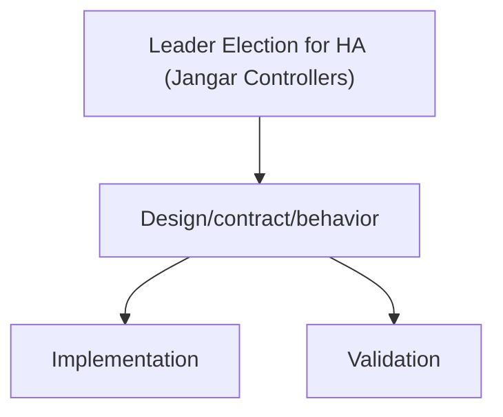

# Leader Election for HA (Jangar Controllers)

Status: Implemented (2026-02-08)

Docs index: [README](../README.md)

## Purpose

Define how Jangar controllers use Kubernetes leader election to support safe horizontal scaling, prevent double
reconciliation, and provide predictable failover behavior.

## Current State

- Code: Leader election is implemented in `services/jangar/src/server/leader-election.ts` and wired into
  `services/jangar/src/server/agent-comms-runtime.ts`.
- Code: Lease operations are performed via `kubectl get/create/replace lease` for Bun compatibility.
- Chart: `controller.leaderElection.*` is present in `charts/agents/values.yaml` and wired into both deployments.
- Cluster: GitOps desired state can scale `agents-controllers` independently via `controllers.replicaCount`.
- Readiness: `/ready` exists and reports controller health (not leadership); mutation endpoints are leader-gated.

## Design Summary

- Use a single Kubernetes Lease to elect one leader across all controller loops running in the Jangar process.
- Only the leader runs reconciliation loops and accepts mutating requests (webhooks, gRPC mutation endpoints).
- Non-leaders stay alive and serve read-only endpoints while remaining ready; mutation endpoints return retryable
  errors and controller loops are stopped on leadership loss.

## Lease Details

- Resource: `coordination.k8s.io/v1` Lease in the controller namespace.
- Default lease name: `jangar-controller-leader`.
- Owner identity: `<pod-name>_<uid>`.
- Timing defaults: `leaseDurationSeconds=30`, `renewDeadlineSeconds=20`, `retryPeriodSeconds=5`.

## Controller Gating

- Gate `startAgentsController`, `startOrchestrationController`, `startSupportingPrimitivesController`, and
  `startPrimitivesReconciler` behind the leader election guard.
- On leadership loss, stop watches and reconcile loops cleanly before returning not-ready.

## Traffic and Readiness

- Readiness probe reports process/controller health, not leadership.
- Non-leader behavior:
  - HTTP mutation endpoints return `503` with `Retry-After`.
  - gRPC mutation methods return `Unavailable` with a retry hint.
  - Read-only status endpoints remain available.

## Configuration

Add a new `controller.leaderElection` section to `charts/agents/values.yaml`:

- `enabled` (default `true`)
- `leaseName` (default `jangar-controller-leader`)
- `leaseNamespace` (default release namespace)
- `leaseDurationSeconds` (default `30`)
- `renewDeadlineSeconds` (default `20`)
- `retryPeriodSeconds` (default `5`)

Map values into env vars consumed by the controller runtime, for example:

- `JANGAR_LEADER_ELECTION_ENABLED`
- `JANGAR_LEADER_ELECTION_LEASE_NAME`
- `JANGAR_LEADER_ELECTION_LEASE_NAMESPACE`
- `JANGAR_LEADER_ELECTION_LEASE_DURATION_SECONDS`
- `JANGAR_LEADER_ELECTION_RENEW_DEADLINE_SECONDS`
- `JANGAR_LEADER_ELECTION_RETRY_PERIOD_SECONDS`

## Failure Modes and Recovery

- Leader crash: a standby replica should acquire the lease within one lease duration.
- Network partition: if the leader cannot renew before `renewDeadlineSeconds`, it must stop reconciling and become
  not-ready so a new leader can take over.
- Split brain: rely on Lease semantics; controllers must stop all reconcile loops on leadership loss.

## Observability

- Log leadership acquisition/loss with lease name and namespace.
- Add metrics:
  - `jangar_leader_elected` (gauge, 1 for leader, 0 for follower)
  - `jangar_leader_changes_total` (counter)
- Extend `services/jangar/src/server/control-plane-status.ts` to report leader status.

## Rollout Plan

- Add leader election implementation and env wiring behind a feature flag.
- Deploy with `replicaCount=2` in a non-prod namespace and confirm only one pod is ready.
- Enable the feature flag in production and increase replicas.

## Validation

- Kill the leader pod and verify another pod becomes leader within 30 seconds.
- Confirm webhooks and gRPC mutation calls are rejected by non-leaders.
- Confirm read-only endpoints remain available during leadership transitions.

## Operational Considerations

- Keep configuration in the appropriate control plane (Helm values, CI, or code) and document overrides.
- Update runbooks with enable/disable steps, rollback guidance, and expected failure modes.

## Risks and Mitigations

- Misconfiguration can cause deployment or runtime regressions; mitigate with schema validation and safe defaults.
- Additional load or latency can impact controller throughput or CI runtime; mitigate with caps and monitoring.

## Handoff Appendix (Repo + Chart + Cluster)

### Source of truth

- Helm chart: `charts/agents` (`Chart.yaml`, `values.yaml`, `values.schema.json`, `templates/`, `crds/`)
- GitOps application (desired state): `argocd/applications/agents/application.yaml`, `argocd/applications/agents/kustomization.yaml`, `argocd/applications/agents/values.yaml`
- Product appset enablement: `argocd/applicationsets/product.yaml`
- CRD Go types and codegen: `services/jangar/api/agents/v1alpha1/types.go`, `scripts/agents/validate-agents.sh`
- Control plane + controllers code:
  - Server entrypoints: `services/jangar/src/server/index.ts`, `services/jangar/src/server/app.ts`
  - Agents/AgentRuns controller: `services/jangar/src/server/agents-controller.ts`
  - Orchestrations: `services/jangar/src/server/orchestration-controller.ts`, `services/jangar/src/server/orchestration-submit.ts`
  - Supporting primitives: `services/jangar/src/server/supporting-primitives-controller.ts`
  - Policy checks (budgets/approval/etc): `services/jangar/src/server/primitives-policy.ts`
- Codex runners (when applicable): `services/jangar/scripts/codex/codex-implement.ts`, `packages/codex/src/runner.ts`
- Argo WorkflowTemplates used by Codex (when applicable): `argocd/applications/froussard/*.yaml` (typically in namespace `jangar`)

### Current cluster state (GitOps desired + live API server)

As of 2026-02-08 (repo `main`):

- Kubernetes API server (live): `v1.35.0+k3s1` (from `kubectl get --raw /version`).
- Argo CD app: `agents` deploys Helm chart `charts/agents` (release `agents`) into namespace `agents` with `includeCRDs: true`. See `argocd/applications/agents/kustomization.yaml`.
- Chart version pinned by GitOps: `0.9.1`. See `argocd/applications/agents/kustomization.yaml`.
- Images pinned by GitOps (see `argocd/applications/agents/values.yaml`):
  - Control plane (`Deployment/agents`): `registry.ide-newton.ts.net/lab/jangar-control-plane:a5afbc7f@sha256:34822aa0b93f57630260aee28659abdbf154ae6706bc6f6d86f08efce5ee4e5b`
  - Controllers (`Deployment/agents-controllers`): `registry.ide-newton.ts.net/lab/jangar:3671d447@sha256:515e03dfe27dd186cf5fcaebbb1eb9bcc773f1236bc89fc523eb0134b9e9794b`
- Control plane replicas: `replicaCount: 1` (root key in `argocd/applications/agents/values.yaml`).
- Controllers replicas: `controllers.replicaCount: 2` (in `argocd/applications/agents/values.yaml`).
- Namespaced reconciliation: `controller.namespaces: [agents]` and `rbac.clusterScoped: false`. See `argocd/applications/agents/values.yaml`.
- Database connectivity: `database.secretRef.name: jangar-db-app` / `key: uri`. See `argocd/applications/agents/values.yaml`.
- gRPC enabled: `grpc.enabled: true` on port `50051`. See `argocd/applications/agents/values.yaml`.
- Repo allowlist: `env.vars.JANGAR_GITHUB_REPOS_ALLOWED: proompteng/lab`. See `argocd/applications/agents/values.yaml`.
- Runner auth (GitHub token): `envFromSecretRefs: [agents-github-token-env]`. See `argocd/applications/agents/values.yaml`.

Note: This repo’s GitOps manifests are the desired state. Live verification requires a kubectl context/SA with list/get access in `agents` (and cluster-scoped access for CRDs).

To verify live cluster state (requires sufficient RBAC), run:

```bash
kubectl version --short
kubectl get --raw /version

kubectl -n agents auth can-i list deploy
kubectl -n agents get deploy
kubectl -n agents get pods

kubectl get application -n argocd agents
kubectl get crd | rg 'proompteng\.ai'

kubectl rollout status -n agents deploy/agents
kubectl rollout status -n agents deploy/agents-controllers
```

### Values → env var mapping (chart)

Rendered primarily by `charts/agents/templates/deployment.yaml` (control plane) and `charts/agents/templates/deployment-controllers.yaml` (controllers).

Env var merge/precedence (see also `docs/agents/designs/chart-env-vars-merge-precedence.md`):

- Control plane: `.Values.env.vars` merged with `.Values.controlPlane.env.vars` (control-plane keys win).
- Controllers: `.Values.env.vars` merged with `.Values.controllers.env.vars` (controllers keys win), plus template defaults for `JANGAR_MIGRATIONS`, `JANGAR_GRPC_ENABLED`, and `JANGAR_CONTROL_PLANE_CACHE_ENABLED` when unset.

Common mappings:

- `controller.namespaces` → `JANGAR_AGENTS_CONTROLLER_NAMESPACES` (and also `JANGAR_PRIMITIVES_NAMESPACES`)
- `controller.concurrency.*` → `JANGAR_AGENTS_CONTROLLER_CONCURRENCY_{NAMESPACE,AGENT,CLUSTER}`
- `controller.queue.*` → `JANGAR_AGENTS_CONTROLLER_QUEUE_{NAMESPACE,REPO,CLUSTER}`
- `controller.rate.*` → `JANGAR_AGENTS_CONTROLLER_RATE_{WINDOW_SECONDS,NAMESPACE,REPO,CLUSTER}`
- `controller.agentRunRetentionSeconds` → `JANGAR_AGENTS_CONTROLLER_AGENTRUN_RETENTION_SECONDS`
- `controller.admissionPolicy.*` → `JANGAR_AGENTS_CONTROLLER_{LABELS_REQUIRED,LABELS_ALLOWED,LABELS_DENIED,IMAGES_ALLOWED,IMAGES_DENIED,BLOCKED_SECRETS}`
- `controller.vcsProviders.*` → `JANGAR_AGENTS_CONTROLLER_VCS_{PROVIDERS_ENABLED,DEPRECATED_TOKEN_TYPES,PR_RATE_LIMITS}`
- `controller.authSecret.*` → `JANGAR_AGENTS_CONTROLLER_AUTH_SECRET_{NAME,KEY,MOUNT_PATH}`
- `orchestrationController.*` → `JANGAR_ORCHESTRATION_CONTROLLER_{ENABLED,NAMESPACES}`
- `supportingController.*` → `JANGAR_SUPPORTING_CONTROLLER_{ENABLED,NAMESPACES}`
- `grpc.*` → `JANGAR_GRPC_{ENABLED,HOST,PORT}` (unless overridden via `env.vars`)
- `controller.jobTtlSecondsAfterFinished` → `JANGAR_AGENT_RUNNER_JOB_TTL_SECONDS`
- `runtime.*` → `JANGAR_{AGENT_RUNNER_IMAGE,AGENT_IMAGE,SCHEDULE_RUNNER_IMAGE,SCHEDULE_SERVICE_ACCOUNT}` (unless overridden via `env.vars`)
- `controller.leaderElection.*` → `JANGAR_LEADER_ELECTION_{ENABLED,LEASE_NAME,LEASE_NAMESPACE,LEASE_DURATION_SECONDS,RENEW_DEADLINE_SECONDS,RETRY_PERIOD_SECONDS}`

### Rollout plan (GitOps)

1. Update code + chart + CRDs in one PR when changing APIs:
   - Go types (`services/jangar/api/agents/v1alpha1/types.go`) → regenerate CRDs → `charts/agents/crds/`.
2. Validate locally:
   - `scripts/agents/validate-agents.sh`
   - `scripts/argo-lint.sh`
   - `scripts/kubeconform.sh argocd`
   - Render the app: `mise exec helm@3 -- kustomize build --enable-helm argocd/applications/agents > /tmp/agents.yaml`
3. Update the GitOps overlay if rollout requires new values:
   - `argocd/applications/agents/values.yaml`
4. Merge to `main`; Argo CD reconciles the `agents` application.

### Validation (smoke)

- Render the full install (Helm via kustomize): `mise exec helm@3 -- kustomize build --enable-helm argocd/applications/agents > /tmp/agents.yaml`
- Schema + example validation: `scripts/agents/validate-agents.sh`
- In-cluster (requires sufficient RBAC):
  - `kubectl -n agents get pods`
  - `kubectl -n agents logs deploy/agents-controllers --tail=200`
  - Apply a minimal `Agent`/`AgentRun` from `charts/agents/examples` and confirm it reaches `Succeeded`.

## Diagram


