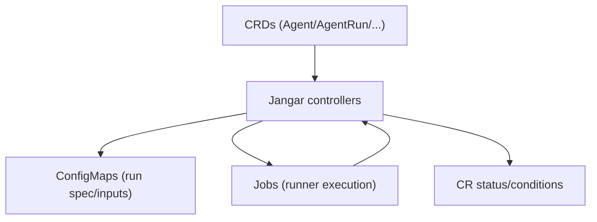

# Jangar Controller Design

Status: Current (2026-01-19)

Docs index: [README](README.md)

## Purpose

Jangar is the control plane and controller for the Agents CRDs. It reconciles AgentRun, ImplementationSpec, ImplementationSource, Memory, and AgentProvider resources and drives execution via runtime adapters.

## Scope

- Watch and reconcile Agents CRDs in configured namespaces.
- Event-driven only (watch + webhook triggers); no periodic polling/resync loops.
- Normalize incoming work (GitHub + Linear) into ImplementationSpec objects.
- Resolve Agent + Provider + ImplementationSpec into an execution plan.
- Dispatch runs via runtime adapters and keep status up to date.

Non-goals:

- Managing cluster ingress or database lifecycle.
- Defining provider-specific integration schemas beyond the ImplementationSource abstraction.

## Control Plane Architecture

- Controller manager with leader election.
- Reconcilers per CRD.
- Runtime adapter layer (workflow/job, temporal, custom) behind a common interface.
- Integration layer (GitHub + Linear) that maps external issues to ImplementationSpec.
- Storage abstraction via Memory CRD.

## Reconciliation Overview

### AgentRun

Inputs:

- `spec.agentRef`
- `spec.implementationSpecRef` or `spec.implementation.inline`
- `spec.runtime`
- `spec.workload`
- `spec.memoryRef` (optional override)
- `spec.parameters`, `spec.secrets` (secrets are exposed via `envFrom` in job/workflow pods)

Steps:

1. Validate required fields and access policy.
2. Fetch Agent and AgentProvider.
3. Resolve ImplementationSpec (or inline payload).
4. Build the agent-runner spec (render templates, resolve secrets).
5. Select runtime adapter from `spec.runtime` and submit workload.
6. Persist runtime identifiers and update status conditions.
7. Reconcile runtime status to completion; emit artifacts if provided.

Status:

- `status.phase`: Pending | Running | Succeeded | Failed | Cancelled
- `status.runtimeRef`: opaque runtime identifier(s)
- `status.startedAt`, `status.finishedAt`
- `status.conditions`: Accepted, InvalidSpec, InProgress, Succeeded, Failed

### ImplementationSpec

Inputs:

- `spec.source` (optional)
- `spec.text` (required for plaintext)

Steps:

1. Validate size limits and schema.
2. Normalize text and summary fields.
3. If sourced, ensure provenance metadata is consistent.

Status:

- `status.syncedAt`
- `status.sourceVersion`
- `status.conditions`: Ready, InvalidSpec, Stale

### ImplementationSource

Inputs:

- Provider config for GitHub or Linear.

Steps:

1. Validate provider + auth secret + webhook enabled (webhook-only, no polling).
2. Normalize external issue payload into ImplementationSpec.
3. Create or update ImplementationSpec objects.
4. Record last webhook sync and errors in status.

Status:

- `status.lastSyncedAt`
- `status.conditions`: Ready, InvalidSpec, Unreachable, WebhookDisabled

### Memory

Inputs:

- `spec.type`
- `spec.connection.secretRef`

Steps:

1. Validate secret reference exists.
2. Record capabilities and connection health.

Status:

- `status.conditions`: Ready, InvalidSpec, Unreachable

## Runtime Adapter Interface

Runtime adapters implement a common contract:

- `Submit(runSpec) -> runtimeRef`
- `GetStatus(runtimeRef) -> phase, timestamps, artifacts`
- `Cancel(runtimeRef) -> void`

Adapters should be idempotent and tolerate retries.

Runtime adapter responsibilities:

- Map `spec.runtime` to adapter-specific request payloads.
- Surface adapter errors as normalized reasons (e.g., `SubmitFailed`, `NotFound`, `Timeout`).
- Provide stable `runtimeRef` values for reconciliation.

Adapter config keys (minimum):

- `workflow` (built-in job runner): `serviceAccount`, `ttlSecondsAfterFinished`
- `temporal`: `taskQueue` (required), `workflowType` (required), `namespace`, `workflowId`, `timeouts`
- `job`: single-job runtime with `serviceAccount`, `ttlSecondsAfterFinished`
- `custom`: `endpoint`, `payload`

## Agent Provider Rendering

AgentProvider defines how to invoke `/usr/local/bin/agent-runner`:

- Render `argsTemplate` and `envTemplate` against resolved AgentRun + ImplementationSpec data.
- Materialize `inputFiles` into the runtime workspace.
- Collect `outputArtifacts` paths.

Agent-runner spec (contract):

```json
{
  "agentRun": {
    "name": "codex-run-abc",
    "uid": "uuid",
    "namespace": "agents"
  },
  "implementation": {
    "text": "...",
    "summary": "...",
    "acceptanceCriteria": ["..."]
  },
  "parameters": {
    "key": "value"
  },
  "memory": {
    "type": "postgres",
    "connectionRef": "secret/name"
  },
  "artifacts": [{ "name": "agent-log", "path": "/workspace/agent.log" }]
}
```

## Integration Mapping Rules

### GitHub Issues -> ImplementationSpec

- `title` -> `spec.summary`
- `body` -> `spec.text` (truncate to 128KB)
- `labels` -> `spec.labels`
- `html_url` -> `spec.source.url`
- `number` -> `spec.source.externalId` (format: `owner/repo#number`)
- `updated_at` -> `status.sourceVersion`

### Linear Issues -> ImplementationSpec

- `title` -> `spec.summary`
- `description` -> `spec.text` (truncate to 128KB)
- `labels` -> `spec.labels`
- `url` -> `spec.source.url`
- `identifier` -> `spec.source.externalId` (format: `LIN-123`)
- `updatedAt` -> `status.sourceVersion`

Rate limits and backoff:

- Respect provider rate-limit headers when present.
- Exponential backoff: base 5s, max 5m, jitter 20%.

## Validation and Schema Constraints

- Use OpenAPI schema for required fields and types.
- Mark flexible dictionaries with `x-kubernetes-preserve-unknown-fields` or `additionalProperties`.
- Enforce size limits on ImplementationSpec text to avoid etcd/API size errors.

## Concurrency and Safety

- Leader election to prevent duplicate reconciliation.
- Finalizers on AgentRun to ensure runtime cleanup.
- Reconcile is idempotent; retries do not duplicate runs.
- Use per-run de-duplication keys (`spec.idempotencyKey` if set, else `metadata.uid`).
- Default concurrency limits (configurable):
  - 10 in-flight AgentRuns per namespace.
  - 5 in-flight AgentRuns per Agent.
  - 100 in-flight AgentRuns cluster-wide.

## Observability

- Structured logs with `agentRun.uid` and `implementationSpec.uid`.
- Metrics: reconcile duration, submit latency, success/failure counts by runtime/provider.
- Kubernetes Events for submit/start/finish/failure.
- Agent event streaming is push-based (subscriber emits new records to the SSE stream); no periodic polling loops.

## Configuration

- Namespace allowlist for watch scope.
- Integration settings for GitHub + Linear.
- Runtime adapter configuration (per-adapter credentials/endpoints).
- Memory backend selection policy (default + overrides).

## Security

- Service account with least privilege for CRDs and runtime submission.
- Secret access constrained via AgentRun allowlist.
- No plaintext credentials in CRDs; use Secret references.

## Failure Modes

- Runtime submission failure -> AgentRun Failed with reason.
- Integration errors -> ImplementationSource Error with retry backoff.
- Memory connection failure -> Memory Unreachable and reconcile backoff.

## Retention Defaults

- AgentRun records retained for 30 days (controller garbage collection).
- Artifacts/logs retention defaults to 7 days (configurable per runtime).

## Decisions

- Runtime schema: `spec.runtime.type` (enum: `workflow|job|temporal|custom`) plus `spec.runtime.config` (schemaless map for adapter-specific settings).
- ImplementationSpec text limit: 128KB max; larger payloads must be stored externally and referenced via `spec.source.url`.
- Memory override: AgentRun may override via `spec.memoryRef`, otherwise it inherits Agent → default Memory.

## Diagram


