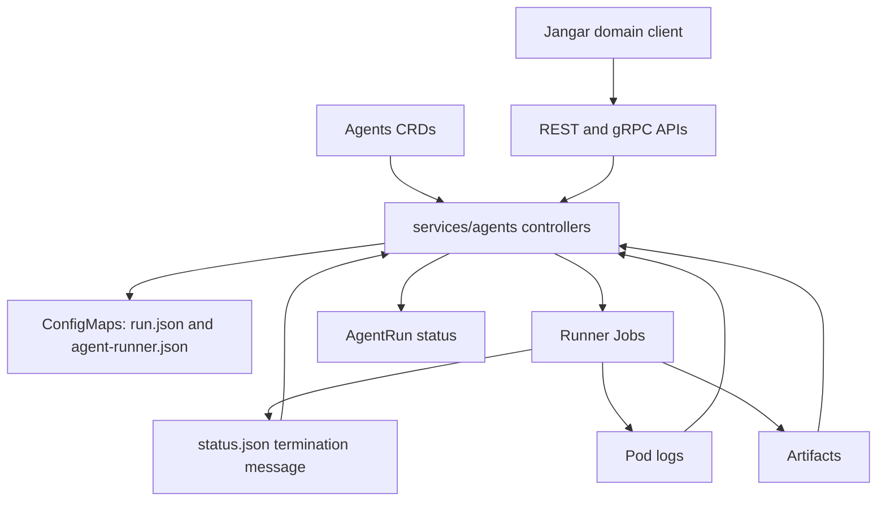

# Agents Controller Design

Status: Current (2026-05-19)

Docs index: [README](README.md)

> Historical note: this file kept its original path because older docs link to it. The active controller owner is
> `services/agents`, not Jangar.

## Purpose

`services/agents` owns the control plane and controllers for the Agents CRDs. It reconciles AgentRun,
ImplementationSpec, ImplementationSource, Memory, AgentProvider, orchestration, tool, schedule, approval, budget,
signal, secret binding, artifact, workspace, and swarm resources, then drives runner workloads through normalized
runtime adapters.

Jangar is a domain client and event consumer. It may call the Agents REST/gRPC APIs for Torghut, whitepaper, swarm, and
readiness domain behavior, but it does not own generic CRD reconciliation, workload creation, logs, artifacts, status,
or cancellation.

## Scope

- Watch and reconcile Agents CRDs in configured namespaces.
- Normalize AgentRun requests into `run.json` plus versioned `agent-runner.json`.
- Resolve Agent, AgentProvider, ImplementationSpec, VCS, secret, policy, and workload settings into a runner contract.
- Create and monitor Kubernetes Jobs for runner execution.
- Collect runner status, logs, artifacts, cancellation state, and terminal conditions.
- Serve the Agents REST API, control-plane status APIs, and agentctl gRPC service.

Non-goals:

- Owning domain-specific Torghut/Jangar behavior.
- Managing Jangar UI state, chat state, or domain readiness projections.
- Renaming the `agents.proompteng.ai/v1alpha1` API group during the first extraction.

## Control Plane Architecture

- `services/agents/src/server/control-plane.ts`: Agents API/control-plane server entrypoint.
- `services/agents/src/server/controller-entrypoint.ts`: controller deployment entrypoint.
- `services/agents/src/server/controller-runtime.ts`: leader-gated controller runtime orchestration.
- `services/agents/src/server/agents-controller`: AgentRun reconciliation and Job lifecycle.
- `services/agents/src/server/orchestration-controller`: orchestration and workflow reconciliation.
- `services/agents/src/server/supporting-primitives-controller`: supporting CRD reconciliation.
- `services/agents/api/agents`: generated Go types for CRDs shipped by `charts/agents/crds`.
- `services/agents/agentctl`: CLI/gRPC client surface.

## AgentRun Reconciliation

Inputs:

- `spec.agentRef`
- `spec.implementationSpecRef` or `spec.implementation.inline`
- `spec.providerRef`
- `spec.runtime`
- `spec.workload`
- `spec.vcsRef` and `spec.vcsPolicy`
- `spec.parameters`, `spec.secrets`, `spec.secretBindingRef`
- `spec.ttlSecondsAfterFinished`

Steps:

1. Validate required fields, admission policy, idempotency, VCS policy, secrets, and workload constraints.
2. Fetch Agent, AgentProvider, ImplementationSpec, VCS provider, and policy resources through Agents-owned stores.
3. Resolve a normalized provider adapter.
4. Write `run.json` and `agent-runner.json` into a controller-owned ConfigMap.
5. Create the runner Job with the selected workload image, service account, volumes, env, and resource settings.
6. Reconcile Job/Pod state into AgentRun status.
7. Read runner terminal status from `/workspace/.agent/status.json` via Kubernetes termination messages.
8. Merge logs, artifacts, cancellation state, and terminal conditions into `AgentRun.status`.
9. Apply Job/ConfigMap cleanup according to TTL and retention settings.

## Runner Contract

`agent-runner.json` is the controller-to-runner contract. It is versioned as
`agents.proompteng.ai/runner/v1` and contains:

- provider identity and provider spec;
- rendered inputs and payload paths;
- goal and token-budget data;
- normalized adapter config;
- status/log/artifact paths;
- output artifact declarations.

Generic Codex providers use `adapter.type=codex-app-server`, implemented by `services/agents/src/runner`.
Legacy process execution is only available through explicit `adapter.type=exec` providers.

## Status Contract

AgentRun status is authoritative in the Agents service and CRD:

- `status.phase`: Pending | Running | Succeeded | Failed | Cancelled
- `status.reason`, `status.message`
- `status.startedAt`, `status.finishedAt`
- `status.runtimeRef`
- `status.conditions`
- `status.artifacts`
- `status.runner`

Runner status is derived from the runner-written `status.json` and is sanitized before being stored on the CR.

## Configuration

Canonical runtime env names are `AGENTS_*`.

- Controller namespace scope: `AGENTS_CONTROLLER_NAMESPACES`
- Leader election: `AGENTS_LEADER_ELECTION_*`
- Job TTL/default workload: `AGENTS_AGENT_RUNNER_*`
- Retention: `AGENTS_CONTROLLER_AGENTRUN_RETENTION_SECONDS`
- gRPC: `AGENTS_GRPC_*`
- Database: `AGENTS_DATABASE_URL` / `agents-db-app`

The Agents chart must render Agents-owned images and env names. Jangar env aliases are not part of rendered Agents
runtime.

## Diagram

```mermaid
flowchart TD
  CRDs["Agents CRDs"] --> Ctrl["services/agents controllers"]
  API["REST and gRPC APIs"] --> Ctrl
  Ctrl --> CM["ConfigMaps: run.json and agent-runner.json"]
  Ctrl --> Job["Runner Jobs"]
  Job --> Term["status.json termination message"]
  Job --> Logs["Pod logs"]
  Job --> Artifacts["Artifacts"]
  Term --> Ctrl
  Logs --> Ctrl
  Artifacts --> Ctrl
  Ctrl --> Status["AgentRun status"]
  Jangar["Jangar domain client"] --> API
```
