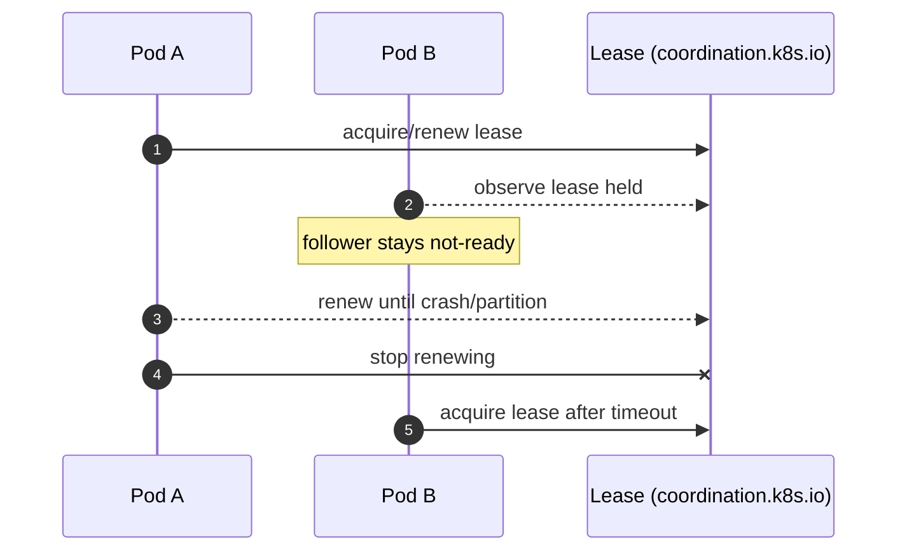

# Leader Election Design (Jangar Controllers)

Status: Current (2026-02-07)

Docs index: [README](README.md)

## Purpose
Define how Jangar controllers use Kubernetes leader election to support safe horizontal scaling, prevent double
reconciliation, and provide predictable failover behavior.

## Current State (As Of 2026-02-07)
- Code: no leader election is implemented. Controllers start unconditionally via `ensureAgentCommsRuntime` in
  `services/jangar/src/server/agent-comms-runtime.ts`, and readiness is not gated on leadership.
- Chart: there is no `controller.leaderElection` configuration in `charts/agents/values.yaml` or the deployment
  templates.
- Cluster (GitOps desired state): `argocd/applications/agents/values.yaml` runs the `agents` deployment with
  `replicaCount: 1`, so HA is not active. gRPC is enabled (port `50051`).

## Goals
- Ensure exactly one active reconciler across the controller loops in a given Jangar release at any time.
- Provide fast, deterministic failover on leader loss.
- Keep webhook and gRPC mutation paths leader-gated to avoid duplicate writes.
- Surface clear status and metrics around leadership changes.

## Non-Goals
- Sharding reconciliation across multiple active leaders.
- Cross-cluster coordination or multi-region leader election.
- Replacing Kubernetes coordination primitives.

## Design Summary
- Use a single Kubernetes Lease to elect one leader across all controller loops running in the Jangar process.
- Only the leader runs reconciliation loops and accepts mutating requests (webhooks, gRPC mutation endpoints).
- Non-leaders stay alive and serve read-only endpoints but report not-ready to avoid traffic.

## Lease Details
- Resource: `coordination.k8s.io/v1` Lease in the controller namespace.
- Default lease name: `jangar-controller-leader`.
- Namespace: release namespace (same as the deployment), configurable.
- Owner identity: `<pod-name>_<uid>`.
- Timing defaults:
  - `leaseDurationSeconds=30`
  - `renewDeadlineSeconds=20`
  - `retryPeriodSeconds=5`

Timing must satisfy `retryPeriod < renewDeadline < leaseDuration`.

## Controller Gating
Gate all controller loops behind the leader election guard. At minimum:
- `startAgentsController`
- `startOrchestrationController`
- `startSupportingPrimitivesController`
- `startPrimitivesReconciler`

On leadership loss, stop watches and reconcile loops cleanly before returning not-ready.

## Traffic And Readiness
- Readiness probe should report ready only on the leader.
- Non-leader behavior:
  - HTTP mutation endpoints return `503` with `Retry-After`.
  - gRPC mutation methods return `Unavailable` with a retry hint.
  - Read-only status endpoints remain available.

## Configuration
Add a `controller.leaderElection` section to `charts/agents/values.yaml`:
- `enabled` (default `true`)
- `leaseName` (default `jangar-controller-leader`)
- `leaseNamespace` (default release namespace)
- `leaseDurationSeconds` (default `30`)
- `renewDeadlineSeconds` (default `20`)
- `retryPeriodSeconds` (default `5`)

Map values into env vars consumed by the controller runtime, for example:
- `JANGAR_LEADER_ELECTION_ENABLED`
- `JANGAR_LEADER_ELECTION_LEASE_NAME`
- `JANGAR_LEADER_ELECTION_LEASE_NAMESPACE`
- `JANGAR_LEADER_ELECTION_LEASE_DURATION_SECONDS`
- `JANGAR_LEADER_ELECTION_RENEW_DEADLINE_SECONDS`
- `JANGAR_LEADER_ELECTION_RETRY_PERIOD_SECONDS`

## Failure Modes And Recovery
- Leader crash: a standby replica should acquire the lease within one lease duration.
- Network partition: if the leader cannot renew before `renewDeadlineSeconds`, it must stop reconciling and become
  not-ready so a new leader can take over.
- Split brain: rely on Lease semantics; controllers must stop all reconcile loops on leadership loss.

## Observability
- Log leadership acquisition/loss with lease name and namespace.
- Add metrics:
  - `jangar_leader_elected` (gauge, 1 for leader, 0 for follower)
  - `jangar_leader_changes_total` (counter)
- Extend `services/jangar/src/server/control-plane-status.ts` to report leader status.

## RBAC Requirements
Jangar service account must be able to manage Leases in its namespace:
- `get`, `list`, `watch`, `create`, `update`, `patch` on `leases.coordination.k8s.io`.

## Rollout Plan
- Add leader election implementation and env wiring behind a feature flag.
- Deploy with `replicaCount=2` in a non-prod namespace and confirm only one pod is ready.
- Enable the feature flag in production and increase replicas.

## Validation
- Kill the leader pod and verify another pod becomes leader within 30 seconds.
- Confirm webhooks and gRPC mutation calls are rejected by non-leaders.
- Confirm read-only endpoints remain available during leadership transitions.

## Operational Considerations
- Keep configuration in the appropriate control plane (Helm values, CI, or code) and document overrides.
- Update runbooks with enable/disable steps, rollback guidance, and expected failure modes.

## Risks And Mitigations
- Misconfiguration can cause deployment or runtime regressions; mitigate with schema validation and safe defaults.
- Additional load or latency can impact controller throughput; mitigate with caps and monitoring.

## Related Docs
- `docs/agents/agents-helm-chart-implementation.md`
- `docs/agents/jangar-controller-design.md`
- `docs/agents/production-readiness-design.md`
- `docs/agents/designs/leader-election-ha.md` (draft, includes repo/chart/cluster handoff appendix)

## Diagram

