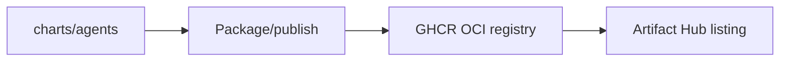

# Agents Platform: Market Readiness & Distribution Plan

Status: Current (2026-01-19)

Docs index: [README](README.md)

## Artifact Hub Publishability (Required)

### Chart & Repo Metadata

- `Chart.yaml` includes:
  - `version`, `appVersion`, `kubeVersion`, `home`, `sources`, `maintainers`, `keywords`, `icon`
  - `annotations` for Artifact Hub:
    - `artifacthub.io/changes`
    - `artifacthub.io/images`
    - `artifacthub.io/crds`
    - `artifacthub.io/crdsExamples`
    - `artifacthub.io/license`
    - `artifacthub.io/links`
    - `artifacthub.io/containsSecurityUpdates` (when applicable)
    - `artifacthub.io/operator`
- Add `artifacthub-pkg.yml` in `charts/agents/` (and `artifacthub-repo.yml` at repo root if publishing an index repo).

### CRDs & Examples

- CRDs shipped in `charts/agents/crds/` (static YAML).
- Provide CRD examples referenced by `artifacthub.io/crdsExamples`.
- Verify CRDs are structural and not too large (see CRD best practices).

### Packaging & Publishing

- Publish chart as OCI or index‑based Helm repo.
- Enforce semver for chart versions.
- Include a changelog snippet for each release.

## Mainstream Readiness (Product & Ops)

### Installation & UX

- One‑command install on minikube/kind/managed clusters.
- Quickstart that creates Agent, ImplementationSpec, AgentRun and shows results.
- Clear uninstall and cleanup steps.

### Compatibility & Stability

- Supported Kubernetes versions documented (>= 1.25).
- Stable CRD schema with a documented compatibility policy.
- Clear upgrade/migration guidance.

### Observability

- Structured logs with run correlation IDs.
- Metrics: reconcile duration, run latency, success/failure counts.
- Kubernetes Events for run lifecycle.
- `agentctl run logs` and `agentctl run status`.

### Security & Trust

- Least‑privilege RBAC.
- Secrets only via references; never embed credentials in CRDs.
- Image signing + SBOM publishing.
- Security policy and disclosure process.

### Docs & Examples

- Architecture overview + diagrams.
- “Hello World” run and a real integration example (GitHub + Linear).
- Troubleshooting and FAQ.

### Community & Governance

- CONTRIBUTING, CODE_OF_CONDUCT, MAINTAINERS.
- Release cadence and roadmap.
- Labeling for good‑first‑issues.

## 50K Stars: Distribution Strategy

### Core Growth Loops

- **Killer use case**: “Run code agents on GitHub Issues in <10 minutes.”
- **Integrations**: GitHub + Linear work out‑of‑the‑box (no custom glue).
- **Content**: blogs, demo videos, talks, and benchmark write‑ups.
- **Proof**: published case studies + logos.

### Ecosystem Leverage

- Runtime adapters for workflow/job, temporal, and custom.
- Templates/examples for CI/CD and AI‑agent workflows.
- Interop with popular observability stacks.

### Adoption Friction Removal

- Minimal chart defaults; no database/ingress required.
- Clear failure messages and recoverable errors.
- “Works locally” story (minikube/kind).

## Release Checklist (Operational)

- [ ] Helm lint + template validation.
- [ ] CRD size check (<= 256KB).
- [ ] Examples validated against CRDs.
- [ ] Artifact Hub annotations present.
- [ ] Images signed + SBOM published.
- [ ] Docs updated.

## Diagram

