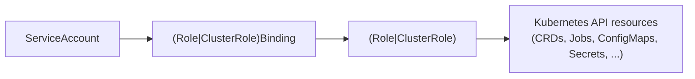

# RBAC Matrix (Agents)

Status: Current (2026-01-19)

Docs index: [README](README.md)

See also:
- `README.md` (docs index)
- `runbooks.md` (install/upgrade flows that require these permissions)
- `designs/chart-rbac-clusterscoped-guardrails.md` (multi-namespace/cluster-scoped guidance)

## Components
- Jangar controller (namespaced)
- agentctl (user client)
- Runtime adapters (Workflow/Temporal/Custom)

## Jangar Controller (namespaced Role)
Required verbs (namespaced):
- `get`, `list`, `watch`, `create`, `update`, `patch` on:
  - `agents`, `agentruns`, `agentproviders`, `implementationspecs`, `implementationsources`, `memories`
- `update` on `*/status` for all CRDs
- `create`, `get`, `list`, `watch`, `update`, `patch`, `delete` on runtime resources:
  - `jobs.batch` (for workflow/job runtime)
- `create`, `get`, `list`, `watch`, `update`, `patch`, `delete` on:
  - `cronjobs.batch` (Schedule controller)
  - `persistentvolumeclaims` (Workspace controller)
- `get`, `list`, `watch` on:
  - `pods` and `pods/log` (agentctl log streaming)
- `get` on `secrets` referenced in AgentRun allowlist
- `create`, `get`, `list`, `watch`, `update`, `patch` on:
  - `configmaps` (run inputs, workflow step payloads)

Optional (if enabled):
- `events` for publishing Kubernetes events

## Jangar Controller (cluster-scoped ClusterRole)
Use when `controller.namespaces` spans multiple namespaces or `"*"`.
Required verbs mirror the namespaced Role, but with cluster scope and a ClusterRoleBinding
to the Jangar service account.
Additional verbs for namespace discovery when using `"*"`:
- `get`, `list`, `watch` on `namespaces`

## agentctl (user)
Uses Kubernetes API by default (kubeconfig + context). Optional gRPC mode uses Jangar endpoints.

## Runtime Adapter Service Accounts
If adapters run outside Jangar:
- Minimal rights to create their runtime resources.
- No access to CRDs beyond their scope.

## Security Notes
- Secrets must be allowlisted by Agent or AgentRun.
- No wildcard access to secrets.

## Diagram

