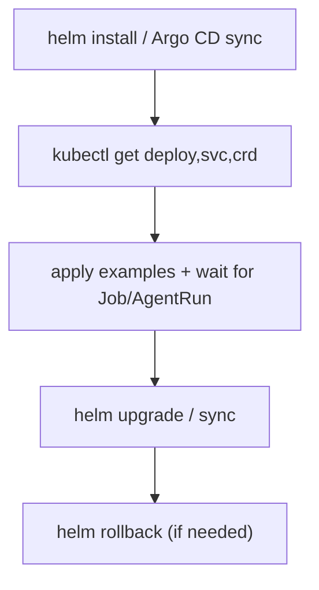

# Runbooks (Agents)

Status: Current (2026-01-20)

Docs index: [README](README.md)

See also:

- `README.md` (docs index)
- `designs/handoff-common.md` (GitOps render + live verification commands)
- `ci-validation-plan.md` (what to run before/after rollout)
- `swarm-end-to-end-runbook.md` (dual-swarm NATS communication + Jangar visibility e2e validation flow)

## Install

1. `helm install agents charts/agents -n agents --create-namespace`
2. Verify CRDs: `kubectl get crd | rg agents.proompteng.ai`
3. Verify Jangar: `kubectl -n agents get deploy,svc`

## Upgrade

1. `helm upgrade agents charts/agents -n agents`
2. Confirm rollout: `kubectl -n agents rollout status deploy/agents`
3. For probe/lifecycle/strategy changes, apply component-at-a-time:
   - First land global values.
   - Validate control-plane rollout.
   - Then validate controllers rollout.
4. If migration is not stable, roll back and remove component overrides first, then global adjustments.

## Rollback

1. `helm rollback agents <REV> -n agents`
2. Verify status and re-run smoke test.

## Argo CD Application (GitOps, optional)

If you use Argo CD for GitOps (optional), use the sample Application manifest in
`argocd/applications/agents/application.yaml`:

These commands apply only to Argo CD-based installs:

```bash
bun run packages/scripts/src/agents/deploy-service.ts
kubectl apply -n argocd -f argocd/applications/agents/application.yaml
kubectl -n argocd get applications.argoproj.io agents
```

The Application renders `argocd/applications/agents` (Helm + kustomize) and installs CRDs + Jangar
into the `agents` namespace using `argocd/applications/agents/values.yaml`.
Update the values file with your Jangar image tag, database secret, and (optional) runner image via `runner.image.*`.
The chart defaults `controller.jobTtlSecondsAfterFinished` to a safe value; set it to `0` to disable job cleanup.
Runner image env precedence is: `env.vars.JANGAR_AGENT_RUNNER_IMAGE` > `runner.image.*` >
`runtime.agentRunnerImage` (legacy fallback).

If `controller.namespaces` spans multiple namespaces or `"*"`, set `rbac.clusterScoped=true`.
Guardrail rules that fail install-time validation:

- Empty scope arrays (`[]`) for any of `controller.namespaces`, `orchestrationController.namespaces`,
  `supportingController.namespaces`
- `['*', ...]` combinations where `*` is mixed with a concrete namespace
- Multiple namespaces with `rbac.clusterScoped=false`
- Explicit single namespace values that do not match `namespaceOverride`/release namespace

Run the namespace validation helper (from `docs/agents/ci-validation-plan.md`) before upgrading
if changing any of these scope values. Example:

```bash
helm template charts/agents --set namespaceOverride=agents --set-json 'controller.namespaces=["agents"]' --set rbac.clusterScoped=false
helm template charts/agents --set-json 'controller.namespaces=["*"]' --set rbac.clusterScoped=false
helm template charts/agents --set-json 'controller.namespaces=[]'
```

If that helper is unavailable, run the full command list in the validation plan directly.

GitOps rollout notes (native workflow runtime):

- No external workflow engine is required for native AgentRun/OrchestrationRun execution.
- Keep `controller.enabled`, `orchestrationController.enabled`, and `supportingController.enabled` at their defaults
  unless you are intentionally disabling native runtime components.
- To point Codex reruns/system improvements at native orchestration, set
  `workflowRuntime.native.rerunOrchestration` and/or `workflowRuntime.native.systemImprovementOrchestration`
  (plus the matching `workflowRuntime.native.*Namespace` values if needed) in `argocd/applications/agents/values.yaml`.

CI runners use `argocd/applications/agents-ci` to provision the `agents-ci` namespace and RBAC for ARC
so GitHub Actions can execute smoke tests against the chart.

Optional Argo CD smoke test (only for Argo CD-based installs):

```bash
kubectl -n argocd get applications.argoproj.io agents -o yaml
kubectl -n agents get deploy,svc
kubectl -n agents rollout status deploy/agents
kubectl get crd | rg agents.proompteng.ai
kubectl -n agents port-forward svc/agents 8080:80
curl -fsS http://localhost:8080/health
kubectl -n agents apply -f charts/agents/examples/agentrun-sample.yaml
kubectl -n agents apply -f charts/agents/examples/orchestration-sample.yaml
kubectl -n agents apply -f charts/agents/examples/orchestrationrun-sample.yaml
kubectl -n agents wait --for=condition=complete job \
  -l agents.proompteng.ai/agent-run=codex-run-sample --timeout=5m
```

## Smoke test (kind/minikube)

```bash
packages/scripts/src/agents/smoke-agents.ts
```

This installs the chart, applies deterministic smoke CRs, submits a multi-step workflow runtime
AgentRun via `agentctl` (kube mode), and validates:

- AgentRun phase transitions Pending → Running → Succeeded.
- Workflow job creation (one Job per step) and Job completion.
- Runtime ref is set to the workflow job runner.

Override `AGENTS_NAMESPACE`, `AGENTS_RELEASE_NAME`, `AGENTS_VALUES_FILE`, `AGENTS_RUN_FILE`,
`AGENTS_RUN_NAME`, `AGENTS_CREATE_NAMESPACE`, or `AGENTCTL_BIN` if needed.
If you do not have an external database handy, set `AGENTS_DB_BOOTSTRAP=true` to spin up a local
Postgres in-cluster and wire `database.url` automatically (or provide `AGENTS_DB_URL` yourself).
Ensure the `agentrun-workflow-smoke.yaml` workload image includes `agent-runner` or set
`env.vars.JANGAR_AGENT_RUNNER_IMAGE` in your values.

## Workflow runtime validation (native)

Confirm the workflow adapter is healthy and no Argo Workflows are required:

```bash
curl -fsS http://localhost:8080/api/agents/control-plane/status?namespace=agents | jq '.runtime_adapters'
curl -fsS http://localhost:8080/api/agents/control-plane/status?namespace=agents | jq '.workflows'
curl -fsS http://localhost:8080/api/agents/control-plane/status?namespace=agents | jq '.agentrun_ingestion'
curl -fsS http://localhost:8080/api/agents/control-plane/status?namespace=agents | jq '.execution_trust'
curl -fsS http://localhost:8080/api/agents/control-plane/status?namespace=agents | jq '.runtime_kits'
curl -fsS http://localhost:8080/api/agents/control-plane/status?namespace=agents | jq '.admission_passports'
curl -fsS http://localhost:8080/api/agents/control-plane/status?namespace=agents | jq '.failure_domain_leases'
curl -fsS http://localhost:8080/api/agents/control-plane/status?namespace=agents | jq '.negative_evidence_router'
curl -fsS http://localhost:8080/api/agents/control-plane/status?namespace=agents | jq '.action_slo_budgets'
curl -fsS http://localhost:8080/api/agents/control-plane/status?namespace=agents | jq '.torghut_action_slo_budgets'
curl -fsS http://localhost:8080/ready | jq '{status, serving_passport_id, runtime_kits, admission_passports}'
kubectl api-resources --api-group=argoproj.io --no-headers || true
kubectl -n agents get workflows.argoproj.io 2>/dev/null || true
```

Expected outcomes:

- `runtime_adapters` contains `workflow` with `status: healthy` and a native runtime message.
- `workflows` includes a bounded rollup with `active_job_runs`, `recent_failed_jobs`,
  `backoff_limit_exceeded_jobs`, and `top_failure_reasons`.
- `agentrun_ingestion` reports the latest AgentRun watch/resync timestamps and stays `healthy` with
  `untouched_run_count: 0` during normal operation.
- `execution_trust` is always present and stays `healthy`; if a swarm freeze TTL has expired without
  reconciliation, it reports `freeze expiry unreconciled` as a degraded repair signal while `/ready`
  stays `200` unless execution trust escalates to `blocked` or `unknown`.
- `runtime_kits` always includes `serving` and `collaboration` classes with stable `runtime_kit_id`,
  `component_digest`, `decision`, and `reason_codes` fields.
- `admission_passports` always includes `serving`, `swarm_plan`, `swarm_implement`, and `swarm_verify`
  consumers, and `/ready.serving_passport_id` matches the `serving` passport from control-plane status.
- `failure_domain_leases.mode` is `shadow` during Phase 0 and includes a `lease_set_digest`, per-domain
  lease `status`, `reason_codes`, and per-action holdback decisions for `dispatch_normal`,
  `dispatch_repair`, `deploy_widen`, `merge_ready`, and Torghut action classes.
- `negative_evidence_router.mode` is `observe`; the router cites design doc 111, current positive/negative evidence
  refs, and the failure-domain lease ids it consumed.
- `action_slo_budgets` includes `serve_readonly`, `dispatch_repair`, `dispatch_normal`, `deploy_widen`, `merge_ready`,
  `torghut_observe`, `paper_canary`, `live_micro_canary`, and `live_scale` budgets with `fresh_until` no more than the
  status evidence window.
- `torghut_action_slo_budgets` is the filtered consumer view for Torghut sizing decisions. Read-only
  `torghut_observe` can remain allowed while stale market context, open quant alerts, or readiness debt hold/block
  paper and live capital budgets.
- If collaboration is degraded or blocked because a runtime helper is missing, `/ready` stays `200` as
  long as the `serving` passport is still `allow` or `degrade`; the blocked `swarm_*` passport surfaces
  the missing component in `reason_codes`.
- The Argo Workflows resource check returns empty output (no CRD or no workflows).

Workspace storage proof uses the same Kubernetes client path as the supporting controller. If a workspace-backed run is
stuck before dispatch, verify the PVC directly through the least-privilege API surface:

```bash
kubectl -n agents get pvc -l workspaces.proompteng.ai/workspace
kubectl -n agents get workspaces.workspaces.proompteng.ai
```

Expected outcomes:

- each active `Workspace` has a same-named PVC labeled `workspaces.proompteng.ai/workspace=<workspace-name>`;
- `Workspace.status.phase=Ready` requires the backing PVC to be `Bound`;
- an `unsupported kubernetes resource: persistentvolumeclaim` controller log means the Jangar image is missing the
  first-class PVC resource alias and should be rolled back or upgraded before relying on storage proof.

During shadow lease synthesis, treat `failure_domain_leases.holdbacks[]` as deployer evidence, not an
admission switch. A `hold` decision with `database.service_refused`, `database.pod_disruption_target`,
`route.unreachable`, `registry.image_pull_timeout`, `storage.mount_conflict`, or
`workflow_artifact.configmap_missing` means normal dispatch or rollout widening should stay manual-held
until the next lease set supersedes it with fresh evidence. Rollback is to keep lease enforcement disabled
and use the existing dependency quorum/runtime passport gates while preserving the lease digest in the PR or
handoff notes.

During negative-evidence router observe mode, treat `action_slo_budgets[]` as an operator/deployer contract rather than
an admission switch. A retained historical failed AgentRun should not block `serve_readonly` or bounded
`dispatch_repair`. Current controller probe failures should reduce `dispatch_normal`; rollout ambiguity should hold
`deploy_widen`; stale market context or open quant alerts should hold or block Torghut capital budgets while preserving
`torghut_observe`. Rollback is to keep enforcement disabled and fall back to failure-domain leases plus dependency
quorum while preserving the emitted `router_epoch_id` and evidence refs.

If a cross-swarm stage refuses launch before NATS collaboration initialization, verify the passport debt first:

```bash
curl -fsS http://localhost:8080/api/agents/control-plane/status?namespace=agents | \
  jq '.admission_passports[] | select(.consumer_class=="swarm_implement")'
curl -fsS http://localhost:8080/api/agents/control-plane/status?namespace=agents | \
  jq '.runtime_kits[] | select(.kit_class=="collaboration")'
```

Expected outcomes:

- a blocked or held `swarm_implement` passport cites the collaboration `runtime_kit_id` in
  `required_runtime_kits`.
- the collaboration runtime kit points at the missing component through `reason_codes` and
  `components[].evidence_ref` (for example `runtime_kit_component_missing:codex_nats_publish` with the
  checked helper paths).
- schedule-runner pods fail closed before creating AgentRuns when a launch-capable swarm runner manifest lacks its
  passport stamp or when the stamped passport id or runtime-kit digest no longer matches the current status response.
  If this fire-time check itself is blocking emergency recovery, set
  `JANGAR_SCHEDULE_RUNNER_ADMISSION_CHECK=false` and keep `JANGAR_SWARM_RUNTIME_ADMISSION_ENFORCEMENT=true` so the
  controller still deletes newly blocked schedules.
- rollback is runtime-local: restore the missing helper/config/secret in the admitted image or revert the
  change that introduced the incompatible runtime contract, then redeploy and re-check the same passport ids.

Jangar deploy verification now checks the same passport surface after rollout digest checks:

```bash
bun run packages/scripts/src/jangar/verify-deployment.ts \
  --require-synced \
  --expected-revision "$(git rev-parse HEAD)" \
  --expected-revision-mode ancestor
```

Expected outcomes:

- the verifier prints the admitted passport ids, runtime-kit set digest set, and runtime-kit image refs for
  `serving`, `swarm_plan`, and `swarm_implement`;
- verification fails if any required passport is stale, missing, held, blocked, or backed by a runtime kit whose
  `image_ref` does not include the promoted digest from `argocd/applications/jangar/kustomization.yaml`;
- emergency rollback for deploy verification only is `--skip-admission-passport-verification` or
  `JANGAR_VERIFY_ADMISSION_PASSPORTS=false`; leave `/ready` and status passport projections enabled while debugging.

## Native workflow e2e proof

This runbook validates the native workflow runtime end-to-end (AgentProvider → Agent → ImplementationSpec → AgentRun)
and confirms that the Codex implementation step opens a PR against `proompteng/lab`.

Prereqs:

- `codex-github-token` secret in the target namespace (GH token with repo permissions).
- OpenAI key available via `AGENTS_E2E_OPENAI_KEY` or an existing `codex-openai-key` secret
  (the script will create/update it when the env var is set).

Prereqs:

- Agents chart is installed in `agents` and Jangar is reachable.
- A GitHub token secret exists (see below).

Create the GitHub token secret once (or set `AGENTS_E2E_GH_TOKEN`):

```bash
kubectl -n agents create secret generic codex-github-token \
  --from-literal=GH_TOKEN="<token>"
```

Run the native workflow script (override the issue/task as needed):

```bash
AGENTS_E2E_ISSUE_NUMBER=2614 \
AGENTS_E2E_PROMPT="Add optional autoscaling support to the Agents Helm chart (HPA + values schema + README)." \
scripts/agents/native-workflow-e2e.sh
```

Expected outputs:

- AgentRun reaches `Succeeded` with `status.runtimeRef.type=workflow`.
- Output directory contains:
  - `agentrun.json` (final status snapshot)
  - `jobs.txt` (Job → Pod mapping)
  - `logs/<job>.log` (job logs)
  - `artifacts/<job>-runner.log` and `artifacts/<job>-status.json` (agent-runner artifacts)
- Script summary includes the output paths and, when available, the PR URL.

Verify the PR was created:

```bash
gh pr list --repo proompteng/lab --head "codex/agents/${AGENTS_E2E_ISSUE_NUMBER}"
```

Notes:

- The script applies `charts/agents/examples/agentprovider-native-workflow.yaml`,
  `charts/agents/examples/agent-native-workflow.yaml`, and
  `charts/agents/examples/implementationspec-native-workflow.yaml` before submitting the AgentRun.
- Set `AGENTS_E2E_VERIFY_PR=false` to skip the optional PR lookup (uses `gh` if available).

Troubleshooting:

- AgentRun failed: `kubectl -n agents get agentrun <name> -o yaml` and inspect job logs in the output directory.
- No PR created: confirm `codex-github-token` exists and includes `GH_TOKEN`, and the agent image has `gh` + `git`.
- Stuck in Pending/Running: check `kubectl -n agents get job -l agents.proompteng.ai/agent-run=<name>` and controller logs.

## Codex reruns/system improvements (native)

- Configure `JANGAR_CODEX_RERUN_ORCHESTRATION` and/or `JANGAR_SYSTEM_IMPROVEMENT_ORCHESTRATION` (plus the matching
  `*_NAMESPACE` variables if needed).
- Ensure the referenced Orchestration exists and watch OrchestrationRun status for progress.

## Torghut v3 orchestration guard checks

- Source templates:
  - `docs/torghut/design-system/v3/full-loop/templates/agentruns.yaml`
  - `docs/torghut/design-system/v3/full-loop/templates/orchestration-policy.yaml`
  - `docs/torghut/design-system/v3/full-loop/templates/orchestration-observability.yaml`
- Validate stage transition guard decisions before advancing a candidate:

```bash
cd services/torghut
uv run python scripts/orchestration_guard.py check-transition \
  --state artifacts/orchestration/candidate-state.json \
  --candidate-id cand-abc123 \
  --run-id run-abc123 \
  --from-stage gate-evaluation \
  --to-stage shadow-paper \
  --previous-artifact artifacts/gates/cand-abc123/report.json \
  --previous-gate-passed \
  --risk-controls-passed \
  --execution-controls-passed \
  --mode gitops
```

- Evaluate retry/pause behavior after a stage failure:

```bash
cd services/torghut
uv run python scripts/orchestration_guard.py evaluate-failure \
  --state artifacts/orchestration/candidate-state.json \
  --stage candidate-build \
  --failure-class transient \
  --attempt 2
```

- Use emergency mode only for ticketed incidents. Mutable actions remain GitOps-first by default.

## Jangar /health 500 (router init error)

- Symptom: `/health` returns 500 with `ReferenceError: Cannot access 'aE' before initialization`.
- Root cause: Jangar builds picked up an incompatible Nitro `latest` bundle output.
- Fix: Pin Nitro to `3.0.0` in `services/jangar/package.json` and deploy a pinned Jangar image digest
  (avoid `latest`).

## Stuck AgentRun

- Check status/conditions: `kubectl -n agents get agentrun <name> -o yaml`
- If runtimeRef exists, check runtime object (job/workflow).
- If no runtimeRef, inspect Jangar logs for submission errors.

## Failed Integration Sync

- Inspect ImplementationSource status.
- Check credentials secret exists and is valid.
- Verify webhook delivery logs and signature headers.

## Memory Outage

- Check Memory status and connection secret.
- Failover to alternative Memory (set default).
- Re-run failed AgentRuns.

## CRD Missing

- Reinstall chart or apply CRD YAMLs directly.
- Verify `kubectl api-resources | rg agents`.

## Diagram


