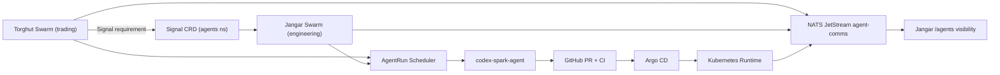
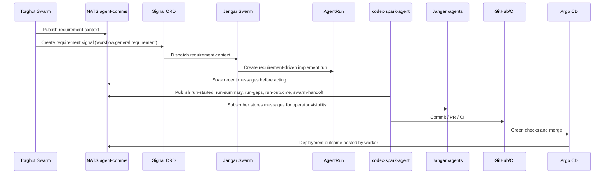

# Swarm End-To-End Runbook

Status: Current (2026-05-05)

This runbook documents how dual swarms run continuously, how they communicate through NATS, and how to verify the full
loop from requirement signal to implementation execution with Jangar visibility.

## System Topology



## Channel Communication Contract

All workers publish durable progress to NATS and Jangar subscribes those messages into `workflow_comms.agent_messages`.
Each stage must do three actions:

1. Read recent NATS context with `codex-nats-soak`.
2. Publish progress, risk, validation, and handoff events with `codex-nats-publish`.
3. Confirm the messages are visible in Jangar under `/agents` and `/agents/general`.

Channel selection is dynamic at runtime:

1. `swarmRequirementChannel` from signal (if present).
2. `natsChannel`.
3. `NATS_CHANNEL`.
4. `general`.

`owner.channel` remains a logical conversation URI for swarm ownership and routing. NATS transport uses
`integrations.nats` or the chart-level `agentComms.nats` values and must not be inferred from `owner.channel`.

## Execution Loop



## Live Verification Procedure

Run these checks in order.

### 1. Branch and merge safety

```bash
git status --porcelain=v1 -b
rg -n "^<<<<<<<|^=======|^>>>>>>>" -g'!*node_modules/*'
```

Expected:

- Clean working tree.
- No conflict markers.

### 2. GitOps health

```bash
kubectl -n argocd get application agents -o json | jq '{sync:.status.sync.status,health:.status.health.status,revision:.status.sync.revision}'
kubectl -n argocd get application nats -o json | jq '{sync:.status.sync.status,health:.status.health.status,revision:.status.sync.revision}'
kubectl -n nats get pods,svc,streams.jetstream.nats.io,consumers.jetstream.nats.io
kubectl -n agents get swarm
kubectl -n agents get schedules.schedules.proompteng.ai
```

Expected:

- `agents` app is `Synced` and `Healthy`.
- `nats` app is `Synced` and `Healthy`.
- `stream/agent-comms` and `consumer/jangar-agent-comms` exist.
- `jangar-control-plane` and `torghut-quant` swarms are `Active` and `Ready=True`.
- All stage schedules are `Active`.

### 2a. Post-sync smoke

```bash
kubectl -n agents get agentrun codex-spark-smoke -o json | jq '{phase:.status.phase,reason:.status.reason,message:.status.message}'
kubectl -n agents logs job/$(kubectl -n agents get job -l agents.proompteng.ai/agent-run=codex-spark-smoke -o jsonpath='{.items[0].metadata.name}') --tail=200
```

Expected:

- `phase` is `Succeeded`.
- No ChatGPT auth-mode, usage-limit, or unknown-model errors appear in the job logs.

### 3. Cross-swarm handoff proof

Create a live Torghut -> Jangar requirement signal:

```bash
TS=$(date +%s)
NAME="torghut-to-jangar-e2e-$TS"
cat <<EOF | kubectl apply -f -
apiVersion: signals.proompteng.ai/v1alpha1
kind: Signal
metadata:
  name: $NAME
  namespace: agents
  labels:
    swarm.proompteng.ai/from: torghut-quant
    swarm.proompteng.ai/to: jangar-control-plane
    swarm.proompteng.ai/type: requirement
spec:
  channel: workflow.general.requirement
  description: "Live e2e validation from Torghut to Jangar"
  payload:
    mission: $NAME
    priority: high
    acceptance: "publish NATS handoff events and show them in Jangar"
EOF
```

Confirm Jangar created a requirement-driven run:

```bash
kubectl -n agents get agentrun -o json | jq -r --arg n "$NAME" '.items[] | select(.spec.parameters.swarmRequirementSignal == $n) | .metadata.name'
```

Then follow to terminal phase:

```bash
RUN="<name-from-previous-command>"
kubectl -n agents get agentrun "$RUN" -w
```

### 4. NATS and Jangar visibility evidence

Inspect the run job logs and confirm NATS publish behavior:

```bash
JOB=$(kubectl -n agents get job -l agents.proompteng.ai/agent-run="$RUN" -o jsonpath='{.items[0].metadata.name}')
kubectl -n agents logs job/"$JOB" --tail=400 | rg -n "codex-nats-soak|codex-nats-publish|run-started|swarm-handoff|run-outcome"
```

Expected evidence:

- `codex-nats-soak` runs before implementation when context is required.
- `codex-nats-publish` emits `run-started`, `run-summary`, `run-gaps`, `run-outcome`, and `swarm-handoff`.
- Jangar `/agents/general` shows the emitted messages after the subscriber stores them.

## Current Known State

Check live cluster state before using this runbook. Swarm readiness, freeze status, and smoke outcomes are operational
signals, not static documentation.

## Failure Criteria

Treat loop as failed if any of these occur:

- Signal exists but no requirement-driven Jangar run is created.
- Jangar run reaches `Failed` or stays non-terminal past runtime SLO.
- Run does not show NATS publish events.
- Jangar does not show the NATS messages in the agent communication views.

## Recovery Actions

1. Force swarm reconcile:
   `kubectl -n agents annotate swarm jangar-control-plane swarm.proompteng.ai/reconcile-now="$(date +%s)" --overwrite`
2. Inspect failed run status and runtime job logs.
3. Re-submit requirement signal with a new mission id.
4. If Argo sync is stuck on terminating template runs, clear stale `runtime-cleanup` finalizers on terminating template
   `AgentRun` objects and re-sync.
