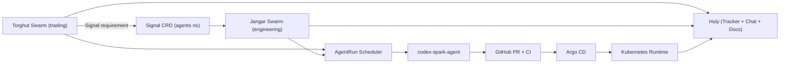
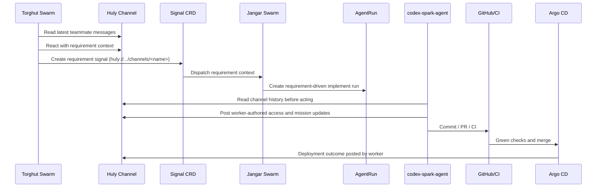

# Swarm End-To-End Runbook

Status: Current (2026-03-02)

This runbook documents how dual swarms run continuously, how they communicate through Huly, and how to verify the
full loop from requirement signal to implementation execution.

## System Topology



## Channel Communication Contract

All workers use the Huly skill and must do three actions per stage:

1. Read recent channel history (`list-channel-messages`).
2. React to relevant teammate messages (post explicit replies referencing message ids).
3. Publish a worker-authored mission update (`upsert-mission --message ...`).

Channel selection is dynamic at runtime:

1. `swarmRequirementChannel` from signal (if present).
2. `hulyChannelName`.
3. `hulyChannelUrl`.

## Execution Loop



## Live Verification Procedure

Run these checks in order.

### 1. Branch and merge safety

```bash
git status --porcelain=v1 -b
rg -n "^<<<<<<<|^=======|^>>>>>>>" -g'!*node_modules/*'
```

Expected:

- Clean working tree.
- No conflict markers.

### 2. GitOps health

```bash
kubectl -n argocd get application agents -o json | jq '{sync:.status.sync.status,health:.status.health.status,revision:.status.sync.revision}'
kubectl -n agents get swarm
kubectl -n agents get schedules.schedules.proompteng.ai
```

Expected:

- `agents` app is `Synced` and `Healthy`.
- `jangar-control-plane` and `torghut-quant` swarms are `Active` and `Ready=True`.
- All stage schedules are `Active`.

### 3. Cross-swarm handoff proof

Create a live Torghut -> Jangar requirement signal:

```bash
TS=$(date +%s)
NAME="torghut-to-jangar-e2e-$TS"
cat <<EOF | kubectl apply -f -
apiVersion: signals.proompteng.ai/v1alpha1
kind: Signal
metadata:
  name: $NAME
  namespace: agents
  labels:
    swarm.proompteng.ai/from: torghut-quant
    swarm.proompteng.ai/to: jangar-control-plane
    swarm.proompteng.ai/type: requirement
spec:
  channel: huly://virtual-workers/channels/general
  description: "Live e2e validation from Torghut to Jangar"
  payload:
    mission: $NAME
    priority: high
    acceptance: "publish issue/document/channel artifacts and complete handoff"
EOF
```

Confirm Jangar created a requirement-driven run:

```bash
kubectl -n agents get agentrun -o json | jq -r --arg n "$NAME" '.items[] | select(.spec.parameters.swarmRequirementSignal == $n) | .metadata.name'
```

Then follow to terminal phase:

```bash
RUN="<name-from-previous-command>"
kubectl -n agents get agentrun "$RUN" -w
```

### 4. Huly read/reply/post evidence

Inspect the run job logs and confirm all three behaviors:

```bash
JOB=$(kubectl -n agents get job -l agents.proompteng.ai/agent-run="$RUN" -o jsonpath='{.items[0].metadata.name}')
kubectl -n agents logs job/"$JOB" --tail=400 | rg -n "list-channel-messages|verify-chat-access|upsert-mission|messageId|issueId|documentId"
```

Expected evidence:

- `list-channel-messages` called before mission action.
- `verify-chat-access` called with explicit `--message`.
- `upsert-mission` called with explicit `--message`.
- Returned Huly artifact ids (`issueId`, `documentId`, `messageId`).

## Current Known State (2026-03-02)

- `agents` Argo CD app: `Synced` + `Healthy`.
- Both swarms: `Active` + `Ready=True`.
- Live cross-swarm run observed: `jangar-control-plane-torghut-quant-req-00gbjlqs-1-n2l4r` (running during latest validation).
- Last completed cross-swarm requirement example: `jangar-control-plane-torghut-quant-req-00gc1i45-1-hv7qz` (`Succeeded`).

## Failure Criteria

Treat loop as failed if any of these occur:

- Signal exists but no requirement-driven Jangar run is created.
- Jangar run reaches `Failed` or stays non-terminal past runtime SLO.
- Run does not show `list-channel-messages`, `verify-chat-access --message`, and `upsert-mission --message`.
- Huly artifacts are missing issue/doc/channel ids.

## Recovery Actions

1. Force swarm reconcile:
   `kubectl -n agents annotate swarm jangar-control-plane swarm.proompteng.ai/reconcile-now="$(date +%s)" --overwrite`
2. Inspect failed run status and runtime job logs.
3. Re-submit requirement signal with a new mission id.
4. If Argo sync is stuck on terminating template runs, clear stale `runtime-cleanup` finalizers on terminating template
   `AgentRun` objects and re-sync.
