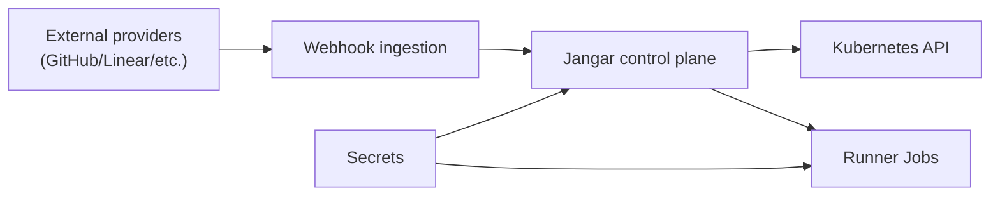

# Threat Model (Agents)

Status: Current (2026-01-19)

Docs index: [README](README.md)

See also:

- `README.md` (docs index)
- `rbac-matrix.md` (permissions model)
- `production-readiness-design.md` (security requirements checklist)

## Assets

- Source code repositories and branches
- Credentials/secrets (GitHub/Linear tokens, runtime credentials)
- ImplementationSpec content (may include sensitive details)
- Agent execution environments

## Trust Boundaries

- External integrations (GitHub/Linear)
- Kubernetes API server
- Runtime adapter endpoints (workflow/temporal/custom)
- Agent execution containers

## Threats & Mitigations

### Credential leakage

- Mitigation: secrets only via SecretRefs; no secret values in CRDs.
- Audit: avoid printing secrets in logs.

### Unauthorized run submission

- Mitigation: namespace RBAC + AgentRun allowlist + admission checks.

### Supply-chain compromise

- Mitigation: signed images, SBOMs, vulnerability scans.

### Run hijacking / privilege escalation

- Mitigation: deny privileged pods by default; restrict service accounts.

### Integration spoofing

- Mitigation: validate webhook signatures; rate-limit webhook ingestion.

### Denial of service

- Mitigation: concurrency limits + backoff; per-namespace quotas.

## Residual Risk

- Large ImplementationSpec content may exhaust etcd or memory if limits ignored.
- Provider outages cause delayed runs; bounded retries prevent overload.

## Diagram

