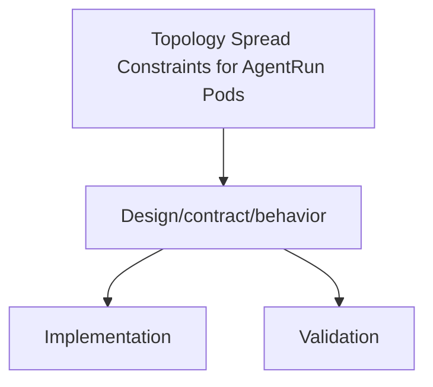

# Topology Spread Constraints for AgentRun Pods

Status: Draft (2026-01-30)

Docs index: [README](README.md)

## Context
AgentRun workloads execute as Kubernetes Jobs created by Jangar. Those job pods already support scheduling controls such as node selectors, tolerations, and affinity. We want first-class topology spread constraints so operators can distribute AgentRun pods across zones, nodes, or other topology domains without changing controller code or hand-editing workloads.

This doc specifies the Helm chart values, template wiring, and runtime behavior for topology spread constraints applied to AgentRun pods in `charts/agents`.

## Goals
- Allow operators to define default topology spread constraints for all AgentRun pods via Helm values.
- Keep the configuration pass-through so users can supply any valid Kubernetes topology spread constraint fields.
- Preserve existing per-run overrides via `AgentRun.spec.runtime.config`.
- Document precedence and interactions with other scheduling knobs.

## Non-goals
- Adding topology spread constraints to the Jangar controller Deployment pod.
- Changing the AgentRun CRD schema.
- Enforcing or validating constraint schemas beyond Helm value shape checks.
- Altering runtime scheduling logic outside of existing default/override behavior.

## Values Schema Shape
The chart exposes topology spread constraints under the controller default workload values:

```
controller:
  defaultWorkload:
    topologySpreadConstraints: []
```

- Type: array of objects (pass-through to the pod spec).
- Validation: `values.schema.json` keeps this as `array<object>` so any valid Kubernetes fields are accepted.
- Recommended fields in each item (Kubernetes standard):
  - `maxSkew` (int)
  - `topologyKey` (string)
  - `whenUnsatisfiable` (`DoNotSchedule` | `ScheduleAnyway`)
  - `labelSelector` (object; e.g. `matchLabels`)
  - Optional fields when supported: `minDomains`, `nodeAffinityPolicy`, `nodeTaintsPolicy`, `matchLabelKeys`.

## Default Behaviors and Precedence
- Default value is empty (`[]`), so no topology spread constraints are applied by default.
- If `controller.defaultWorkload.topologySpreadConstraints` is set, it becomes the default for all AgentRun pods.
- Per-run overrides take precedence:
  - `AgentRun.spec.runtime.config.topologySpreadConstraints` (if provided as an array) overrides the chart default.
  - An explicit empty array in the AgentRun spec clears the chart default.
- If neither is set, the Job pod spec is unchanged and the scheduler ignores topology spread.

## Template Wiring
The chart passes default workload settings to Jangar via environment variables in `charts/agents/templates/deployment.yaml`:

- `controller.defaultWorkload.topologySpreadConstraints` -> `JANGAR_AGENT_RUNNER_TOPOLOGY_SPREAD_CONSTRAINTS`
- `controller.defaultWorkload.nodeSelector` -> `JANGAR_AGENT_RUNNER_NODE_SELECTOR`
- `controller.defaultWorkload.tolerations` -> `JANGAR_AGENT_RUNNER_TOLERATIONS`
- `controller.defaultWorkload.affinity` -> `JANGAR_AGENT_RUNNER_AFFINITY`

Jangar reads those environment variables, then applies them to the Job pod spec unless overridden by `AgentRun.spec.runtime.config.*` fields. Topology spread constraints are only written to the pod spec when the array is non-empty.

## Interactions With Node Selector, Affinity, and Tolerations
Topology spread constraints are evaluated by the scheduler after the node selection rules limit the candidate set.

- **nodeSelector** narrows eligible nodes up front. If it restricts to a single zone or rack, topology spread constraints may become unsatisfiable.
- **affinity/anti-affinity** further restricts placement and can conflict with spread constraints. Prefer aligning pod labels and selectors so the scheduler has a healthy candidate set.
- **tolerations** expand eligibility onto tainted nodes; use them to preserve enough nodes for spreading when clusters are tainted by zone or pool.
- **whenUnsatisfiable** is the safety valve:
  - `DoNotSchedule` enforces strict spread and will leave pods Pending if constraints cannot be met.
  - `ScheduleAnyway` prefers spread but allows co-location when the cluster cannot satisfy the constraint.

Label selectors should target labels that exist on AgentRun pods. Jangar applies standard labels such as:
- `agents.proompteng.ai/agent-run`
- `agents.proompteng.ai/agent`
- `agents.proompteng.ai/provider`
- `agents.proompteng.ai/implementation`

Use these in `labelSelector.matchLabels` to scope spread to a specific agent or provider, or omit the selector to spread across all AgentRun pods in the namespace.

## Examples

### Default spread across zones for all AgentRun pods
```
controller:
  defaultWorkload:
    topologySpreadConstraints:
      - maxSkew: 1
        topologyKey: topology.kubernetes.io/zone
        whenUnsatisfiable: ScheduleAnyway
        labelSelector:
          matchLabels:
            agents.proompteng.ai/agent: codex-agent
```

### Per-run override in AgentRun spec
```
apiVersion: agents.proompteng.ai/v1alpha1
kind: AgentRun
metadata:
  name: codex-run-001
spec:
  runtime:
    type: workflow
    config:
      topologySpreadConstraints:
        - maxSkew: 1
          topologyKey: kubernetes.io/hostname
          whenUnsatisfiable: DoNotSchedule
          labelSelector:
            matchLabels:
              agents.proompteng.ai/agent-run: codex-run-001
```

### Clearing the default for a single run
```
spec:
  runtime:
    type: workflow
    config:
      topologySpreadConstraints: []
```

## Rollout and Testing Considerations
- **Values validation**: run `helm lint charts/agents` or `helm template` with custom values to confirm the JSON array is rendered correctly.
- **Dry-run scheduling**: apply a sample AgentRun with a tight constraint (e.g., hostname) and confirm pods distribute as expected or fail with clear Pending status if `DoNotSchedule` is used.
- **Cluster compatibility**: ensure topology labels exist on nodes (`topology.kubernetes.io/zone`, `kubernetes.io/hostname`) before enabling strict constraints.
- **Fallback behavior**: prefer `ScheduleAnyway` for mixed or small clusters to avoid stalled AgentRun jobs.

## Open Questions
- Do we want to add a top-level `topologySpreadConstraints` for the controller Deployment pod, or keep this scoped to AgentRun workloads only?
- Should the chart surface a short helper example in `charts/agents/README.md` once the feature is promoted beyond design stage?

## Diagram


