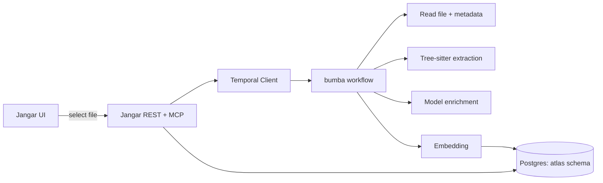
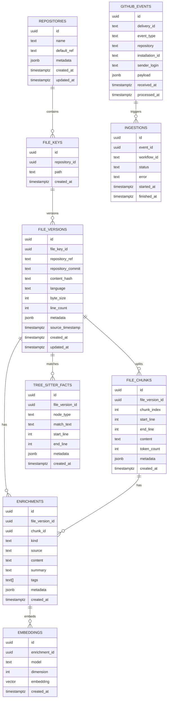
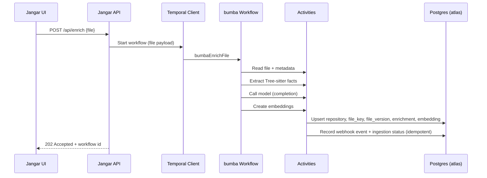

# Atlas Indexing & Semantic Search (Design Doc)

## Summary

This document defines the `atlas` schema and indexing pipeline for file‑level semantic search. The goal is a generic, agent‑friendly retrieval layer that can index code files (and derived context like AST facts and model summaries) and serve fast semantic queries.

## Goals

- Provide a dedicated, Jangar‑owned schema (`atlas`) for code indexing and retrieval.
- Support multi‑source enrichments (AST facts, summaries, notes, etc.).
- Enable fast semantic search with filtering by repo/ref/path/tags.
- Keep ingestion flexible (Temporal workflows + reusable activities).
- Expose generic REST + MCP endpoints (no service‑specific names).
- Ensure webhook‑driven workflows are idempotent and safe to retry.

## Non‑Goals

- Full code graph or cross‑repo dependency graph.
- Replacing `memories` or retrofitting existing memories data.
- Real‑time indexing on every commit (initially on‑demand).

## Architecture Overview



## Data Model (atlas schema)

### Entities

- `repositories`: tracked repos + default refs.
- `file_keys`: stable file identity per repo+path.
- `file_versions`: versioned snapshots (ref/commit/hash).
- `file_chunks`: optional chunk records (future‑proofing).
- `enrichments`: semantic units (summary, AST facts, completion notes).
- `embeddings`: vector storage by model + dimension.
- `tree_sitter_facts`: structured AST matches.
- `github_events`: webhook delivery log for idempotency.
- `ingestions`: workflow runs tied to webhook events.



### Indexing Strategy

- `atlas.file_keys` + `atlas.file_versions`:
  - `path` index for prefix searches.
  - `(repository_ref, repository_commit)` for exact snapshots.
  - GIN index on `metadata` for filters.
- `atlas.enrichments`:
  - `kind`, `tags`, `metadata` indexes for filtering.
- `atlas.embeddings`:
  - IVF‑Flat index on `embedding` with cosine ops.

### Embedding Dimension

The `embedding` column uses a fixed dimension from `OPENAI_EMBEDDING_DIMENSION`. If the configured dimension changes, a migration or regeneration is required.

## Ingestion Workflow (bumba)



## API Surface (generic)

### REST

- `POST /api/enrich`
  - Input: `{ repository, ref, commit?, path, contentHash?, metadata? }`
  - Returns: workflow id or indexing result.
- `GET /api/search`
  - Input: `query`, `limit`, optional `repository`, `ref`, `pathPrefix`, `tags[]`, `kinds[]`.
  - Returns: ranked enrichment results + file metadata.

### MCP

- `atlas.index`
- `atlas.search`
- `atlas.stats`

## Operational Considerations

- Schema and extensions are created lazily on first use.
- Embedding dimension mismatch causes a clear error until migrated.
- Index build uses `ivfflat` lists = 100 (tunable).
- Bumba workflows are reusable and activity‑based for future pipelines.
- Webhook deliveries are idempotent via `github_events.delivery_id` and `ingestions` records.
- Index updates are idempotent by `(file_key_id, repository_ref, repository_commit, content_hash)`.

## Security Notes

- All indexing is scoped to known repo mounts (Jangar PVC).
- Embedding calls use OpenAI‑compatible endpoints (self‑hosted on `190`).
- Inputs are normalized and size‑bounded to avoid model abuse.

## Open Questions

- Whether to chunk files immediately or only when size exceeds a threshold.
- Backfill policy from existing `memories` content (likely no).
- How to version Tree‑sitter grammars or extraction rules and link them in metadata.

## Tree‑sitter Extraction (per file)

We normalize Tree‑sitter output into a stable facts schema:

- Parse file with the language grammar.
- Walk the AST and emit facts like `{ node_type, match_text, start_line, end_line, metadata }`.
- Store those facts in `atlas.tree_sitter_facts` and/or append to `enrichments` metadata.

Pseudocode example (activity):

```ts
const parser = new Parser()
parser.setLanguage(lang)
const tree = parser.parse(source)
const facts = []
walk(tree.rootNode, (node) => {
  if (isInteresting(node)) {
    facts.push({
      node_type: node.type,
      match_text: source.slice(node.startIndex, node.endIndex),
      start_line: node.startPosition.row + 1,
      end_line: node.endPosition.row + 1,
      metadata: { field: node.fieldName },
    })
  }
})
```
