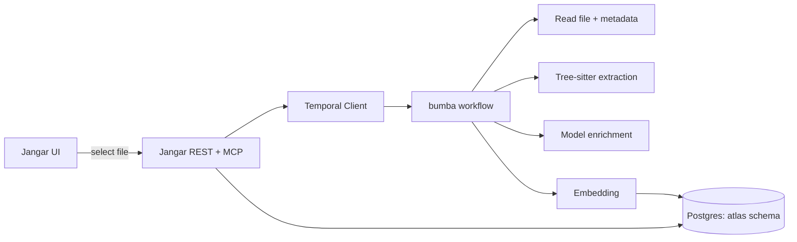
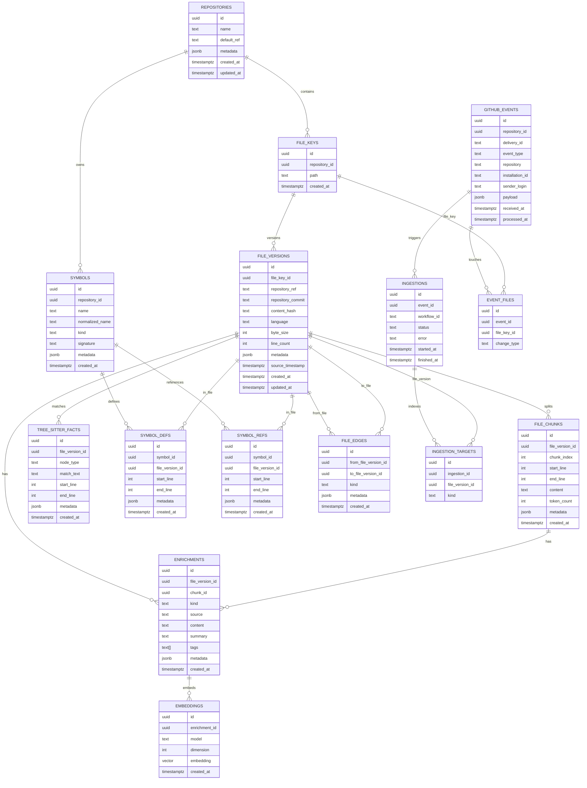
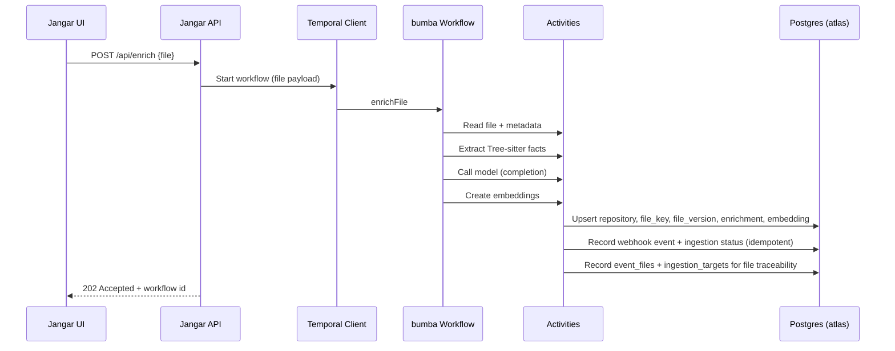

# Atlas Indexing & Semantic Search (Design Doc)

## Summary

This document defines the `atlas` schema and indexing pipeline for file‑level semantic search. The goal is a generic, agent‑friendly retrieval layer that can index code files (and derived context like AST facts and model summaries) and serve fast semantic queries.

## Goals

- Provide a dedicated, Jangar‑owned schema (`atlas`) for code indexing and retrieval.
- Support multi‑source enrichments (AST facts, summaries, notes, etc.).
- Enable fast semantic search with filtering by repo/ref/path/tags.
- Keep ingestion flexible (Temporal workflows + reusable activities).
- Expose generic REST + MCP endpoints (no service‑specific names).
- Ensure webhook‑driven workflows are idempotent and safe to retry.

## Non‑Goals

- Full code graph or cross‑repo dependency graph.
- Replacing `memories` or retrofitting existing memories data.
- Real‑time indexing on every commit (initially on‑demand).

## Architecture Overview



## Data Model (atlas schema)

### Entities

- `repositories`: tracked repos + default refs.
- `file_keys`: stable file identity per repo+path.
- `file_versions`: versioned snapshots (ref/commit/hash).
- `file_chunks`: optional chunk records (future‑proofing).
- `enrichments`: semantic units (summary, AST facts, completion notes).
- `embeddings`: vector storage by model + dimension.
- `tree_sitter_facts`: structured AST matches.
- `symbols` + `symbol_defs` + `symbol_refs`: cross‑file definition/reference graph.
- `file_edges`: explicit file‑to‑file relationships for traversal.
- `github_events`: webhook delivery log for idempotency.
- `ingestions`: workflow runs tied to webhook events.
- `event_files`: map webhook events to file keys.
- `ingestion_targets`: map workflow runs to indexed file versions.



### Indexing Strategy

- `atlas.file_keys` + `atlas.file_versions`:
  - `path` index for prefix searches.
  - `(repository_ref, repository_commit)` for exact snapshots.
  - GIN index on `metadata` for filters.
- `atlas.enrichments`:
  - `kind`, `tags`, `metadata` indexes for filtering.
- `atlas.embeddings`:
  - IVF‑Flat index on `embedding` with cosine ops.
- `atlas.symbols` + `atlas.symbol_defs` + `atlas.symbol_refs`:
  - `normalized_name` + `kind` for symbol lookups.
  - `file_version_id` for traversal from a file.
- `atlas.file_edges`:
  - `(from_file_version_id, kind)` and `(to_file_version_id, kind)` for graph traversal.

### Embedding Dimension

The `embedding` column uses a fixed dimension from `OPENAI_EMBEDDING_DIMENSION`. If the configured dimension changes, a migration or regeneration is required.

## Ingestion Workflow (bumba)



### Ingestion Tracking Details

- Jangar records webhook deliveries in `atlas.github_events` and starts workflows with the actual Temporal workflow ID.
- Bumba workflows create or update `atlas.ingestions` using that workflow ID and the GitHub delivery id.
- `atlas.ingestions.status` is updated to `running` → `completed` (or `failed`/`skipped`) by the workflow itself.
- `atlas.event_files` is populated when a file is indexed, keyed to the webhook delivery id + file key.
- `atlas.ingestion_targets` is populated for each indexed file version with `kind = model_enrichment`.

These links allow full traceability from webhook event → workflow run → file keys → file versions.

### Data Quality Guardrails

- Repository refs are normalized before persistence (e.g., `refs/heads/main` → `main`) to avoid duplicate file_versions.
- When Tree‑sitter yields no interesting nodes, facts fall back to a plain‑text parser so `tree_sitter_facts` isn’t empty for simple formats (e.g., JSON).

## API Surface (generic)

### REST

- `POST /api/enrich`
  - Input: `{ repository, ref, commit?, path, contentHash?, metadata? }`
  - Returns: workflow id or indexing result.
- `GET /api/search`
  - Input: `query`, `limit`, optional `repository`, `ref`, `pathPrefix`, `tags[]`, `kinds[]`.
  - Returns: ranked enrichment results + file metadata.

### MCP

- `atlas.index`
- `atlas.search`
- `atlas.stats`

## Operational Considerations

- Schema and extensions are created lazily on first use.
- Embedding dimension mismatch causes a clear error until migrated.
- Index build uses `ivfflat` lists = 100 (tunable).
- Bumba workflows are reusable and activity‑based for future pipelines.
- Webhook deliveries are idempotent via `github_events.delivery_id` and `ingestions` records.
- Index updates are idempotent by `(file_key_id, repository_ref, repository_commit, content_hash)`.
- Event and ingestion link tables provide traceability from webhook → files → indexed versions.
- Graph traversal is supported by `symbol_defs`/`symbol_refs` (for symbol‑level joins) and `file_edges` (for direct file‑to‑file edges).

## Security Notes

- All indexing is scoped to known repo mounts (Jangar PVC).
- Embedding calls use OpenAI‑compatible endpoints (self‑hosted on `190`).
- Inputs are normalized and size‑bounded to avoid model abuse.

## Open Questions

- Whether to chunk files immediately or only when size exceeds a threshold.
- Backfill policy from existing `memories` content (likely no).
- How to version Tree‑sitter grammars or extraction rules and link them in metadata.
- How to normalize symbols consistently across languages (e.g., module‑qualified names).

## Implementation Task Slices (Argo/Codex)

Use these slices to create one GitHub issue per task (Codex workflow friendly).

1) Atlas schema + Jangar store layer  
   - Scope: create `atlas` schema and Jangar store/service.  
   - Touch: `services/jangar/src/server/atlas-store.ts`, `services/jangar/src/server/atlas.ts`, tests.  
   - Output: auto‑create tables + idempotent upserts.

2) REST + MCP endpoints (generic)  
   - Scope: `POST /api/enrich`, `GET /api/search`, MCP tools `atlas.index|search|stats`.  
   - Touch: `services/jangar/src/routes/api/enrich.ts`, `services/jangar/src/routes/api/search.ts`, MCP handler.  
   - Depends on: task 1 interface.

3) Bumba workflow activities (Tree‑sitter + model + embedding)  
   - Scope: workflow activities + idempotent orchestration.  
   - Touch: `services/bumba/src/activities/*`, `services/bumba/src/workflows/index.ts`.  
   - Depends on: task 1 schema.

4) Jangar UI + sidebar entry  
   - Scope: atlas page with indexed file table + search + enrich trigger.  
   - Touch: `services/jangar/src/components/app-sidebar.tsx`, `services/jangar/src/routes/atlas.tsx`.  
   - Depends on: task 2 endpoints.

5) Script helpers for agents  
   - Scope: bun script that queries `/api/search`.  
   - Touch: `packages/scripts/src/atlas/search.ts`, root script `atlas:search`.  
   - Depends on: task 2 endpoints.

6) Froussard webhook integration  
   - Scope: GitHub webhook -> `/api/enrich` with idempotency.  
   - Touch: `services/froussard/**`.  
   - Depends on: task 2 endpoints + atlas event tables.

## Tree‑sitter Extraction (per file)

We normalize Tree‑sitter output into a stable facts schema:

- Parse file with the language grammar.
- Walk the AST and emit facts like `{ node_type, match_text, start_line, end_line, metadata }`.
- Store those facts in `atlas.tree_sitter_facts` and/or append to `enrichments` metadata.
- Emit symbols + refs + file edges for cross‑file navigation.

Pseudocode example (activity):

```ts
const parser = new Parser()
parser.setLanguage(lang)
const tree = parser.parse(source)
const facts = []
walk(tree.rootNode, (node) => {
  if (isInteresting(node)) {
    facts.push({
      node_type: node.type,
      match_text: source.slice(node.startIndex, node.endIndex),
      start_line: node.startPosition.row + 1,
      end_line: node.endPosition.row + 1,
      metadata: { field: node.fieldName },
    })
  }
  if (isSymbolDef(node)) {
    emitSymbolDef(node)
  }
  if (isSymbolRef(node)) {
    emitSymbolRef(node)
  }
  if (isImportEdge(node)) {
    emitFileEdge(node)
  }
})
```
