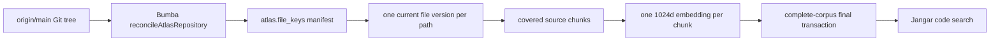

# Atlas Indexing and Search

Status: Current operating contract. The detailed repair, rollout, and acceptance gates live in
[`docs/atlas/production-code-search-design.md`](atlas/production-code-search-design.md).

Atlas is a disposable search cache of the exact current `proompteng/lab` `origin/main` tree. Git is authoritative. The
existing `atlas` PostgreSQL schema is the only corpus: there is no backup corpus, shadow schema, dual writer, or search
fallback.

## Ownership

- Bumba is the only corpus writer. Its only corpus workflow is `reconcileAtlasRepository`.
- Jangar owns migrations, fail-closed health, source preview, HTTP search, and MCP search.
- `atlas.file_keys` is the complete eligible-path manifest.
- Each file key has exactly one current `atlas.file_versions` row and its current chunks and embeddings.
- `atlas.repositories.default_ref` remains `main`. Repository metadata identifies the indexed commit, exact build,
  corpus counts, chunker, embedding model, dimension, progress, and failure state.

The operational states are `maintenance`, `building`, `ready`, and `failed`. All search surfaces are unavailable unless
the repository is exactly `ready` and its stored counts and embedding configuration agree with the database.

## One Reconciliation


```mermaid
flowchart LR
  Git["origin/main Git tree"] --> Bumba["Bumba reconcileAtlasRepository"]
  Bumba --> Manifest["atlas.file_keys manifest"]
  Manifest --> Versions["one current file version per path"]
  Versions --> Chunks["covered source chunks"]
  Chunks --> Embeddings["one 1024d embedding per chunk"]
  Embeddings --> Gate["complete-corpus final transaction"]
  Gate --> Search["Jangar code search"]
```

Reconciliation always resolves the complete current `origin/main` tree; event path lists are traceability, not corpus
authority. It diffs that tree against the manifest, treats renames as delete plus add, and converges duplicate or
out-of-order events to the newest tree.

The writer fences the repository with a build ID and target commit before mutation. It prepares at most
`BUMBA_ATLAS_PREPARE_CONCURRENCY` files at once, commits that bounded batch directly into the existing schema, and sends
Temporal heartbeats with the build ID and persisted progress. A retry resumes the same build from committed database
state. Every manual, UI, and event start uses the same repository-scoped Temporal workflow ID, so Temporal rejects a
second active reconciliation. A database lease supplies a second ownership fence, and repository events are serialized
per repository.

Only the final transaction may publish `ready`. It verifies the exact path manifest, current file version count, chunk
coverage, and embedding coverage before it records the canonical commit and model configuration. A failed or killed
attempt may leave disposable partial rows in the same schema, but search remains unavailable and the next reconciliation
resumes or replaces them.

## Existing Schema Contract

- `repositories`: stable repository identity, `default_ref`, and build/readiness metadata.
- `file_keys`: exactly one row per eligible current path.
- `file_versions`: exactly one current blob per file key.
- `file_chunks`: covered current source regions with chunker and content-hash metadata.
- `chunk_embeddings`: one current embedding per chunk.
- `github_events` and `ingestions`: operational event history, preserved across a corpus reset.
- `enrichments`, `embeddings`, `tree_sitter_facts`, and symbol tables: derived or historical features; they are not a
  second code-search corpus.

The current migration is `services/jangar/src/server/migrations/20260714_atlas_current_corpus.ts`. It repairs these
existing tables in place, enforces one file version per file key, creates path/content trigram indexes, and creates a
cosine HNSW index on `atlas.chunk_embeddings.embedding`.

## Embedding Contract

Atlas uses the existing `qwen3-embedding-saigak:8b` model with a 1,024-dimensional Matryoshka output:

```text
ATLAS_CODE_SEARCH_EMBEDDING_MODEL=qwen3-embedding-saigak:8b
ATLAS_CODE_SEARCH_EMBEDDING_DIMENSION=1024
```

Bumba and Jangar must use the same two values. Query embeddings use the Qwen retrieval instruction; document chunks do
not. A dimension or model mismatch, or any missing eligible chunk embedding, makes the index unavailable. Changing these
values requires truncating and rebuilding the disposable corpus; it must never silently mix embeddings.

## One Search Implementation

`services/jangar/src/server/atlas-code-search.ts` is the search authority. It combines exact path/identifier, lexical,
trigram, and HNSW semantic candidates across the complete current corpus, then deduplicates and ranks them.

All supported entrypoints call that implementation:

- `POST /api/code-search`
- `GET /api/search` as a UI compatibility adapter
- MCP tool `atlas_code_search`
- repository command `bun run atlas:code-search`

There is no direct MCP indexing tool, per-file production writer, partial backfill command, legacy enrichment search, or
silent lexical fallback. Results identify repository, `main`, indexed commit, path, line range, content hash, retrieval
mode, and any degradation. Source preview reads `git show <indexedCommit>:<path>` and verifies the content hash.

## Operator Workflow

Keep the GitHub event consumer disabled during a repair or destructive reset. Start exactly one full reconciliation:

```bash
bun run atlas:rebuild --repository proompteng/lab --ref main
```

Then independently prove Git, PostgreSQL, source preview, search correctness, cancellation, and latency:

```bash
bun run atlas:verify \
  --repository proompteng/lab \
  --ref main \
  --database-url "$DATABASE_URL" \
  --base-url "$ATLAS_BASE_URL"
```

If `origin/main` advances, reconcile and verify again. Re-enable the same event consumer through GitOps only after the
live verifier exits zero, then prove that one later main change converges. Pod health, Argo health, corpus percentages,
or a few plausible searches are not completeness evidence.

## Agent Trust Rule

Until the live Definition of Done in the production design is recorded as passed, Atlas results are navigation leads.
Verify every material path and claim against the exact Git ref and report misses, stale paths, unavailable semantic
search, or fallback behavior instead of hiding the defect with a narrower query.
