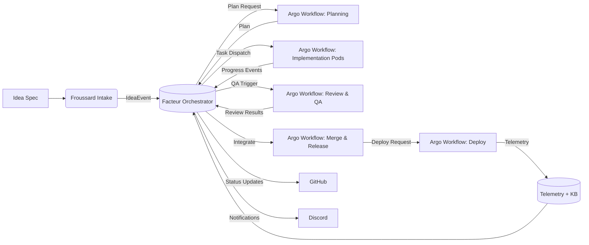

# Autonomous Codex Delivery System

> Note: The production Codex pipeline is now implementation-only. Planning/review references below are historical design notes and should be treated as aspirational until reintroduced.

## 1. Background

The current Codex automation stack is split across two services:

- **Froussard** (`apps/froussard`) ingests GitHub/Discord events, derives Codex prompts, and publishes structured protobuf messages (`github.issues.codex.tasks`) to Kafka. Planning/implementation/review stages are gated inside `apps/froussard/src/webhooks/github/events/*.ts`.
- **Facteur** (`services/facteur`) handles Discord workflows and consumes Codex tasks delivered by the Knative KafkaSource (`argocd/applications/facteur/overlays/cluster/facteur-codex-kafkasource.yaml`) on `/codex/tasks`, orchestrating Argo workflows when enabled.

Limitations:

1. Workflow templates live outside the Facteur codebase, which complicates template/version coordination.
2. Schema management lives inside the vecteur PostgreSQL bootstrap manifest (`argocd/applications/facteur/overlays/cluster/facteur-vector-cluster.yaml`), tying migrations to infrastructure rollouts.
3. There is no persistence of run lifecycle beyond raw logs; no scheduler for multi-task ideas; and no automated deployment governance.

## 2. Goal

Deliver a **fully autonomous development cycle** where a human supplies an “Idea Spec” and Codex agents drive planning, implementation, review, integration, deployment, and post-deploy monitoring without manual coding. Humans only approve when policy demands.

## 3. Functional Requirements

1. Accept structured ideas via GitHub issues or Discord commands.
2. Generate detailed plans (task DAG, milestones, acceptance criteria, risk register).
3. Dispatch multiple Codex execution pods concurrently based on dependencies.
4. Enforce quality gates (tests, lint, security scans, policy).
5. Merge & deploy autonomously when guardrails pass.
6. Monitor production metrics, triggering follow-up automation if regressions appear.
7. Maintain audit logs, run history, and knowledge base for reuse.

## 4. Non-Functional Requirements

| Area | Expectation |
| --- | --- |
| Reliability | Survive transient GitHub/Kafka outages; idempotent workflow submissions. |
| Observability | Trace each idea through all stages with metrics and logs. |
| Security | Least-privilege credentials, approvals for high-risk actions, immutable audit trail. |
| Cost | Autoscale agents, limit concurrent heavy workflows, provide cost attribution per idea. |
| Extensibility | Pluggable policy engine, ability to add new workflow stages or external integrations. |

## 5. Architecture Overview



Key components evolve from the current codebase:

- **Froussard Intake:** extends existing GitHub webhook handler (`apps/froussard/src/webhooks/github.ts`) to capture structured idea metadata.
- **Facteur Orchestrator:** enhances `services/facteur` with durable state, scheduling, and workflow dispatch via the existing Argo runner (`services/facteur/internal/argo/workflow_runner.go`).
- **Argo Workflows:** reuse and expand `argocd/applications/froussard/github-codex-*.yaml` templates; add new integration/deploy templates.
- **Telemetry/Knowledge Base:** expand `codex_kb` schema (now migrated at app startup) to capture run history, embeddings, metrics.

## 6. Detailed Component Changes

### 6.1 Froussard Enhancements

1. **Idea Intake API**
   - Extend GitHub issue parsing (`apps/froussard/src/webhooks/github/events/issues.ts`) to recognise a new idea template.
   - Validate required fields (goal, constraints, success metrics) and publish an `IdeaEvent` payload to a new Kafka topic `codex.intent`.
   - For Discord: add command in `apps/froussard/src/webhooks/discord.ts` to capture free-form ideas, summarise with LLM, and publish same payload.

2. **Plan Generation Triggers**
   - Publish structured task payloads to `github.issues.codex.tasks` for planning/implementation/review, including `ideaId`, dependency hints, and risk labels.
   - Provide plan markers the orchestrator can map back to the idea graph.

### 6.2 Facteur Orchestrator (New Responsibilities)

1. **Configuration**
   - Extend `services/facteur/internal/config/config.go` to include:
     ```yaml
     codex_executor:
       enabled: true
       namespace: argo-workflows
       service_account: facteur-workflow
       templates:
         planning: github-codex-planning
         implementation: github-codex-implementation
         review: github-codex-review
         integration: github-codex-integration
         deploy: github-codex-deploy
       default_parameters:
         planning:
           rawEvent: 'e30=' # base64('{}')
         implementation:
           rawEvent: 'e30=' # base64('{}')
     ```

     `facteur` overwrites these with the real payload at runtime and encodes every JSON blob as base64 so Argo never tries to interpret `{{ ... }}` sequences embedded in user-provided prompts.

2. **Database Migration at Startup**
   - Adopt `pressly/goose` in `services/facteur` (per issue #1626) with migrations under `services/facteur/migrations`.
   - Introduce `internal/migrate` package invoked before server startup (`services/facteur/cmd/facteur/serve.go`).
   - Baseline migration adds existing `codex_kb.runs` / `codex_kb.entries` schema; subsequent migrations augment with idea/task tables.

3. **State Model**

   ```mermaid
   stateDiagram-v2
     [*] --> IdeaRegistered
     IdeaRegistered --> Planning
     Planning --> PlanReady
     PlanReady --> AwaitingDependencies
     AwaitingDependencies --> RunningTasks
     RunningTasks --> QAReview
     QAReview --> Integration
     Integration --> Deployment
     Deployment --> Monitoring
     Monitoring --> Completed
     Monitoring --> Remediation : regression_detected
     Remediation --> RunningTasks
   ```

   - Persist in Postgres tables:
     - `ideas`: id, title, description, initiator, priority, status, created_at.
     - `tasks`: id, idea_id, stage, dependencies, state, codex_run_id.
     - `runs`: extends existing `codex_kb.runs` with plan references.
     - `events`: append-only log of orchestration decisions.

4. **Schedulers & Executors**
   - Listen to Kafka topics (`codex.intent`, existing `github.issues.codex.tasks`, new status topics).
   - Use `services/facteur/internal/argo` runner to submit workflows with stage-specific templates.
   - Implement concurrency controller to limit simultaneous heavy workflows; queue tasks based on priority from Idea Spec.
   - Provide REST/gRPC API for status queries and manual overrides (pause, resume, cancel).

5. **Event Handling Enhancements**
   - Update `/codex/tasks` handler (`services/facteur/internal/server/server.go`) to:
     - Deserialize `CodexTask` proto.
     - Route to stage-specific executor.
     - Record delivery idempotently (deliveryId persisted in `runs`).
     - Emit internal events (`codex.execution`) via Kafka for monitoring/analytics.

6. **Policy Engine**
   - Introduce `internal/policy` module with declarative YAML rules (checked at scheduling & pre-merge). Example policies:
     - Required tests per directory.
     - High-risk labels require human approval.
     - Limit code churn per idea.

### 6.3 Argo Workflow Templates

1. **Planning Template (`github-codex-planning`)**
   - Extend to write plan artifacts into object storage (S3/GCS) and notify orchestrator via callback (POST to Facteur).
   - Include validations to ensure acceptance criteria, DAG, risk list exist.

2. **Implementation Template (`github-codex-implementation`)**
   - Already runs `codex-implement.ts`. Add parameter for `taskId` so logs map back to orchestrator.
   - Publish heartbeat events to Kafka (progress updates, tests run, status).

3. **Review Template (`github-codex-review`)**
   - Add loops for retrying until QA passes or policy halts.
   - Integrate new summary output consumed by orchestrator.

4. **Integration Template (New)**
   - Actions: rebase, ensure status checks, merge to target branch, tag release.  
   - Runs `codex-integration.ts` script that we will create within `apps/froussard/src/codex/cli`.

5. **Deploy Template (New)**
   - Wrap existing deployment scripts (`packages/scripts/src/froussard/deploy-service.ts`, etc.) inside Argo steps.
   - Validate deployment metrics (via metrics API) before signalling success.

## 7. Data Flow & Topics

| Topic | Producer | Consumer | Payload |
| --- | --- | --- | --- |
| `codex.intent` | Froussard | Facteur | Normalised Idea Spec |
| `github.issues.codex.tasks` | Froussard | Facteur executor | Protobuf CodexTask |
| `codex.plan` | Planning workflow | Facteur | Plan artifacts metadata |
| `codex.execution` | Implementation workflow | Facteur, Observability | Progress, logs |
| `codex.review` | Review workflow | Facteur | QA outcomes |
| `codex.deploy` | Deploy workflow | Facteur | Deployment status |
| `codex.telemetry` | All workflows | Observability | Metrics/traces |

## 8. Knowledge Base Integration

- Reuse `codex_kb` schema; add columns for idea/task references, embeddings for prompts and solutions.
- Implement ingestion job post-workflow to store artifacts (prompts, diffs, logs).
- Provide semantic search API (using pgvector) to fetch similar past tasks before planning begins.

## 9. Quality Gates

1. **Automated Tests**
   - Workflow steps must run repo-specific commands (e.g., `bun run lint:<app>`, `go test ./...`).
   - Results appended to progress comment and stored in `runs`.
   - Implementation runs must always auto-commit changes, even on failure, so worktree diffs are authoritative. The progress
     record must match the exact patch produced during the run.

2. **Policy Checks**
   - Integration stage ensures branch protection rules (status checks, reviewer approvals).
   - Deploy stage double-checks environment freeze windows, change budgets.

3. **Human Oversight**
   - High-risk ideas (per policy) require explicit approval comment. Facteur blocks automation until approval event arrives.

## 10. Observability

- Integrate with existing OTEL setup (`services/facteur/internal/telemetry`).
- Emit spans per stage: `codex.planning`, `codex.implementation`, etc.
- Metrics: workflow submissions, success/failure counts, MTTR, queue latency.
- Dashboards: idea lifecycle, agent utilization, policy blocks.
- Alerts: stuck tasks (>N minutes without progress), repeated workflow failures, deploy regression detection.

## 11. Security & Compliance

- Credentials: use Kubernetes secrets mounted into workflows; rotate regularly.
- Audit: Facteur logs prompts, diffs, decisions into append-only storage (ex: object storage + DB).
- Access control: enforce service accounts per stage (planning vs deploy).
- Compliance: maintain history of approvals, policy configs, release metadata.

## 12. Rollout Strategy

1. **Phase 0 – Foundations**
   - Complete Facteur migration runner (issue #1626).
   - Refactor `/codex/tasks` to submit workflows for existing stages; leave Argo sensor in place for fallback.

2. **Phase 1 – Orchestrated Planning & Implementation**
   - Enable Facteur-led planning/implementation dispatch.
   - Persist idea/task state; implement idempotent run tracking.
   - Remove Argo sensor once stable.

3. **Phase 2 – Review & Policy Engine**
   - Add review workflow orchestration, policy enforcement, and knowledge base ingestion.

4. **Phase 3 – Integration & Deploy Automation**
   - Introduce integration/deploy templates; wire in guardrails and post-deploy checks.

5. **Phase 4 – Autonomous Scheduling & Monitoring**
   - Build backlog scheduler, production health feedback loops, and incident triage automation.

6. **Phase 5 – Optimization**
   - Implement semantic suggestions, cost-aware scheduling, continuous improvement analytics.

For each phase:
- Update runbooks, dashboards, and alerting.
- Provide feature flags to fall back to manual control if needed.

## 13. Testing Strategy

- **Unit Tests:** Extend Facteur tests (`services/facteur/internal/..._test.go`) for orchestrator logic, migration runner, policy evaluation.
- **Integration Tests:** Use local KinD + Argo to execute workflows end-to-end with mock issues.
- **Chaos Tests:** Inject Kafka outages/Argo failures to confirm retry handling.
- **Shadow Mode:** Initially run new workflows in parallel, compare outcomes with legacy path.

## 14. Open Questions

1. How should the orchestrator prioritise ideas when compute is scarce? (Heuristics vs. reinforcement learning.)
2. What production metrics constitute “regression” for automated remediation?
3. Do we need human review for security-sensitive areas (secrets, auth flows), and how should policy encode that?
4. Are there compliance constraints requiring approval storage outside Postgres (e.g., external audit system)?

## 15. Next Steps

1. Implement Facteur startup migrations (pressly/goose).
2. Refactor `/codex/tasks` to submit Argo workflows via existing runner.
3. Design `codex.intent` schema and extend Froussard intake.
4. Draft planning workflow changes to emit plan metadata.
5. Prototype orchestrator state machine with Postgres persistence.
6. Define initial policy rules and high-risk approval paths.
7. Prepare runbooks/dashboards for Phase 0 rollout.

This design builds directly on the current codebase, evolving Froussard and Facteur into a cohesive autonomous platform while maintaining incremental rollout safety.

## 16. Docker-Enabled Codex Workflows

- **Image tooling:** `apps/froussard/Dockerfile.codex` now bakes Docker CLI, Buildx, and Compose with default `DOCKER_HOST=tcp://localhost:2375`. `DOCKER_TLS_VERIFY` should be unset for the in-pod daemon (bootstrap treats `0`/`false` as unset). `DOCKER_ENABLED` defaults to `0` in the image and is set to `1` only on WorkflowTemplates that attach the Docker sidecar so non-docker workflows stay untouched.
- **Rootless sidecar:** Every GitHub Codex WorkflowTemplate attaches a `docker:25.0-dind-rootless` sidecar listening on 2375, backed by an `emptyDir` at `/var/lib/docker` that is mounted read-only into the main Codex container to make image layers visible across steps without exposing write access.
- **Bootstrap changes:** `codex-bootstrap` skips redundant `bun install` when `DOCKER_ENABLED=1` and cached modules exist, and it waits for `docker info` only when `DOCKER_ENABLED=1` so docker-ready workflows fail fast while other workflows proceed without delay.
- **Policy guardrails:** A dedicated RBAC binding (`codex-docker-privileged` role in `argocd/applications/argo-workflows/codex-docker-policy.yaml`) scopes privileged pod usage to the Codex workflow service account; review namespace pod-security posture before promotion.
- **Runbooks:** `docs/runbooks/codex-docker.md` documents validation (`docker info`, `docker run hello-world`, sample `docker build`), sidecar restart, and log collection. Roll staging first, monitor node pressure, then promote after Argo sync.
