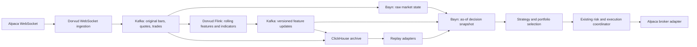

# Bayn streaming market data and Flink features

Status: Proposed implementation design. This document describes the requested architecture, not deployed behavior.
Source baseline: `13c53e073a655fde7250d59b926e71d02ca6c2b9`, inspected September 12, 2026 UTC.
The [current Bayn architecture](architecture.md) remains the reference for the existing runtime.

## Decision

Keep the original Alpaca market events in Kafka. Bayn consumes those events directly with `@platformatic/kafka`.
Extend Dorvud's existing Flink technical-analysis job to consume the same events and publish versioned feature
updates. Bayn joins raw market state with those updates before running strategy, portfolio, risk, and order logic.

Flink owns reusable rolling calculations. Bayn owns the decision about what to trade and whether an order is allowed.
ClickHouse retains raw events and feature revisions for replay. The existing Alpaca integration and feed remain the
inputs for implementation and economic evaluation.

Raw quotes reach Bayn independently of feature production. An execution price must come from a fresh quote, even
when a slower feature window supplies the reason to enter. Flink feature updates do not submit orders or trigger a
second trading scheduler. The account-keyed Restate controller continues to own execution cadence.

## What exists today

| Component           | Source-backed behavior                                                                              | Required change                                                                          |
| ------------------- | --------------------------------------------------------------------------------------------------- | ---------------------------------------------------------------------------------------- |
| WebSocket ingestion | Publishes bars, quotes, and trades to Kafka.                                                        | Preserve raw contracts and record identity.                                              |
| Dorvud archive      | Retains raw Kafka topic, partition, offset, provider, feed, universe, and timestamps in ClickHouse. | Add an archive consumer for the new feature topic.                                       |
| Dorvud TA           | Calculates EMA, MACD, RSI, Bollinger bands, VWAP, and realized volatility.                          | Reuse calculations behind a feature contract with explicit state and availability rules. |
| Bayn market data    | Reads verified rolling snapshots from ClickHouse.                                                   | Add a scoped Kafka adapter and a streaming snapshot constructor.                         |
| Bayn strategy       | Calculates rolling bar metrics and evaluates fresh quotes and trades in TypeScript.                 | Consume prepared window values while retaining strategy comparisons and risk logic.      |

The relevant source paths are:

- [TA job and keyed state](../../services/dorvud/technical-analysis-flink/src/main/kotlin/ai/proompteng/dorvud/ta/flink/FlinkTechnicalAnalysisJob.kt)
- [Raw archive records and Kafka deserialization](../../services/dorvud/technical-analysis-flink/src/main/kotlin/ai/proompteng/dorvud/ta/flink/MarketDataArchiveJob.kt)
- [TA configuration](../../services/dorvud/technical-analysis-flink/src/main/kotlin/ai/proompteng/dorvud/ta/flink/FlinkTaConfig.kt)
- [Bayn resource composition](../../services/bayn/src/composition/resources.ts)
- [Bayn observation window](../../services/bayn/src/observe-composition/intraday-momentum-decision.ts)
- [Bayn strategy core](../../services/bayn/src/strategy/intraday-momentum/decision-core.ts)

The existing TA output is not sufficient as the new contract. Its keyed state groups by symbol, appends bars, and
increments session VWAP without an explicit session reset in `TaSignalsFunction`. Its inherited envelope ingestion
time does not establish when a computed feature became readable. The new feature branch must address those issues
without changing the existing TA topic's meaning for other consumers.

## Streams and universe

The following topic names are existing except for `torghut.market-features.v1`, which this design proposes.

| Topic                        | Purpose                                                                 | Consumer                   |
| ---------------------------- | ----------------------------------------------------------------------- | -------------------------- |
| `torghut.bars.1m.v1`         | Original minute bars and bar updates                                    | Bayn, Flink, archive       |
| `torghut.quotes.v1`          | Original quotes for current market and execution state                  | Bayn, existing TA, archive |
| `torghut.trades.v1`          | Original trades for current market state                                | Bayn, existing TA, archive |
| `torghut.market-features.v1` | Complete feature snapshots for a symbol and window, including revisions | Bayn, feature archive      |

The new feature branch starts with minute bars. Existing Dorvud quote and trade calculations can add feature families
later under explicit definitions. Bayn can already use raw quotes and trades without waiting for those additions.

The [core archive configuration](../../argocd/applications/torghut/market-data-archive/configmap.yaml) currently declares
16 IEX symbols: AAPL, AMD, AMZN, AVGO, COHR, CRDO, IWM, LITE, MRVL, MU, NVDA, QQQ, SMH, SNDK, SPY, and WDC.
That is configured scope, not a claim that every symbol currently has complete live coverage. Flink produces features
for every configured core symbol. Bayn maintains market state for the whole universe.

The current strategy's six candidates and SPY benchmark remain a separate, versioned selection policy. Receiving
16 symbols does not mean selecting 16 positions. Changing candidate eligibility or position limits requires an
explicit strategy revision and evaluation.

Do not join IEX, delayed SIP, overnight, or simulation records by ticker alone. The join identity includes provider,
feed, delay class, universe ID and hash, symbol, market session, and session date. All three consumers derive universe
identity from the same declared configuration rather than maintaining separate symbol lists.

The new topic uses a stable composite identity key, three partitions, three replicas, and 35-day delete retention,
matching the raw topic durability policy. Retain every feature revision; do not compact away historical revisions.
Existing raw topics retain their partitioning. A shared symbol does not imply ordering across topics or partitions.

## Feature contract

Use JSON for the new topic, with a checked-in schema and shared Kotlin/TypeScript fixtures. Preserve existing TA Avro
outputs. Platformatic's [schema-registry integration is experimental](https://github.com/platformatic/kafka), so the
first feature contract does not depend on that API.

Every message is a complete feature snapshot for one identity and one completed window. Consumers do not need an
earlier delta to interpret it.

| Field group | Required content                                                                                           |
| ----------- | ---------------------------------------------------------------------------------------------------------- |
| Contract    | Schema version, feature definition ID and hash, calculation artifact revision                              |
| Identity    | Provider, feed, delay class, universe ID and hash, symbol, market session, session date, calendar identity |
| Window      | Bar duration, inclusive start, exclusive end, session open and close                                       |
| Provenance  | Exact input bar revisions, their Kafka topic/partition/offset, content digests, and source ingestion times |
| Revision    | Logical window ID, immutable feature ID, ordered input digest, correction cause when applicable            |
| Computation | Actual `computedAt`, maximum input event time, maximum source ingestion time                               |
| Quality     | Expected and observed bars, missing intervals, contiguous history length, validity and warmup per feature  |
| Values      | Named values with units, periods, seed rules, rounding, and missing-value reasons                          |

The logical window ID binds identity, definition, and window boundaries. The feature ID additionally binds the
canonical input revisions and calculated values. Reprocessing identical inputs produces the same feature ID even
when transport delivery or `computedAt` differs. A duplicate ID with different semantic content is an error.

Canonicalization must be specified in the schema fixtures. Kafka offsets use decimal strings to avoid JavaScript
integer precision loss. Decimal feature values use canonical decimal strings. Hashes must not depend on Kotlin
serializing `100.0` while JavaScript serializes `100`. Reject non-finite numbers and unknown required definitions at
the consumer boundary.

`computedAt` records producer computation time. Bayn separately records when a message became usable in its local
projection. Neither a bar timestamp nor producer computation time proves Bayn had the feature at that moment.

## Flink calculations and state

Extract reusable indicator calculations from the existing TA operator. Give the new branch separate operator UIDs
and state descriptors, preserving existing consumers and savepoint state. Keep the pinned Flink and connector
versions until compatibility testing supports a change.

The first release publishes only the rolling price-window values used by the current strategy: first open, maximum
high, minimum low, last close, total volume, and coverage for 30 complete one-minute bars. Preserve the current
strategy's numeric rules and prove decision parity before adding indicator-based rules.

The feature definition includes the fixed-point scale and rounding used by Bayn. Flink converts source prices at the
same boundary and produces the same integer values. Kafka carries those integers as decimal strings. The Kotlin and
TypeScript fixtures must include values at rounding and strategy-threshold boundaries.

Dorvud already contains EMA, MACD, RSI, Bollinger, VWAP, and realized-volatility calculations. Add those feature families
when a concrete strategy experiment needs them, reusing the existing formulas where their semantics match. Each
extension declares periods, seed behavior, required history, units, and rounding. A close-weighted price must not be
labeled VWAP, and volatility must state its horizon and annualization. These extensions do not delay the initial
raw-plus-rolling-feature release or silently introduce new entry rules.

State is isolated by the full data identity and exchange session. Session boundaries use a versioned exchange
calendar, including holidays, early closes, and daylight saving changes. The broker calendar remains authoritative
for Bayn's order window; a disagreement blocks entry until resolved.

Within a session, retain one canonical bar revision per minute. Bound state to that session's scheduled minutes and
expire old session state. Resolve retransmissions and corrections using the same explicit precedence rule as the
raw archive reader. For bars at the source baseline, the [archive query](../../services/bayn/src/market-data/intraday/queries.ts)
selects the greatest ingestion time, then partition number, then offset for the same symbol and event time within
the configured topic. Extract this policy into matching fixtures rather than implementing a different arrival-order
winner in Flink. Partition-number precedence is a deterministic tie-break, not evidence of causal recency across
partitions. Conflicting content at the same immutable source coordinates is an error.

A newer canonical correction replaces its previous contribution. Recompute the affected window and publish a new
snapshot for the current completed window. Preserve prior feature messages for audit. A correction cannot insert
later-event data into an earlier window or rewrite a past decision. Historical backfills run with a separate output
identity and cannot overwrite current live feature state.

The initial rolling feature requires all 30 scheduled minute bars in its window. Gaps remain invalid until a complete
window is available. No additional session warmup is imposed. Future indicator families must declare whether they
reset at session open or require earlier history, and carry their own validity. An unavailable optional indicator
cannot invalidate an otherwise complete rolling price window.

Derive each minute bar's exclusive end from its start timestamp and duration. Emit a feature as soon as all required
finalized bars for that completed window are present. Do not wait for the next minute's bar to advance a watermark
past this window: that would add a minute of avoidable delay. Reject premature bars and retain the distinction between
the latest finalized revision and a bar that can never be corrected.

Use event time for window membership and watermarks for progress reporting and bounded state cleanup. A
[Flink watermark](https://nightlies.apache.org/flink/flink-docs-release-2.2/docs/concepts/time/) does not establish
permanent finality or consumer availability. Missing minutes remain visible; their arrival can complete a pending
window. Never fabricate bars to advance a watermark or clear warmup.

Use checkpointed state with at-least-once feature publication initially. Semantic feature IDs absorb duplicates after
recovery. This avoids making feature visibility wait for a Kafka transaction committed at the checkpoint interval.
There is no atomic transaction across Kafka, ClickHouse, and broker orders. Any later switch to transactional feature
publication must account for its added visibility delay and consumer isolation mode.

## Bayn consumption and decision snapshots

Add one process-scoped `@platformatic/kafka` consumer to each execution worker. Each worker needs a complete universe
view because Restate can route the next account pass to any worker. Give each worker its own consumer group and stable
identity for its process lifetime. Sharing one group across independent in-memory worker projections would split
partitions and leave each worker with an incomplete view.

The public status process does not consume the full stream. Repeated consumption across execution workers is an
explicit initial cost. Measure throughput and memory before cutover. If that cost becomes material, move the same
projection contract into a shared market-data process rather than changing group IDs and accidentally sharding state.

The Effect resource owns the client, consumer stream, bounded queue, reducer, and cleanup. Use scoped acquisition,
typed decode failures, bounded reconnect behavior, and cancellation that closes the client. A message becomes usable
only after validation and incorporation into the reducer. Offset commits follow a terminal message disposition,
never queue admission. A rejected message updates the bounded rejection diagnostics and marks its affected symbol
unavailable before advancing the offset. If the identity cannot be decoded, invalidate the affected partition's
coverage. Do not retry malformed bytes indefinitely or count a rejection as usable data.
Backpressure pauses consumption; it does not silently drop inputs. Freshness checks prevent a backlog from becoming
a current trading snapshot.

The reducer retains canonical minute bars, the latest eligible raw quote and trade state, and feature revisions needed
for the current decision window. It orders input application locally and assigns a monotonic local sequence. Older
events cannot overwrite newer quote state merely because they arrived later. Conflicting equal-identity records
produce a typed data error.

At a controller observation time, Bayn takes one immutable cut of that reducer:

1. Bind the current process epoch, local sequence, and incorporated offset for each assigned topic partition.
2. Compute the same decision window as the current protocol, including its two-second delay.
3. Select a feature for that exact window and identity whose inputs have also been observed and whose canonical bar
   revisions match the raw projection. A feature can arrive before its raw inputs; keep it pending until they match.
   Select by matching input revision, not by greatest feature-topic offset: an old feature retried after recovery
   must not replace a corrected feature.
4. Require candidate and benchmark windows to align. Apply per-family completeness and freshness rules. If a raw bar
   correction arrives before its replacement feature, exclude the affected candidate until the values agree.
5. Combine valid window features with fresh quotes and trades, then run the pure strategy and portfolio logic.
6. Persist the snapshot evidence before releasing the observation to the trading path. Bind exact raw records, feature
   IDs and payloads, availability observations, definition hashes, and the projection cut to the decision.

For example, assume the requested window ends at 14:30:00 UTC and all shared inputs are valid:

| Local observation time | New input or controller tick                   | Result                                                        |
| ---------------------- | ---------------------------------------------- | ------------------------------------------------------------- |
| 14:30:01               | Raw bars complete the window                   | Raw state is ready; the matching feature is pending.          |
| 14:30:02               | Controller observes                            | Exclude the candidate because its feature is unavailable.     |
| 14:30:03               | Matching feature arrives and is validated      | It becomes eligible for a later snapshot.                     |
| 14:30:04               | Controller observes with fresh prices          | Use the feature and persist this exact input cut.             |
| 14:30:05               | A contributing raw bar is corrected            | Invalidate the old feature for future snapshots.              |
| 14:30:06               | Controller observes before replacement feature | Exclude the candidate. The 14:30:04 decision stays unchanged. |

An observed-but-old quote does not become fresh because a new feature arrived. The existing event-time quote deadline
still expires the entry approval, and the final mutation transaction still enforces it.

Missing candidate features exclude that candidate with a reason. Missing required benchmark or execution-pricing
evidence makes the observation unavailable. An observation with no eligible candidates cannot become a fabricated
valid `NO_TRADE`. Flink failure does not stop broker reconciliation or the existing position-reducing recovery path.

Introduce a separate verified streaming snapshot type. Both archive and streaming adapters construct the normalized
input consumed by the pure strategy, with their evidence modes preserved. Do not cast Kafka state into the current
archive-verified type or manufacture an archive manifest. Include the new data and feature contract in protocol and
decision identities, even where trading thresholds remain unchanged.

## Startup, restart, and failure behavior

An offset commit is not a durable checkpoint of an in-memory projection. Every replacement worker rebuilds required
state before it can supply an entry snapshot. Do not resume at committed offsets with empty state or default to
`latest` and call the worker ready.

The initial implementation uses this bootstrap algorithm:

1. Fix a bootstrap observation time and derive the protocol's completed window end `E` and required lookback `L`.
   For the initial rolling feature, `L` is 30 minutes. An extension that needs session history must declare that longer
   requirement rather than reusing the shorter bootstrap range.
2. Calculate a common lower time bound `S = E - L - M`, where `M` is the versioned maximum clock-skew and timestamp
   uncertainty allowance. Kafka record timestamps must represent producer ingestion or publication time within that
   allowance. Verify the existing producer and topic timestamp policy before relying on timestamp lookup. A provider
   bar event timestamp alone does not meet this contract.
3. Record the topic partition set and capture each partition's log-start offset and readable end offset `H`, exclusive.
   Resolve the first offset at or after `S` with Kafka timestamp lookup and seek there. Retain these exact bounds in
   bootstrap evidence. If lookup finds no record, start at the captured end for that partition and let data coverage
   checks determine availability. If retained data starts after required history, report the coverage gap.
4. Consume in partition order through every captured `H`, using broker positions rather than assuming numeric offsets
   are contiguous. Apply the same validation and reducer used after bootstrap. Deduplicate any delivery repeats.
   Process features pending on raw inputs once those inputs have arrived.
5. Once every partition crosses its barrier, choose a fresh observation time and construct a normal decision snapshot.
   Require its exact rolling coverage and fresh prices. If catch-up has taken long enough that a newer window is
   required, continue consumption until that window is available. Never serve the old bootstrap window as current.

The timestamp contract is a prerequisite for using the bounded seek. If a topic cannot satisfy it, consume from its
retained beginning under a bounded startup deadline and report unavailable if that cannot recover sufficient data.
Do not guess a later offset. ClickHouse bootstrap is a later optimization and must supply a verified per-partition
coverage cut before Kafka continuation can be trusted.

After crossing the captured barriers, the worker still requires complete bars, compatible features, current quotes
and trades, and successful durable evidence writes. End-offset progress alone is not readiness. Consumer group
reassignment or partition changes invalidate the old projection cut and require a new verified bootstrap boundary.
Broker restarts that preserve assignment resume with duplicates handled by record identity.

| Condition                                                   | Response                                                                                                             |
| ----------------------------------------------------------- | -------------------------------------------------------------------------------------------------------------------- |
| Duplicate raw record or feature                             | Ignore the duplicate semantic update; retain transport provenance where needed.                                      |
| Feature arrives before referenced raw bars                  | Keep pending within a bounded buffer; expire with a visible reason.                                                  |
| Feature missing or stale                                    | Exclude affected candidates; block entry when required shared evidence is missing.                                   |
| Kafka disconnect or sustained backlog                       | Stop accepting stale entry snapshots and continue reconciliation.                                                    |
| Unsupported schema, identity conflict, or invalid timestamp | Record a redacted rejection and invalidate affected data. Do not acknowledge it as usable evidence.                  |
| ClickHouse archive lag                                      | Continue using durable decision evidence if the live inputs are valid; report archive replay coverage as incomplete. |
| PostgreSQL evidence write fails                             | Do not release the snapshot to execution.                                                                            |
| Retention removes required replay data                      | Report the missing interval; do not silently start from a later point.                                               |

## Archive and replay

Extend the Dorvud archive path to consume `torghut.market-features.v1` and write a new append-only feature table, proposed
as `signal.intraday_features_v1`. Archive the complete message, semantic feature ID, feature-topic Kafka coordinates,
and archive observation time. Dorvud owns DDL and writes. Bayn remains a read-only ClickHouse client.

The Kafka feature topic is the handoff between calculation and archival. Avoid independent producer-to-Kafka and
producer-to-ClickHouse writes that can disagree about which feature was actually published. Preserve all semantic
revisions and deduplicate transport retries by source record identity during reads. A latest-value-only table is
insufficient for historical decisions.

Persist full decision inputs with Bayn's existing PostgreSQL decision evidence. Do not put every market quote in the
trading ledger. Decision evidence is sufficient to reconstruct an actual recorded decision even while archival is
lagging; Kafka and ClickHouse supply the broader market history used for experiments.

Replay has two distinct evidence modes:

- **Recorded-decision reproduction.** Reconstruct the exact saved snapshot cut and feed it to the same strategy code.
  Preserve the consumer epoch, local sequence, raw revisions, and selected feature IDs. A later correction is absent
  from an earlier decision unless that earlier evidence actually contained it.
- **Historical strategy experiment.** Replay raw events and feature arrivals through the same reducer. When historical
  Bayn observation order is unavailable, declare a deterministic delivery model and tie-break rule. Producer ingestion
  time, feature computation time, and archive visibility can inform that model but cannot establish actual Bayn
  availability. Results retain that limitation.

Recorded snapshots do not prove when Bayn received every unused record, so they cannot establish arbitrary alternate
strategies' live availability. Regenerating features from old raw data is valid research, but regenerated features
must carry a new run identity and explicit simulated availability. Do not backdate `computedAt` to the bar close.

Freeze universe, feature definitions, strategy, execution costs, delivery assumptions, and date ranges before an
evaluation. Retain incomplete sessions and report net results, costs, drawdown coverage, per-symbol results, and a
benchmark. Feature plumbing and PAPER operation do not establish profitable trading.

## Delivery and acceptance

Implement and validate these increments in order:

1. **Contract and fixtures.** Specify canonical encoding, correction precedence, session calendar, warmup, and numeric
   rules. Kotlin and TypeScript must agree on decoded values and IDs for normal, duplicate, corrected, and invalid
   records. The protocol states required feature families, clock allowance, bootstrap deadline, and feature freshness
   rules explicitly.
2. **Dorvud producer and archive.** Add the isolated feature branch, Kafka topic, and archive table. Verify session
   rollover, gaps, out-of-order bars, corrections, duplicate recovery, source isolation, and savepoint restoration.
   Add `:technical-analysis-flink:test` to Dorvud CI, which currently omits that module's tests.
3. **Bayn shadow consumption.** Add scoped Platformatic resources, complete per-worker projections, bootstrap, snapshot
   evidence, and status. Compare the existing archive decision with the streaming decision at identical available
   input cuts. Record mismatches by cause before enabling streaming decisions for execution.
4. **Replay parity and failure tests.** Reproduce recorded decisions exactly. Test feature-before-raw arrival, raw
   correction-before-feature arrival, interrupted consumption, bounded queues, restart, retention gaps, schema failure,
   missing candidates, unavailable benchmark, and stale execution quotes.
5. **PAPER cutover.** Publish a new protocol/source identity, pass review and required CI, and deliver through the
   existing Kargo and Argo path. Verify exact images and actual consumed records, produced features, snapshot joins,
   decision receipts, and broker outcomes where a strategy decision creates an order. A no-trade session must retain
   its concrete selection or data reasons.

The [Kafka desired state](../../argocd/applications/kafka/strimzi-kafka-cluster.yaml) pins broker version `4.3.1`.
Platformatic's [published support range](https://github.com/platformatic/kafka) currently ends at `4.2.0`. Keep
`@platformatic/kafka` as the chosen client, pin the tested package version, and require a broker-4.3.1 integration test
covering SCRAM-SHA-512, compressed records, offset lookup and commits, disconnects, and reassignment before cutover.
Use the existing authenticated listener on port 9092 and an explicitly provisioned Bayn identity through the repository
secret path. Do not reuse an unrelated identity or switch to the unauthenticated listener to clear a test.

Acceptance measurements include per-partition lag, last usable event age, feature delay after window end, archive lag,
warmup by symbol, pending joins, rejected revisions, queue size, restart time, and eligible/excluded symbols. Capture
p50, p95, and p99 feature availability across complete sessions. The two-second decision delay is the earliest
observation time, not proof that Flink will deliver by then. A late feature may serve a later controller tick while
its window is still the requested window and raw inputs remain valid. Measure missed opportunities and do not silently
widen freshness limits or substitute an older window if delivery is slower.

Rollback selects the previous reviewed source and data mode through the existing promotion and activation contracts.
It must not erase feature history, reinterpret streaming decisions as archive decisions, or restore stale entry
authority. [Release automation](../release-automation.md) remains the delivery procedure.

This design's completion evidence is a verified raw-plus-feature decision path and reproducible replay. Economic
acceptance remains a separate measured result using the existing Alpaca feed and execution assumptions.
