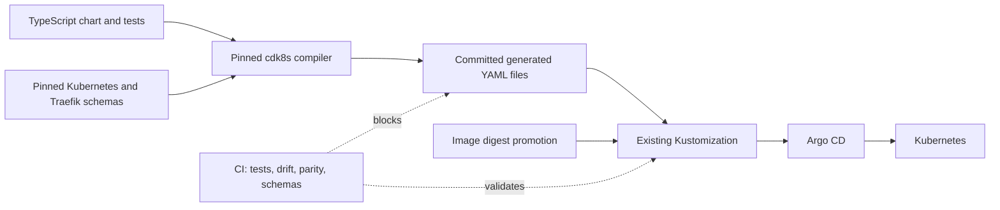

# TypeScript Kubernetes Manifest Authoring with cdk8s

## Status

- Decision: Proposed
- Last verified: 2026-07-09
- Pilot: `docs`
- Runtime source of truth: `argocd/applications/docs/**`
- Application source: `apps/docs/**`
- Cluster: `galactic-tailscale`, Kubernetes `v1.35.0`

This document defines the intended manifest-authoring model. Until an application is migrated, its existing files under
`argocd/applications/**` remain authoritative.

## Executive Decision

Adopt cdk8s as a build-time TypeScript compiler for repository-owned Kubernetes resources. Commit the synthesized YAML
and keep Kustomize and Argo CD as the deployment path.

The first live migration is `docs`. The migration must preserve the exact rendered Deployment, Service, IngressRoute,
and image-promotion contract. It must not disable the application, change its runtime policy, or require TypeScript to
execute inside Argo CD.

The design deliberately separates authoring from reconciliation:

- TypeScript is the source for migrated Kubernetes objects.
- Generated YAML files are the review and GitOps artifacts.
- Kustomize continues to own image digest substitution.
- Argo CD continues to reconcile static YAML.
- CI proves determinism, semantic parity, schema validity, and source/output consistency.

## Why `docs` Is the First Live Pilot

The pilot needs to be live enough to prove rollout safety and small enough to isolate compiler behavior from application
behavior.

| Candidate    | Current state        | Manifest surface                                 | Operational concern                                      | Decision    |
| ------------ | -------------------- | ------------------------------------------------ | -------------------------------------------------------- | ----------- |
| `docs`       | Synced, Healthy, 200 | Deployment, Service, IngressRoute                | Public route; single replica                             | Selected    |
| `analysis`   | Synced, Healthy      | Deployment, ClusterIP Service, Tailscale Service | LoadBalancer allocation and private-only validation      | Later wave  |
| `proompteng` | Synced, Healthy, 200 | Deployment, Service, IngressRoute                | Primary landing site and runtime environment variables   | Later wave  |
| `bumba`      | Synced, Healthy      | Deployment, persistent volume                    | Stateful workspace, secrets, Temporal and model services | Not a pilot |
| `olden`      | Disabled             | No live Application or workload                  | Cannot prove a live, no-diff migration                   | Excluded    |

`docs` is the narrowest useful production proof:

- it is enabled in `argocd/applicationsets/product.yaml`;
- Argo currently reports it `Synced/Healthy`;
- its Deployment is `1/1` Ready and its public endpoint returns HTTP 200;
- it has no Secret, PVC, Job, database, service account, or external runtime dependency;
- its image is digest-pinned through the existing Kustomize `images` block;
- its public route provides an independent smoke test after reconciliation.

The Traefik IngressRoute is useful rather than disqualifying: it proves the CRD import path on one small, pinned custom
resource before broader CRD-heavy applications are considered.

## Current Repository Baseline

The repository already contains two cdk8s experiments, but neither is the target operating model:

- `services/bonjour/infra/**` synthesizes a Deployment, Service, and HPA. Bonjour is disabled and is useful only as a
  compiler canary.
- `packages/cloutt/**` is an older cdk8s-plus experiment whose output is not current GitOps authority.
- `argocd/applicationsets/cdk8s.yaml` has no enabled consumer.
- the Argo repo-server cdk8s plugin installs dependencies and executes synthesis during reconciliation. That adds package
  registry and JavaScript runtime availability to Argo's critical path.

The new path reuses the useful TypeScript experience but removes runtime synthesis from Argo.

## Architecture



### Repository layout

```text
packages/k8s/
  package.json                 # name: @proompteng/k8s
  cdk8s.yaml
  tsconfig.json
  crds/
    traefik-41.0.1.yaml
  src/
    application.ts
    registry.ts
    cli.ts
    synth.ts
    apps/
      docs/
        application.ts
        chart.ts
        chart.test.ts
    imports/
      k8s.ts
      traefik.io.ts
    policy/
      manifest-assertions.ts

argocd/applications/docs/
  generated/
    kustomization.yaml
    deployment-docs.yaml
    ingressroute-docs.yaml
    service-docs.yaml
  kustomization.yaml
```

The chart lives in a dedicated manifest package rather than `apps/docs/infra`. The existing image workflows watch
`apps/docs/**`; keeping manifest-only changes outside that tree prevents an infrastructure edit from rebuilding and
promoting the application image.

Shared constructs are introduced only after a second migrated application needs the same contract. The first chart uses
low-level generated constructs so the pull request exposes every Kubernetes field being preserved.

### Application declaration

`packages/k8s/src/application.ts` defines the registration contract. An application declaration owns its stable name,
namespace, generated output directory, and chart factory:

```ts
import type { Chart } from 'cdk8s'
import type { Construct } from 'constructs'

export interface ApplicationDefinition {
  readonly name: string
  readonly namespace: string
  readonly outputDir: `argocd/applications/${string}/generated`
  readonly create: (scope: Construct) => Chart
}

export const defineApplication = <const T extends ApplicationDefinition>(definition: T): T => definition
```

The `docs` manifest module declares itself in `packages/k8s/src/apps/docs/application.ts`:

```ts
import { defineApplication } from '../../application'
import { DocsChart } from './chart'

export const docsApplication = defineApplication({
  name: 'docs',
  namespace: 'docs',
  outputDir: 'argocd/applications/docs/generated',
  create(scope) {
    return new DocsChart(scope, 'docs', { namespace: 'docs' })
  },
})
```

`packages/k8s/src/registry.ts` is deliberately explicit:

```ts
import { defineApplicationRegistry } from './application'
import { docsApplication } from './apps/docs/application'

export const applicationRegistry = defineApplicationRegistry([docsApplication])
```

`defineApplicationRegistry` fails on duplicate application names, namespaces/output directories that violate policy,
and two applications targeting the same directory. Filesystem auto-discovery is not used; adding one import and one
registry entry is an intentional review boundary.

To declare another application:

1. create `packages/k8s/src/apps/<name>/chart.ts` and `chart.test.ts`;
2. create `application.ts` with `defineApplication({ name, namespace, outputDir, create })`;
3. import that definition into `registry.ts` and add it once;
4. run `bun run --filter @proompteng/k8s synth -- --app <name>`;
5. add the generated directory to the application's Kustomization only after parity validation passes.

## Authoring Contract

### Resource identity

- Set every `metadata.name` and `metadata.namespace` explicitly.
- Never allow construct paths or generated hashes to define a live Kubernetes name.
- Preserve the existing `apiVersion`, `kind`, namespace, name, selectors, ports, and route match.
- Reuse one labels value for Deployment selectors, pod labels, and Service selectors.
- Do not emit Namespace resources; ApplicationSet namespace management remains authoritative.
- Do not emit plaintext Secret resources.

### Inputs and output

- Pin `cdk8s`, `cdk8s-cli`, and `constructs` in the Bun workspace lockfile.
- Generate Kubernetes L1 constructs from `k8s@1.35.0` and commit the imports.
- Vendor the Traefik IngressRoute CRD from chart `41.0.1`, the version pinned in
  `argocd/applications/traefik/kustomization.yaml`, and generate committed L1 bindings from that file.
- Synthesis may read only committed inputs. Environment variables must not change production values.
- Produce exactly one YAML file per Kubernetes resource. Each file contains one document and is named
  `<kind-kebab>-<metadata.name>.yaml`; synthesis fails on filename or resource-identity collisions.
- Generate a `kustomization.yaml` inside the output directory with a sorted, explicit list of the resource files.
- Exclude timestamps, Git revisions, absolute paths, random values, and dependency banners from output.
- Generated files are changed only by the synth command.

### Kustomize boundary

The generated Deployment retains the logical image name `registry.ide-newton.ts.net/lab/docs`. The existing
Kustomization retains the digest and remains the write-back target for release automation.

```yaml
resources:
  - generated
images:
  - name: registry.ide-newton.ts.net/lab/docs
    newName: registry.ide-newton.ts.net/lab/docs
    digest: sha256:...
```

The generated directory is itself a Kustomization:

```yaml
apiVersion: kustomize.config.k8s.io/v1beta1
kind: Kustomization
resources:
  - deployment-docs.yaml
  - ingressroute-docs.yaml
  - service-docs.yaml
```

cdk8s must not embed the promoted digest. This keeps manifest authoring independent from image publication and avoids
changing the existing automated release contract.

## `docs` Pilot Contract

The migration is mechanical. No hardening, scaling, image, or routing changes belong in the pilot pull request.

### Deployment

The synthesized `Deployment/docs` must preserve:

- namespace `docs`;
- selector and pod label `app: docs`;
- rolling update with `maxSurge: 0` and `maxUnavailable: 1`;
- node selector `kubernetes.io/arch: arm64`;
- one `docs` container using logical image `registry.ide-newton.ts.net/lab/docs`;
- CPU request `200m`, CPU limit `1`, memory request `256Mi`, and memory limit `512Mi`;
- container port `3000`.

The existing manifest does not define probes or container security settings. Adding them is valuable follow-up work, but
combining it with the compiler cutover would make semantic-parity review impossible.

### Service

The synthesized `Service/docs` must preserve:

- namespace `docs`;
- selector `app: docs`;
- port `80` targeting container port `3000`.

### IngressRoute

The synthesized `IngressRoute/docs` must preserve:

- API `traefik.io/v1alpha1`;
- entry points `web` and `websecure`;
- route match ``Host(`docs.proompteng.ai`)``;
- backend `Service/docs` on port `80`.

### Non-change proof

Before the Kustomization is switched, normalize both the handwritten and synthesized objects by
`apiVersion/kind/namespace/name` and compare their complete object bodies. YAML ordering and comments are the only
allowed differences. Any spec, metadata, or object-set difference blocks the migration.

## Compiler and CI Design

`packages/k8s/package.json` is named `@proompteng/k8s` and exposes these commands:

| Command                                           | Responsibility                                                         |
| ------------------------------------------------- | ---------------------------------------------------------------------- |
| `synth -- --app <name>`                           | Replace one application's validated per-resource output directory      |
| `synth:check -- --app <name>`                     | Compare one clean output directory with tracked output without writing |
| `synth:check -- --all`                            | Check every registered application without writing                     |
| `test`                                            | Run registry, chart structure, and policy tests                        |
| `imports:check`                                   | Regenerate pinned L1 imports and fail on schema drift                  |
| `parity -- --app <name> --baseline <path-or-ref>` | Compare normalized handwritten and generated resources during cutover  |

The package scripts are thin aliases over the single CLI:

```json
{
  "name": "@proompteng/k8s",
  "private": true,
  "type": "module",
  "scripts": {
    "synth": "bun run src/cli.ts synth",
    "synth:check": "bun run src/cli.ts check",
    "test": "bun test",
    "imports:check": "bun run src/cli.ts imports-check",
    "parity": "bun run src/cli.ts parity"
  }
}
```

The normal invocation from the repository root is:

```bash
bun run --filter @proompteng/k8s synth -- --app docs
bun run --filter @proompteng/k8s synth:check -- --all
```

### Generation flow

`src/cli.ts` does not discover applications or infer output directories. It performs the following steps:

1. parse `--app`, require exactly one registered name for a writing synthesis, and reject unknown names;
2. look up the `ApplicationDefinition` in the explicit registry;
3. create a staging directory beside the declared output directory so every rename stays on one filesystem;
4. instantiate a cdk8s `App` with `YamlOutputType.FILE_PER_RESOURCE`, `outputFileExtension: '.yaml'`, and construct
   metadata disabled; construct only the selected chart and synthesize into staging;
5. load each synthesized file, require exactly one Kubernetes document per file, and run identity, Namespace/Secret,
   selector, image, and application-specific policy assertions;
6. rename every staged manifest to `<kind-kebab>-<metadata.name>.yaml`, reject collisions, and sort the filenames;
7. emit a staged `kustomization.yaml` containing the sorted, explicit resource list;
8. in write mode, swap the validated staged directory into `outputDir`, retaining the old directory as a rollback backup
   until the swap succeeds;
9. in check mode, recursively compare the staged directory with tracked output and exit non-zero on added, removed, or
   changed files without modifying the worktree;
10. restore the backup on a failed swap and remove staging/backup directories in a `finally` block.

Writing `--all` is intentionally unsupported so one failed chart cannot leave a partially regenerated multi-application
worktree. CI uses the non-writing `synth:check -- --all` path.

CI runs only when the manifest package, imported schemas, generated output, Kustomization, or lockfile changes. It must:

1. install with the repository's pinned Bun version and frozen lockfile;
2. run formatting, Oxlint, TypeScript checking, and chart tests;
3. synthesize twice and compare hashes;
4. fail if tracked generated YAML differs from a clean synthesis;
5. validate generated YAML and the final Kustomize render with kubeconform;
6. run strict server-side dry-run where the in-cluster CI identity is available;
7. reject Namespace and plaintext Secret objects;
8. verify the final image is still digest-pinned after Kustomize rendering.

Synthesis writes the complete resource set to a temporary directory first and swaps the tracked directory only after
every manifest and the generated Kustomization pass. A failed chart or import must not leave partially regenerated GitOps
state.

## Migration and Rollout

### Phase 1: establish the compiler

- Add `packages/k8s` as workspace package `@proompteng/k8s` with the typed definition registry and pinned dependencies.
- Generate and commit Kubernetes 1.35 and Traefik 41.0.1 L1 imports.
- Add deterministic synthesis, transactional output-directory swaps, policy assertions, and blocking CI.
- Repair Bonjour only enough to use it as a disabled compiler canary; do not enable it or retain Argo runtime synthesis
  as the target design.

### Phase 2: synthesize `docs` without changing Argo input

- Implement the `docs` chart and structural tests.
- Generate `deployment-docs.yaml`, `ingressroute-docs.yaml`, `service-docs.yaml`, and the generated Kustomization under
  `argocd/applications/docs/generated/` alongside the handwritten files.
- Run full normalized parity against the current Deployment, Service, and IngressRoute.
- Review the generated YAML as the intended live object set.

### Phase 3: cut over the live application

- Change only `argocd/applications/docs/kustomization.yaml` to reference the generated directory.
- Remove the three superseded handwritten resource files in the same pull request.
- Confirm the final Kustomize render is semantically identical to the pre-migration render.
- Capture the current Deployment revision, ReplicaSet, pod UID, Service cluster IP, and IngressRoute before merge.
- Merge through the normal GitOps path and sync root/`docs` through Argo.

Because the rendered objects are identical, Argo should show no live-object diff and Kubernetes should not create a new
ReplicaSet. If Argo reports a spec change, stop before sync and fix parity.

### Live acceptance gates

The pilot succeeds only when all of the following are true at the implementation revision:

- root and `docs` are `Synced/Healthy`;
- `Deployment/docs` remains `1/1` Ready;
- no unexpected ReplicaSet or pod rollout occurred;
- `Service/docs` retains its cluster IP and ready endpoint;
- `IngressRoute/docs` retains both entry points, host match, and backend;
- `https://docs.proompteng.ai/` returns HTTP 200;
- the final live image equals the digest in Kustomization;
- a clean synthesis produces no Git diff.

## Rollback

Do not disable `docs` to roll back the authoring change.

1. Revert the migration commit so Kustomization references the handwritten manifests again.
2. Run Kustomize build, kubeconform, and strict server dry-run on the revert.
3. Merge and let Argo reconcile the previous static YAML through the normal GitOps path.
4. Verify Argo health, Deployment readiness, Service endpoints, IngressRoute routing, and HTTP 200.

Since resource identities are unchanged, rollback is an in-place desired-state revert. Application deletion, namespace
deletion, and manual workload recreation are not part of the rollback path.

## Adoption Sequence After `docs`

Expansion is based on manifest complexity and runtime blast radius, not directory size alone.

| Wave | Applications                    | New capability proved                                       |
| ---- | ------------------------------- | ----------------------------------------------------------- |
| 1    | `docs`                          | Live no-diff cutover; core resources; one pinned CRD        |
| 2    | `analysis`, `proompteng`        | Tailscale Service annotations; environment values           |
| 3    | `app`, `synthesis`, `oirat`     | Broader routing, configuration, RBAC, and sealed references |
| 4    | `bumba`, `froussard`, `forgejo` | Persistence, secrets, workers, and third-party composition  |
| 5    | `agents`, `jangar`, `torghut`   | Large CRD-heavy control planes and stateful dependencies    |

Third-party Helm releases and remote vendor bases remain Helm/YAML unless a separate decision demonstrates a concrete
maintenance benefit. Shared higher-level constructs require at least two proven consumers and their own tests.

## Rejected Alternatives

### Synthesize inside Argo CD

Rejected because reconciliation would depend on Bun, dependency installation, package registry availability, and
arbitrary TypeScript execution in the repo-server. It would also hide generated YAML from normal pull-request review.

### Keep generated YAML uncommitted

Rejected because reviewers and image-promotion automation need the exact desired-state artifact in Git. A CI artifact is
not an adequate GitOps source of truth.

### Start with a disabled application

Rejected because it proves compiler output but not live semantic parity, no-op reconciliation, routing, release
automation compatibility, or rollback. Disabled Bonjour remains a tooling canary; disabled Olden is not an adoption
pilot.

### Start with a control-plane or stateful application

Rejected because storage, secrets, operators, and runtime dependencies would make it difficult to distinguish compiler
defects from workload-specific rollout failures.

### Adopt cdk8s-plus in the first wave

Rejected for the parity phase because higher-level constructs can introduce names, labels, defaults, and relationships
that differ from the current wire contract. Reconsider only after the low-level path is proven.

## Adoption Completion Criteria

cdk8s adoption is established when:

- `docs` is live from committed TypeScript-generated YAML with no behavior change;
- source/output drift and imported-schema drift are blocking CI failures;
- the image digest promotion workflow continues to update Kustomization successfully;
- at least one second live application reuses the compiler contract;
- the Argo cdk8s plugin has no consumer and is removed;
- every migrated application has a recorded semantic baseline, rollout proof, and in-place rollback path.

## References

- [cdk8s overview](https://cdk8s.io/docs/latest/)
- [cdk8s synthesis and output configuration](https://cdk8s.io/docs/latest/cli/synth/)
- [cdk8s L1 imports](https://cdk8s.io/docs/latest/cli/import/)
- [cdk8s testing utilities](https://cdk8s.io/docs/latest/basics/testing/)
- [cdk8s API object naming](https://cdk8s.io/docs/latest/basics/api-object/)
- [Argo CD Kustomize integration](https://argo-cd.readthedocs.io/en/stable/user-guide/kustomize/)
- [Kubernetes server-side dry-run](https://kubernetes.io/docs/reference/kubectl/generated/kubectl_apply/)
