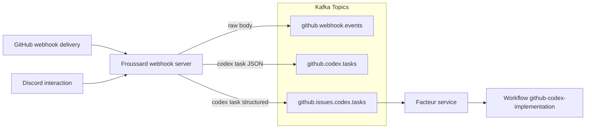

# Codex Issue Automation Workflow

This guide explains how the single-stage Codex implementation pipeline works and how to verify it after deployment.

## Architecture

1. **Froussard** consumes GitHub webhooks and normalises them into Kafka topics (`github.codex.tasks`, `github.issues.codex.tasks`). It emits `stage=implementation` tasks immediately when an authorized login opens an issue, or when an authorized comment with `implement issue` is posted.
2. **Facteur** subscribes to the structured mirror via Knative Eventing (`/codex/tasks`). When `codex_implementation_orchestrator.enabled` is `true` it persists implementation tasks into `codex_kb` and submits the `github-codex-implementation` WorkflowTemplate. If the flag is disabled, Facteur logs the delivery and no workflow is dispatched. You can re-enable a legacy Argo Events trigger with `argocd/applications/froussard/components/codex-implementation-argo-fallback/` if needed.
3. The **WorkflowTemplate** runs the Codex container (headless) via [Argo Workflows](https://argo-workflows.readthedocs.io/en/stable/).
   - `stage=implementation`: `codex-implement.ts` executes the implementation prompt, pushes the feature branch, opens a draft PR, maintains the `<!-- codex:progress -->` comment via `codex-progress-comment.ts`, and records the full interaction in `.codex-implementation.log` (uploaded as an Argo artifact).



Run `facteur codex-listen --config <path>` to stream the structured payloads while you build consumers; the command uses the
`github.issues.codex.tasks` topic and mirrors the behaviour of the Knative KafkaSource. In production the same feed reaches
Facteur via `argocd/applications/facteur/overlays/cluster/facteur-codex-kafkasource.yaml`. When
`codex_implementation_orchestrator.enabled` is `false` the handler logs stage/repository/issue metadata for observability; once
enabled, implementation payloads enqueue the `github-codex-implementation` WorkflowTemplate, persist intake data, emit structured
logs (`workflow submitted: stage=implementation`), and surface workflow metadata before committing the Kafka message.
## Prerequisites

- Use the **Codex Task** GitHub issue template (`.github/ISSUE_TEMPLATE/codex-task.md`) when opening automation requests. The form keeps summary, scope guardrails, validation commands, and the Codex prompt structured so Froussard can forward them directly to the Argo workflows.
- Secrets `github-token` and `codex-openai` in `argo-workflows` namespace.
- Discord secrets regenerated in `argocd/applications/froussard/discord-secrets.yaml` (provides both `discord-bot` and `discord-codex-bot` sealed manifests).
- Kafka topics `github.webhook.events`, `github.codex.tasks`, and `github.issues.codex.tasks` deployed via Strimzi.
- Argo Events resources under `argocd/applications/froussard/` synced.

## Manual End-to-End Test

### Discord Channel Integration

Codex now mirrors implementation output into a per-run Discord channel when the bot credentials are present.

1. **Provision the secret**
   - Run `bun run froussard:reseal` (requires `op`, `kubectl`, and `kubeseal`) to refresh `argocd/applications/froussard/discord-secrets.yaml` with sealed values for `bot-token`, `guild-id`, and optionally `category-id`.
   - Argo CD reconciles the sealed secret into an opaque secret named `discord-codex-bot` in `argo-workflows`.
2. **Verify workflow envs**
   - The `github-codex-implementation` template injects `DISCORD_BOT_TOKEN`, `DISCORD_GUILD_ID`, and `DISCORD_CATEGORY_ID` into the Codex container. Streaming only activates when the token and guild id are present.
3. **Dry-run locally**
   - Exercise the channel flow without touching Discord by piping sample output:
     ```bash
     printf 'hello discord\nthis is a dry run\n' | \
       bunx tsx apps/froussard/scripts/discord-channel.ts \
         --stage implementation \
         --repo proompteng/lab \
         --issue 999 \
         --run-id local-test \
         --dry-run
     ```
   - Expect stderr to show the fabricated channel name, metadata banner, and echoed log lines.
4. **End-to-end smoke check**
   - Trigger an implementation workflow and confirm a new Discord channel appears under the configured category with the Codex transcript streaming live.

### Implementation Progress Comment Lifecycle

- Codex owns a single issue comment anchored by `<!-- codex:progress -->`; the helper at `apps/froussard/src/codex/cli/codex-progress-comment.ts` keeps it consistent.
- On implementation kickoff the helper seeds a checklist from the issue context/template, marks the active step, and appends a short status section (tests run, blockers, next action).
- After every meaningful milestone the comment is updated in-place so reviewers can follow along without reading the Argo logs.
- When work finishes, the checklist is fully checked, the transient status block is replaced with the final summary/validation notes, and the same comment becomes the permanent implementation recap.
- Provide the comment body via stdin or `--body-file`; set `ISSUE_REPO`, `ISSUE_NUMBER`, and (optionally) `CODEX_PROGRESS_COMMENT_MARKER`/`CODEX_PROGRESS_COMMENT_LOG_PATH` before invoking the helper.
- Use `--dry-run` when validating changes locally—this prints the resolved body/action without mutating GitHub.

1. **Create a test issue** in `proompteng/lab` (while logged in as `gregkonush`).
   - Watch for a new workflow named `github-codex-implementation-*`; it should push a branch (`codex/issue-<number>-*`), open a draft PR, and upload `.codex-implementation.log` as an artifact.
2. **Manual override (optional)**: comment `implement issue` on the issue to retrigger implementation if automation stalls.
   - Confirm a single progress comment remains on the issue, anchored by `<!-- codex:progress -->`, with validation results and the final status.
   - The issue gains a follow-up comment linking to the PR.

## Helpful Commands

- Inspect workflows:
  ```bash
  argo list -n argo-workflows
  argo get <workflow-name> -n argo-workflows
  argo logs <workflow-name> -n argo-workflows
  ```
- Peek at Kafka traffic:
  ```bash
  kubectl -n kafka run kafka-cli --rm -it --image=strimzi/kafka:0.47.0-kafka-3.7.0 -- /bin/bash
  bin/kafka-console-consumer.sh --bootstrap-server kafka-kafka-bootstrap:9092 \
    --topic github.codex.tasks --from-beginning
  ```

## Direct Workflow Smoke Tests

Trigger the implementation flow directly. Encode both parameters as base64 before submitting so Argo treats the JSON as opaque text:

```bash
RAW_EVENT=$(printf '{}' | base64 | tr -d '\n')
EVENT_BODY=$(cat <<'JSON' | base64 | tr -d '\n'
{"stage":"implementation","prompt":"<codex prompt>","repository":"proompteng/lab","issueNumber":999,"base":"main","head":"codex/test","issueUrl":"https://github.com/proompteng/lab/issues/999","issueTitle":"Codex dry run","issueBody":"Testing orchestration"}
JSON
)
argo submit --from workflowtemplate/github-codex-implementation -n argo-workflows \
  -p rawEvent="$RAW_EVENT" \
  -p eventBody="$EVENT_BODY"
```

The implementation workflow writes verbose output to `/workspace/lab/.codex-implementation.log`; inspect the artifacts in Argo if you need the full Codex transcripts.

### Cleanup After Manual Tests

When you finish a dry run, clean up the temporary artefacts so production dashboards stay quiet:

- Delete the ad-hoc test issue/PR opened during the run (or close the GitHub ticket if you re-used an existing one).
- Remove the Codex Discord channel created for the rehearsal.
- Prune completed workflows to avoid clutter in Argo:
  ```bash
  argo delete --older 24h -n argo-workflows github-codex-implementation-999
  ```
- Clear any Kafka offsets for local consumers (`facteur codex-listen`) if you plan to re-run the scenario.

## Manifest & CI Safety Checks

Whenever you introduce a new Codex workflow or touch the surrounding manifests, run the validation scripts locally before opening a PR:

- `bun run --filter froussard test`
- `scripts/argo-lint.sh` (offline Argo lint of any Workflow/WorkflowTemplate YAML)
- `scripts/kubeconform.sh argocd` (kubeconform with custom CRD schemas)

Both lint scripts are what CI uses, so matching their output locally keeps Argo CD syncs clean.

## Troubleshooting

- **Implementation not triggered**: verify the webhook secret, Kafka topic health, and that Facteur is running with `codex_implementation_orchestrator.enabled=true`.
- **Draft PR missing**: confirm the GitHub token has `repo` scope and the workflow pod can push.
- **Merge conflicts**: resolve conflicts (or rebase), then comment `implement issue` to rerun implementation on a clean base.
- **Ready-to-merge signal**: when the branch is clean and a 👍 reaction exists, Froussard posts the `:shipit:` ready comment. It does not undraft PRs automatically.
