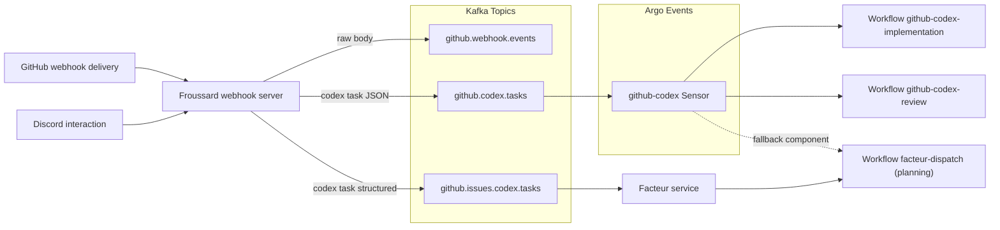

# Codex Issue Automation Workflow

This guide explains how the three-stage Codex automation pipeline works and how to verify it after deployment.

## Architecture

1. **Froussard** consumes GitHub webhooks and normalises them into Kafka topics (`github.codex.tasks`, `github.issues.codex.tasks`). When the planning workflow leaves a `<!-- codex:plan -->` marker the service promotes the issue to implementation, mirroring GitHub’s recommended pattern for approval comments (see the [GitHub webhooks guide](https://docs.github.com/en/webhooks-and-events/webhooks/about-webhooks)).
2. **Facteur** subscribes to the structured mirror via Knative Eventing (`/codex/tasks`) and, when `codex_dispatch.planning_enabled` is `true`, persists planning-stage `proompteng.froussard.v1.CodexTask` payloads into `codex_kb`, dispatches the shared `facteur-dispatch` WorkflowTemplate, and records the correlation ID from the Kafka delivery identifier while emitting OTEL spans tagged `codex.stage=planning`. With the flag disabled it logs the delivery and defers to the legacy Argo Events trigger; the optional component at `argocd/applications/froussard/components/codex-planning-argo-fallback/` re-adds the planning dependency/trigger if you need to roll back.
3. **Argo Events** (`github-codex` EventSource/Sensor) continues to consume the JSON stream (`github.codex.tasks`) for implementation and review handoffs.
   - `github-codex-implementation` for approved plans.
   - `github-codex-review` for review/maintenance loops until the PR becomes mergeable.
4. Each **WorkflowTemplate** runs the Codex container (`gpt-5.1-codex-max` with `--reasoning high --search --mode yolo`), orchestrated by [Argo Workflows](https://argo-workflows.readthedocs.io/en/stable/).
   - `stage=planning`: `codex-plan.ts` (via the `facteur-dispatch` template) generates a `<!-- codex:plan -->` issue comment and logs its GH CLI output to `.codex-plan-output.md`. Facteur prefixes runs with `codex-planning-` to keep planner workflows distinct, and the Argo Events fallback reuses the same template if re-enabled.
   - `stage=implementation`: `codex-implement.ts` executes the approved plan, pushes the feature branch, opens a **draft** PR, maintains the `<!-- codex:progress -->` comment via `codex-progress-comment.ts`, and records the full interaction in `.codex-implementation.log` (uploaded as an Argo artifact).
   - `stage=review`: `codex-review.ts` consumes the review payload, synthesises the reviewer feedback plus failing checks into a new prompt, reuses the existing Codex branch, and streams the run into `.codex-review.log` for artifacts and Discord updates.
   - Each template carries a `codex.stage` label so downstream sensors can reference the stage without parsing the workflow name.
4. Review automation is now opt-in: Froussard only emits `stage: "review"` payloads when an authorized collaborator comments `@tuslagch review` on the pull request. PR mergeability, outstanding threads, or check failures no longer trigger review runs automatically.



Run `facteur codex-listen --config <path>` to stream the structured payloads while you build consumers; the command uses the
`github.issues.codex.tasks` topic and mirrors the behaviour of the Knative KafkaSource. In production the same feed reaches
Facteur via `argocd/applications/facteur/overlays/cluster/facteur-codex-kafkasource.yaml`. When `codex_dispatch.planning_enabled` is `false` the handler logs
stage/repository/issue metadata for observability; once the flag flips, planning payloads enqueue the `facteur-dispatch`
WorkflowTemplate, persist intake data, emit structured logs (`workflow submitted: stage=PLANNING …`), and surface workflow metadata before committing the Kafka message.
## Prerequisites

- Use the **Codex Task** GitHub issue template (`.github/ISSUE_TEMPLATE/codex-task.md`) when opening automation requests. The form keeps summary, scope guardrails, validation commands, and the Codex prompt structured so Froussard can forward them directly to the Argo workflows.
- Secrets `github-token` and `codex-openai` in `argo-workflows` namespace.
- Discord secrets regenerated in `argocd/applications/froussard/discord-secrets.yaml` (provides both `discord-bot` and `discord-codex-bot` sealed manifests).
- Kafka topics `github.webhook.events`, `github.codex.tasks`, and `github.issues.codex.tasks` deployed via Strimzi.
- Argo Events resources under `argocd/applications/froussard/` synced.

## Manual End-to-End Test

### Discord Channel Integration

Codex now mirrors planning and implementation output into a per-run Discord channel when the bot credentials are present.

1. **Provision the secret**
   - Run `bun run froussard:reseal` (requires `op`, `kubectl`, and `kubeseal`) to refresh `argocd/applications/froussard/discord-secrets.yaml` with sealed values for `bot-token`, `guild-id`, and optionally `category-id`.
   - Argo CD reconciles the sealed secret into an opaque secret named `discord-codex-bot` in `argo-workflows`.
2. **Verify workflow envs**
   - The `facteur-dispatch` (planning), `github-codex-implementation`, and `github-codex-review` templates inject `DISCORD_BOT_TOKEN`, `DISCORD_GUILD_ID`, and `DISCORD_CATEGORY_ID` into the Codex container. Streaming only activates when the token and guild id are present.
3. **Dry-run locally**
   - Exercise the channel flow without touching Discord by piping sample output:
     ```bash
     printf 'hello discord\nthis is a dry run\n' | \
       bunx tsx apps/froussard/scripts/discord-channel.ts \
         --stage planning \
         --repo proompteng/lab \
         --issue 999 \
         --run-id local-test \
         --dry-run
     ```
   - Expect stderr to show the fabricated channel name, metadata banner, and echoed log lines.
4. **End-to-end smoke check**
   - Trigger the planning workflow and confirm a new Discord channel appears under the configured category with the Codex transcript streaming live. Implementation runs reuse the same secret and stage metadata but post into their own channels.

### Facteur Planner Replay (curl)

Use this flow to validate the planner path locally without relying on Argo Events:

1. Start Facteur with the planner flag enabled:
   ```bash
   FACTEUR_CODEX_ENABLE_PLANNING_ORCHESTRATION=true \
   FACTEUR_CONFIG_FILE=services/facteur/config/example.yaml \
   go run ./services/facteur/cmd/facteur serve
   ```
   Set `FACTEUR_POSTGRES_DSN` and `FACTEUR_REDIS_URL` through the config or environment before running the server.
2. Craft a planning payload in protobuf text format and convert it to the binary wire format:
   ```bash
   cat <<'EOF' > payload.txt
   stage: CODEX_TASK_STAGE_PLANNING
   prompt: "Capture planner replay instructions"
   repository: "proompteng/lab"
   base: "main"
   head: "codex/replay"
   issue_number: 1636
   issue_url: "https://github.com/proompteng/lab/issues/1636"
   issue_title: "Replay planning workflow"
   issue_body: "Testing the Facteur planner orchestration path."
   delivery_id: "manual-planning-test"
   EOF

   protoc --encode=proompteng.froussard.v1.CodexTask proto/proompteng/froussard/v1/codex_task.proto < payload.txt \
     | curl -sS http://localhost:8080/codex/tasks --data-binary @- \
       -H 'Content-Type: application/x-protobuf' | jq
   ```
   Expect a `202 Accepted` response containing the workflow namespace/name, the RFC 3339 submission timestamp, and a `duplicate` flag.
3. Replaying the same `delivery_id` returns the prior metadata with `duplicate: true` and does not submit another Argo workflow. Observe the `facteur.server.codex_tasks` and nested `facteur.orchestrator.plan` spans in your tracing backend—they carry `codex.stage=planning`, `facteur.codex.workflow`, and `facteur.codex.duplicate` attributes for run-level observability.

### Implementation Progress Comment Lifecycle

- Codex owns a single issue comment anchored by `<!-- codex:progress -->`; the helper at `apps/froussard/src/codex/cli/codex-progress-comment.ts` keeps it consistent.
- On implementation kickoff the helper seeds a checklist from the approved plan, marks the active step, and appends a short status section (tests run, blockers, next action).
- After every meaningful milestone the comment is updated in-place so reviewers can follow along without reading the Argo logs.
- When work finishes, the checklist is fully checked, the transient status block is replaced with the final summary/validation notes, and the same comment becomes the permanent implementation recap.
- Provide the comment body via stdin or `--body-file`; set `ISSUE_REPO`, `ISSUE_NUMBER`, and (optionally) `CODEX_PROGRESS_COMMENT_MARKER`/`CODEX_PROGRESS_COMMENT_LOG_PATH` before invoking the helper.
- Use `--dry-run` when validating changes locally—this prints the resolved body/action without mutating GitHub.

1. **Create a test issue** in `proompteng/lab` (while logged in as `gregkonush`).
   - Check `argo get @latest -n argo-workflows` to see the planning workflow run via `codex-planning-*` (dispatched by Facteur).
   - Confirm the issue received a comment beginning with `<!-- codex:plan -->` that follows the Objective/Context & Constraints/Task Breakdown/Deliverables/Validation & Observability/Risks & Contingencies/Communication & Handoff/Ready Checklist template.
2. **Approve the plan** by validating that the planning workflow's comment contains `<!-- codex:plan -->`. Froussard will enqueue implementation automatically once that comment lands.
   - Watch for a new workflow named `github-codex-implementation-*`; it should push a branch ( `codex/issue-<number>-*` ), open a draft PR, and upload `.codex-implementation.log` as an artifact.
   - If automation fails, reply `execute plan` on the issue (still as `gregkonush`) to trigger the manual fallback.
   - Confirm a single progress comment remains on the issue, anchored by `<!-- codex:progress -->`, with the checklist reflecting the plan and validation state.
   - The issue gains a follow-up comment linking to the PR.

### Review Maintenance Loop

- The new `review` stage re-enters Codex whenever the draft PR looks clean, receives review feedback, or trips CI failures.
- Froussard queries GitHub for unresolved review threads and failing check runs; it also flips a Codex draft PR to “Ready for review” automatically once everything is green.
- `codex-review.ts` merges that feedback into a fresh prompt, keeps the existing progress comment updated, and records the session in `.codex-review.log` (collected as an Argo artifact / posted to Discord when credentials exist).
- The cycle continues until the PR is mergeable—at that point the workflow quietly exits and no further review tasks are emitted.

## Helpful Commands

- Inspect workflows:
  ```bash
  argo list -n argo-workflows
  argo get <workflow-name> -n argo-workflows
  argo logs <workflow-name> -n argo-workflows
  ```
- Peek at Kafka traffic:
  ```bash
  kubectl -n kafka run kafka-cli --rm -it --image=strimzi/kafka:0.47.0-kafka-3.7.0 -- /bin/bash
  bin/kafka-console-consumer.sh --bootstrap-server kafka-kafka-bootstrap:9092 \
    --topic github.codex.tasks --from-beginning
  ```

## Direct Workflow Smoke Tests

Submit the template manually to isolate execution from GitHub/Kafka:

```bash
argo submit --from workflowtemplate/facteur-dispatch -n argo-workflows \
  -p payload='{"stage":"planning","prompt":"Dry run","repository":"proompteng/lab","issueNumber":999,"base":"main","head":"codex/test","issueUrl":"https://github.com/proompteng/lab/issues/999","title":"Codex dry run","body":"Testing orchestration"}'
```

Trigger the implementation flow directly when you have an approved plan payload handy. Encode both parameters as base64 before submitting so Argo treats the JSON as opaque text:

```bash
RAW_EVENT=$(printf '{}' | base64 | tr -d '\n')
EVENT_BODY=$(cat <<'JSON' | base64 | tr -d '\n'
{"stage":"implementation","prompt":"<codex prompt>","repository":"proompteng/lab","issueNumber":999,"base":"main","head":"codex/test","issueUrl":"https://github.com/proompteng/lab/issues/999","issueTitle":"Codex dry run","issueBody":"Testing orchestration","planCommentBody":"<!-- codex:plan -->\n..."}
JSON
)
argo submit --from workflowtemplate/github-codex-implementation -n argo-workflows \
  -p rawEvent="$RAW_EVENT" \
  -p eventBody="$EVENT_BODY"
```

Exercise the review workflow by posting an authorized `@tuslagch review` comment (OWNER/MEMBER/COLLABORATOR) on the pull request. Froussard will fetch the latest threads and check failures, emit a single `stage:"review"` payload, and Argo will launch the `github-codex-review` workflow. If you need to bypass the webhook layer for isolated testing, base64-encode the manual payload the same way:

```bash
RAW_EVENT=$(printf '{}' | base64 | tr -d '\n')
EVENT_BODY=$(cat <<'JSON' | base64 | tr -d '\n'
{"stage":"review","repository":"proompteng/lab","issueNumber":999,"base":"main","head":"codex/test","issueUrl":"https://github.com/proompteng/lab/pull/999","issueTitle":"Codex dry run","issueBody":"Testing review workflows","reviewContext":{"summary":"Two review threads open","reviewThreads":[{"summary":"Add unit test for webhook","url":"https://github.com/proompteng/lab/pull/999#discussion-1","author":"octocat"}],"failingChecks":[{"name":"ci / test","conclusion":"failure","url":"https://ci.example.test"}]}}
JSON
)
argo submit --from workflowtemplate/github-codex-review -n argo-workflows \
  -p rawEvent="$RAW_EVENT" \
  -p eventBody="$EVENT_BODY"
```

The implementation and review workflows write verbose output to `/workspace/lab/.codex-implementation.log` and `/workspace/lab/.codex-review.log`; inspect the artifacts in Argo if you need the full Codex transcripts.

### Cleanup After Manual Tests

When you finish a dry run, clean up the temporary artefacts so production dashboards stay quiet:

- Delete the ad-hoc test issue/PR opened during the run (or close the GitHub ticket if you re-used an existing one).
- Remove the Codex Discord channel created for the rehearsal.
- Prune completed workflows to avoid clutter in Argo:
  ```bash
  argo delete --older 24h -n argo-workflows codex-planning-999 github-codex-implementation-999 github-codex-review-999
  ```
- Clear any Kafka offsets for local consumers (`facteur codex-listen`) if you plan to re-run the scenario.

## Manifest & CI Safety Checks

Whenever you introduce a new Codex workflow or touch the surrounding manifests, run the validation scripts locally before opening a PR:

- `bun run --filter froussard test`
- `scripts/argo-lint.sh` (offline Argo lint of any Workflow/WorkflowTemplate YAML)
- `scripts/kubeconform.sh argocd` (kubeconform with custom CRD schemas)

Both lint scripts are what CI uses, so matching their output locally keeps Argo CD syncs clean.

## Troubleshooting

- **No plan comment**: verify the webhook secret/names.
- **Workflows not triggered**: check the `github-codex` sensor/eventsource pods.
- **Draft PR missing**: confirm the GitHub token has `repo` scope and the workflow pod can push.
- **Merge conflicts**: Codex flags GitHub’s `mergeable_state=dirty` inside the review payload, but automation will not re-run until an authorized collaborator comments `@tuslagch review`. Resolve conflicts (or rebase) before asking for a new review so the workflow has a clean base to inspect.
- **Ready-to-merge signal**: When the branch is clean, Froussard still removes draft status (if applicable) and posts the ready-to-merge handoff. It no longer auto-requests review—use `@tuslagch review` when you’re ready for Codex to take another pass.
