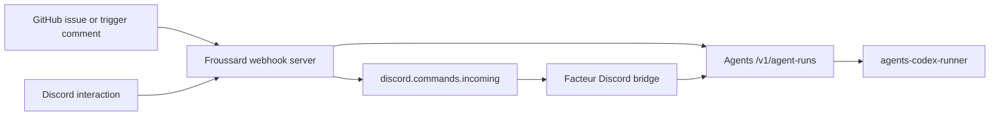

# Codex Issue Automation Workflow

This guide describes the current GitHub issue implementation path after the Agents extraction.

## Architecture

1. **Froussard** receives GitHub webhooks, builds the implementation prompt, and submits an `AgentRun` directly to the Agents service at `/v1/agent-runs`.
2. **Agents** owns admission, idempotency, controller reconciliation, runner workload creation, logs, artifacts, status, and cancellation.
3. **Facteur** no longer receives GitHub issue implementation tasks. It remains the Discord/domain command bridge that submits AgentRuns from normalized command events.


```mermaid
flowchart LR
  GH[GitHub issue or trigger comment] --> Froussard[Froussard webhook server]
  Froussard --> Agents[Agents /v1/agent-runs]
  Agents --> Runner[agents-codex-runner]
  Discord[Discord interaction] --> Froussard
  Froussard --> Kafka[discord.commands.incoming]
  Kafka --> Facteur[Facteur Discord bridge]
  Facteur --> Agents
```

## Prerequisites

- `AGENTS_SERVICE_BASE_URL` points Froussard at the Agents service.
- `AGENTS_SERVICE_CLIENT_NAME` identifies the Froussard client in Agents request headers.
- GitHub implementation runs target the configured Agents `Agent` and VCS provider.
- Kafka remains only for raw webhook events, Codex judge filtering, and Discord command intake.

## Verification

1. Create a GitHub issue in `proompteng/lab` as an authorized Codex trigger user, or comment `implement issue` on an existing issue.
2. Verify Froussard returns `codexStageTriggered: "implementation"`.
3. Verify Agents receives a `POST /v1/agent-runs` request with the GitHub delivery id as the idempotency key.
4. Verify an `AgentRun` appears in the `agents` namespace with `spec.agentRef.name`, `spec.implementation.inline.text`, `spec.goal`, VCS policy, secrets, and TTL populated.

## Helpful Commands

```bash
kubectl -n agents get agentruns
kubectl -n agents get jobs -l agents.proompteng.ai/agent-run=<run-name>
kubectl -n agents logs -f job/<job-name>
```

## Troubleshooting

- **Implementation not triggered**: verify webhook signature validation, authorized trigger login, and issue skip markers/labels.
- **AgentRun not created**: check Froussard logs for Agents service HTTP errors and confirm `AGENTS_SERVICE_BASE_URL` is reachable.
- **Runner fails before prompt execution**: inspect the generated AgentRun ConfigMap and compare `run.json`/`agent-runner.json` with `docs/agents/agentrun-creation-guide.md`.
