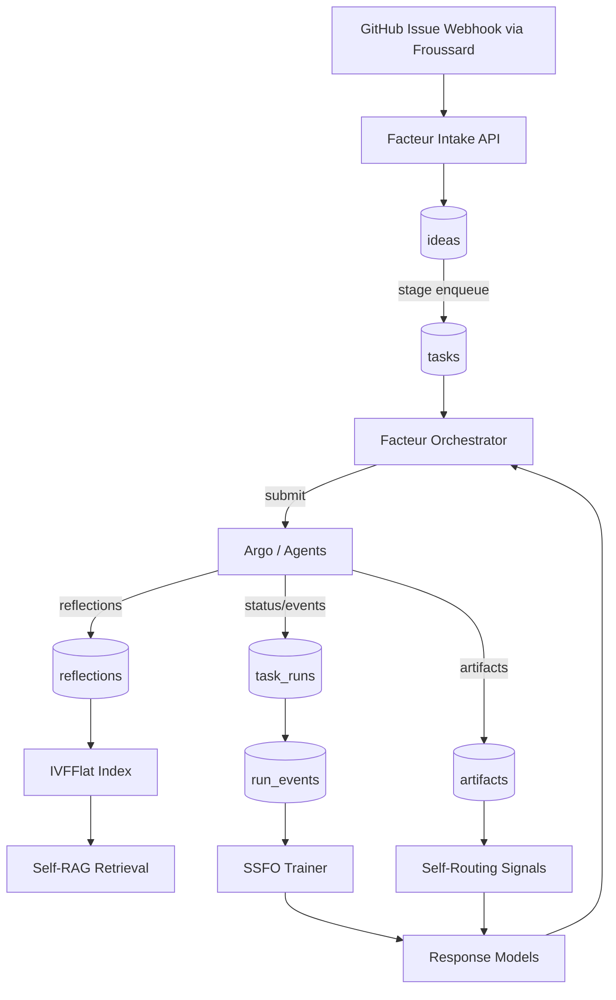

# Facteur Autonomous Knowledge Base (2025-10-30)

## Purpose

- Provide a single, self-improving knowledge base (KB) that captures every autonomous run, reflection, artifact, and outcome.
- Ensure each new automation cycle both **reads from** and **contributes to** the KB, improving accuracy, latency, and reliability over time.

## Key Design Principles

1. **Unified ingestion** – All structured payloads from Froussard webhooks, orchestrated tasks, and downstream workflows flow into the KB automatically.
2. **Reflection-driven learning** – Store agent reflections with vector search to enable Self-RAG style retrieval of lessons before new runs.[^self-rag]
3. **Router feedback** – Log when retrieval is skipped or invoked so Self-Routing RAG models reduce redundant queries while protecting quality.[^self-routing]
4. **Label-free alignment** – Use SSFO to continually improve faithfulness without manual annotations.[^ssfo]
5. **Domain adaptability** – Apply REFINE to keep embeddings sharp when new documentation domains appear.[^refine]
6. **Observability-first** – Every state change, policy decision, and anomaly is append-only, auditable, and queryable.

## Architecture Overview

## Data Model Integration

- **ideas / tasks / task_runs** provide the relational spine for orchestration status.
- **reflections** (vector-enabled) record critiques, postmortems, and rationales tied to each `task_run_id`.
- **artifacts** maintain URIs for plan PDFs, diffs, logs, SSFO preference pairs, and router decision logs.
- **run_events** capture every transition (queued → running, retrieval skipped, policy blocked, success/failure).
- **policy_checks** store gating outcomes (retrieval router, anomaly detector, human-approval requirements).
- **run_metrics** surfaces latency/throughput/SLO performance for continuous monitoring.

## End-to-End Lifecycle

1. **Ingest** – Froussard sends normalized issue payload → Facteur stores in `ideas`; tasks created per stage.
2. **Execute** – Orchestrator dispatches stage-specific workflow; results tracked in `task_runs` + `run_events`. (Implementation is now orchestrator-only; legacy direct dispatch removed and Knative Service is cluster-local with Tailscale-only access.)
3. **Reflect** – Each agent produces a reflection (success/failure rationale, improvement ideas) saved in `reflections` with embeddings.
4. **Update KB** – Artifacts, metrics, and policy checks persist alongside reflections; vector index rebuilt incrementally when >4× growth.[^pgvector-guidelines]
5. **Improve** – Nightly SSFO compares retrieved vs. non-retrieved answers to fine-tune the response model; Self-Routing telemetry updates router weights monthly; REFINE jobs recalibrate embeddings when new domain docs onboard.
6. **Next Run Prep** – Before a new task executes, the orchestrator:
   - Pulls similar reflections via vector search (Self-RAG style).
   - Evaluates router hints to decide whether retrieval is necessary.
   - Injects relevant artifacts and metrics into the prompt/context.
7. **Continuous Monitoring** – Synthetic anomaly generation + real incidents feed detectors; results logged in `policy_checks` and drive retraining per quarter.[^swift-hydra]

## Self-Learning Loops

- **Reflection Retrieval (D1)**: Query `reflections` for top-N similar past lessons, append to prompts, and log reuse in `run_events`.
- **Router Feedback (D2)**: Capture router decisions in `policy_checks` and retrain router weights with accumulated telemetry.
- **Faithfulness (D3)**: Build `artifacts` entries for SSFO preference pairs, run DPO fine-tuning nightly, and publish metrics in `run_metrics`.
- **Domain Adaptation (D4)**: Trigger REFINE when new documentation repo appears; version embeddings via `reflection.embedding_version`.
- **Anomaly Defense (D5)**: Synthetic incidents appended to `run_events`; detectors retrained and measured through `policy_checks` precision/recall.
- **Retrieval Reinforcement (D6)**: Store re-ranker keep/drop decisions in `artifacts` and feed back into scoring models alongside SSFO results.

### Reflection Persistence & Validation

- Apply goose migration `000003_reflection_idempotency.sql` after deduping any conflicting rows; it adds `updated_at` and enforces `UNIQUE (task_run_id, reflection_type)` so repeated saves stay idempotent. Run `go run ./cmd/facteur migrate --config config/example.yaml` in each environment before enabling the store.
- Save operations update `updated_at` on conflict and emit `facteur_reflections_saved_total`; retrieval increments `facteur_reflections_retrieved_total` so observability dashboards can track usage.
- Retrieval callers may raise recall by issuing `SET LOCAL ivfflat.probes = <n>` inside the session before querying. Start with 10 in staging, 20 in production hot paths, and reset to defaults after the transaction when not needed.
- Rebuild `codex_kb.idx_reflections_embedding` with `REINDEX (CONCURRENTLY)` whenever `lists` or `probes` change materially, matching the migration comment so REINDEX windows are captured in runbooks.
- Manual spot check: `psql "$FACTEUR_POSTGRES_DSN" -c "SELECT task_run_id, reflection_type, content FROM codex_kb.reflections ORDER BY embedding <-> (SELECT embedding FROM codex_kb.reflections WHERE task_run_id = '<seed-run>' LIMIT 1) LIMIT 3;"` verifies cosine ordering against a known seed reflection.

## Implementation Roadmap

1. **Phase 0** – Baseline schema cleanup (complete).
2. **Phase 1** – Create `reflections` table, expand orchestrator to log router decisions, and persist SSFO artifacts.
3. **Phase 2** – Implement nightly SSFO pipeline, monthly router retraining, and REFINE-based embedding updates.
4. **Phase 3** – Add synthetic anomaly generation flow and integrate retrieval reinforcement metrics.
5. **Phase 4** – Establish automated evaluators (faithfulness, relevance, anomaly precision) with dashboards fed by `run_metrics`.

## Operational Guardrails

- **Index maintenance**: monitor reflection corpus size; rebuild IVFFlat indexes when growth >4× or drift detected.[^pgvector-guidelines]
- **Idempotent intake**: reuse `delivery_id` when retrying Codex deliveries—`codex_kb.task_runs.delivery_id` is unique and replay-safe (`ON CONFLICT (delivery_id) DO UPDATE`).
- **Quality gates**: require faithfulness delta ≥0 and retrieval relevance improvement before promoting new models.
- **Retention**: keep reflections and events ≥1 year to allow long-tail analysis; older artifacts archived to object storage per retention class.
- **Access**: Facteur service account owns writes; analytics roles granted read-only to history tables.

## References

[^self-rag]: [Self-RAG: Self-Reflective Retrieval-Augmented Generation](https://selfrag.github.io/)

[^self-routing]: [Self-Routing RAG](https://arxiv.org/abs/2504.01018)

[^ssfo]: [Self-Supervised Faithfulness Optimization](https://arxiv.org/abs/2508.17225)

[^refine]: [REFINE: Fused Embeddings for Retrieval](https://arxiv.org/abs/2410.12890)

[^pgvector-guidelines]: [pgvector Documentation – IVFFlat Index Guidelines](https://access.crunchydata.com/documentation/pgvector/0.5.1/)

[^swift-hydra]: [Swift-Hydra: Safe RL for Autonomous Driving](https://arxiv.org/abs/2503.06413)
