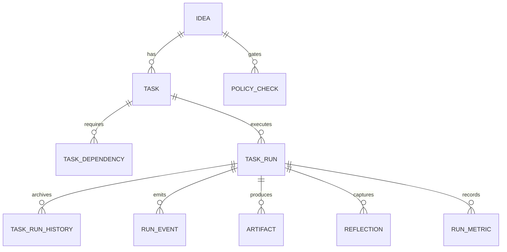

# Facteur Autonomous Schema Plan (2025-10-30)

## Objectives

- Provide a durable, queryable data model for fully autonomous Codex workflows spanning intake → deploy while keeping operational tables lean.
- Separate hot-path orchestration state from immutable history to preserve performance under high throughput.[^flowable-runtime]
- Enable semantic retrieval of plans, diffs, and telemetry through vector search while retaining traditional relational access patterns.[^pgvector-guidelines]

## Design Principles

- **Runtime vs. history separation**: follow BPM/workflow engines by storing active orchestration state in runtime tables and moving completed executions into history tables for analytics/audit.[^flowable-runtime]
- **Task graph as first-class data**: persist dependencies and execution metadata per task to mirror proven DynamoDB-based orchestration patterns (status, dependency resolution, payload pointers).[^aws-dynamodb-orchestration]
- **Retention-aware history**: design archival and TTL policies that reflect Step Functions’ 90-day execution history limit, ensuring Facteur retains data past cloud service windows when required.[^aws-step-functions-retention]
- **Vector indexing discipline**: delay building pgvector IVFFlat indexes until representative data exists, tune `lists`/`probes` for workload, and document rebuild triggers.[^pgvector-guidelines]
- **Scalable ANN performance**: size IVFFlat parameters based on dataset growth and workload, balancing recall and build time as observed in production-scale benchmarks.[^pgvector-tuning]

## High-Level Schema

## Entity Specifications

### `ideas`

| Column                      | Type        | Notes                                                             |
| --------------------------- | ----------- | ----------------------------------------------------------------- |
| `id`                        | UUID PK     | Stable idea identifier (maps to GitHub issue or Discord command). |
| `source_type`, `source_ref` | TEXT        | Origin channel and external ID for traceability.                  |
| `priority`                  | SMALLINT    | 0–5 scale; informs scheduler fairness.                            |
| `status`                    | TEXT        | Enum: `new`, `triaged`, `scheduled`, `closed`.                    |
| `risk_flags`                | JSONB       | Structured risk markers driving policy checks.                    |
| `payload`                   | JSONB       | Captured idea spec for replay/testing.                            |
| `created_at`, `updated_at`  | TIMESTAMPTZ | Auditable lifecycle.                                              |

### `tasks`

| Column         | Type                                      | Notes                                                                         |
| -------------- | ----------------------------------------- | ----------------------------------------------------------------------------- |
| `id`           | UUID PK                                   | Unique per task stage.                                                        |
| `idea_id`      | UUID FK → `ideas.id`                      | Cascading orchestration linkage.                                              |
| `stage`        | TEXT                                      | `planning`, `implementation`, `review`, `integration`, `deploy`, etc.         |
| `state`        | TEXT                                      | `pending`, `queued`, `running`, `blocked`, `succeeded`, `failed`, `canceled`. |
| `assignee`     | TEXT                                      | Actor (service or human).                                                     |
| `sla_deadline` | TIMESTAMPTZ                               | Drives escalation.                                                            |
| `metadata`     | JSONB                                     | Stage-specific configuration snapshot.                                        |
| Indexes        | `(idea_id, stage)`, `(state, updated_at)` | Fast lookups for dispatch & dashboards.                                       |

### `task_dependencies`

| Column               | Type                            | Notes                                   |
| -------------------- | ------------------------------- | --------------------------------------- |
| `task_id`            | UUID FK → `tasks.id`            | Dependent task.                         |
| `depends_on_task_id` | UUID FK → `tasks.id`            | Prerequisite task.                      |
| `dependency_type`    | TEXT                            | `hard`, `soft`, `approval`, `artifact`. |
| Composite PK         | `(task_id, depends_on_task_id)` | Prevent duplicate edges.                |

### `task_runs`

| Column                                    | Type                                                 | Notes                                             |
| ----------------------------------------- | ---------------------------------------------------- | ------------------------------------------------- |
| `id`                                      | UUID PK                                              | One row per workflow execution attempt.           |
| `task_id`                                 | UUID FK                                              | Owning task.                                      |
| `external_run_id`                         | TEXT                                                 | Argo workflow UID / Step Functions execution ARN. |
| `status`                                  | TEXT                                                 | Mirrors workflow terminal state.                  |
| `queued_at`, `started_at`, `completed_at` | TIMESTAMPTZ                                          | SLA & latency metrics.                            |
| `input_ref`, `output_ref`                 | TEXT                                                 | URI pointers (S3/GCS/object store).               |
| `retry_count`                             | SMALLINT                                             | Max + current for auto-retry logic.               |
| Indexes                                   | `(task_id, created_at DESC)`, `(status, updated_at)` | Efficient history queries.                        |

### `task_runs_history`

| Column            | Type          | Notes                                                                                                                                                                 |
| ----------------- | ------------- | --------------------------------------------------------------------------------------------------------------------------------------------------------------------- |
| `archived_run_id` | UUID PK       | Mirrors `task_runs.id`.                                                                                                                                               |
| `task_id`         | UUID          | Kept for joins.                                                                                                                                                       |
| `snapshot`        | JSONB         | Immutable copy of runtime row.                                                                                                                                        |
| `archived_at`     | TIMESTAMPTZ   | Migration timestamp.                                                                                                                                                  |
| `retention_class` | TEXT          | `default`, `regulated`, `short` to drive TTL policies.                                                                                                                |
| Storage           | Archive-ready | Move completed runs from runtime into history tables to keep primary tables small, following Flowable guidance on runtime vs. historic separation.[^flowable-runtime] |

### `run_events`

| Column        | Type                                              | Notes                                                       |
| ------------- | ------------------------------------------------- | ----------------------------------------------------------- |
| `id`          | BIGSERIAL PK                                      | Dense event log.                                            |
| `task_run_id` | UUID FK                                           | Event owner.                                                |
| `event_type`  | TEXT                                              | `state.change`, `policy.blocked`, `callback.received`, etc. |
| `actor`       | TEXT                                              | Service or human.                                           |
| `payload`     | JSONB                                             | Structured event data.                                      |
| `emitted_at`  | TIMESTAMPTZ                                       | Ordering + replay.                                          |
| Indexes       | `(task_run_id, emitted_at)`, `btree (emitted_at)` | Replay + timeline queries.                                  |

### `artifacts`

| Column          | Type                           | Notes                                     |
| --------------- | ------------------------------ | ----------------------------------------- |
| `id`            | UUID PK                        | Artifact identifier.                      |
| `task_run_id`   | UUID FK                        | Production run.                           |
| `artifact_type` | TEXT                           | `plan`, `diff`, `log`, `commentary`, etc. |
| `uri`           | TEXT                           | Store location (S3, GCS, Git blob).       |
| `checksum`      | TEXT                           | Integrity verification (SHA256).          |
| `metadata`      | JSONB                          | Format, size, mime type, etc.             |
| Index           | `(task_run_id, artifact_type)` | Fetch latest outputs quickly.             |

### `reflections`

| Column              | Type                                                                                                       | Notes                                                             |
| ------------------- | ---------------------------------------------------------------------------------------------------------- | ----------------------------------------------------------------- |
| `id`                | UUID PK                                                                                                    | Reflection identifier.                                            |
| `task_run_id`       | UUID FK                                                                                                    | Run that generated the reflection.                                |
| `author`            | TEXT                                                                                                       | Agent or reviewer that produced the reflection.                   |
| `reflection_type`   | TEXT                                                                                                       | `critique`, `plan_insight`, `failure_postmortem`, etc.            |
| `content`           | TEXT                                                                                                       | Raw reflection text.                                              |
| `embedding`         | VECTOR(1536)                                                                                               | Supports Self-RAG style retrieval of prior lessons.[^self-rag]    |
| `embedding_version` | TEXT                                                                                                       | Embedding model/tag for drift tracking.                           |
| `metadata`          | JSONB                                                                                                      | Tokens, scoring, or confidence values.                            |
| `updated_at`        | TIMESTAMPTZ                                                                                                | Auto-refreshed on every idempotent upsert for freshness tracking. |
| Constraint          | `UNIQUE (task_run_id, reflection_type)`                                                                    | Guarantees one reflection per run/type pair.                      |
| Index               | `ivfflat (embedding vector_cosine_ops)` with tuned `lists`; rebuild when growth >4×.[^pgvector-guidelines] |

### `policy_checks`

| Column         | Type                                     | Notes                                    |
| -------------- | ---------------------------------------- | ---------------------------------------- |
| `id`           | UUID PK                                  | Policy instance.                         |
| `idea_id`      | UUID FK                                  | Scope.                                   |
| `task_run_id`  | UUID FK                                  | Execution generating check.              |
| `policy_key`   | TEXT                                     | e.g., `lint.required`, `approval.human`. |
| `status`       | TEXT                                     | `pass`, `fail`, `waived`.                |
| `evidence_uri` | TEXT                                     | Link to logs/test reports.               |
| Index          | `(idea_id, policy_key, created_at DESC)` | Latest status per policy.                |

### `run_metrics`

| Column                                               | Type                 | Notes                                      |
| ---------------------------------------------------- | -------------------- | ------------------------------------------ |
| `task_run_id`                                        | UUID PK/FK           | One row per run.                           |
| `queue_latency_ms`, `runtime_ms`, `retry_latency_ms` | BIGINT               | Main SLO drivers.                          |
| `resource_usage`                                     | JSONB                | CPU/memory/tokens from workflow telemetry. |
| Index                                                | `btree (runtime_ms)` | Outlier queries & dashboards.              |

## Query & Index Strategy

- **Dispatch queries**: use `(state, updated_at)` and `(idea_id, stage)` indexes on `tasks` to pop ready work while respecting priority hints.
- **Dependency resolution**: join `task_dependencies` and `tasks` to ensure prerequisites are `succeeded`; store derived readiness in materialized view `task_ready_view` refreshed on change triggers.
- **History analytics**: move completed `task_runs` into `task_runs_history` via nightly job, mirroring Flowable’s approach of keeping runtime tables lean.[^flowable-runtime]
- **Event replay**: provide ordered stream via `run_events` keyed by `task_run_id` for audit and debugging.

## Vector Storage Guidance

- Build IVFFlat indexes on `reflections.embedding` only after ≥10k entries exist to avoid low-recall warnings; prefer `lists = sqrt(n)` as baseline, adjusting per workload benchmarks.[^pgvector-guidelines]
- Monitor query recall and latency; increase `lists`/`probes` or consider HNSW when accuracy must exceed 95%.[^pgvector-tuning]
- Allow orchestrators to raise recall ad hoc with `SET LOCAL ivfflat.probes = <n>` inside retrieval transactions; reset to defaults once the query completes.
- Document operational playbook for index rebuilds when the reflection corpus distribution shifts significantly.[^pgvector-guidelines]

## Retention & Compliance

- Retain runtime data for active tasks only; archive to `task_runs_history` immediately on terminal state with retention class metadata.
- Maintain events/artifacts for ≥1 year to exceed Step Functions’ 90-day history window and support forensic analysis.[^aws-step-functions-retention]
- Apply tiered storage (hot Postgres → cold object storage) based on `retention_class`; schedule purges per compliance requirements.

## Migration Roadmap

1. **Phase 0 – Baseline cleanup**: current change removes legacy `runs`/`entries` DDL so goose baseline only sets up schema + privileges.
2. **Phase 1 – Table introduction**: create `ideas`, `tasks`, `task_dependencies`, `task_runs`, `run_events`, `artifacts`, `reflections` in new migrations; gate writes behind feature flag.
3. **Phase 2 – History extraction**: add `task_runs_history`, `policy_checks`, `run_metrics`; implement job to move terminal runs nightly.
4. **Phase 3 – Backfill & validation**: replay existing telemetry sources into new tables; verify counts, referential integrity, and SLO dashboards.
5. **Phase 4 – Decommission legacy usage**: remove codepaths relying on deprecated tables; update docs and runbooks.

## Operational Considerations

- **Ingestion workflows**: background job listens to Kafka topics, writes runtime tables, and emits audit events.
- **Observability**: instrument `run_events` and `run_metrics` to feed trace + metric pipelines; align with Flowable’s history levels to tune data volume.[^flowable-runtime]
- **Disaster recovery**: nightly logical backups plus periodic PITR; ensure vector indexes rebuilt as part of DR runbook.
- **Access control**: limit mutation to Facteur service role; analytics roles read history tables only.

## Diagrams & Future Work

- Extend the ER diagram with policy evaluation subgraph once rule engine schema is finalized.
- Model materialized views (`task_ready_view`, `idea_summary_view`) after initial workload profiling.

## References

[^flowable-runtime]: [Flowable Database Schema Overview](https://documentation.flowable.com/latest/develop/dbs/overview)

[^pgvector-guidelines]: [pgvector Documentation – IVFFlat Index Guidelines](https://access.crunchydata.com/documentation/pgvector/0.5.1/)

[^aws-dynamodb-orchestration]: [Build a Dynamic Workflow Orchestration Engine with Amazon DynamoDB and AWS Lambda](https://aws.amazon.com/blogs/database/build-a-dynamic-workflow-orchestration-engine-with-amazon-dynamodb-and-aws-lambda/)

[^aws-step-functions-retention]: [AWS Step Functions Service Quotas](https://docs.aws.amazon.com/step-functions/latest/dg/limits-overview.html)

[^pgvector-tuning]: [Optimize pgvector Search – Neon Docs](https://neon.com/docs/ai/ai-vector-search-optimization)
