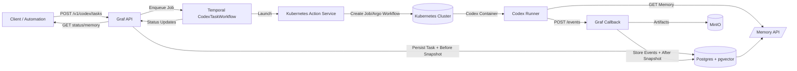

# Graf Codex Learning Architecture

## 1. Overview

Graf needs to orchestrate Codex container executions that can mutate any Kubernetes resource, capture "before" and "after" execution state as embeddings, and harvest feedback from Codex containers so future runs improve. This document summarizes the current state, target capabilities, architecture, API contracts, storage changes, security considerations, and implementation tasks.

## 2. Current State (2025-11-16)

- **Graf service** (`services/graf`) is a Quarkus/Kotlin microservice backed by Neo4j with Temporal+Argo integrations (see `src/main/kotlin/ai/proompteng/graf/codex/*`).
- **Deployment** is a Knative Service defined under `argocd/applications/graf`, running as `ServiceAccount graf` with limited RBAC (Argo workflow submission only).
- **Storage**: Neo4j + MinIO artifacts; no Postgres/Redis; no vector memory.
- **Codex execution**: Graf launches Argo workflows via Temporal (`CodexResearchWorkflowImpl`) but lacks general Kubernetes control or callback ingestion.

## 3. Goals & Non-Goals

| Goals                                                                                                          | Non-Goals                                                           |
| -------------------------------------------------------------------------------------------------------------- | ------------------------------------------------------------------- |
| Accept Codex tasks via REST, launch containers that may touch any K8s resource, and track lifecycle.           | Building a separate memory microservice.                            |
| Persist before/after snapshots + events, embedding them via OpenAI and storing vectors in Postgres (pgvector). | Integrating Milvus or other external vector stores.                 |
| Provide callback endpoint for Codex containers to report progress and artifacts.                               | Replacing Argo/Temporal globally.                                   |
| Surface prior embeddings to new executions so prompts include relevant context.                                | Changing GitHub/Discord intake flows.                               |
| Ensure RBAC, auditing, and observability cover the new control surface.                                        | Manual management of Kubernetes manifests (Graf remains automated). |

## 4. Architecture Overview

- Graf remains the control plane: validates requests, persists state, coordinates Temporal workflows, and talks to Kubernetes.
- Temporal orchestrates long-running tasks (fetch memory, launch Job/Argo, wait for callbacks, finalize).
- Kubernetes Action Service wraps Fabric8 to apply manifests, create Jobs, snapshot resources.
- Embedding Service generates vectors for prompts, snapshots, and events; pgvector powers similarity search.

## 5. Data Flow & Snapshots

1. **Submission**: Client calls `POST /v1/codex/tasks`. Graf validates metadata, writes `codex_tasks`, captures "before" snapshot (prompt + optional resource manifests), embeds via OpenAI, stores vector.
2. **Execution**: Temporal workflow retrieves top-N similar embeddings for context, spins up Kubernetes Job (or Argo template) with callback token and memory endpoint env vars.
3. **Callbacks**: Codex container periodically POSTs events (progress, artifacts, after snapshot). Graf authenticates using per-task token, stores payloads in Postgres, uploads attachments to MinIO, generates embeddings.
4. **Completion**: Graf compares target resources to previous state, stores "after" snapshot + embeddings, marks task complete, exposes results via GET API.
5. **Retrieval**: Future tasks query memory endpoints to fetch vectors from Postgres (pgvector) filtered by tags/resource types.

## 6. Storage & Schema Changes

- **Postgres (CloudNativePG)**: dedicated cluster for Graf (new manifests under `argocd/applications/graf`). Enable `pgvector` extension.
- **Redis**: optional but recommended for work queues (embedding jobs, action dispatch) managed via Redis operator.
- **Tables** (Flyway migrations in `services/graf/src/main/resources/db/migration`):
  - `codex_tasks`: metadata, statuses, orchestration mode, callback token hash, IDs of Temporal/Argo/Kubernetes resources.
  - `codex_task_snapshots`: `task_id`, `type` (`before|after`), manifest references, embedding vector, MinIO artifact keys.
  - `codex_task_events`: event stream entries (progress, artifact metadata) + embeddings.
  - `codex_task_memory_index`: denormalized rows for similarity search.
- **Artifacts**: large payloads stored in MinIO, referenced from Postgres rows.

## 7. API Surface

### 7.1 Task Submission & Status

- `POST /v1/codex/tasks`
  - Body: prompt, target resources, orchestration mode (`temporal|argo|direct`), idempotency key, optional metadata.
  - Response: `taskId`, status, callback URL/token, `memoryEndpoint` details.
- `GET /v1/codex/tasks/{id}`
  - Returns status, workflow IDs, resource references, artifact links, embedding readiness flags.

### 7.2 Memory Endpoints

- `GET /v1/codex/tasks/{id}/memory`
  - Query params: `limit`, `namespace`, `resourceKind`.
  - Returns vector similarity results (score, snippet, metadata).
- `POST /v1/codex/tasks/{id}/memory/query`
  - Body: arbitrary text/vector; Graf embeds if text provided and returns nearest neighbors.

### 7.3 Callback Endpoint

- `POST /v1/codex/tasks/{id}/events`
  - Headers: `Authorization: Bearer <task-token>`.
  - Body: `eventType`, `content`, optional `artifacts` (pre-signed upload), `snapshot` data (manifests/diffs).
  - Graf persists event, generates embeddings, optionally signals Temporal workflow.

## 8. Temporal & Execution Design

- Introduce `CodexTaskWorkflow` and `CodexTaskActivities` alongside existing research workflow. Activities include:
  1. `PrepareTaskContext`: fetch prompt, query `codex_task_memory_index` for context, return enriched prompt.
  2. `LaunchExecution`: decide path (Argo template vs. raw Job) and call Kubernetes Action Service.
  3. `WaitForCompletion`: poll Kubernetes or await callback signal; enforce timeout using `argoPollTimeoutSeconds`.
  4. `FinalizeTask`: fetch after snapshots, embed outputs, update Postgres.
- Workflows use Redis queue to backoff/resume embedding jobs without blocking Temporal threads.

## 9. Kubernetes Action Service

- Implement `KubernetesActionService` (Fabric8 client) with capabilities:
  - Server-side apply/delete for arbitrary manifests (supporting "resource control" requirement).
  - Job creation for Codex containers (inject prompt, memory references, callback token, resource limits).
  - Live manifest snapshot + diff generation for embeddings (before/after).
  - Watchers for Jobs/Deployments/Knative revisions; stream results back to Temporal.
- RBAC: new `ClusterRole graf-kubernetes-manager` grants `*` verbs on core + custom resources, `pods/log`, `pods/exec`, `events`. Bound to `ServiceAccount graf`.

## 10. Embedding Pipeline

- `EmbeddingService` wraps OpenAI embeddings (`text-embedding-3-large`, configurable via env). Provides methods:
  - `embedText(text, metadata)` → returns vector.
  - `embedManifest(manifestYaml, metadata)`.
  - `embedEventPayload(payload)`.
- Invoked at submission, callback ingestion, and completion. Failures go to Redis retry queue.
- Expose metrics (`graf_codex_embedding_duration_ms`, `graf_codex_embedding_failures_total`).

## 11. Security & Observability

- **Authentication**: existing bearer tokens guard REST APIs; callback tokens are per-task secrets hashed in Postgres and injected into Job env.
- **Authorization**: policy engine in Graf validates requested operations (allowed API groups/namespaces) before applying manifests.
- **Auditing**: every action logs task id, resource refs, diff digest, user metadata; stored in Postgres + Loki.
- **Metrics/Traces**: extend OTEL instrumentation for submission, workflow activities, embedding jobs, callbacks. Dashboard panels track task throughput, success rate, callback latency.

## 12. Infra & Deployment Changes

- `argocd/applications/graf`
  - Add Postgres cluster manifest + Secret + Service (CloudNativePG) and reference DSN via `knative-service.yaml` env.
  - Add Redis manifest + Service + Secret; set `GRAF_REDIS_URL` env.
  - Add `graf-kubernetes-manager` ClusterRole/Binding, ConfigMaps for embedding + orchestration config.
- `services/graf`
  - Update `build.gradle.kts` with Postgres, Flyway, pgvector, Redis, Fabric8, OpenAI dependencies.
  - Extend `GrafApplication.kt` configuration to bootstrap new services (Postgres datasource, Redis clients, embedding service, Kubernetes action service, Temporal workflow registration).
  - Update README with setup steps (running Postgres/Redis locally, env vars, curl samples).

## 13. Implementation Task Breakdown

1. **Infra Foundation**
   - Add CloudNativePG cluster + secrets under `argocd/applications/graf`.
   - Add Redis instance + secrets and wire env vars in Knative service.
   - Create `graf-kubernetes-manager` ClusterRole/Binding manifests.
2. **Persistence Layer**
   - Add Postgres dependencies, datasource config, and Flyway migrations for task/event/snapshot tables with pgvector columns.
   - Implement repositories + DAOs for tasks, events, embeddings.
3. **Embedding Service**
   - Implement OpenAI client wrapper, retry logic, and metrics.
   - Add env vars (`OPENAI_API_KEY`, `OPENAI_EMBEDDING_MODEL`, `OPENAI_EMBEDDING_DIMENSION`).
4. **Kubernetes Action Service**
   - Introduce Fabric8-based service to apply manifests, run Jobs, capture snapshots.
   - Integrate Redis queues for concurrency control/backoff.
5. **API Layer**
   - Add REST resources for task submission/status, callbacks, memory queries.
   - Update request/response models and security filters.
6. **Temporal Workflow**
   - Define `CodexTaskWorkflow` + activities mirroring the new execution steps, register in `GrafTemporalBootstrap.kt`.
   - Add Temporal tests covering callbacks and retries.
7. **Redis-backed Workers**
   - Implement embedding job worker + Kubernetes action worker loops.
   - Provide health endpoints/metrics.
8. **Codex Container Contract**
   - Document required env vars + callback usage; add SDK/helper in `packages/codex` for posting events + querying memory.
9. **Observability**
   - Emit OTEL spans/metrics for new components, update dashboards/runbooks.
10. **Documentation & Rollout**
    - Publish API docs (`services/graf/README.md` + new `docs/graf-codex-learning.md`), sample curl commands, and rollout plan with feature flags (`GRAF_CODEX_TASKS_ENABLED`, `GRAF_CODEX_MEMORY_ENABLED`).

## 14. Open Questions

- How granular should policy controls be (per namespace, per resource type, per caller) before enabling full cluster access?
- Do we need per-task quotas or global concurrency caps to protect cluster resources? (Likely yes—define in Redis-based scheduler.)
- Should callback endpoint accept streaming logs or only structured batches? (MVP favors batches with artifact uploads.)

## 15. Next Steps

1. Review this design with platform/security teams to approve RBAC expansion and Postgres/Redis sizing.
2. Sequence implementation tasks (infra → persistence → API → workflow → SDK) and assign to Codex agents.
3. Build staging environment, run end-to-end test (submit task, run Codex Job, observe embeddings), and iterate before production rollout.
