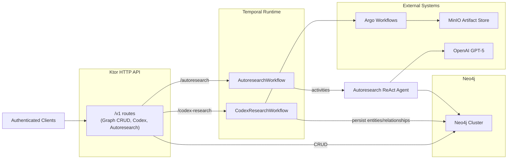
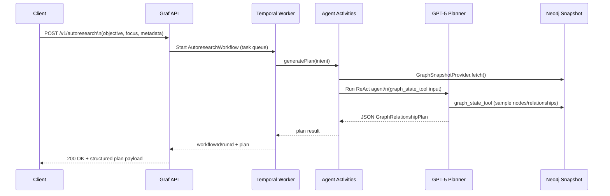

# Graf Service – Current State (November 9, 2025)

This document captures the current architecture of the Graf Neo4j persistence service as deployed from the `services/graf` module. It reflects the latest autoresearch relationship planner and how it complements the existing CRUD/complement/clean API surface.

## Key Components

- **Ktor HTTP API (`Application.module`)**
  - Exposes `/v1` routes wrapped in bearer auth.
  - Provides CRUD operations for entities and relationships, plus complement/clean routines.
  - Hosts two automation entry points:
    - `POST /v1/codex-research` to trigger Argo-driven Codex workflows.
    - `POST /v1/autoresearch` to launch autoresearch agents via Temporal.
- **Temporal / autoresearch runtime**
  - Shared Temporal connection (`WorkflowClient`) with task queue `graf-codex-research`.
  - Codex workflows (`CodexResearchWorkflowImpl`) ingest research artifacts through Minio.
  - Autoresearch workflow (`AutoresearchWorkflowImpl`) wraps a ReAct-style GPT-5 agent that reasons over the live graph.
- **Neo4j client**
  - `Neo4jClient` encapsulates write/read transactions, backs both REST mutations and agent graph snapshot tooling.
  - Snapshot provider reads node/relationship samples, label histograms, and focus records for agent prompts.
- **MinIO + Argo tooling**
  - `ArgoWorkflowClient` submits workflow templates and tracks completion.
  - `MinioArtifactFetcher` streams artifacts to Temporal activities.

## Deployment & Configuration Snapshot

| Concern | Current State |
| --- | --- |
| Runtime | Java 21, Kotlin 2.2, Ktor 3.3.2 |
| Persistence | Neo4j via Bolt (configurable URI/db/user). |
| Temporal | Address defaults to `temporal-frontend.temporal.svc.cluster.local:7233`; task queue `graf-codex-research`. |
| Autoresearch agent | Enabled when `AGENT_ENABLED=true` and `AGENT_OPENAI_API_KEY` (or `OPENAI_API_KEY`) is present. Defaults to OpenAI `gpt-5` with **High** reasoning effort, up to 16 iterations, and a 25-node sample window. |
| Security | `/v1/**` protected by bearer tokens from `GRAF_API_BEARER_TOKENS`. |

## High-Level Architecture



## Autoresearch Planner Flow

The autoresearch path synthesizes live graph state, Temporal execution metadata, and GPT-5 reasoning into a structured plan.



### Plan payload schema

```kotlin
data class GraphRelationshipPlan(
  val objective: String,
  val summary: String,
  val currentSignals: List<String>,
  val candidateRelationships: List<CandidateRelationship>,
  val prioritizedPrompts: List<String>,
  val missingData: List<String>,
  val recommendedTools: List<String>,
)
```

Each `CandidateRelationship` includes `fromId`, `toId`, `relationshipType`, rationale, confidence, evidence requirements, and suggested artifact paths—ready for downstream Codex or manual ingestion.

## Operational Notes

- **Enablement**: The autoresearch runtime is only instantiated when credentials are supplied; otherwise `/v1/autoresearch` returns `503 ServiceUnavailable`.
- **Shutdown**: Neo4j driver, Temporal workers, Ktor client, MinIO client, and autoresearch agent resources are all closed in the JVM shutdown hook.
- **Testing**: `./gradlew test` exercises the existing Codex/Ktor units; autoresearch-specific code currently relies on integration behavior plus compilation coverage.

This document should be updated whenever we add new automation routes, change Temporal task queues, or expand the autoresearch tooling surface (e.g., adding mutation tools or MCP adapters).
