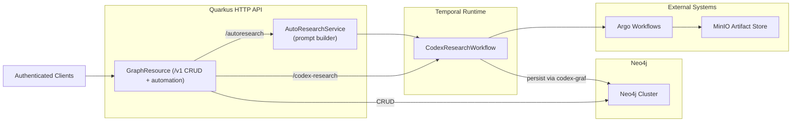
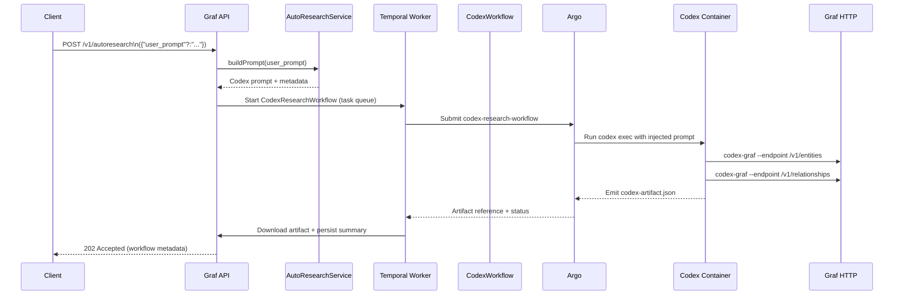

# Graf Service – Current State (November 10, 2025)

This document captures the current architecture of the Graf Neo4j persistence service as deployed from the `services/graf` module. It reflects the refreshed AutoResearch Codex prompt (no Koog agent) and how it complements the existing CRUD/complement/clean API surface.

## Key Components

- **Quarkus HTTP API (GraphResource + ServiceResource)**
  - RESTEasy Reactive resources serve `/v1` routes behind the `GrafBearerTokenFilter`.
  - CRUD operations for entities/relationships plus complement/clean map 1:1 with the original Ktor handlers.
  - Automation entry points:
    - `POST /v1/codex-research` launches Argo-driven Codex workflows.
    - `POST /v1/autoresearch` injects the AutoResearch prompt (optional `user_prompt`) before dispatching the same workflow.
- **Temporal / Codex runtime**
  - Shared Temporal connection (`WorkflowClient`) with task queue `graf-codex-research`.
  - `CodexResearchWorkflowImpl` submits the `codex-research-workflow` template, polls Argo until completion, downloads the MinIO artifact, and asks `GraphService` to persist the resulting entities/relationships.
  - AutoResearch now reuses this exact workflow; the Kotlin service simply injects additional instructions before the run starts.
- **Neo4j client**
  - `Neo4jClient` encapsulates write/read transactions for every REST mutation.
- **MinIO + Argo tooling**
  - `ArgoWorkflowClient` submits workflow templates and tracks completion.
  - `MinioArtifactFetcher` streams artifacts to Temporal activities.

## Deployment & Configuration Snapshot

| Concern | Current State |
| --- | --- |
| Runtime | Quarkus 3.29.2 on Java 21 / Kotlin 2.2 (`GraphResource`, `ServiceResource`, CDI producers). |
| Persistence | Neo4j via Bolt (configurable URI/db/user). |
| Temporal | Address defaults to `temporal-frontend.temporal.svc.cluster.local:7233`; task queue `graf-codex-research`. |
| AutoResearch prompt | Always enabled. `AutoResearchService` synthesizes a codified prompt (v2025-11-10) that instructs the Codex runner to keep growing the graph, call `/usr/local/bin/codex-graf` for every entity/relationship, and tag payloads with `streamId = "auto-research"`. Clients may pass `{"user_prompt": "optional guidance"}` to steer the run; no Koog/OpenAI credentials are required. |
| Security | `/v1/**` protected by bearer tokens from `GRAF_API_BEARER_TOKENS`. |
| Config | Quarkus HTTP/CORS tuned via `graf-quarkus-config` (uppercase `QUARKUS_HTTP_*`). |

## High-Level Architecture

## AutoResearch Codex Flow

The AutoResearch path now focuses on producing a repeatable Codex prompt rather than running a bespoke Koog agent. The Kotlin service injects operational guardrails (use `codex-graf`, tag payloads, summarize findings) and kicks off the standard Codex workflow.

### Execution notes

1. **Prompt synthesis** – `AutoResearchService` stamps the prompt version (`v2025-11-10`), UTC timestamp, and optional operator guidance. It also reminds Codex to post JSON directly to Graf using `/usr/local/bin/codex-graf` and to include `artifactId`, `researchSource`, and `streamId = "auto-research"` on every payload.
2. **Temporal launch** – `/v1/autoresearch` generates a unique Argo workflow name (e.g., `auto-research-<uuid>`), computes the MinIO artifact key, and calls `CodexResearchService.startResearch`. The HTTP caller still receives `202 Accepted` immediately with the Temporal + Argo identifiers.
3. **Argo execution** – the workflow template mounts the Graf bearer token as `CODEX_GRAF_BEARER_TOKEN` and runs `codex exec` with the synthesized instructions. Because the prompt explicitly calls for `codex-graf`, findings are streamed back to Graf while the research is in flight instead of waiting for a post-processing step.
4. **Artifact + persistence** – once Argo finishes, Graf downloads the JSON artifact (still `codex-artifact.json`) and replays any entity/relationship batches it contains. This keeps the run auditable even though the Codex CLI already POSTed individual mutations during the investigation.

## Operational Notes

- **Enablement**: AutoResearch is always on because it no longer depends on Koog/OpenAI credentials. `/v1/autoresearch` simply wraps `CodexResearchService` with an enriched prompt.
- **Startup/Shutdown**: `GrafConfiguration` observes `StartupEvent` to warm Temporal, Neo4j, and MinIO connections before probes flip ready, and closes the same dependencies via its `@PreDestroy` hook.
- **Testing**: `./gradlew test` covers the Quarkus resources, Codex workflow glue, and prompt builder metadata serialization; `./gradlew koverXmlReport` tracks coverage.

This document should be updated whenever we add new automation routes, change Temporal task queues, or expand the AutoResearch tooling surface (e.g., adding mutation tools or MCP adapters).
