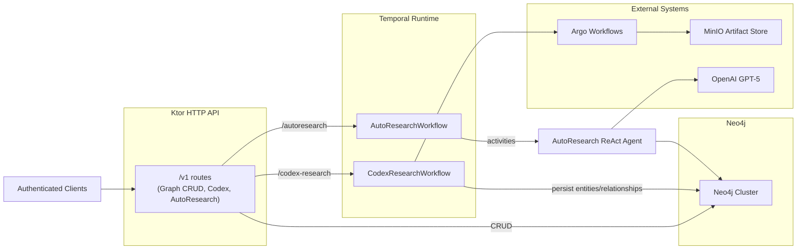
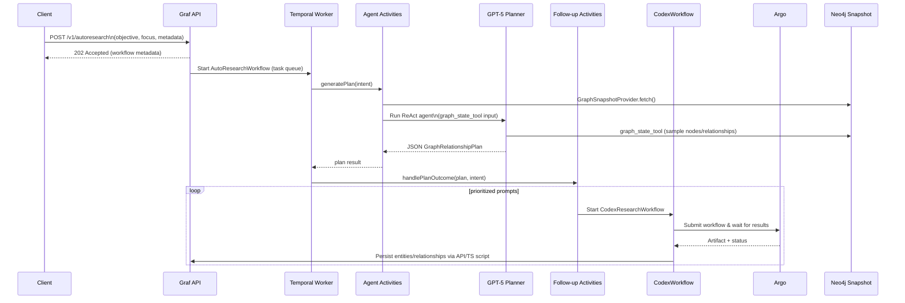

# Graf Service – Current State (November 9, 2025)

This document captures the current architecture of the Graf Neo4j persistence service as deployed from the `services/graf` module. It reflects the latest AutoResearch relationship planner and how it complements the existing CRUD/complement/clean API surface.

## Key Components

- **Ktor HTTP API (`Application.module`)**
  - Exposes `/v1` routes wrapped in bearer auth.
  - Provides CRUD operations for entities and relationships, plus complement/clean routines.
  - Hosts two automation entry points:
    - `POST /v1/codex-research` to trigger Argo-driven Codex workflows.
    - `POST /v1/autoresearch` to launch AutoResearch agents via Temporal.
- **Temporal / AutoResearch runtime**
  - Shared Temporal connection (`WorkflowClient`) with task queue `graf-codex-research`.
  - Codex workflows (`CodexResearchWorkflowImpl`) ingest research artifacts through Minio.
  - AutoResearch workflow (`AutoResearchWorkflowImpl`) wraps a ReAct-style GPT-5 agent that reasons over the live graph, then hands the structured plan to follow-up activities that trigger Codex research jobs for every prioritized prompt.
- **Neo4j client**
  - `Neo4jClient` encapsulates write/read transactions, backs both REST mutations and agent graph snapshot tooling.
  - Snapshot provider reads node/relationship samples, label histograms, and focus records for agent prompts.
- **MinIO + Argo tooling**
  - `ArgoWorkflowClient` submits workflow templates and tracks completion.
  - `MinioArtifactFetcher` streams artifacts to Temporal activities.

## Deployment & Configuration Snapshot

| Concern | Current State |
| --- | --- |
| Runtime | Java 21, Kotlin 2.2, Ktor 3.3.2 |
| Persistence | Neo4j via Bolt (configurable URI/db/user). |
| Temporal | Address defaults to `temporal-frontend.temporal.svc.cluster.local:7233`; task queue `graf-codex-research`. |
| AutoResearch agent | Enabled when `AGENT_ENABLED=true` and `AGENT_OPENAI_API_KEY` (or `OPENAI_API_KEY`) is present. Defaults to OpenAI `gpt-5` with **High** reasoning effort, up to 16 iterations, and a 25-node sample window. The system prompt follows the OpenAI Cookbook planning guidance and emphasizes the Graf knowledge base relationship surface (partners, manufacturers, suppliers, research alliances, and operational dependencies). HTTP callers receive a `202 Accepted` immediately; the worker logs the completed plan and automatically schedules Codex research jobs (Argo workflows) for each prioritized prompt so downstream TS tooling can persist results back through Graf's API. The prompt builder can be retargeted through `AGENT_KNOWLEDGE_BASE_NAME`, `AGENT_KNOWLEDGE_BASE_STAGE`, `AGENT_OPERATOR_GUIDANCE`, and `AGENT_DEFAULT_STREAM_ID` (see docs/graf-knowledge-base-design.md). |
| Security | `/v1/**` protected by bearer tokens from `GRAF_API_BEARER_TOKENS`. |

## High-Level Architecture



## AutoResearch Planner Flow

The AutoResearch path synthesizes live graph state, Temporal execution metadata, and GPT-5 reasoning into a structured plan.



Graf never blocks the HTTP caller while the plan runs. Instead, the workflow logs the finished plan (objective, summary, counts) and `AutoResearchFollowupActivities` spins up Codex research jobs for each prioritized prompt. Those Codex runs encapsulate the Argo workflow + TypeScript ingestion script that writes the resulting entities/relationships back through Graf's REST endpoints.

### Plan completion & research fan-out

1. **Plan logging** – `AutoResearchWorkflowImpl` emits INFO logs with the workflow/run IDs, objective, metadata keys, and plan counts as soon as the agent returns JSON. This makes it easy to confirm completion straight from the worker logs (`kubectl logs … -c user-container`).
2. **Plan parsing** – the workflow hands the intent + plan to `AutoResearchFollowupActivities`, which runs inside the same worker process and prepares fan-out metadata (prompt index, hashes, stream ID, etc.).
3. **Codex launches per prompt** – every prioritized prompt becomes its own Codex Temporal workflow, which in turn submits an Argo workflow (via `ArgoWorkflowClient`) and stores artifacts in MinIO under `codex-research/<argoWorkflowName>/codex-artifact.json`.
4. **TypeScript ingestion** – once Argo returns the artifact, the Codex container runs its bundled TypeScript script to call Graf's `/v1/entities` and `/v1/relationships` endpoints, persisting the new research. This mirrors how manual Codex runs ingest results today, so the AutoResearch path produces the same graph mutations as a full Codex investigation.

### Plan payload schema

```kotlin
data class GraphRelationshipPlan(
  val objective: String,
  val summary: String,
  val currentSignals: List<String>,
  val candidateRelationships: List<CandidateRelationship>,
  val prioritizedPrompts: List<String>,
  val missingData: List<String>,
  val recommendedTools: List<String>,
)
```

Each `CandidateRelationship` includes `fromId`, `toId`, `relationshipType`, rationale, confidence, evidence requirements, and suggested artifact paths—ready for downstream Codex or manual ingestion.

## Operational Notes

- **Enablement**: The AutoResearch runtime is only instantiated when credentials are supplied; otherwise `/v1/autoresearch` returns `503 ServiceUnavailable`.
- **Shutdown**: Neo4j driver, Temporal workers, Ktor client, MinIO client, and AutoResearch agent resources are all closed in the JVM shutdown hook.
- **Testing**: `./gradlew test` exercises the existing Codex/Ktor units; AutoResearch-specific code currently relies on integration behavior plus compilation coverage.

This document should be updated whenever we add new automation routes, change Temporal task queues, or expand the AutoResearch tooling surface (e.g., adding mutation tools or MCP adapters).
