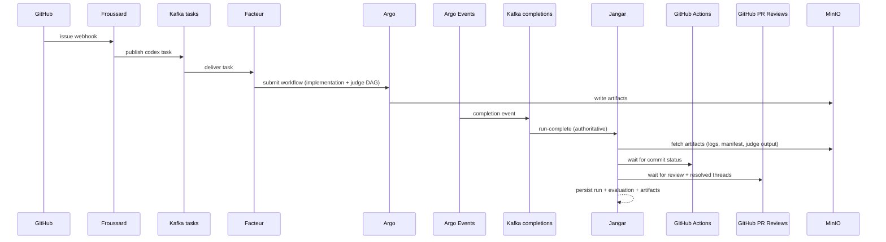

# Argo-Only Judge Mode in Jangar

## Summary
Argo-only judge mode makes Argo Workflows the exclusive runtime for Codex implementation and judge execution while
Jangar becomes the durable state store, UI, and policy engine that ingests Argo outputs. In this mode, Jangar does
not run judge logic locally or start local Codex runs. It only consumes Argo workflow completions + artifacts,
waits for CI and Codex review gates, and records the final decision and lineage.

This document describes the architecture, required configuration, data flow, security posture, failure modes,
and observability for the argo-only judge mode.

## Goals
- Make Argo the single source of execution for implementation + judge steps.
- Ensure Jangar can always reconstruct run state from Argo completions + artifacts.
- Keep judge decisions reproducible and auditable via artifacts and persisted records.
- Maintain deterministic gates (CI, review resolution) before accepting judge output.

## Non-goals
- Replacing GitHub Actions CI or Codex review gates.
- Defining the complete Argo DAG for autonomous execution (see `docs/jangar/autonomous-codex-end-to-end-design-v2.md`).
- Designing new authentication systems beyond existing cluster secrets and service-to-service trust.

## Architecture
### Components
- **Argo Workflows**: executes implementation and judge steps; uploads artifacts to MinIO.
- **Argo Events + Kafka**: publishes workflow completion events to `argo.workflows.completions`.
- **Froussard**: receives GitHub webhooks, publishes Codex tasks to Kafka, owns workflow template manifests.
- **Facteur**: consumes tasks and submits Argo workflows; orchestrates reruns.
- **Jangar**: ingests run-complete + notify payloads, stores run metadata, waits for CI + review gates,
  and writes final evaluations to `codex_judge` schema tables.
- **GitHub Actions**: provides CI status for the attempt commit SHA.
- **GitHub PR Reviews**: Codex review gate and thread resolution state.
- **MinIO (artifact repository)**: stores logs, patches, manifests, and judge outputs.
- **Discord (optional)**: success/escalation notifications.

### Argo-Only Contract
- Jangar does **not** create runs via local Codex execution.
- Jangar does **not** run judge logic locally in production; it ingests judge artifacts from Argo.
- Argo workflow completion events are the authoritative record of attempt existence.
- Notify payloads are **enrichment only** (run-complete is source of truth).

## Configuration Flags
### Mode selection
- `JANGAR_CODEX_JUDGE_MODE=argo`
  - Operational requirement: local judge mode is deprecated; deployments must set this invariant.
  - Jangar expects Argo completions + artifacts as the source of truth.

### Jangar judge pipeline settings
From `services/jangar/src/server/codex-judge-config.ts`:
- `GITHUB_TOKEN` or `GH_TOKEN`: GitHub API access token.
- `GITHUB_API_BASE_URL`: GitHub API base URL (default `https://api.github.com`).
- `JANGAR_CODEX_REVIEWERS` / `CODEX_REVIEWERS`: comma-separated logins for Codex reviews.
- `JANGAR_CI_EVENT_STREAM_ENABLED` / `JANGAR_GITHUB_EVENT_STREAM_ENABLED`: enable Kafka GitHub event stream.
- `JANGAR_CI_MAX_WAIT_MS`: CI timeout (default 60 min).
- `JANGAR_REVIEW_MAX_WAIT_MS`: review gate timeout (default 60 min).
- `JANGAR_CODEX_MAX_ATTEMPTS`: max reruns before escalation.
- `JANGAR_CODEX_BACKOFF_SCHEDULE_MS`: rerun backoff schedule in ms.
- `FACTEUR_INTERNAL_URL`: service endpoint for submitting reruns.
- `JANGAR_CODEX_ARTIFACT_BUCKET` / `ARTIFACT_BUCKET`: MinIO bucket for artifacts.
- `JANGAR_CODEX_WORKFLOW_NAMESPACE`: default workflow namespace (if provided).
- `JANGAR_PROMPT_TUNING_ENABLED`: toggle prompt auto-tuning PRs.
- `JANGAR_PROMPT_TUNING_REPO`: repo for prompt tuning PRs.
- `JANGAR_PROMPT_TUNING_FAILURE_THRESHOLD`: failures needed to trigger PR.
- `JANGAR_PROMPT_TUNING_WINDOW_HOURS`: lookback window for failures.
- `JANGAR_PROMPT_TUNING_COOLDOWN_HOURS`: cooldown between PRs.
- `JANGAR_CODEX_RERUN_ORCHESTRATION` / `_NAMESPACE`: rerun workflow template + namespace.
- `JANGAR_SYSTEM_IMPROVEMENT_ORCHESTRATION` / `_NAMESPACE`: system-improvement workflow template + namespace.
- `JANGAR_SYSTEM_IMPROVEMENT_JUDGE_PROMPT`: prompt for system-improvement judge runs.
- `JANGAR_CODEX_JUDGE_PROMPT`: default judge prompt.
- `DISCORD_BOT_TOKEN`, `DISCORD_SUCCESS_CHANNEL_ID`, `DISCORD_API_BASE_URL`: optional notifications.

### Argo + artifact connectivity
From `argocd/applications/jangar/deployment.yaml`:
- `ARGO_SERVER_URL`: Argo server endpoint for workflow metadata queries.
- `MINIO_ENDPOINT`, `MINIO_ACCESS_KEY`, `MINIO_SECRET_KEY`, `MINIO_SECURE`: artifact access.

## Data Flow
### High-level sequence

### Run-complete ingestion
- Jangar receives Argo completion events via KafkaSource at `POST /api/codex/run-complete`.
- Jangar persists the attempt record even if metadata is incomplete.
- If the completion payload lacks `eventBody`, Jangar recovers context from workflow labels/annotations.

### Notify enrichment
- Codex notify payloads are accepted at `POST /api/codex/notify`.
- Notify adds log excerpts and prompt context but does not create runs.

### Judge artifacts
Argo judge steps must emit a strict JSON decision artifact (e.g. `judge-result.json`) with:
- `decision`: `pass` | `fail` | `needs_more_work`
- `confidence`: 0..1
- `reasons`, `missing_items`, `suggested_fixes`, `next_prompt`, `system_suggestions`

Jangar stores the judge output in `codex_judge.evaluations` and uses it to:
- mark completion,
- trigger reruns via Facteur when incomplete, and
- seed prompt tuning or system-improvement flows.

## Security
- **Service-to-service trust**: run-complete and notify endpoints are only reachable via in-cluster sources
  (KafkaSource for completions, notify wrapper inside Argo workflow).
- **GitHub API**: token is read from a Kubernetes Secret and restricted to read-only by default.
- **Argo + MinIO**: credentials are stored in Secrets and injected into Jangar; access is scoped to the
  artifact bucket and Argo server endpoint.
- **Data minimization**: Jangar stores only required payloads and references to artifacts; large logs remain
  in MinIO.
- **Auditability**: all judge outcomes, reruns, and write actions are persisted in the Jangar DB.

## Failure Modes and Mitigations
- **Missing/invalid `eventBody`**: fall back to workflow labels/annotations; still persist the run record.
- **Notify missing**: proceed with run-complete only; use artifacts as log context.
- **Artifacts missing or incomplete**: use fallback artifacts from Argo outputs; record partial evaluation
  with a warning status.
- **CI timeout (`JANGAR_CI_MAX_WAIT_MS`)**: mark run as gated/failed and escalate (no rerun without CI).
- **Review timeout (`JANGAR_REVIEW_MAX_WAIT_MS`)**: mark run as blocked; notify for manual intervention.
- **MinIO access failure**: skip log/manifest enrichment; retry later from background poll.
- **Argo completion delay**: run remains in pending state until completion event arrives.
- **Duplicate completions**: dedupe on workflow UID/name and persist idempotently.
- **Rerun storm**: `JANGAR_CODEX_MAX_ATTEMPTS` + `JANGAR_CODEX_BACKOFF_SCHEDULE_MS` enforce throttling.

## Observability
- **Primary signals**
  - Kafka completion ingestion rate and errors.
  - Run state transitions in `codex_judge.runs` and `codex_judge.evaluations`.
  - CI gating latency (time from completion to CI verdict).
  - Review gating latency (time from completion to review resolution).
  - Rerun submission counts + backoff timing.

- **Logs**
  - `services/jangar/src/server/codex-judge.ts` logs run-complete ingestion, artifact fetches, and reruns.
  - Argo workflow logs + artifact outputs are the primary execution traces.

- **Dashboards/alerts**
  - Codex pipeline dashboards and alert rules live under `argocd/applications/observability/`.
  - Add panels for run-complete lag, missing artifacts, and judge decision distribution.

## Rollout Guidance
1) Ensure Argo workflow templates emit judge artifacts and upload logs to MinIO.
2) Configure KafkaSource to deliver `argo.workflows.completions` to Jangar `/api/codex/run-complete`.
3) Set `JANGAR_CODEX_JUDGE_MODE=argo` in the Jangar deployment.
4) Verify ingestion + evaluation records in `codex_judge.*` tables.
5) Enable rerun orchestration only after CI + review gates are verified in production.

## Related Docs
- `docs/jangar/autonomous-codex-end-to-end-design.md`
- `docs/jangar/autonomous-codex-end-to-end-design-v2.md`
- `docs/jangar/codex-judge-argo-design.md`
- `docs/jangar/codex-judge-argo-implementation.md`
- `docs/jangar/github-pr-review-in-app.md`
