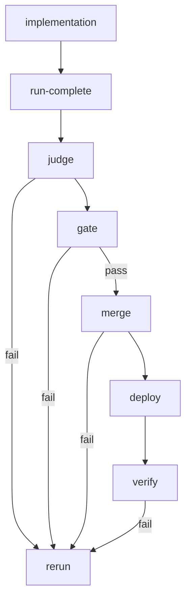

# Autonomous Codex End-to-End Delivery Design v2 (Argo-First)

Date: 2026-01-04
Status: Draft (success-focused)
Owner: Jangar + Froussard + Facteur
Scope: Fully autonomous Codex pipeline with Argo as the primary orchestrator, including judge runs, reruns, and system improvement PRs.

## 1) Why v2

The current pipeline is not production-ready. The system relies on Jangar API uptime for run creation and uses GitHub diffs instead of worktree snapshots. PR creation, durable reruns, and system-improvement PRs are not guaranteed. v2 closes these gaps by shifting run creation and judge execution into Argo DAG steps and defining strict data/behavior contracts.

## 1.1 Guarantee Model (What “Success” Means Here)
This design cannot guarantee business success (e.g., every issue is implementable without human review), but it **does** guarantee the following when deployed correctly:
- If the pipeline is blocked, it **fails fast** with an explicit reason and a recovery path.
- If the pipeline is not blocked, it **completes end-to-end** with deterministic gates, a judge decision, and a PR outcome.
- Every failure produces a **durable rerun request** and a **concrete next_prompt**.
- Every `needs_iteration`/`needs_human` outcome produces a **system-improvement PR** or a **specific human escalation** with a blocking reason.

## 1.2 Success Guarantees (Operational)
The system is considered **guaranteed-successful** when these hold in production:
1) Every run reaches a terminal status (`completed`, `needs_iteration`, or `needs_human`). No runs remain “stuck” beyond their timeout windows.
2) Every failure produces an actionable next step (rerun with next_prompt or human escalation).
3) Every judge decision is based on an authoritative worktree snapshot.
4) Every run contains a complete artifact set, or is explicitly marked as infra-failure with automatic rerun.

## 1.3 One-Turn Completion Contract (Required)
This design is **completable in one turn** when the following conditions are true. If any condition is false, the run must fail fast with a precise error and the smallest unblocker.

### 1.3.1 One-turn definition
A single **Argo workflow execution** performs:
1) Implementation
2) Run record creation
3) Judge evaluation
4) Gate resolution (CI + review)
5) Merge
6) Deploy
7) Post-deploy verification

No manual intervention, no out-of-band Jangar API calls, and no cross-run dependency are allowed in a one-turn execution.

### 1.3.2 One-turn preconditions (hard requirements)
All of the following must be true before the workflow starts:
- Repo checkout present at `CODEX_CWD` with valid `.git`.
- `git`, `gh`, and `argo` CLIs available in the workflow container.
- GitHub token has PR create + read + review scopes.
- MinIO/Argo artifact repository is reachable.
- DB or Kafka sink is reachable for run-complete persistence.
- Workflow template `codex-run` exists and is referenced by the DAG.

### 1.3.3 One-turn execution guarantees (must be enforced)
- Implementation step creates or updates a PR **before** the DAG proceeds.
- Run record is written **inside** the DAG (`run-complete` step).
- Judge runs **inside** the DAG (not as a Jangar background task).
- Worktree snapshot exists before judge evaluation.
- CI and review gates are resolved for **exact** commit SHA.
- Any failure produces `next_prompt` + rerun submission **in the same workflow**.

### 1.3.4 One-turn output guarantees
A completed or failed run must have:
- Run record in DB
- Full artifact set in MinIO
- Judge decision JSON
- PR URL (or explicit failure reason)
- Rerun submission or human escalation record

## 2) Observed Deficiencies (from code + DB)

### Data and ingestion
- Many runs lack `workflow_name` and `run_complete_payload`, preventing artifact resolution.
- Required artifacts are present for only a small subset of runs.
- `stage` is missing from run records even when payloads include it.

### PR and worktree coverage
- A large number of runs have no PR and no commit SHA.
- Worktree snapshots exist for only a few PRs.
- Judge currently uses GitHub API diffs, not worktree diffs.

### Rerun and automation
- Reruns are scheduled with in-memory timers and are lost on restart.
- `needs_iteration` runs do not always result in rerun submissions.

### Prompt and system improvement
- Prompt tuning PRs are generic and not tied to concrete system changes.
- System improvement suggestions are not translated into real PRs.

## 3) v2 Goals (Non-Negotiables)

1) Argo creates the authoritative run records.
2) Judge runs are Argo jobs chained to implementation using DAG semantics.
3) Worktree-only diffs are the source of truth for judging.
4) Every failed run yields a rerun or human escalation with a concrete next prompt.
5) System improvements produce real PRs (not placeholders).
6) The pipeline is resumable and durable across service restarts.
7) The system is **deterministically recoverable** from any transient failure.
8) The system produces **verifiable and auditable evidence** for every decision.
9) The system can be **executed end-to-end in one Argo workflow run** with no external dependencies beyond GitHub, MinIO, and DB/Kafka.

## 4) High-Level Architecture

### Core shift: Argo-first orchestration
- Implementation and judge are two DAG steps in the same workflow or a child workflow.
- Jangar becomes a durable state store + UI, not the sole orchestrator.
- Run creation happens inside Argo (via DB or Kafka with retries), not via a single Jangar API request.
- NATS provides a **global agent context channel** so every Argo run can learn prior decisions, gaps, and fixes.

### Proposed flow (DAG)
```
GitHub Issue -> Froussard -> Facteur -> Argo Workflow (DAG)

DAG:
  A) implementation
  B) run-complete emit (durable)
  C) judge (run in Argo)
  D) merge + deploy
  E) post-deploy verify
  F) rerun submit (if needed)
```

## 4.1 NATS Agent Context Channel (Required)

### 4.1.1 Purpose
All Argo workflow agents must know what has already been attempted, what failed, and what remains. This is enforced through a **global NATS channel** that:
- Receives summaries from every run (implementation + judge + verification).
- Allows new runs to pull a **context soak** before acting.
- Stores a structured history that is queryable by issue number, branch, and run id.

### 4.1.2 Channel and Subjects
- General channel: `workflow_comms.agent_messages` with `channel="general"`.
- Subject schema (hierarchical):
  - `codex.run.<repository>.<issueNumber>.<runId>`
  - `codex.run.<repository>.<issueNumber>.general`

### 4.1.3 Required Messages (per run)
Every run must publish the following messages to the general channel:
- `run-started`: repository, issue, branch, workflow id, stage
- `run-summary`: concise summary of actions taken + artifacts produced
- `run-gaps`: explicit missing items and next steps
- `run-next-prompt`: the exact next_prompt used for rerun (if any)
- `run-outcome`: decision + status + PR link + CI link

### 4.1.4 Context Soak (pre-run)
Before implementation or judge begins, the workflow must:
- Fetch the **latest N** messages from `channel="general"` for the issue/branch.
- Inject a structured summary into the run prompt.
- Fail fast if NATS is unreachable (classify as infra_failure).

### 4.1.5 Guarantees
- No Argo run proceeds without a context soak.
- Every run emits at least one summary + one gap/finding message to NATS.
- The general channel becomes the **single source of truth** for cross-run context.

## 5) Workflow Template Strategy

### 5.1 Unified template
- Create a single reusable template, `codex-run`, parameterized by:
  - `stage` (implementation | judge | post-deploy)
  - `prompt` (only difference between implementation vs judge)
  - `repository`, `issue_number`, `base`, `head`
  - `run_id` (optional, but preferred)

### 5.2 Two modes
- **Implementation mode**: runs Codex, writes implementation artifacts and notify payload.
- **Judge mode**: runs judge prompt (Codex or specialized judge binary), produces evaluation payload and required system-improvement output.

The only difference between the two modes must be the prompt and the step label. All infrastructure and capture logic is shared.

## 6) Argo DAG Design

### 6.1 DAG nodes
1) `implementation` (codex-run, stage=implementation)
2) `run-complete` (emit run record + artifacts, retryable)
3) `judge` (codex-run, stage=judge)
4) `gate` (CI/review gate; waits on GitHub check data)
5) `merge` (if pass)
6) `deploy` (if merge)
7) `verify` (post-deploy)
8) `rerun` (if fail, durable submit with next_prompt)

### 6.1.1 One-turn DAG wiring (mandatory)
- `implementation -> run-complete -> judge -> gate -> merge -> deploy -> verify`
- `judge -> rerun` on failure (no external timer)
- `rerun` must submit the next workflow execution immediately or with a bounded delay (persisted).

### 6.1.2 Argo Workflow DAG (Mermaid)
All nodes below are **Argo workflow nodes**; edges are Argo DAG dependencies or conditional branches.


### 6.2 Run creation without Jangar API
- `run-complete` step writes directly to the DB or publishes to Kafka with retry/backoff.
- If DB is unavailable, persist a run payload artifact and requeue later.
- Jangar should be able to reconcile runs from these artifacts.

### 6.3 DAG Success Invariants
These invariants must be enforced by the workflow before proceeding to the next step:
- `implementation` produces all required artifacts.
- `run-complete` produces a valid run record with `workflow_name`, `workflow_uid`, `stage`, and `artifacts`.
- `judge` must have a worktree snapshot; otherwise fail with infra rerun.
- `gate` must have a commit SHA and CI status for the exact SHA.
- `merge` is only attempted if gates pass and PR is mergeable.
- `verify` is only attempted if merge succeeded.

### 6.4 Failure Taxonomy (mandatory)
Every failure must be classified into one of:
- `infra_failure`: artifact missing, DB unavailable, GitHub API outage.
- `implementation_failure`: CI failure, review changes, incomplete requirements.
- `merge_failure`: merge conflict, merge blocked.
- `verification_failure`: post-deploy tests failed or timed out.

Each category produces a deterministic next_prompt and a system-improvement PR where applicable.

## 7) Data Contracts (Required)

### 7.1 Run record (authoritative)
Required fields:
- `workflow_name`, `workflow_namespace`, `workflow_uid`
- `repository`, `issue_number`, `branch`, `base`
- `stage` (implementation | judge | post-deploy)
- `prompt`
- `started_at`, `finished_at`
- `artifacts[]` with bucket + key

### 7.2 Artifacts (all required every run)
- `implementation-changes`
- `implementation-patch`
- `implementation-status`
- `implementation-log`
- `implementation-events`
- `implementation-agent-log`
- `implementation-runtime-log`
- `implementation-resume`
- `implementation-notify`

### 7.3 Judge output (strict JSON)
Required fields:
- `decision` (pass|fail)
- `requirements_coverage`
- `missing_items`
- `suggested_fixes`
- `next_prompt`
- `prompt_tuning_suggestions`
- `system_improvement_suggestions`

## 8) Judge Requirements (v2)

1) Judge must evaluate against worktree-only diff (not GitHub API diff).
2) Judge must read full PR context from worktree snapshot + issue body.
3) If gaps exist, judge must build a `next_prompt` that enumerates all findings.
4) Judge must emit a system-improvement bundle for any failure.

### 8.1 Judge Input Guarantees (Fail-Fast)
The judge step must hard-fail if any required input is missing:
- No worktree diff -> fail with `infra_failure` and rerun.
- No issue body/title -> fail with `infra_failure` and rerun.
- No PR info -> fail with `implementation_failure` and rerun.

### 8.2 Judge Output Guarantees (Fail-Closed)
If judge output is not valid JSON in the required schema:
- retry with bounded attempts
- if still invalid, classify as `infra_failure` and rerun
- record failure reason and attach retry prompts

## 9) System Improvement PRs (Must be Real)

### 9.1 Hard requirement
- Any `needs_iteration` or `needs_human` outcome must produce a PR with concrete code/config changes.
- If no actionable change is possible, mark `needs_human` and attach a blocking reason.

### 9.2 Implementation details
- System improvement PRs must target real pipeline code or workflow templates.
- Each PR must include:
  - Proposed change with diff
  - Evidence from runs that motivated the change
  - Acceptance criteria

### 9.3 Enforcement
- Pipeline should fail if it cannot generate a real system-improvement PR for repeated failures.
- This prevents silent degradation where suggestions become “garbage.”

## 10) PR Creation Guarantees

- The implementation workflow must create or update a PR on every attempt.
- PR creation is not optional; workflow must fail fast if no PR is created.
- Head branch must be stable per issue; reruns continue on the same branch.

### 10.1 One-turn PR constraint
- PR must be opened **within the same workflow run** (implementation step).
- If PR is not opened, the workflow must fail and emit a system-improvement PR with the root cause.

## 11) Retry and Idempotency Guarantees

### 11.1 Retry policy
- All network calls are retried with bounded exponential backoff.
- Each step stores an idempotency key so retries do not create duplicates.

### 11.2 Idempotency rules
- Run identity: `(workflow_uid, workflow_name)` is unique.
- Worktree snapshot identity: `(repository, pr_number, commit_sha)` is unique.
- PR identity: `head branch` is unique per issue.
- System-improvement PR identity: `(issue_number, failure_reason, window)` is unique.

## 12) Durable Rerun Orchestration

- Rerun submissions must be persisted in DB first, then executed.
- A background worker (or Argo step) must claim and submit pending reruns.
- In-memory timers are not allowed for production.

## 13) Worktree Snapshot Requirements

- Worktree snapshot must exist for every PR used by judge.
- `jangar_github.pr_files` must be populated from git diff in the worktree.
- Judge must fail if worktree snapshot is missing.

## 14) Reliability Engineering (SLOs + Monitoring)

### 14.1 Service-level objectives
- Run completion SLO: 99% of runs reach a terminal state within 2 hours.
- Artifact completeness SLO: 99% of runs include all required artifacts.
- Rerun durability SLO: 100% of rerun submissions persisted and retriable.

### 14.2 Required dashboards
- Run lifecycle counts by status.
- Missing artifact rate.
- Missing PR rate.
- Judge invalid JSON rate.
- Worktree snapshot failures.

### 14.3 Alerts
- Any run in non-terminal status > 2 hours.
- Artifact missing > 1% in last 24h.
- Worktree snapshot failure > 0.5% in last 24h.

## 15) Acceptance Criteria (Production Ready)

1) 100% runs have `workflow_name`, `workflow_namespace`, `stage`, and `run_complete_payload`.
2) 100% runs have full artifact sets.
3) 100% runs have PR, commit SHA, and worktree snapshot.
4) 100% failures produce a concrete `next_prompt` AND a real system-improvement PR.
5) Rerun submissions are durable and survive restarts.
6) Judge uses worktree-only diff; GitHub API diff is forbidden.
7) CI and review gates are resolved for the exact commit SHA.
8) No runs remain in non-terminal statuses beyond timeout.
9) All step outputs are auditable via stored artifacts and DB records.

## 16) Preflight Requirements (Hard Fail If Missing)

Before any workflow run, validate:
- `CODEX_CWD` exists and has repo checkout.
- `git` present and can resolve base/head.
- GitHub token has PR create + review read scopes.
- MinIO access validated with a signed URL test.
- DB or Kafka sink reachable for run-complete creation.

## 17) Migration Plan

1) Add `codex-run` WorkflowTemplate (generic, parameterized prompt).
2) Update implementation workflow to use DAG and include judge step.
3) Implement DB/Kafka write step for run-complete creation (retryable).
4) Enforce PR creation in implementation step.
5) Enforce worktree snapshot before judging.
6) Add durable rerun queue + worker.
7) Add system-improvement PR generator with real patches.

## 18) Validation Checklist (Run-Level)

For every run, the following must be true:
- Run record exists with stage and workflow metadata.
- Artifacts list contains all required names.
- PR exists and is linked in run data.
- Worktree snapshot exists and is tied to PR head SHA.
- CI status is captured for that exact SHA.
- Review status and threads are resolved or escalated.
- Judge output is valid JSON with required fields.
- If decision != pass, next_prompt is non-empty.

## 19) Open Questions

- Should judge run in the same workflow DAG or in a child workflow template?
- Who owns the system-improvement PRs (Jangar or separate service)?
- What is the canonical source for acceptance criteria (issue body vs structured input)?
