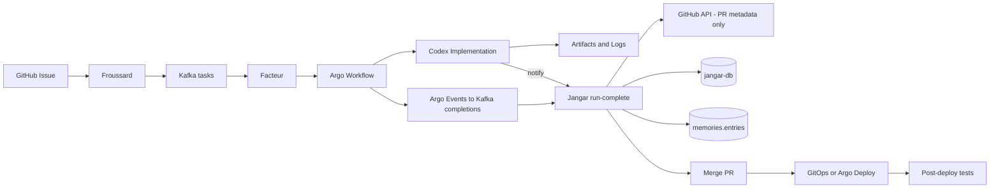
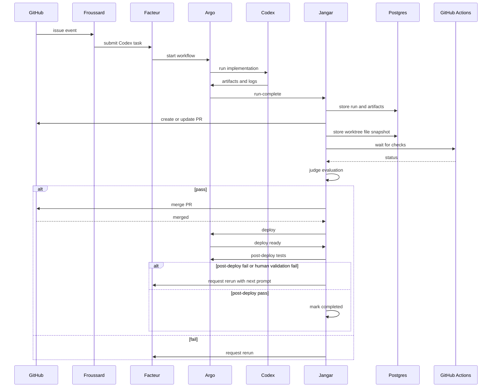
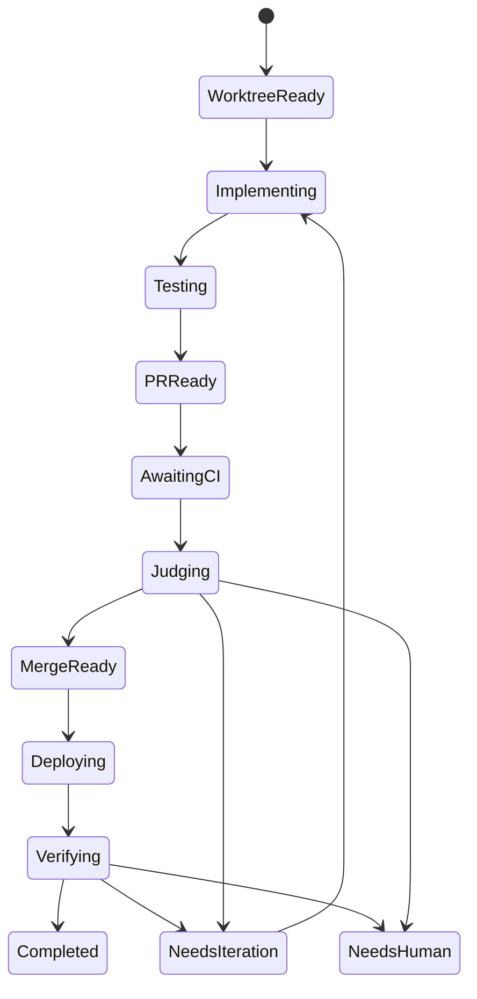

# Autonomous Codex End-to-End Delivery Design

Date: 2026-01-04
Status: Design draft for immediate implementation
Owner: Jangar
Scope: An end-to-end autonomous Argo workflow run that completes implementation, tests, PR, judging, merge, deploy, and post-deploy verification.

## 1) Ground Truth Snapshot

This design is grounded in the current cluster and the `jangar` database.

### 1.1 Kubernetes
- Namespace `jangar`
  - Pods: `jangar` (2 containers), `bumba` (2 pods), `jangar-db-1`, `jangar-openwebui-redis-0`, `open-webui-0`
  - Services: `jangar`, `jangar-db-rw/ro/r`, `jangar-openwebui-redis`, `open-webui`, `jangar-tailscale`
- Namespace `argo-workflows`
  - Completed `github-codex-implementation-*` workflows exist (e.g. `github-codex-implementation-20260103-*`).
- Namespace `nats` exists (NATS cluster running).
- Namespace `facteur` exists with `facteur-internal` service.

### 1.2 CNPG and Postgres
- CNPG cluster: `jangar-db` in namespace `jangar`, Postgres 17.0, backup to `s3://argo-workflows/cnpg/jangar`.
- Database: `jangar` with schemas: `codex_judge`, `jangar_github`, `workflow_comms`, `terminals`, `memories`, `atlas`, `public`.

### 1.3 Current DB Counts (2026-01-04)
```
 codex_judge.runs              88
 codex_judge.evaluations       60
 codex_judge.artifacts         120
 codex_judge.prompt_tuning     9
 codex_judge.rerun_submissions 13

 jangar_github.events          513
 jangar_github.pr_state        2
 jangar_github.review_state    1
 jangar_github.check_state     15
 jangar_github.pr_files        2
 jangar_github.review_threads  2
 jangar_github.comments        3
 jangar_github.write_actions   0

 workflow_comms.agent_messages 326
 terminals.sessions            23
 memories.entries              918
```

### 1.4 Observed Gaps
- `jangar_github.pr_files` has only 2 rows, so PR file snapshots are incomplete and must be sourced from the local worktree only.
- `jangar_github.check_state` stores per-commit check summaries, so UI must group checks by commit SHA.
- `jangar_github.write_actions` is empty, so no automated merges have been recorded yet.

## 2) Objective

Deliver an end-to-end autonomous run that:
1) provisions a deterministic worktree
2) implements changes
3) runs tests
4) creates or updates a PR
5) captures authoritative file snapshots from the local filesystem
6) gates on CI and review state
7) performs judge evaluation
8) merges the PR when safe
9) deploys
10) runs post-deploy integration and end-to-end tests
11) persists artifacts, logs, and audit data

If any gate fails, the system must record why and either rerun or escalate to `needs_human`.

## 3) Constraints and Non-Negotiables

- **No API backfill for PR files or patches.** The local filesystem is the only source of truth.
- PR checks must be grouped by commit SHA.
- The run must be idempotent and safe to re-enter after retries.
- All major steps must persist artifacts and logs.

## 4) Existing Code Baseline

### Codex Judge
- `services/jangar/src/server/codex-judge.ts`
- `services/jangar/src/server/codex-judge-store.ts`
- `services/jangar/src/server/codex-judge-gates.ts`
- Argo artifacts via `services/jangar/src/server/argo-client.ts`

### GitHub Review
- `services/jangar/src/server/github-review-ingest.ts`
- `services/jangar/src/server/github-review-store.ts`
- `services/jangar/src/server/github-review-actions.ts`

### Worktrees
- `services/jangar/src/server/bumba.ts`
- `services/jangar/src/server/terminals.ts`
- `services/jangar/src/server/chat.ts`

### Agent Comms
- `services/jangar/src/server/agent-comms-subscriber.ts`
- `services/jangar/src/routes/api/agents/events.ts`

## 5) Configuration and Secrets

The autonomous run depends on these environment variables already present in the Jangar deployment:
- GitHub: `GITHUB_TOKEN`, `JANGAR_GITHUB_REPOS_ALLOWED`, `JANGAR_GITHUB_REVIEWS_WRITE`, `JANGAR_GITHUB_MERGE_WRITE`, `JANGAR_GITHUB_MERGE_FORCE`
- Codex judge: `JANGAR_CI_EVENT_STREAM_ENABLED`, `JANGAR_CI_MAX_WAIT_MS`, `JANGAR_REVIEW_MAX_WAIT_MS`, `JANGAR_CODEX_MAX_ATTEMPTS`, `JANGAR_CODEX_BACKOFF_SCHEDULE_MS`, `JANGAR_CODEX_JUDGE_MODEL`
- Argo and artifacts: `ARGO_SERVER_URL`, `MINIO_ENDPOINT`, `MINIO_ACCESS_KEY`, `MINIO_SECRET_KEY`, `MINIO_SECURE`
- Facteur reruns: `FACTEUR_INTERNAL_URL`
- Infra: `DATABASE_URL`, `JANGAR_REDIS_URL`, `NATS_URL`, `NATS_USER`, `NATS_PASSWORD`

Required guarantee: the workflow image has `git` and the repo checkout at `${CODEX_CWD}`.

## 6) Architecture Overview



## 7) End-to-End Run: Detailed Steps

### 7.1 Inputs
- `repository` (e.g. `proompteng/lab`)
- `issueNumber`
- `base` (e.g. `main`)
- `head` (e.g. `codex/issue-<n>`)
- `prompt`

### 7.2 Worktree Provisioning
**Goal:** authoritative file source.
- Worktree root: `${CODEX_CWD}/.worktrees`.
- Worktree name: `pr-${owner}-${repo}-${issueNumber}`.
- If exists: `git fetch --all` then `git reset --hard <head>`.
- If not: `git worktree add --detach <path> <head>`.
- Record into DB table `jangar_github.pr_worktrees`.

### 7.3 Implementation
- Run Codex agent inside worktree.
- Produce artifacts: changes tarball, patch, logs, events, status.
- Include `metadata/manifest.json` inside the changes archive.

### 7.4 Tests
- Execute repo-appropriate test suites and record results.
- Failures do not skip PR creation; they gate later completion.
- Store output in `codex_judge.artifacts` and logs.

### 7.5 PR Creation or Update
- Use `github.createPullRequest` or update existing PR.
- Persist PR number, URL, and head SHA into `codex_judge.runs`.

### 7.6 Worktree-Only File Snapshot
- Generate diff: `git diff --name-status <base>..<head>`.
- Optional patch: `git diff -U3 <base>..<head>`.
- Store in `jangar_github.pr_files` with `source='worktree'`.
- **Do not use GitHub API for file lists or patches.**

### 7.7 CI and Review Gate
- CI status: `jangar_github.check_state` grouped by commit SHA.
- Review status: `jangar_github.review_state` plus unresolved threads.
- Mergeability: GitHub API `mergeable_state` only.

### 7.8 Codex Judge
- Evaluate via `services/jangar/src/server/codex-judge.ts`.
- Requirements to pass:
  - CI success
  - Review clear
  - Mergeable state acceptable
  - Judge decision pass

### 7.9 Merge
- Use `mergePullRequest` in `github-review-actions.ts`.
- Record audit to `jangar_github.write_actions`.

### 7.10 Deploy
- GitOps preferred: merge triggers Argo CD sync.
- Optional: trigger deploy workflow via Argo API.

### 7.11 Post-Deploy Verification
- After deploy is ready, run integration and end-to-end tests.
- Failures gate completion and force another iteration or escalation.
- Record failures as artifacts and judge evaluations.
- If post-deploy tests fail or requirements are verified as incomplete, the system must **request another iteration** by submitting a rerun task with a next prompt that enumerates the missing work.

### 7.12 Persist Evidence
- Store artifacts in `codex_judge.artifacts`.
- Store evaluations in `codex_judge.evaluations`.
- Store memories in `memories.entries`.

## 8) Artifact Contract (Required)

The workflow must emit the following artifacts on every run, regardless of success/failure:
- `implementation-changes` (`.codex-implementation-changes.tar.gz`)
  - Must contain `metadata/manifest.json` with repository, issue number, prompt, session id, commit SHA.
- `implementation-patch` (`.codex-implementation.patch`)
- `implementation-status` (`.codex-implementation-status.txt`)
- `implementation-log` (`.codex-implementation.log`)
- `implementation-events` (`.codex/implementation-events.jsonl`)
- `implementation-agent-log` (`.codex-implementation-agent.log`)
- `implementation-runtime-log` (`.codex-implementation-runtime.log`)
- `implementation-notify` (`.codex-implementation-notify.json`)
- `implementation-resume` (`.codex/implementation-resume.json`)

If any artifact is missing, Jangar must fall back to available artifacts and still persist the run.

## 9) Payload Contracts (Notify + Run-Complete)

### 9.1 Notify Payload (POST /api/codex/notify)
Minimum fields required to attach enrichment:
```json
{
  "workflowName": "github-codex-implementation-<id>",
  "workflowNamespace": "argo-workflows",
  "repository": "proompteng/lab",
  "issueNumber": 1234,
  "branch": "codex/issue-1234",
  "prompt": "string",
  "commitSha": "abcdef123",
  "last_assistant_message": "string",
  "logs": {
    "output": "string",
    "events": "string",
    "agent": "string",
    "runtime": "string",
    "status": "string"
  }
}
```

### 9.2 Run-Complete Payload (POST /api/codex/run-complete)
Minimum fields required to create the run:
```json
{
  "workflowName": "github-codex-implementation-<id>",
  "workflowNamespace": "argo-workflows",
  "workflowUid": "uuid",
  "repository": "proompteng/lab",
  "issueNumber": 1234,
  "branch": "codex/issue-1234",
  "base": "main",
  "prompt": "string",
  "startedAt": "2026-01-04T00:00:00Z",
  "finishedAt": "2026-01-04T00:10:00Z",
  "artifacts": [
    { "name": "implementation-changes", "key": "path/in/bucket", "bucket": "argo-workflows" }
  ]
}
```

## 10) Gate and Timeout Policy

- CI timeout: `JANGAR_CI_MAX_WAIT_MS`
- Review timeout: `JANGAR_REVIEW_MAX_WAIT_MS`
- Max reruns: `JANGAR_CODEX_MAX_ATTEMPTS`
- Backoff schedule: `JANGAR_CODEX_BACKOFF_SCHEDULE_MS`
- Mergeable state rules: use existing `codex-judge.ts` logic.
- Post-deploy verification failures or human validation failures must trigger a rerun with a concrete next prompt.

## 11) Idempotency and Retry Rules

- Run identity: `(workflow_name, workflow_namespace, workflow_uid)` is the primary key for run-complete ingestion.
- Notify payloads attach by workflow name and namespace; notify is enrichment only.
- Worktree allocation is idempotent per `(repository, pr_number)` in `jangar_github.pr_worktrees`.
- PR creation must be idempotent: if branch already has a PR, update it rather than creating a new one.
- Worktree snapshots overwrite prior `source='worktree'` records for the same PR and commit SHA.

## 12) Data Model Changes

### 12.1 `jangar_github.pr_files`
Add `source text not null default 'worktree'`.
- Only worktree snapshots are valid; API backfill is not allowed.

### 12.2 `jangar_github.pr_worktrees` (new)
```
CREATE TABLE jangar_github.pr_worktrees (
  id uuid PRIMARY KEY DEFAULT gen_random_uuid(),
  repository text NOT NULL,
  pr_number integer NOT NULL,
  worktree_name text NOT NULL,
  worktree_path text NOT NULL,
  base_sha text,
  head_sha text,
  last_refreshed_at timestamptz NOT NULL,
  UNIQUE (repository, pr_number)
);
```

## 13) API Changes

### 13.1 Judge Runs by PR
`GET /api/github/pulls/:owner/:repo/:number/judge-runs`
- Returns all `codex_judge.runs` for the PR.

### 13.2 Checks Grouped by Commit
`GET /api/github/pulls/:owner/:repo/:number/checks`
- Returns grouped check runs by commit SHA.

### 13.3 Worktree Snapshot Refresh
`POST /api/github/pulls/:owner/:repo/:number/refresh-files`
- Triggers worktree diff and updates `pr_files` with `source='worktree'`.

## 14) UI Requirements
- Replace PR detail navigation with tabs: Overview, Files, Conversation, Checks, Judge.
- Checks tab grouped by commit SHA.
- Files tab shows full tree from worktree snapshot.
- Judge tab links to run history.

## 15) Mermaid Diagrams

### 15.1 Sequence: End-to-End Run


### 15.2 State: Run Lifecycle


## 16) Implementation Inputs (Mandatory for a Single Workflow)

These items must be defined and included in the workflow parameters or config maps so a single Argo workflow can complete end-to-end without follow-up runs:
- Argo workflow template name for implementation and deployment.
- Parameter schema (repository, issue number, base, head, prompt, commit SHA).
- Exact pre-merge test commands.
- Exact post-deploy integration and end-to-end test commands.
- Notify and run-complete payload schemas as a single reference JSON definition.
- Rollback policy (what gets rolled back, how, and what signals trigger rollback).
- Rerun policy (max attempts before `needs_human`).

## 17) Success Criteria
- Worktree snapshot exists for PR with `source='worktree'`.
- CI success and review clear.
- Judge decision pass.
- PR merged and deployment triggered.
- Post-deploy integration and end-to-end tests pass.
- Artifacts, evaluations, and memories persisted.
